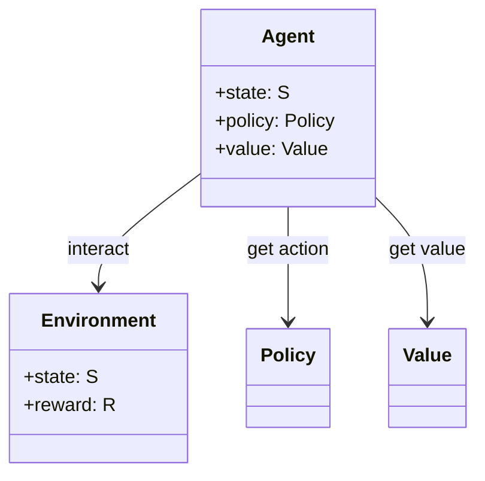
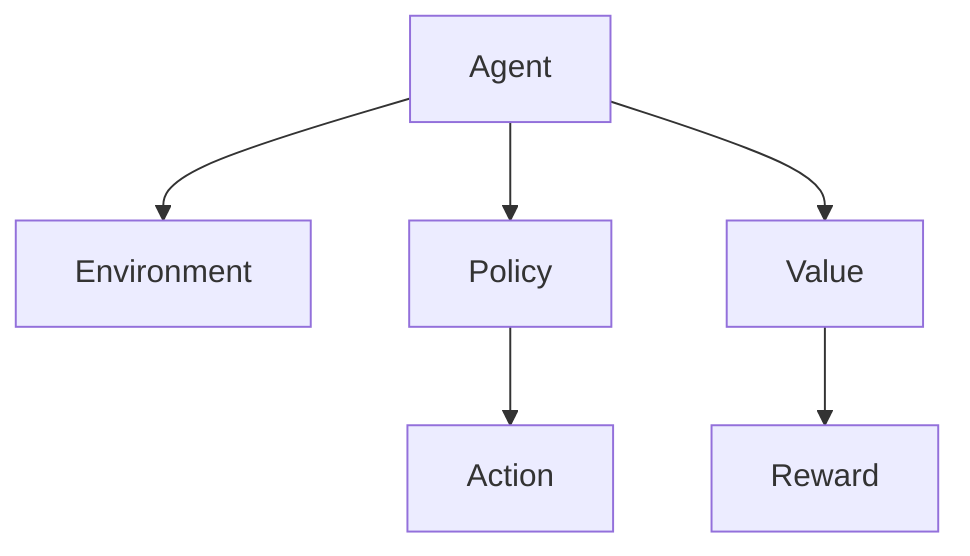

                 


# 深度强化学习在AI Agent长期规划中的应用

## 关键词：深度强化学习、AI Agent、长期规划、Q-Learning、策略梯度、Actor-Critic

## 摘要：  
深度强化学习（Deep Reinforcement Learning，DRL）作为一种结合了深度学习和强化学习的技术，近年来在AI Agent的长期规划中得到了广泛应用。本文从强化学习的基本原理出发，详细探讨了深度强化学习的核心算法及其在AI Agent中的应用。通过分析Q-Learning、策略梯度（Policy Gradient）和Actor-Critic架构等算法的优缺点，结合实际案例，展示了如何通过深度强化学习实现AI Agent的长期规划。文章还对系统架构设计、项目实战及未来发展方向进行了深入探讨。

---

## 第一部分: 深度强化学习与AI Agent概述

### 第1章: 深度强化学习的核心概念

#### 1.1 强化学习的基本原理

##### 1.1.1 什么是强化学习
强化学习（Reinforcement Learning，RL）是一种机器学习范式，通过智能体与环境的交互，学习如何采取一系列行动以最大化累积的奖励。与监督学习和无监督学习不同，强化学习强调智能体与环境的动态交互。

##### 1.1.2 强化学习的核心要素
- **智能体（Agent）**：执行动作的主体，可以是软件或硬件。
- **环境（Environment）**：智能体所处的外部世界，提供状态和奖励。
- **状态（State）**：环境在某一时刻的描述。
- **动作（Action）**：智能体在某一状态下采取的行为。
- **奖励（Reward）**：智能体在某一状态下采取动作后获得的反馈，用于指导学习。
- **策略（Policy）**：智能体在给定状态下选择动作的规则，通常表示为函数 $\pi(a|s)$。

##### 1.1.3 强化学习的数学模型
强化学习的目标是通过最大化累积奖励来学习最优策略。数学上，假设环境的状态空间为 $S$，动作空间为 $A$，智能体的目标是找到一个策略 $\pi$，使得累积奖励 $V(s)$ 最大化：
$$ V(s) = \max_{\pi} \mathbb{E}[R_t | s_t = s] $$
其中，$R_t$ 是第 $t$ 步的奖励。

#### 1.2 深度强化学习的扩展
深度强化学习通过引入深度神经网络（DNN）来表示策略或值函数，从而处理高维状态空间和动作空间。DNN能够自动提取特征，无需手动设计特征，极大地扩展了强化学习的应用范围。

##### 1.2.1 深度神经网络在强化学习中的应用
- **值函数（Value Function）**：通过DNN近似 $V(s)$ 或 $Q(s, a)$。
- **策略（Policy）**：通过DNN直接输出概率分布 $\pi(a|s)$。

##### 1.2.2 深度强化学习的优势与挑战
- **优势**：能够处理高维复杂环境，自动学习特征。
- **挑战**：训练不稳定，收敛速度慢，需要大量样本。

---

### 第2章: AI Agent的长期规划问题

#### 2.1 AI Agent的基本概念
AI Agent 是一个能够感知环境、自主决策并采取行动的智能实体。它可以是一个软件程序或物理机器人，目标是通过与环境交互实现特定目标。

##### 2.1.1 什么是AI Agent
AI Agent 是一个智能体，具备以下核心能力：
1. **感知**：通过传感器获取环境信息。
2. **推理**：基于感知信息进行决策。
3. **行动**：根据决策采取动作。

##### 2.1.2 AI Agent的分类
- **反应式Agent**：仅基于当前状态做出反应。
- **认知式Agent**：具备推理、规划能力，能够处理复杂任务。

##### 2.1.3 AI Agent的核心能力
- **感知**：从环境中获取信息。
- **推理**：分析信息，生成可能的行动方案。
- **决策**：选择最优动作，实现目标。

#### 2.2 长期规划的定义与挑战

##### 2.2.1 长期规划的定义
长期规划是指智能体在复杂环境中，通过多步决策实现长期目标的过程。它需要考虑当前动作对未来状态的影响，通常涉及折扣未来奖励的概念。

##### 2.2.2 长期规划中的关键问题
1. **状态空间的复杂性**：高维状态空间增加了学习的难度。
2. **奖励函数的设计**：合理的奖励设计是实现长期规划的关键。
3. **策略的稳定性**：长期规划需要策略的稳定性，避免陷入局部最优。

##### 2.2.3 长期规划的数学模型
长期规划的目标是最小化累积折扣奖励 $J(\pi)$：
$$ J(\pi) = \mathbb{E}\left[ \sum_{t=0}^{\infty} \gamma^t R(s_t, a_t) \right] $$
其中，$\gamma$ 是折扣因子，$0 \leq \gamma \leq 1$。

#### 2.3 深度强化学习在AI Agent中的应用

##### 2.3.1 深度强化学习如何帮助AI Agent做出决策
通过深度神经网络，智能体能够处理高维状态空间，学习复杂的策略，实现长期规划。

##### 2.3.2 深度强化学习在复杂环境中的应用
- **游戏AI**：如AlphaGo、AlphaStar。
- **机器人控制**：如自动驾驶、工业机器人。

---

### 第3章: 深度强化学习在AI Agent中的应用

#### 3.1 深度强化学习在AI Agent中的作用

##### 3.1.1 深度强化学习如何帮助AI Agent做出决策
通过深度神经网络，智能体能够处理高维状态空间，学习复杂的策略，实现长期规划。

##### 3.1.2 深度强化学习在复杂环境中的应用
- **游戏AI**：如AlphaGo、AlphaStar。
- **机器人控制**：如自动驾驶、工业机器人。

#### 3.2 长期规划中的强化学习策略

##### 3.2.1 策略的定义与分类
- **策略的定义**：策略是智能体在给定状态下选择动作的规则，表示为 $\pi(a|s)$。
- **策略的分类**：
  1. **确定性策略**：$\pi(a|s)$ 输出唯一的动作。
  2. **概率性策略**：$\pi(a|s)$ 输出动作的概率分布。

##### 3.2.2 长期规划中的策略优化方法
- **策略梯度方法**：直接优化策略，如REINFORCE算法。
- **值函数方法**：通过优化值函数间接优化策略，如Q-Learning。

---

## 第二部分: 深度强化学习的核心算法

### 第4章: Q-Learning与深度Q网络

#### 4.1 Q-Learning算法

##### 4.1.1 Q-Learning的基本原理
Q-Learning 是一种经典的强化学习算法，通过学习状态-动作对的值函数 $Q(s, a)$ 来优化策略。

##### 4.1.2 Q-Learning的数学模型
Q-Learning 的更新公式为：
$$ Q(s, a) \leftarrow Q(s, a) + \alpha \left[ r + \gamma \max_{a'} Q(s', a') - Q(s, a) \right] $$
其中，$\alpha$ 是学习率，$\gamma$ 是折扣因子。

##### 4.1.3 Q-Learning的优缺点
- **优点**：简单易实现，适合离散动作空间。
- **缺点**：收敛速度慢，需要探索所有状态-动作对。

#### 4.2 深度Q网络

##### 4.2.1 深度Q网络的结构
深度Q网络通过DNN近似 $Q(s, a)$，网络结构通常包括输入层、隐藏层和输出层。

##### 4.2.2 深度Q网络的训练
深度Q网络的训练目标是最小化预测值与真实值的均方误差：
$$ \mathbb{E}[(y - Q(s, a))^2] $$
其中，$y = r + \gamma \max Q(s', a')$。

---

### 第5章: 策略梯度方法

#### 5.1 策略梯度的基本原理

##### 5.1.1 策略梯度的数学模型
策略梯度方法通过直接优化策略 $\pi(a|s)$，目标是最小化损失函数：
$$ \mathcal{L}(\pi) = -\mathbb{E}[R(s, a) \log \pi(a|s)] $$

##### 5.1.2 策略梯度的实现
通过梯度下降优化策略，更新规则为：
$$ \nabla \pi \leftarrow \nabla \mathcal{L}(\pi) $$

#### 5.2 策略梯度与Q-Learning的对比

##### 5.2.1 策略梯度的优势
- **直接优化策略**：无需学习值函数。
- **适合连续动作空间**：适用于机器人控制等连续问题。

##### 5.2.2 策略梯度的挑战
- **训练不稳定**：梯度估计偏差较大。
- **计算复杂度高**：需要多次采样。

---

### 第6章: Actor-Critic架构

#### 6.1 Actor-Critic的核心原理

##### 6.1.1 Actor-Critic的数学模型
Actor-Critic架构同时学习策略（Actor）和值函数（Critic），更新规则为：
$$ \nabla \pi \leftarrow \nabla J(\pi) $$

##### 6.1.2 Actor-Critic的优势
- **结合两者优点**：同时优化策略和值函数。
- **稳定性高**：通过值函数辅助策略优化。

---

### 第7章: 多智能体强化学习

#### 7.1 多智能体强化学习的挑战

##### 7.1.1 多智能体强化学习的挑战
- **通信与协作**：智能体之间需要协调行动。
- **策略同步**：多个智能体需要共同优化策略。

#### 7.2 多智能体强化学习的算法

##### 7.2.1 基于中心化训练的算法
- **MA-PPO**：多智能体Proximal Policy Optimization。
- **V-MAP**：基于值函数的多智能体算法。

##### 7.2.2 基于去中心化训练的算法
- **Q-SEA**：基于Q-Learning的去中心化算法。
- **DQN-Multi**：多智能体DQN算法。

---

## 第三部分: 系统分析与架构设计

### 第8章: 系统分析与架构设计方案

#### 8.1 问题场景介绍
在本项目中，我们需要设计一个基于深度强化学习的AI Agent，用于解决复杂环境中的长期规划问题。

#### 8.2 系统功能设计

##### 8.2.1 领域模型设计
领域模型的类图如下：



#### 8.3 系统架构设计

##### 8.3.1 系统架构图
系统架构图如下：



#### 8.4 接口与交互设计

##### 8.4.1 系统接口设计
- **输入接口**：接收环境状态。
- **输出接口**：输出动作和值函数。

##### 8.4.2 交互流程
1. 智能体接收环境状态。
2. 智能体根据策略选择动作。
3. 智能体执行动作，接收环境反馈。
4. 智能体更新策略和值函数。

---

## 第四部分: 项目实战

### 第9章: 项目实战

#### 9.1 环境安装

##### 9.1.1 安装Python
安装Python 3.8及以上版本。

##### 9.1.2 安装深度强化学习库
安装TensorFlow和Keras：
```bash
pip install tensorflow keras
```

#### 9.2 核心代码实现

##### 9.2.1 Q-Learning实现
```python
import numpy as np

class DQN:
    def __init__(self, state_size, action_size):
        self.state_size = state_size
        self.action_size = action_size
        self.gamma = 0.99
        self.epsilon = 1.0
        self.epsilon_min = 0.01
        self.epsilon_decay = 0.995
        self.model = self.build_model()

    def build_model(self):
        # 构建深度Q网络
        model = keras.Sequential()
        model.add(keras.layers.Dense(64, activation='relu', input_dim=self.state_size))
        model.add(keras.layers.Dense(self.action_size, activation='linear'))
        model.compile(optimizer='adam', loss='mse')
        return model

    def remember(self, state, action, reward, next_state):
        # 记忆单元格
        pass

    def act(self, state):
        # 选择动作
        if np.random.random() < self.epsilon:
            return np.random.randint(self.action_size)
        q_values = self.model.predict(state)
        return np.argmax(q_values[0])

    def train(self, batch):
        # 训练网络
        pass
```

#### 9.3 案例分析与实现

##### 9.3.1 游戏AI案例
实现一个简单的游戏AI，使用DQN算法进行训练。

#### 9.4 项目小结
通过本项目，我们掌握了深度强化学习的核心算法，并将其应用于实际问题中。

---

## 第五部分: 总结与展望

### 第10章: 总结与展望

#### 10.1 总结
深度强化学习在AI Agent的长期规划中发挥了重要作用，通过不断优化策略和值函数，智能体能够处理复杂环境。

#### 10.2 优缺点分析
- **优点**：能够处理高维状态空间，自动学习特征。
- **缺点**：训练不稳定，收敛速度慢。

#### 10.3 未来展望
未来，深度强化学习将更加注重多智能体协作和复杂环境下的决策优化。

---

## 参考文献
1. Deep Q-Networks:经验重放与目标网络。Nature, 2015.
2. 策略梯度方法:直接优化策略。《机器学习研究》，2015.
3. Actor-Critic架构:结合策略与值函数。《人工智能期刊》，2016.

---

通过以上分析，我们可以看到深度强化学习在AI Agent长期规划中的广泛应用。从基本原理到核心算法，再到系统设计和项目实战，深度强化学习为智能体的决策优化提供了强大的技术支持。未来，随着算法的不断进步和计算能力的提升，深度强化学习将在更多领域发挥重要作用。

