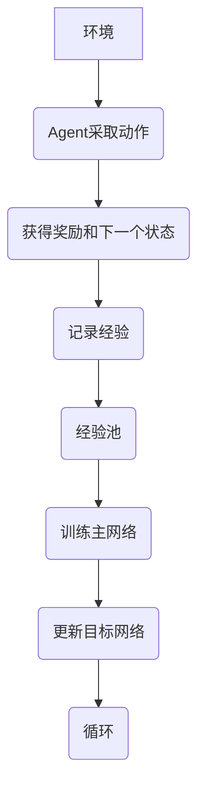
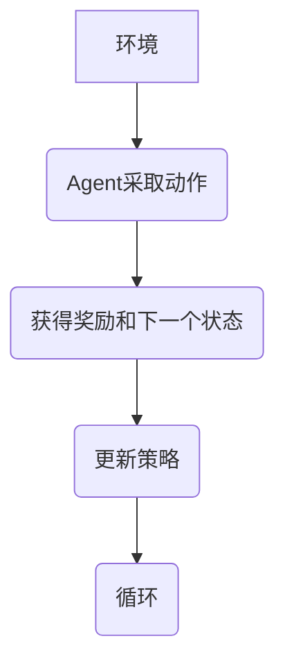
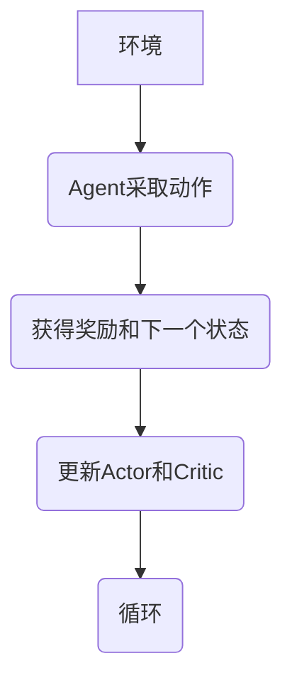
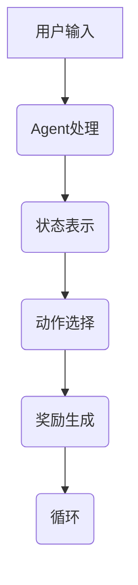
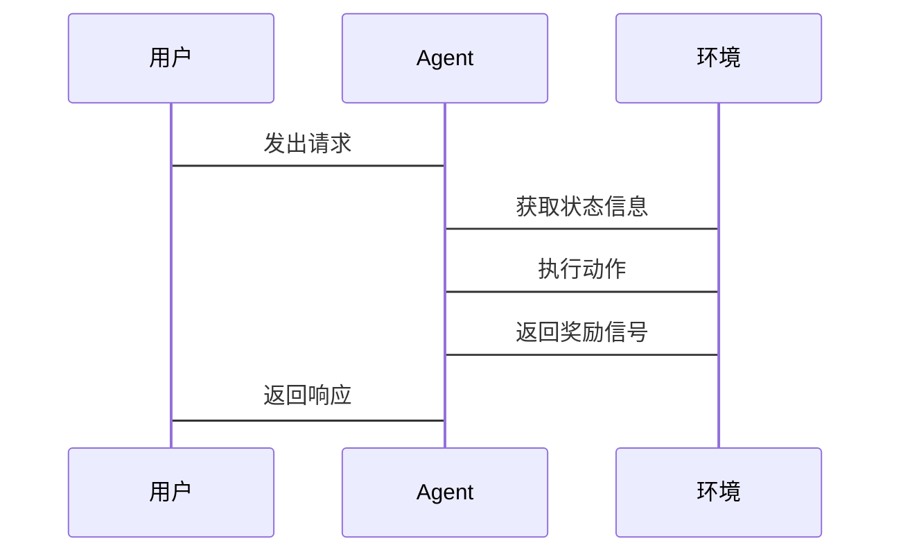

                 


# 深度强化学习在AI Agent长期规划中的应用

> 关键词：深度强化学习、AI Agent、长期规划、强化学习、人工智能、系统架构

> 摘要：本文详细探讨了深度强化学习在AI Agent长期规划中的应用，分析了深度强化学习的核心原理、算法实现、系统架构，并通过实际案例展示了其在复杂环境中的规划能力。文章从理论基础到实际应用，全面解析了深度强化学习如何助力AI Agent实现长期目标，为相关领域的研究和实践提供了有价值的参考。

---

# 第一部分: 深度强化学习与AI Agent背景介绍

## 第1章: 问题背景与核心概念

### 1.1 问题背景

#### 1.1.1 AI Agent的定义与特点
AI Agent（人工智能代理）是一种能够感知环境、自主决策并采取行动的智能体。其特点包括：
- **自主性**：能够在没有外部干预的情况下自主运行。
- **反应性**：能够实时感知环境并做出反应。
- **目标导向性**：基于目标进行决策和规划。
- **学习能力**：通过与环境交互不断优化自身的策略。

#### 1.1.2 长期规划的定义与重要性
长期规划是指AI Agent在复杂环境中，为了实现长远目标而制定的一系列决策和行动策略。其重要性体现在：
- **复杂环境适应性**：在动态变化的环境中，需要考虑多步决策的累积效应。
- **目标实现的高效性**：通过规划减少随机性，提高目标达成的概率。
- **资源优化**：长期规划有助于合理分配资源，避免短视行为。

#### 1.1.3 深度强化学习在长期规划中的作用
深度强化学习（Deep Reinforcement Learning, Deep RL）通过结合强化学习的奖励驱动机制和深度学习的强大表示能力，为AI Agent的长期规划提供了有效的解决方案。其作用包括：
- **复杂状态空间的处理**：深度神经网络能够有效处理高维状态空间。
- **非线性关系建模**：深度学习擅长建模复杂非线性关系，适用于长期规划中的多维决策问题。
- **经验复用**：通过深度网络的特征提取能力，实现经验的有效复用，减少探索成本。

### 1.2 核心概念与联系

#### 1.2.1 深度强化学习的核心原理
深度强化学习结合了强化学习的奖励机制和深度学习的特征提取能力。其核心原理如下：
- **强化学习**：通过与环境交互，AI Agent通过试错学习，逐步逼近最优策略。
- **深度学习**：深度神经网络用于近似值函数或策略函数，提升模型的表达能力和泛化能力。
- **目标函数**：通过优化目标函数（如损失函数），AI Agent不断改进其决策策略。

#### 1.2.2 AI Agent的长期规划问题建模
长期规划问题可以通过马尔可夫决策过程（Markov Decision Process, MDP）进行建模。MDP包括以下要素：
- **状态（State）**：环境中的当前情况。
- **动作（Action）**：AI Agent在特定状态下采取的行动。
- **转移概率（Transition Probability）**：从当前状态到下一个状态的概率分布。
- **奖励（Reward）**：AI Agent采取某个动作后获得的即时反馈。
- **策略（Policy）**：定义AI Agent在每个状态下选择动作的概率分布。

#### 1.2.3 深度强化学习与长期规划的结合
深度强化学习通过以下方式实现与长期规划的结合：
- **多步决策优化**：通过深度网络对多步决策进行建模，优化长期目标。
- **全局规划能力**：深度强化学习能够综合考虑全局信息，制定长远的规划策略。
- **动态适应性**：通过在线学习机制，AI Agent能够实时调整规划策略以适应环境变化。

### 1.3 相关技术与研究进展

#### 1.3.1 强化学习的历史与发展
强化学习的历史可以追溯到20世纪50年代，经历了从简单的随机试错方法到现代深度强化学习的演变。近年来，深度强化学习的突破性进展推动了AI Agent在复杂任务中的应用。

#### 1.3.2 深度学习在强化学习中的应用
深度学习通过其强大的特征提取能力，为强化学习提供了更高效的策略表示和值函数近似方法。具体应用包括：
- **深度Q网络（DQN）**：使用卷积神经网络（CNN）近似Q值函数，提高状态表示能力。
- **策略网络**：通过神经网络直接生成策略，简化了强化学习的训练过程。

#### 1.3.3 当前研究热点与未来趋势
当前研究热点包括：
- **多智能体协作**：研究多个AI Agent之间的协作与竞争。
- **持续学习**：研究AI Agent在动态环境中的持续学习能力。
- **稀疏奖励场景**：解决强化学习中奖励信号稀疏的问题，提升学习效率。

未来趋势：
- **通用化强化学习**：研究适用于更广泛任务的通用强化学习框架。
- **人机协作**：增强人与AI Agent之间的协作能力，使其更符合人类需求。
- **伦理与安全**：研究AI Agent的伦理和安全问题，确保其行为符合人类价值观。

---

## 第2章: 深度强化学习基础

### 2.1 强化学习的基本概念

#### 2.1.1 状态、动作、奖励的定义
- **状态（State）**：描述环境当前的状况，例如在迷宫中AI Agent的位置。
- **动作（Action）**：AI Agent在特定状态下选择的动作，例如“左转”或“右转”。
- **奖励（Reward）**：AI Agent采取某个动作后获得的反馈，通常表示该动作的好坏程度。

#### 2.1.2 Q-learning与策略梯度方法
- **Q-learning**：基于值函数的强化学习方法，通过更新Q值函数逼近最优策略。
- **策略梯度方法**：直接优化策略，通过梯度上升更新策略参数。

#### 2.1.3 马尔可夫决策过程(MDP)
马尔可夫决策过程（MDP）是强化学习的基本模型，描述了AI Agent与环境的交互过程。MDP由以下五部分组成：
1. **状态空间（State Space）**：所有可能的状态集合。
2. **动作空间（Action Space）**：AI Agent在每个状态下可以采取的动作集合。
3. **转移概率（Transition Probability）**：从当前状态采取某个动作后转移到下一个状态的概率。
4. **奖励函数（Reward Function）**：AI Agent在当前状态下采取某个动作后获得的奖励。
5. **终止条件（Termination Condition）**：AI Agent是否完成任务或达到终止状态的条件。

### 2.2 深度学习与强化学习的结合

#### 2.2.1 神经网络在强化学习中的应用
神经网络在强化学习中的应用主要体现在以下几个方面：
- **值函数近似**：使用神经网络近似值函数，如Q值函数或V值函数。
- **策略表示**：直接使用神经网络生成策略，例如策略网络。
- **状态编码**：通过卷积神经网络（CNN）对复杂状态进行编码，提高状态表示能力。

#### 2.2.2 深度Q网络(DQN)的原理
深度Q网络（DQN）是一种结合深度学习和强化学习的算法，由DeepMind团队提出。其核心思想是使用神经网络近似Q值函数，并通过经验回放和目标网络减少近似偏差。

#### 2.2.3 策略网络与值函数网络的对比
- **策略网络**：直接生成策略，适用于离散动作空间。
- **值函数网络**：通过近似值函数辅助策略优化，适用于连续动作空间。

### 2.3 深度强化学习的核心算法

#### 2.3.1 DQN算法的原理与实现
DQN算法通过两个神经网络（主网络和目标网络）交替更新，通过经验回放减少训练中的偏差。其算法流程如下：
1. **环境交互**：AI Agent与环境交互，记录经验（状态、动作、奖励、下一个状态）。
2. **经验回放**：从经验池中随机抽取小批量经验，更新主网络。
3. **目标网络更新**：定期将主网络的权重复制到目标网络，减少目标网络与主网络之间的差异。

#### 2.3.2 基于策略梯度的算法(Policy Gradient)
基于策略梯度的算法直接优化策略，通过梯度上升更新策略参数。其核心公式为：
$$
\nabla J = \mathbb{E}_{\tau \sim \pi_\theta} [\nabla_\theta \log \pi_\theta(a_t|s_t) Q(s_t, a_t)]
$$

#### 2.3.3 Actor-Critic算法
Actor-Critic算法结合了策略梯度和值函数方法，通过同时优化策略（Actor）和值函数（Critic）实现更稳定的训练。其数学表达式如下：
- **Actor**：策略网络，参数为θ。
- **Critic**：值函数网络，参数为φ。
- **目标函数**：通过Actor-Critic网络交替优化策略和值函数。

---

## 第3章: 深度强化学习的算法原理

### 3.1 DQN算法的实现细节

#### 3.1.1 DQN算法的流程图


#### 3.1.2 DQN算法的代码实现
```python
import torch
import torch.nn as nn
import torch.optim as optim
import numpy as np

class DQN(nn.Module):
    def __init__(self, input_size, hidden_size, output_size):
        super(DQN, self).__init__()
        self.fc1 = nn.Linear(input_size, hidden_size)
        self.fc2 = nn.Linear(hidden_size, output_size)
    
    def forward(self, x):
        x = torch.relu(self.fc1(x))
        x = self.fc2(x)
        return x

def dqn_algorithm(env, input_size, hidden_size, output_size, num_episodes=1000):
    main_network = DQN(input_size, hidden_size, output_size)
    target_network = DQN(input_size, hidden_size, output_size)
    optimizer = optim.Adam(main_network.parameters(), lr=0.001)
    memory = []
    
    for episode in range(num_episodes):
        state = env.reset()
        while not done:
            # 选择动作
            with torch.no_grad():
                q_values = main_network(torch.FloatTensor(state))
            action = torch.argmax(q_values).item()
            
            # 与环境交互
            next_state, reward, done = env.step(action)
            
            # 记录经验
            memory.append((state, action, reward, next_state))
            
            # 经验回放
            if len(memory) >= BATCH_SIZE:
                batch = random.sample(memory, BATCH_SIZE)
                states = torch.FloatTensor([b[0] for b in batch])
                actions = torch.LongTensor([b[1] for b in batch])
                rewards = torch.FloatTensor([b[2] for b in batch])
                next_states = torch.FloatTensor([b[3] for b in batch])
                
                # 更新主网络
                current_q = main_network(states).gather(1, actions.unsqueeze(1))
                next_q = target_network(next_states).max(1)[0].detach()
                target_q = rewards + GAMMA * next_q
                loss = nn.MSELoss()(current_q.squeeze(), target_q)
                optimizer.zero_grad()
                loss.backward()
                optimizer.step()
                
                # 更新目标网络
                if episode % UPDATE_FREQUENCY == 0:
                    target_network.load_state_dict(main_network.state_dict())
    return main_network, target_network
```

### 3.2 基于策略梯度的算法实现

#### 3.2.1 Policy Gradient算法的流程图


#### 3.2.2 Policy Gradient算法的代码实现
```python
import torch
import torch.nn as nn
import torch.optim as optim

class PolicyNetwork(nn.Module):
    def __init__(self, input_size, hidden_size, output_size):
        super(PolicyNetwork, self).__init__()
        self.fc1 = nn.Linear(input_size, hidden_size)
        self.fc2 = nn.Linear(hidden_size, output_size)
    
    def forward(self, x):
        x = torch.relu(self.fc1(x))
        x = torch.log_softmax(self.fc2(x), dim=-1)
        return x

def policy_gradient_algorithm(env, input_size, hidden_size, output_size, num_episodes=1000):
    policy_network = PolicyNetwork(input_size, hidden_size, output_size)
    optimizer = optim.Adam(policy_network.parameters(), lr=0.001)
    
    for episode in range(num_episodes):
        state = env.reset()
        log_probs = []
        rewards = []
        
        while not done:
            # 生成策略
            with torch.no_grad():
                log_prob = policy_network(torch.FloatTensor(state))
            prob = torch.exp(log_prob)
            
            # 选择动作
            action = torch.multinomial(prob, 1).item()
            
            # 与环境交互
            next_state, reward, done = env.step(action)
            
            # 记录奖励和对数概率
            log_probs.append(log_prob[0][action])
            rewards.append(reward)
            
            # 更新策略
            total_reward = sum(rewards)
            loss = -log_probs.mean() * total_reward
            optimizer.zero_grad()
            loss.backward()
            optimizer.step()
    
    return policy_network
```

### 3.3 Actor-Critic算法的实现

#### 3.3.1 Actor-Critic算法的流程图


#### 3.3.2 Actor-Critic算法的代码实现
```python
import torch
import torch.nn as nn
import torch.optim as optim

class ActorNetwork(nn.Module):
    def __init__(self, input_size, hidden_size, output_size):
        super(ActorNetwork, self).__init__()
        self.fc1 = nn.Linear(input_size, hidden_size)
        self.fc2 = nn.Linear(hidden_size, output_size)
    
    def forward(self, x):
        x = torch.relu(self.fc1(x))
        x = torch.log_softmax(self.fc2(x), dim=-1)
        return x

class CriticNetwork(nn.Module):
    def __init__(self, input_size, hidden_size, output_size):
        super(CriticNetwork, self).__init__()
        self.fc1 = nn.Linear(input_size, hidden_size)
        self.fc2 = nn.Linear(hidden_size, output_size)
    
    def forward(self, x):
        x = torch.relu(self.fc1(x))
        x = self.fc2(x)
        return x

def actor_critic_algorithm(env, input_size, hidden_size, output_size, num_episodes=1000):
    actor = ActorNetwork(input_size, hidden_size, output_size)
    critic = CriticNetwork(input_size, hidden_size, 1)
    optimizer_actor = optim.Adam(actor.parameters(), lr=0.001)
    optimizer_critic = optim.Adam(critic.parameters(), lr=0.001)
    
    for episode in range(num_episodes):
        state = env.reset()
        rewards = []
        actor_losses = []
        critic_losses = []
        
        while not done:
            # 生成策略和值函数
            with torch.no_grad():
                action_prob = actor(torch.FloatTensor(state))
                state_value = critic(torch.FloatTensor(state))
            
            # 选择动作
            action = torch.multinomial(action_prob.exp(), 1).item()
            
            # 与环境交互
            next_state, reward, done = env.step(action)
            
            # 更新奖励和值函数
            rewards.append(reward)
            next_value = critic(torch.FloatTensor(next_state)).item()
            
            # 计算损失
            actor_loss = -torch.mean(action_prob[action]) * (sum(rewards) - next_value)
            critic_loss = nn.MSELoss()(state_value, torch.FloatTensor([sum(rewards)]))
            
            # 更新Actor和Critic
            optimizer_actor.zero_grad()
            actor_loss.backward()
            optimizer_actor.step()
            
            optimizer_critic.zero_grad()
            critic_loss.backward()
            optimizer_critic.step()
    
    return actor, critic
```

---

## 第4章: 深度强化学习的系统架构与设计

### 4.1 系统架构设计

#### 4.1.1 问题场景介绍
以智能客服为例，AI Agent需要在复杂对话环境中，通过与用户交互，实现用户需求的准确识别和高效满足。系统需要处理以下问题：
- **对话状态管理**：跟踪对话上下文。
- **用户意图识别**：准确理解用户的意图。
- **多轮对话策略**：制定长期对话规划。

#### 4.1.2 系统功能设计
系统功能模块包括：
- **状态表示模块**：将对话上下文转化为状态向量。
- **动作选择模块**：基于当前状态选择下一步动作。
- **奖励机制模块**：根据对话结果生成奖励信号。

#### 4.1.3 系统架构图


### 4.2 系统架构实现

#### 4.2.1 系统功能模块实现
- **状态表示模块**：使用编码器将对话历史转化为向量表示。
- **动作选择模块**：基于深度强化学习算法选择下一步动作。
- **奖励机制模块**：根据对话结果生成奖励信号。

#### 4.2.2 系统交互流程


---

## 第5章: 深度强化学习的项目实战

### 5.1 环境配置与安装

#### 5.1.1 环境配置
需要安装以下库：
- **PyTorch**：深度学习框架。
- **Gym**：强化学习环境库。
- **Mermaid**：用于绘制流程图。

#### 5.1.2 安装命令
```bash
pip install torch gym
```

### 5.2 系统核心实现源代码

#### 5.2.1 DQN算法实现
```python
import gym
import torch
import torch.nn as nn
import torch.optim as optim
import numpy as np

class DQN(nn.Module):
    def __init__(self, input_size, hidden_size, output_size):
        super(DQN, self).__init__()
        self.fc1 = nn.Linear(input_size, hidden_size)
        self.fc2 = nn.Linear(hidden_size, output_size)
    
    def forward(self, x):
        x = torch.relu(self.fc1(x))
        x = self.fc2(x)
        return x

def train_dqn(env, input_size, hidden_size, output_size, num_episodes=1000):
    main_network = DQN(input_size, hidden_size, output_size)
    target_network = DQN(input_size, hidden_size, output_size)
    optimizer = optim.Adam(main_network.parameters(), lr=0.001)
    memory = []
    BATCH_SIZE = 64
    GAMMA = 0.99
    UPDATE_FREQUENCY = 100
    
    for episode in range(num_episodes):
        state = env.reset()
        done = False
        while not done:
            # 选择动作
            with torch.no_grad():
                q_values = main_network(torch.FloatTensor(state))
            action = torch.argmax(q_values).item()
            
            # 与环境交互
            next_state, reward, done = env.step(action)
            
            # 记录经验
            memory.append((state, action, reward, next_state))
            
            # 经验回放
            if len(memory) >= BATCH_SIZE:
                batch = np.random.choice(memory, size=BATCH_SIZE)
                states = torch.FloatTensor([b[0] for b in batch])
                actions = torch.LongTensor([b[1] for b in batch])
                rewards = torch.FloatTensor([b[2] for b in batch])
                next_states = torch.FloatTensor([b[3] for b in batch])
                
                # 更新主网络
                current_q = main_network(states).gather(1, actions.unsqueeze(1))
                next_q = target_network(next_states).max(1)[0].detach()
                target_q = rewards + GAMMA * next_q
                loss = nn.MSELoss()(current_q.squeeze(), target_q)
                optimizer.zero_grad()
                loss.backward()
                optimizer.step()
                
                # 更新目标网络
                if episode % UPDATE_FREQUENCY == 0:
                    target_network.load_state_dict(main_network.state_dict())
    
    return main_network, target_network
```

#### 5.2.2 智能客服案例实现
```python
import gym
import torch
import torch.nn as nn
import torch.optim as optim
import numpy as np

class DQN(nn.Module):
    def __init__(self, input_size, hidden_size, output_size):
        super(DQN, self).__init__()
        self.fc1 = nn.Linear(input_size, hidden_size)
        self.fc2 = nn.Linear(hidden_size, output_size)
    
    def forward(self, x):
        x = torch.relu(self.fc1(x))
        x = self.fc2(x)
        return x

def train_dqn(env, input_size, hidden_size, output_size, num_episodes=1000):
    main_network = DQN(input_size, hidden_size, output_size)
    target_network = DQN(input_size, hidden_size, output_size)
    optimizer = optim.Adam(main_network.parameters(), lr=0.001)
    memory = []
    BATCH_SIZE = 64
    GAMMA = 0.99
    UPDATE_FREQUENCY = 100
    
    for episode in range(num_episodes):
        state = env.reset()
        done = False
        while not done:
            # 选择动作
            with torch.no_grad():
                q_values = main_network(torch.FloatTensor(state))
            action = torch.argmax(q_values).item()
            
            # 与环境交互
            next_state, reward, done = env.step(action)
            
            # 记录经验
            memory.append((state, action, reward, next_state))
            
            # 经验回放
            if len(memory) >= BATCH_SIZE:
                batch = np.random.choice(memory, size=BATCH_SIZE)
                states = torch.FloatTensor([b[0] for b in batch])
                actions = torch.LongTensor([b[1] for b in batch])
                rewards = torch.FloatTensor([b[2] for b in batch])
                next_states = torch.FloatTensor([b[3] for b in batch])
                
                # 更新主网络
                current_q = main_network(states).gather(1, actions.unsqueeze(1))
                next_q = target_network(next_states).max(1)[0].detach()
                target_q = rewards + GAMMA * next_q
                loss = nn.MSELoss()(current_q.squeeze(), target_q)
                optimizer.zero_grad()
                loss.backward()
                optimizer.step()
                
                # 更新目标网络
                if episode % UPDATE_FREQUENCY == 0:
                    target_network.load_state_dict(main_network.state_dict())
    
    return main_network, target_network
```

### 5.3 实际案例分析

#### 5.3.1 案例介绍
以智能客服为例，训练AI Agent在复杂对话环境中，通过多轮对话实现用户需求的准确识别和高效满足。

#### 5.3.2 案例分析
通过训练DQN算法，AI Agent能够在复杂对话环境中，根据对话上下文选择合适的回复策略，提高用户满意度。

---

## 第6章: 最佳实践与总结

### 6.1 小结
深度强化学习在AI Agent长期规划中的应用，通过结合强化学习的奖励机制和深度学习的特征提取能力，为复杂环境中的决策问题提供了有效的解决方案。

### 6.2 注意事项
- **算法选择**：根据具体任务选择合适的算法。
- **环境设计**：合理设计环境和奖励机制。
- **模型调优**：通过实验不断调整模型参数。

### 6.3 未来趋势与扩展阅读
- **多智能体协作**：研究多个AI Agent之间的协作与竞争。
- **持续学习**：研究AI Agent在动态环境中的持续学习能力。
- **伦理与安全**：研究AI Agent的伦理和安全问题，确保其行为符合人类价值观。

---

通过本文的详细讲解，读者可以系统地了解深度强化学习在AI Agent长期规划中的应用，从理论基础到实际应用，全面掌握其核心原理和实现方法。希望本文能够为相关领域的研究和实践提供有价值的参考。

