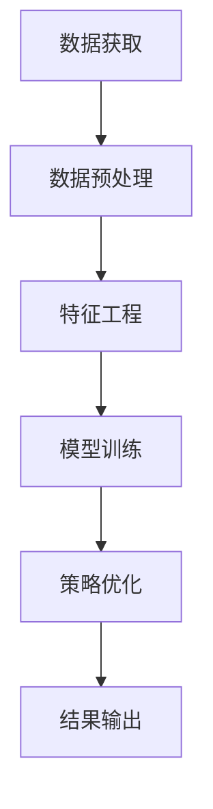

                 


# 深度强化学习在多周期投资决策中的应用

> 关键词：深度强化学习、多周期投资决策、强化学习算法、金融投资、人工智能

> 摘要：本文探讨了深度强化学习在多周期投资决策中的应用，分析了其核心概念、算法原理、系统架构以及实际案例。通过详细的技术分析和实践，展示了深度强化学习如何解决多周期投资中的复杂决策问题，并提供了实际的解决方案和优化建议。

---

## 第1章: 引言

### 1.1 深度强化学习的背景与意义
- 1.1.1 深度学习与强化学习的结合：从数据驱动到决策优化
- 1.1.2 多周期投资决策的复杂性：传统方法的局限与深度强化学习的优势
- 1.1.3 深度强化学习在金融领域的革命性应用

### 1.2 多周期投资决策的定义与特点
- 1.2.1 投资周期的定义与分类
- 1.2.2 多周期投资决策的核心问题
- 1.2.3 深度强化学习在多周期投资中的应用前景

### 1.3 深度强化学习在金融领域的应用现状
- 1.3.1 金融领域的复杂决策问题
- 1.3.2 深度强化学习在金融中的成功案例
- 1.3.3 当前研究的不足与未来方向

---

## 第2章: 深度强化学习的核心概念与原理

### 2.1 深度强化学习的基本原理
- 2.1.1 强化学习的基本概念
- 2.1.2 深度学习在强化学习中的应用
- 2.1.3 深度强化学习的数学模型

### 2.2 多周期投资决策的强化学习建模
- 2.2.1 状态空间的定义
- 2.2.2 动作空间的设计
- 2.2.3 奖励函数的构建

### 2.3 深度强化学习算法的分类与选择
- 2.3.1 Q-learning算法
- 2.3.2 策略梯度算法
- 2.3.3 多智能体强化学习

---

## 第3章: 深度强化学习的数学模型与公式

### 3.1 强化学习的基本公式
- 3.1.1 Q-learning的更新公式
$$ Q(s, a) = (1-\alpha) Q(s, a) + \alpha (r + \gamma \max Q(s', a')) $$
- 3.1.2 策略梯度的优化公式
$$ \nabla J(\theta) = \mathbb{E}[ \nabla \log \pi(a|s) Q(s,a) ] $$

### 3.2 深度强化学习的网络结构
- 3.2.1 状态-动作网络（DQN）
- 3.2.2 策略网络与价值网络
- 3.2.3 多周期决策的网络架构设计

### 3.3 深度强化学习的训练流程
- 3.3.1 状态输入的处理
- 3.3.2 动作输出的策略
- 3.3.3 奖励函数的计算与优化

---

## 第4章: 多周期投资决策的系统分析与架构设计

### 4.1 投资决策系统的总体架构
- 4.1.1 系统功能模块划分
- 4.1.2 系统架构的mermaid图表示



### 4.2 数据流与系统交互设计
- 4.2.1 数据获取与预处理
- 4.2.2 系统接口设计
- 4.2.3 系统交互的mermaid序列图

```mermaid
sequenceDiagram
    actor 用户
    软件系统
    用户 -> 软件系统: 输入投资周期
    软件系统 -> 数据源: 获取历史数据
    数据源 --> 软件系统: 返回历史数据
    软件系统 -> 用户: 显示优化策略
```

### 4.3 系统功能设计
- 4.3.1 多周期决策模型的构建
- 4.3.2 模型训练与优化
- 4.3.3 模型部署与应用

---

## 第5章: 项目实战——深度强化学习在多周期投资中的实现

### 5.1 环境安装与配置
- 5.1.1 安装Python与相关库
- 5.1.2 安装深度强化学习框架（如TensorFlow、PyTorch）

### 5.2 系统核心实现源代码
- 5.2.1 数据获取与预处理
- 5.2.2 模型训练代码
- 5.2.3 模型推理代码

```python
import numpy as np
import tensorflow as tf

# 定义DQN网络
class DQN:
    def __init__(self, state_space, action_space):
        self.state_space = state_space
        self.action_space = action_space
        self.model = self.build_model()
    
    def build_model(self):
        model = tf.keras.Sequential()
        model.add(tf.keras.layers.Dense(64, activation='relu', input_dim=self.state_space))
        model.add(tf.keras.layers.Dense(64, activation='relu'))
        model.add(tf.keras.layers.Dense(self.action_space, activation='linear'))
        model.compile(optimizer='adam', loss='mse')
        return model
```

### 5.3 代码应用解读与分析
- 5.3.1 数据获取与预处理的具体实现
- 5.3.2 模型训练的详细过程
- 5.3.3 模型推理的结果分析

### 5.4 实际案例分析和详细讲解剖析
- 5.4.1 案例背景与数据介绍
- 5.4.2 模型训练与优化过程
- 5.4.3 模型在多周期投资中的实际表现

### 5.5 项目小结
- 5.5.1 项目实现的关键点总结
- 5.5.2 模型的优缺点分析
- 5.5.3 未来改进方向

---

## 第6章: 深度强化学习在多周期投资决策中的应用案例

### 6.1 案例背景介绍
- 6.1.1 投资周期的选择与目标
- 6.1.2 数据来源与特征分析

### 6.2 深度强化学习模型的构建与训练
- 6.2.1 模型架构设计
- 6.2.2 训练策略与优化方法

### 6.3 模型在多周期投资中的实际表现
- 6.3.1 模型的收益与风险分析
- 6.3.2 模型在不同周期中的表现对比
- 6.3.3 模型的鲁棒性与稳定性分析

---

## 第7章: 深度强化学习在多周期投资决策中的优化与展望

### 7.1 模型优化策略
- 7.1.1 超参数优化
- 7.1.2 网络结构优化
- 7.1.3 奖励函数的改进

### 7.2 深度强化学习的未来发展方向
- 7.2.1 多智能体强化学习的应用
- 7.2.2 模型解释性与可解释性的提升
- 7.2.3 结合其他技术（如区块链）的创新应用

---

## 第8章: 总结与展望

### 8.1 核心观点总结
- 8.1.1 深度强化学习在多周期投资中的优势
- 8.1.2 实际应用中的关键挑战与解决方案

### 8.2 未来研究方向
- 8.2.1 更复杂的决策场景建模
- 8.2.2 高效算法的优化与创新
- 8.2.3 与其他人工智能技术的结合

---

## 参考文献

（此处列出相关的学术论文、书籍和技术文档）

---

## 附录

### 附录A: 深度强化学习算法的数学公式汇总
- Q-learning的更新公式
$$ Q(s, a) = (1-\alpha) Q(s, a) + \alpha (r + \gamma \max Q(s', a')) $$
- 策略梯度的优化公式
$$ \nabla J(\theta) = \mathbb{E}[ \nabla \log \pi(a|s) Q(s,a) ] $$

### 附录B: 系统架构图


### 附录C: 项目代码示例
```python
import numpy as np
import tensorflow as tf

# 定义DQN网络
class DQN:
    def __init__(self, state_space, action_space):
        self.state_space = state_space
        self.action_space = action_space
        self.model = self.build_model()
    
    def build_model(self):
        model = tf.keras.Sequential()
        model.add(tf.keras.layers.Dense(64, activation='relu', input_dim=self.state_space))
        model.add(tf.keras.layers.Dense(64, activation='relu'))
        model.add(tf.keras.layers.Dense(self.action_space, activation='linear'))
        model.compile(optimizer='adam', loss='mse')
        return model
```

---

通过以上目录结构和内容安排，文章将从理论到实践，系统地探讨深度强化学习在多周期投资决策中的应用，结合实际案例和技术细节，为读者提供全面而深入的指导。

