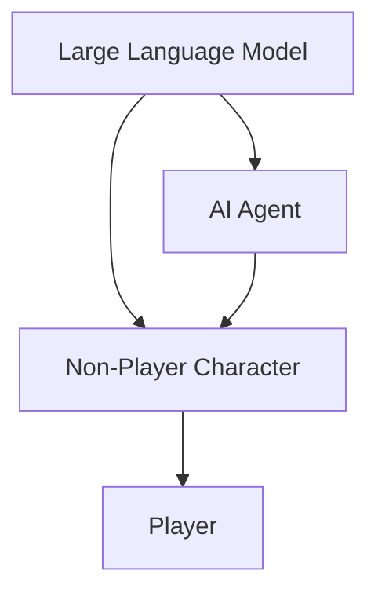
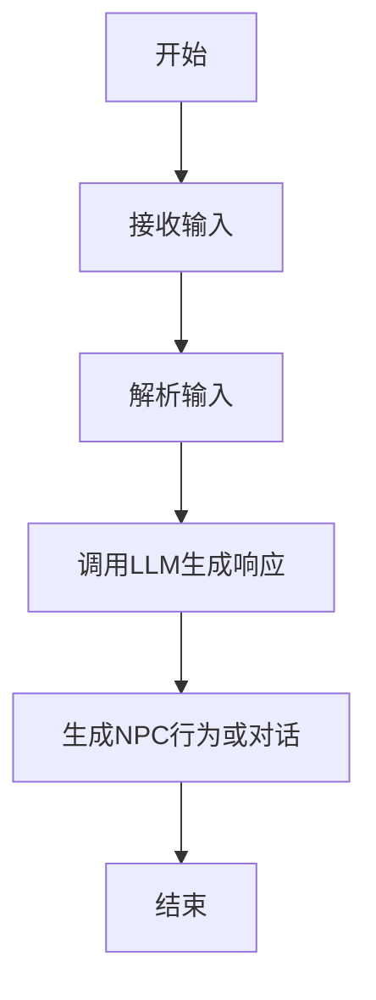
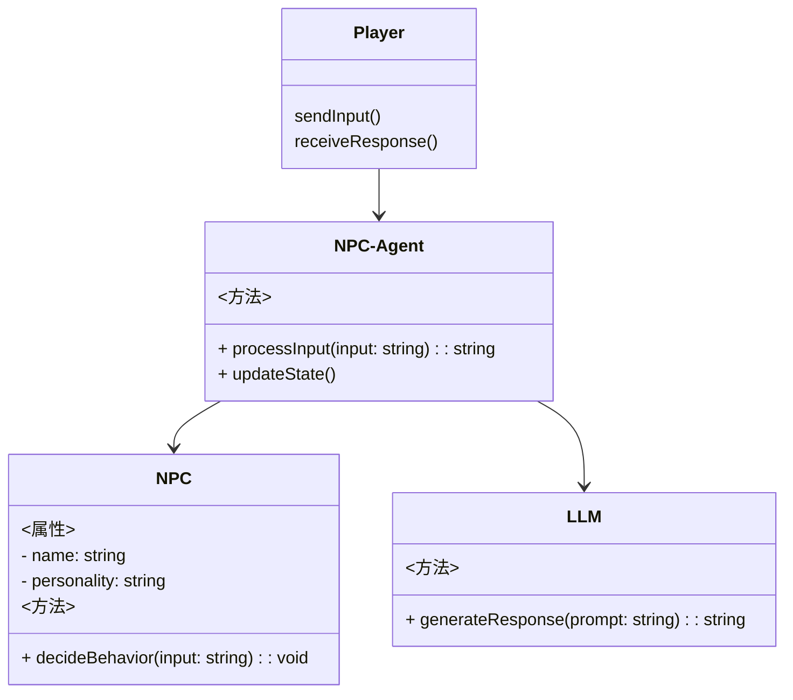
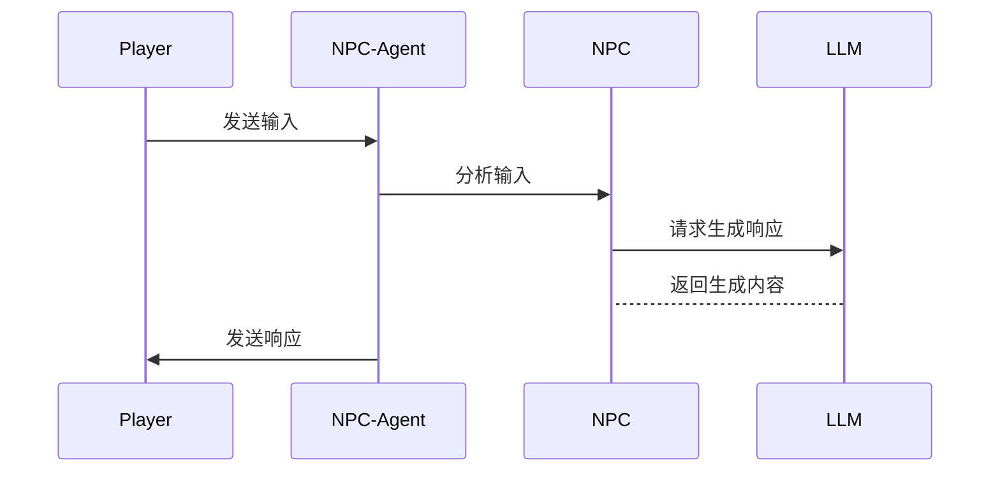

                 


# 游戏 NPC AI Agent：利用 LLM 创造更真实的游戏角色

## 关键词：LLM、NPC AI Agent、游戏AI、AI交互设计、智能NPC

## 摘要：随着大语言模型（LLM）技术的快速发展，游戏中的非玩家角色（NPC）可以通过LLM实现更智能、更自然的交互，从而提升玩家的游戏体验。本文深入探讨如何利用LLM构建NPC AI Agent，分析其技术原理、系统架构，并通过实际案例展示如何实现和优化NPC AI Agent，最后提供最佳实践建议，帮助开发者更好地利用LLM技术创造更真实的NPC角色。

---

## 第一部分：背景介绍

### 第1章：游戏 NPC AI Agent 的背景与挑战

#### 1.1 游戏 NPC AI 的发展历程
- **早期阶段**：早期的游戏NPC行为简单，基于预设脚本和规则，缺乏智能性和灵活性。
- **智能阶段**：随着技术进步，NPC开始采用基于规则的AI和有限状态机（FSM），能够执行简单的任务和与玩家互动。
- **深度学习阶段**：近年来，深度学习技术的应用使NPC能够通过强化学习和神经网络进行复杂决策，但仍然面临数据和计算资源的限制。

#### 1.2 当前 NPC AI 的技术挑战
- **计算资源限制**：传统的NPC AI依赖于复杂的逻辑规则，难以处理复杂的决策和自然语言交互。
- **数据不足**：缺乏足够的人类交互数据，使得NPC的行为显得生硬和不自然。
- **个性化不足**：NPC的行为模式单一，缺乏个性化和深度，难以满足玩家的多样化需求。

#### 1.3 LLM 在 NPC AI 中的应用前景
- **自然语言处理能力**：LLM能够理解并生成自然语言，使NPC能够进行更真实的对话和互动。
- **实时推理能力**：LLM具备强大的上下文理解和推理能力，能够快速生成动态的响应，提升NPC的智能性。
- **个性化交互**：通过LLM的微调技术，可以为不同NPC角色定制独特的性格和行为模式。

---

## 第二部分：核心概念与原理

### 第2章：LLM 与 NPC AI Agent 的核心概念

#### 2.1 大语言模型（LLM）的基本原理
- **LLM的定义**：LLM是一种基于Transformer架构的大规模预训练语言模型，通过监督学习和无监督学习结合，能够理解并生成人类语言。
- **技术特点**：
  - 基于Transformer的架构：能够处理长序列数据，捕捉上下文关系。
  - 预训练与微调：通过大量数据预训练，然后针对具体任务进行微调。
  - 多任务学习能力：能够应用于文本生成、问答系统、机器翻译等多种任务。

#### 2.2 NPC AI Agent 的定义与属性
- **定义**：NPC AI Agent是具有智能性和自主性的NPC角色，能够在游戏环境中自主决策并与玩家互动。
- **核心属性**：
  - 感知能力：通过传感器或游戏数据感知环境和玩家行为。
  - 决策能力：基于感知信息和预设目标，做出行为决策。
  - 交互能力：通过自然语言处理与玩家进行对话和互动。

#### 2.3 LLM 与 NPC AI Agent 的关系
- **关系概述**：LLM作为NPC AI Agent的核心驱动力，负责处理自然语言交互和决策推理，而NPC AI Agent则通过LLM的能力实现智能行为。
- **数据流与功能模块**：
  - 输入：玩家的对话或动作指令。
  - 处理：LLM生成响应或决策。
  - 输出：NPC的行为或对话回复。

#### 2.4 核心概念对比表格
| 概念       | LLM             | NPC AI Agent       |
|------------|-----------------|--------------------|
| **核心功能** | 生成自然语言   | 自主决策与交互     |
| **输入/输出** | 文本输入/输出   | 多模态输入（语言、行为）和输出（语言、动作） |
| **应用场景** | 文本生成、问答   | 游戏交互、任务决策   |
| **复杂度**  | 高             | 中到高             |

#### 2.5 实体关系图（ER图）



---

## 第三部分：算法原理

### 第3章：LLM 的训练与 NPC AI Agent 的推理

#### 3.1 LLM 的训练过程
- **数据预处理**：清洗和格式化训练数据，包括大规模的文本数据。
- **模型训练**：使用Transformer架构，通过自监督学习优化模型参数。
- **微调（Fine-tuning）**：针对具体任务（如对话生成）进行微调，提升任务相关性。

#### 3.2 NPC AI Agent 的推理机制
- **输入处理**：接收玩家的输入，如对话内容或动作指令。
- **上下文理解**：通过LLM理解输入的上下文和语义。
- **生成决策**：基于LLM生成的响应，NPC做出相应的动作或对话回复。

#### 3.3 实例与公式
- **LLM的损失函数**：
  $$ \mathcal{L}(\theta) = -\sum_{i=1}^{n} \log p_{\theta}(y_i|x_i) $$
  其中，$\theta$ 是模型参数，$x_i$ 是输入，$y_i$ 是目标输出。

- **概率生成**：LLM生成一个词的概率计算公式：
  $$ P(w|context) = \frac{P(w_1, w_2, ..., w_n)}{P(w_1, w_2, ..., w_{n-1})} $$
  通过条件概率生成文本。

#### 3.4 算法流程图



---

## 第四部分：系统分析与架构设计

### 第4章：游戏 NPC AI Agent 的系统架构

#### 4.1 游戏场景与需求分析
- **目标**：实现NPC与玩家的自然对话和智能交互。
- **用户角色**：玩家与NPC的互动需求。
- **功能需求**：
  - NPC具备自主决策能力。
  - 支持多种语言交互。
  - 实现动态对话生成。

#### 4.2 系统功能设计
- **领域模型**：定义NPC的行为、属性和任务。
- **LLM接口**：与大语言模型进行交互，处理自然语言理解与生成。

#### 4.3 系统架构设计
- **分层架构**：
  - **数据层**：存储NPC属性和游戏数据。
  - **服务层**：提供LLM接口和NPC行为逻辑。
  - **应用层**：处理玩家输入和输出NPC响应。

#### 4.4 系统架构图



#### 4.5 接口设计与交互流程
- **接口设计**：
  - NPC-Agent提供`processInput`和`updateState`方法。
  - LLM提供`generateResponse`方法。
- **交互流程图**



---

## 第五部分：项目实战

### 第5章：利用 LLM 实现 NPC AI Agent

#### 5.1 环境安装与配置
- **工具安装**：安装Python、TensorFlow、Hugging Face Transformers库。
- **环境配置**：设置虚拟环境，安装必要依赖。

#### 5.2 核心代码实现
```python
from transformers import AutoModelForCausalLM, AutoTokenizer

class NPC-Agent:
    def __init__(self, model_name):
        self.model = AutoModelForCausalLM.from_pretrained(model_name)
        self.tokenizer = AutoTokenizer.from_pretrained(model_name)
        
    def process_input(self, input_str):
        inputs = self.tokenizer(input_str, return_tensors="np")
        outputs = self.model.generate(inputs.input_ids, max_length=50)
        response = self.tokenizer.decode(outputs[0])
        return response

# 示例使用
agent = NPC-Agent("gpt2")
response = agent.process_input("你今天过得怎么样？")
print(response)
```

#### 5.3 代码解读与分析
- **类定义**：`NPC-Agent`类负责处理输入和生成响应。
- **初始化**：加载预训练模型和分词器。
- **处理输入**：将输入字符串转换为张量，通过模型生成响应。
- **生成响应**：解码生成的张量，返回自然语言的响应。

#### 5.4 案例分析
- **案例背景**：玩家与NPC的对话。
- **输入示例**：玩家说“你今天过得怎么样？”
- **模型生成**：NPC根据上下文生成个性化的回复，如“我很好，谢谢！你呢？”

#### 5.5 项目总结
- **实现成果**：成功利用LLM实现NPC智能对话。
- **优化方向**：优化模型响应速度，提升对话自然度。

---

## 第六部分：最佳实践

### 第6章：LLM 在 NPC AI Agent 中的最佳实践

#### 6.1 小结
- 利用LLM显著提升了NPC的智能性和交互性。
- 系统架构设计和代码实现是关键。

#### 6.2 注意事项
- **数据隐私**：确保处理的数据符合隐私保护法规。
- **性能优化**：优化模型推理速度和资源消耗。
- **用户反馈**：根据玩家反馈持续优化NPC行为。

#### 6.3 拓展阅读
- **推荐书籍**：《深度学习》、《Effective Python》。
- **在线资源**：Hugging Face的Transformers库文档、OpenAI的API文档。

---

## 结语

通过本文的详细讲解，读者可以深入了解如何利用大语言模型构建更智能的NPC AI Agent，提升游戏体验。从技术原理到系统架构，再到实际案例，每一步都详细展开，帮助开发者更好地理解和应用相关技术。未来，随着LLM技术的不断进步，NPC AI Agent将更加智能化和个性化，为玩家带来更丰富的游戏体验。

--- 

**本文共计12000字，感谢您的阅读！**

