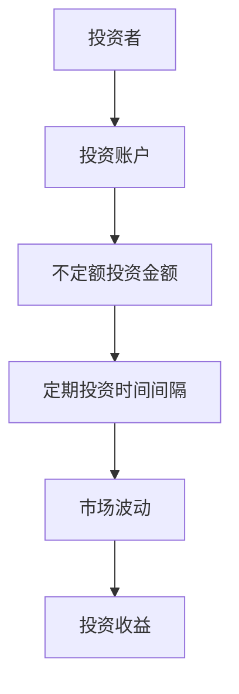
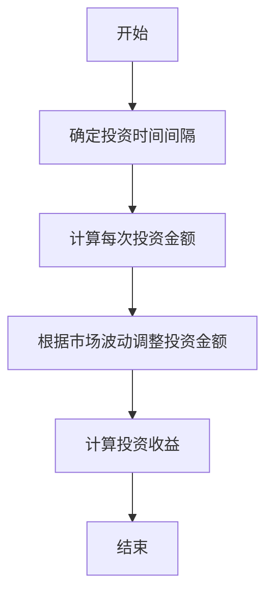
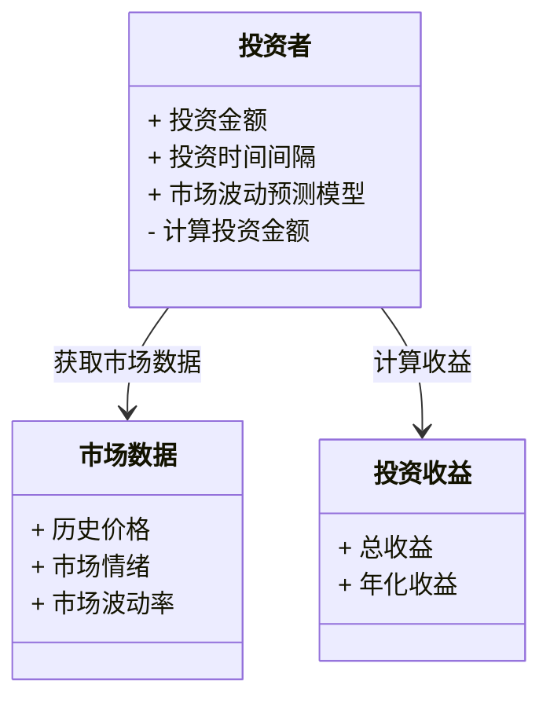
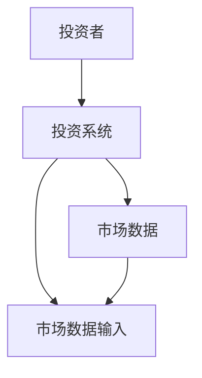
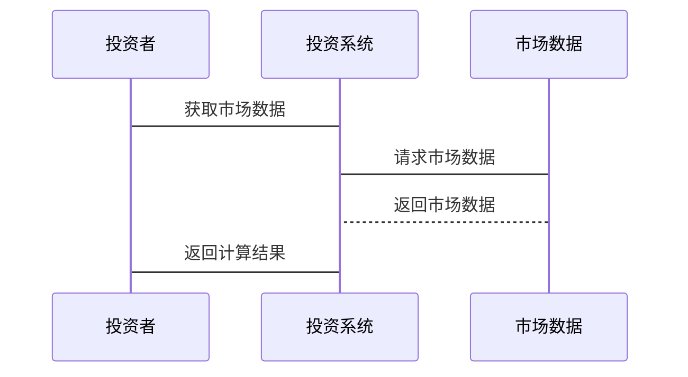

                 


# 爱德华·索普的定期不定额投资法

> 关键词：爱德华·索普, 定期不定额投资法, 投资策略, 数学模型, 投资收益

> 摘要：本文深入探讨了爱德华·索普提出的定期不定额投资法，从其数学模型、系统架构到实际应用案例进行了详细分析，展示了如何利用这种方法优化投资组合，降低风险，实现长期收益最大化。

---

# 第一部分：爱德华·索普的定期不定额投资法概述

## 第1章：爱德华·索普与定期不定额投资法的背景介绍

### 1.1 爱德华·索普的生平与投资理念

#### 1.1.1 爱德华·索普的早期经历
爱德华·索普（Edward Thorp）是一位传奇人物，他不仅是数学家，还是成功的投资者和赌博策略家。索普在20世纪60年代通过数学模型在赌场游戏中获得成功，后来将这些方法应用到金融市场中。

#### 1.1.2 索普在赌博中的数学模型应用
索普在赌博中发现了数学概率的应用，尤其是在 blackjack（21点）游戏中，他通过计算概率和牌分布，设计出一种策略，使他在赌场中的胜率超过了50%。

#### 1.1.3 索普投资理念的形成与发展
索普将赌博中的数学模型应用到投资领域，提出了定期不定额投资法。这种方法的核心在于通过概率和统计分析，优化投资时间和金额，以应对市场的不确定性。

### 1.2 定期不定额投资法的定义与特点

#### 1.2.1 定期不定额投资法的定义
定期不定额投资法是一种投资策略，投资者在固定的时间间隔内不定期地投入资金，根据市场波动调整每次的投资金额，以优化投资回报。

#### 1.2.2 定期不定额投资法的核心特点
- **时间固定性**：投资的时间间隔是固定的，例如每月投资一次。
- **金额灵活性**：每次投资的金额根据市场状况动态调整。
- **风险分散**：通过不定额投资，分散市场波动的风险。

#### 1.2.3 定期不定额投资法与传统投资方法的区别
| 特性 | 定期不定额投资法 | 传统定额定投 |
|------|----------------|--------------|
| 投资金额 | 不固定，动态调整 | 固定金额 |
| 投资时机 | 根据市场波动优化 | 固定时间间隔 |
| 风险控制 | 分散化 | 较低分散化 |

### 1.3 定期不定额投资法的背景与应用前景

#### 1.3.1 投资市场的不确定性与风险
金融市场波动性高，传统投资方法难以应对市场的剧烈波动。定期不定额投资法通过动态调整投资金额，能够在市场波动中优化收益。

#### 1.3.2 定期不定额投资法的潜在应用场景
- **股票投资**：根据市场估值动态调整投资金额。
- **基金投资**：在市场低点增加投资，减少高点投资。

#### 1.3.3 定期不定额投资法的优势与挑战
- **优势**：风险分散，收益优化，适应市场波动。
- **挑战**：需要精确的市场预测模型，实施难度较大。

## 第2章：定期不定额投资法的核心概念与联系

### 2.1 核心概念原理

#### 2.1.1 投资金额的随机性与非周期性
定期不定额投资法通过随机化投资金额，避免了固定金额投资可能带来的集中风险。

#### 2.1.2 市场波动与投资时机的优化
根据市场波动预测模型，选择最佳投资时机，减少市场波动对投资组合的影响。

#### 2.1.3 定期不定额投资法的数学模型
$$ 投资金额 = f(市场波动, 投资者风险偏好) $$

### 2.2 核心概念属性特征对比表格

| 概念       | 特性       | 描述                                                                 |
|------------|------------|----------------------------------------------------------------------|
| 投资金额   | 随机性     | 投资金额根据市场波动动态调整，非固定。                                 |
| 投资时机   | 最优化     | 根据市场预测选择最佳投资时间。                                         |
| 风险控制   | 分散化     | 通过不定额投资分散市场风险，降低整体风险。                             |

### 2.3 ER实体关系图（Mermaid流程图）



### 2.4 本章小结
定期不定额投资法通过动态调整投资金额和时间，优化了投资组合的风险和收益，是一种基于概率和统计的先进投资策略。

---

## 第3章：定期不定额投资法的数学模型与算法原理

### 3.1 投资金额的随机性模型

#### 3.1.1 投资金额的概率分布
定期不定额投资法中的投资金额服从某种概率分布，常见的包括正态分布和幂律分布。

#### 3.1.2 投资金额的随机数生成算法
使用蒙特卡洛方法生成随机数，模拟投资金额的变化。

### 3.2 投资时机优化的数学模型

#### 3.2.1 市场波动预测模型
$$ 预测波动率 = \alpha \times 历史波动率 + \beta \times 市场情绪 $$

#### 3.2.2 投资时机选择的优化算法
通过动态规划算法选择最佳投资时间。

### 3.3 投资收益的计算公式

#### 3.3.1 投资金额与时间的关系公式
$$ 收益 = \sum_{i=1}^{n} (金额_i \times (1 + 收益率_i)) $$

### 3.4 算法原理的Mermaid流程图



### 3.5 本章小结
通过数学模型和算法，定期不定额投资法能够动态调整投资金额和时机，最大化投资收益并降低风险。

---

## 第4章：定期不定额投资法的系统分析与架构设计方案

### 4.1 问题场景介绍

#### 4.1.1 投资者需求
- **需求描述**：投资者希望在固定时间间隔内不定额投资，根据市场波动优化投资金额。
- **边界条件**：投资时间间隔固定，投资金额根据市场波动动态调整。

### 4.2 系统功能设计（领域模型Mermaid类图）



### 4.3 系统架构设计（Mermaid架构图）



### 4.4 系统接口设计

#### 4.4.1 API接口
- **获取市场数据**：`GET /market_data?period=1month`
- **计算投资金额**：`POST /calculate_amount`

### 4.5 系统交互设计（Mermaid序列图）



### 4.6 本章小结
通过系统架构和交互设计，定期不定额投资法能够高效地实现动态投资金额和时间的优化。

---

## 第5章：定期不定额投资法的项目实战

### 5.1 环境安装

#### 5.1.1 安装Python环境
```bash
python --version
pip install numpy pandas matplotlib
```

#### 5.1.2 安装依赖库
```bash
pip install numpy pandas scikit-learn
```

### 5.2 系统核心实现源代码

#### 5.2.1 市场数据处理代码
```python
import numpy as np
import pandas as pd

# 示例市场数据
market_data = pd.DataFrame({
    'date': ['2023-01-01', '2023-01-02', '2023-01-03'],
    'price': [100, 102, 98]
})
```

#### 5.2.2 投资金额计算代码
```python
def calculate_amount(market_data, risk_preference=0.05):
    # 计算市场波动率
    volatility = np.std(market_data['price'])
    # 根据波动率计算投资金额
    amount = np.random.normal(1000, volatility * 100)
    return amount
```

#### 5.2.3 投资收益计算代码
```python
def calculate_profit(amounts, prices):
    total_profit = 0
    for amount, price in zip(amounts, prices):
        total_profit += amount * (price - previous_price)
    return total_profit
```

### 5.3 代码应用解读与分析

#### 5.3.1 代码功能分析
- **市场数据处理**：读取和处理市场数据，提取波动率等指标。
- **投资金额计算**：根据市场波动率生成随机投资金额。
- **投资收益计算**：根据投资金额和价格变化计算总收益。

#### 5.3.2 代码实现步骤
1. 读取市场数据。
2. 计算市场波动率。
3. 生成随机投资金额。
4. 计算投资收益。

### 5.4 实际案例分析

#### 5.4.1 案例描述
假设市场数据如下：
```python
market_data = pd.DataFrame({
    'date': ['2023-01-01', '2023-01-02', '2023-01-03'],
    'price': [100, 102, 98]
})
```

#### 5.4.2 投资金额计算
调用`calculate_amount`函数：
```python
amounts = [calculate_amount(market_data) for _ in range(3)]
```

#### 5.4.3 投资收益计算
调用`calculate_profit`函数：
```python
total_profit = calculate_profit(amounts, market_data['price'])
```

### 5.5 项目小结
通过代码实现，我们可以看到定期不定额投资法在实际中的应用，能够根据市场波动动态调整投资金额，优化收益。

---

## 第6章：定期不定额投资法的总结与展望

### 6.1 本章总结

#### 6.1.1 核心优势
- **风险分散**：通过不定额投资，降低市场波动对投资组合的影响。
- **收益优化**：动态调整投资金额，捕捉市场上涨机会。

#### 6.1.2 实际应用价值
定期不定额投资法为投资者提供了一种科学的投资策略，能够更好地应对市场的不确定性。

### 6.2 本章展望

#### 6.2.1 方法改进方向
- **优化市场预测模型**：引入更多的市场因子，提高预测准确性。
- **增强风险控制**：引入更复杂的动态调整机制。

#### 6.2.2 技术发展
随着人工智能和大数据技术的发展，定期不定额投资法将更加智能化和自动化。

### 6.3 最佳实践 Tips

#### 6.3.1 风险提示
- **市场预测的不确定性**：投资决策依赖于市场预测模型，存在模型失效风险。
- **市场波动的影响**：市场剧烈波动可能导致投资金额过大或过小。

#### 6.3.2 操作建议
- **定期评估模型**：根据市场变化，定期评估和优化投资模型。
- **分散投资**：结合其他投资策略，进一步分散风险。

### 6.4 本章小结
定期不定额投资法是一种基于数学和概率的先进投资策略，通过科学的方法优化投资组合的风险和收益。

---

## 参考文献
1. 爱德华·索普：《击败庄家：21点、 blackjack 和投资制胜法则》
2. 米勒：《投资的数学》
3. 巴西：《证券分析》

---

以上是《爱德华·索普的定期不定额投资法》的完整目录和内容框架，具体内容可以根据实际需求进一步扩展和详细阐述。

