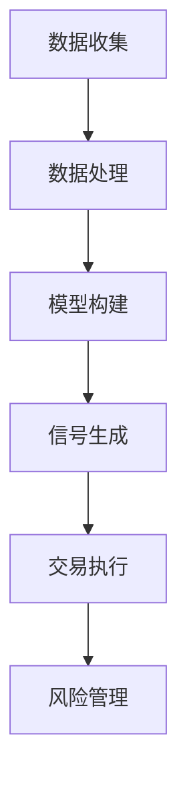

                 


# 爱德华·索普的统计套利在价值投资中的应用

> 关键词：统计套利，爱德华·索普，价值投资，市场中性策略，配对交易，数学模型，投资组合

> 摘要：本文详细探讨了爱德华·索普的统计套利方法在价值投资中的应用，结合数学模型和实际案例，分析了其在市场中性策略、配对交易以及投资组合构建中的具体应用，展示了如何利用统计套利实现低风险高回报的投资策略。

---

## 第一部分：统计套利的起源与发展

### 第1章：爱德华·索普及其贡献

#### 1.1 爱德华·索普的生平简介

爱德华·索普（Edward Thorp）是一位传奇的数学家和投资家，他在统计套利领域的贡献奠定了现代量化投资的基础。索普出生于1932年，最初在物理学和数学领域进行研究，后来转向金融数学。他的成就包括发现并应用统计套利策略，尤其是在期权定价和对冲交易中的应用。

#### 1.2 统计套利的起源与历史发展

统计套利起源于20世纪70年代，当时索普等人开始将统计学和数学应用于金融市场，寻找价格偏离的套利机会。统计套利的核心思想是利用资产之间的统计相关性，通过构建对冲组合来消除市场风险，从而在价格回归均值时获利。

#### 1.3 统计套利在金融领域的应用现状

目前，统计套利广泛应用于股票、外汇、期货等市场。它不仅帮助投资者在市场波动中获利，还为对冲基金和其他金融机构提供了有效的风险管理工具。然而，随着市场效率的提高，统计套利的机会逐渐减少，这也促使投资者不断优化模型和策略。

---

### 第2章：统计套利的核心概念与数学基础

#### 2.1 统计套利的基本原理

统计套利是一种基于统计学和数学模型的投资策略，通过分析资产之间的相关性，寻找价格偏离理论价值的机会。其核心假设是市场中存在短期的定价错误，这些错误可以通过统计方法识别和利用。

#### 2.2 统计套利与传统投资的区别

与传统投资方法不同，统计套利不依赖于对市场趋势的预测，而是通过量化分析寻找套利机会。它通常采用市场中性策略，即在对冲掉市场风险后，通过资产配对或组合投资来实现收益。

#### 2.3 统计套利的核心假设与限制

统计套利基于以下假设：
1. 资产价格服从统计规律，如均值回归。
2. 资产之间的相关性是稳定的。
3. 市场中存在套利机会，即价格偏离理论价值。

其限制包括：
- 市场效率提高，套利机会减少。
- 模型假设可能不成立，如相关性变化。
- 过度拟合模型参数，导致策略失效。

---

### 第3章：统计套利的数学模型与算法实现

#### 3.1 统计套利的数学模型

统计套利的核心是均值回归模型和协方差分析。以下是常用模型：

##### 均值回归模型
均值回归假设资产价格围绕长期均值波动。当价格偏离均值时，模型预测其回归，从而产生套利机会。

数学模型：
$$ E_t[P_{t+1}] = \mu + \beta (P_t - \mu) $$
其中，$\mu$ 是长期均值，$\beta$ 是回归系数。

##### 协方差与相关性分析
统计套利通过分析资产之间的协方差矩阵，构建相关性较高的资产组合，以对冲市场风险。

协方差矩阵表示为：
$$ \Sigma = \begin{bmatrix}
\sigma_1^2 & \sigma_{1,2} & \cdots & \sigma_{1,n} \\
\sigma_{2,1} & \sigma_2^2 & \cdots & \sigma_{2,n} \\
\vdots & \vdots & \ddots & \vdots \\
\sigma_{n,1} & \sigma_{n,2} & \cdots & \sigma_n^2
\end{bmatrix} $$

##### 时间序列分析
通过ARIMA模型或其他时间序列方法预测资产价格的变化，识别套利机会。

#### 3.2 统计套利的算法实现

以下是统计套利的实现步骤：

1. **数据收集**：收集目标资产的历史价格数据。
2. **计算相关性**：计算资产之间的协方差和相关系数。
3. **构建模型**：建立均值回归模型或时间序列模型。
4. **识别套利机会**：寻找价格偏离均值的资产。
5. **构建组合**：根据相关性构建对冲组合。
6. **风险管理**：设置止损和止盈点，控制风险。

以下是Python代码示例：

```python
import pandas as pd
import numpy as np

# 假设我们有两只股票的数据
stock1 = pd.read_csv('stock1.csv')
stock2 = pd.read_csv('stock2.csv')

# 计算收盘价的协方差矩阵
cov_matrix = np.cov(stock1['close'], stock2['close'])

# 计算相关系数
correlation = np.corrcoef(stock1['close'], stock2['close'])
```

---

## 第二部分：统计套利在价值投资中的应用

### 第4章：市场中性策略

#### 4.1 市场中性策略的定义与特点

市场中性策略是一种通过空头头寸抵消多头头寸的市场风险，从而实现收益与市场无关的投资策略。其核心思想是消除Beta风险，仅承担Alpha风险。

#### 4.2 统计套利在市场中性策略中的应用

统计套利通过构建相关资产组合，对冲市场风险，实现市场中性。具体方法包括：

- **配对交易**：选择两只高度相关的资产，建立多空头寸，利用其价格差异回归均值。
- **篮子交易**：构建多个资产的组合，利用资产间的相关性进行对冲。

---

### 第5章：配对交易

#### 5.1 配对交易的定义与特点

配对交易是一种市场中性策略，通过同时买入低估资产和卖出高估资产，利用其价格回归均值来获利。其核心在于选择高度相关的资产对。

#### 5.2 统计套利在配对交易中的应用

以下是配对交易的实现步骤：

1. **选择资产对**：选择两只高度相关的资产。
2. **计算价差**：计算资产对的价差（如股价之差）。
3. **建立模型**：建立均值回归模型，预测价差回归均值。
4. **交易信号**：当价差偏离均值时，建立多空头寸。

以下是Python代码示例：

```python
import statsmodels.api as sm

# 计算股价差
price_diff = stock1['close'] - stock2['close']

# 建立均值回归模型
model = sm.OLS(price_diff, sm.add_constant(stock1['close']))
results = model.fit()

# 获取回归系数
beta = results.params[1]
intercept = results.params[0]

# 预测均值
mean_diff = intercept + beta * stock1['close']
```

---

### 第6章：统计套利组合构建

#### 6.1 统计套利组合的构建方法

统计套利组合构建的关键在于选择相关资产，并根据统计模型确定头寸大小。以下是具体步骤：

1. **选择资产池**：从多个资产中筛选高度相关的资产。
2. **计算协方差矩阵**：量化资产之间的相关性。
3. **优化组合**：使用优化算法确定最优头寸，最大化收益并最小化风险。

#### 6.2 组合的风险管理

风险管理是统计套利成功的关键。主要措施包括：

- **风险价值（VaR）**：量化组合的潜在损失。
- **止损策略**：设定止损点，避免重大损失。
- **动态调整**：定期重新优化组合，适应市场变化。

---

## 第三部分：统计套利的系统设计与实现

### 第7章：统计套利系统设计

#### 7.1 系统架构设计

统计套利系统通常包括以下几个模块：

- 数据收集模块：收集和处理市场数据。
- 模型构建模块：建立统计套利模型。
- 信号生成模块：产生交易信号。
- 执行模块：根据信号执行交易。
- 风险管理模块：监控和管理风险。

系统架构图如下：



---

### 第8章：项目实战

#### 8.1 环境安装与数据获取

安装必要的Python库：

```bash
pip install pandas numpy statsmodels matplotlib
```

获取股票数据，例如使用Yahoo Finance接口。

#### 8.2 统计套利策略实现

以下是配对交易策略的代码示例：

```python
import pandas as pd
import numpy as np
import statsmodels.api as sm
import yfinance as yf

# 获取股票数据
stock1 = yf.download('AAPL', start='2020-01-01', end='2023-12-31')
stock2 = yf.download('MSFT', start='2020-01-01', end='2023-12-31')

# 计算股价差
price_diff = stock1['Adj Close'] - stock2['Adj Close']

# 建立均值回归模型
model = sm.OLS(price_diff, sm.add_constant(stock1['Adj Close']))
results = model.fit()

# 获取回归系数
beta = results.params[1]
intercept = results.params[0]

# 预测均值
mean_diff = intercept + beta * stock1['Adj Close']

# 生成交易信号
signal = (price_diff < mean_diff - 1) | (price_diff > mean_diff + 1)
```

---

## 第四部分：总结与展望

### 第9章：统计套利的应用总结

统计套利通过量化分析和对冲策略，帮助投资者在市场中获得超额收益。其优势在于：

- 低风险：通过市场中性策略消除Beta风险。
- 系统化：基于数学模型，减少人为干扰。
- 高效性：利用计算机快速识别套利机会。

### 第10章：最佳实践与注意事项

- **持续优化模型**：市场变化迅速，模型需定期更新。
- **控制交易成本**：过高交易成本会侵蚀收益。
- **风险监控**：建立完善的风控体系，避免重大损失。
- **技术与策略结合**：结合技术进步，不断优化策略。

---

## 附录：进一步阅读与资源

- 推荐书籍：《统计套利入门》、《量化交易实战》。
- 推荐工具：Python的量化分析库（如Pandas、NumPy）。
- 推荐网站：QuantInsti、QuantStack。

---

通过以上内容，我们深入探讨了爱德华·索普的统计套利在价值投资中的应用，从理论到实践，为读者提供了全面的指导和实用的代码示例。

