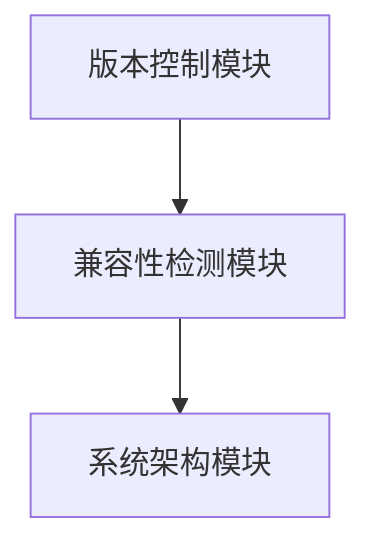

                 


# 版本兼容性：管理AI Agent的历史版本

> 关键词：版本兼容性，AI Agent，历史版本管理，技术实现，系统架构

> 摘要：本文探讨了版本兼容性在AI Agent管理中的重要性，详细分析了版本控制的核心原理、兼容性检测算法、系统架构设计以及实际项目中的应用。通过理论与实践结合，为AI Agent的历史版本管理提供系统化的解决方案。

---

## 第1章: 引言

### 1.1 版本兼容性的重要性

在现代软件开发中，版本兼容性是一个关键问题，尤其是在AI Agent领域。AI Agent作为智能系统的核心组件，其功能和行为依赖于特定的版本。当系统需要在不同版本之间切换时，确保兼容性至关重要。版本兼容性问题不仅影响系统的稳定性，还可能影响用户体验和业务连续性。

### 1.2 AI Agent的版本管理挑战

AI Agent的版本管理具有特殊性。AI模型的更新可能导致功能行为的变化，而这种变化可能与旧版本不兼容。此外，AI Agent的动态更新特性使得版本管理更加复杂，需要实时检测和处理兼容性问题。

---

## 第2章: 版本兼容性的核心概念

### 2.1 版本控制的基本原理

版本控制是一种记录文件改动历史的技术，允许在不同版本之间切换。AI Agent的版本管理需要考虑模型权重、算法逻辑等多方面因素的变化。版本控制的核心要素包括版本号、变更记录和回滚机制。

### 2.2 兼容性检测的基本原理

兼容性检测是确保不同版本AI Agent协同工作的关键步骤。检测过程需要分析模型参数的变化，评估其对系统行为的影响。兼容性检测算法通过比较新旧版本的特征，判断是否可以无缝切换。

---

## 第3章: 版本兼容性的数学模型与算法

### 3.1 版本兼容性的数学模型

版本兼容性模型通过数学公式描述版本间的关系。假设版本V1和V2，模型定义了兼容性条件：

$$
C(V1, V2) = \begin{cases}
\text{兼容} & \text{if } D(V1, V2) \leq T \\
\text{不兼容} & \text{otherwise}
\end{cases}
$$

其中，$D$表示版本差异度，$T$是阈值。

### 3.2 兼容性检测算法

兼容性检测算法的步骤如下：

1. 比较当前版本和目标版本的特征。
2. 计算差异度$D$。
3. 判断$D$是否小于阈值$T$。
4. 返回兼容性结果。

算法复杂度为$O(n)$，其中$n$是特征数量。

---

## 第4章: 系统架构设计

### 4.1 系统功能模块

AI Agent版本管理系统包括以下模块：

- 版本控制模块：管理版本信息。
- 兼容性检测模块：评估版本差异。
- 系统架构模块：设计模块交互。

### 4.2 系统架构图

使用mermaid图展示系统架构：



---

## 第5章: 项目实战

### 5.1 环境安装

安装版本控制工具，如Git，配置AI框架（如TensorFlow或PyTorch）。

### 5.2 核心代码实现

实现兼容性检测算法：

```python
def is_compatible(current_version, target_version):
    # 计算版本差异
    diff = calculate_diff(current_version, target_version)
    # 判断是否在阈值内
    return diff < threshold
```

### 5.3 实际案例分析

通过案例展示如何处理版本回滚，确保系统在版本切换时的稳定性。

---

## 第6章: 最佳实践与小结

### 6.1 最佳实践

- 定期备份版本信息。
- 使用自动化工具进行兼容性测试。
- 实施版本回滚机制。

### 6.2 小结

版本兼容性是AI Agent管理中的关键问题，通过系统化的解决方案，可以有效管理历史版本，确保系统的稳定性和可靠性。

---

通过以上结构，本文系统地探讨了版本兼容性在AI Agent管理中的应用，提供了理论支持和实践指导。读者可以结合实际项目，灵活应用这些方法，确保AI系统的顺利运行。

