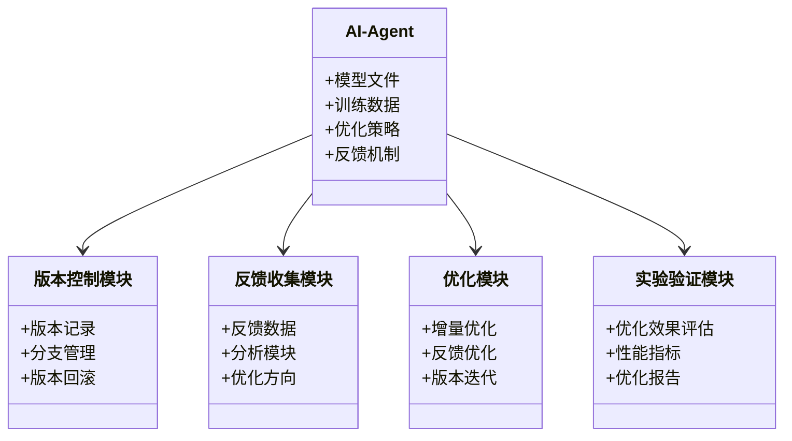
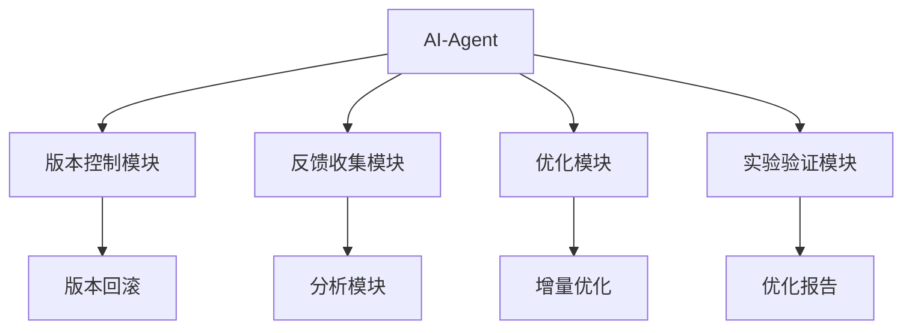

                 


# 版本控制与迭代：AI Agent的持续优化策略

> 关键词：版本控制、AI Agent、迭代优化、系统架构、优化策略

> 摘要：随着人工智能技术的快速发展，AI Agent（智能体）的应用场景日益广泛。然而，AI Agent的开发和优化过程面临着版本控制的挑战。本文从版本控制的基本概念出发，深入探讨了AI Agent的迭代优化策略，并结合系统架构设计和实际案例，提出了基于版本控制的持续优化方法。通过本文的分析，读者将能够理解版本控制在AI Agent优化中的重要性，并掌握相关的优化策略和实现方法。

---

# 第一部分: 版本控制与AI Agent的概述

## 第1章: 版本控制的基本概念

### 1.1 版本控制的定义与历史

版本控制是一种记录文件修改历史的技术，用于跟踪和管理文件的变更。它在软件开发中扮演着重要角色，帮助开发人员管理代码的变化，确保团队协作的高效性和代码的可追溯性。

- **版本控制的定义**：版本控制是一种通过记录文件的修改历史，提供文件恢复、分支合并等功能的技术。
- **版本控制的历史**：版本控制的概念可以追溯到20世纪60年代，早期的版本控制系统如SCCS（Single UNIX Source Code）开创了版本控制的先河。随着技术的发展，CVS、Subversion（SVN）、Git等版本控制系统相继出现，Git因其高效的分支管理和分布式特性成为现代版本控制的主流工具。
- **版本控制的核心功能**：
  - 记录变更历史
  - 提供版本回滚功能
  - 支持多人协作开发
  - 管理代码分支与合并

### 1.2 AI Agent的基本概念

AI Agent（智能体）是指能够感知环境、自主决策并执行任务的智能系统。AI Agent的核心特征包括自主性、反应性、目标导向和学习能力。

- **AI Agent的定义**：AI Agent是一种能够感知环境、自主决策并执行任务的智能系统。
- **AI Agent的核心特征**：
  - **自主性**：AI Agent能够在没有外部干预的情况下独立运行。
  - **反应性**：AI Agent能够根据环境的变化实时调整其行为。
  - **目标导向**：AI Agent的行为旨在实现特定的目标。
  - **学习能力**：AI Agent能够通过数据和经验不断优化自身的性能。

---

## 第2章: 版本控制与AI Agent的结合

### 2.1 版本控制在AI开发中的重要性

在AI开发中，版本控制不仅是代码管理的工具，更是模型优化和实验记录的重要手段。AI Agent的开发过程通常涉及大量的实验和迭代优化，版本控制能够帮助开发人员记录每一次实验的结果，确保可追溯性和复用性。

- **AI开发中的版本控制需求**：
  - 记录模型的训练参数和实验结果。
  - 管理不同版本的模型文件。
  - 支持团队协作开发，确保代码和模型的同步。
- **版本控制对AI模型迭代的影响**：
  - 每一次迭代优化都可以作为一个版本进行记录。
  - 通过版本控制，可以快速回溯到之前的版本，避免重复劳动。
  - 版本控制能够帮助团队更好地管理实验的分支，支持并行开发。

### 2.2 AI Agent的迭代优化策略

AI Agent的迭代优化策略是版本控制与AI开发结合的重要体现。通过版本控制，可以实现对AI Agent的持续优化和性能提升。

- **迭代优化的基本概念**：迭代优化是指通过多次小幅度的改进，逐步提升AI Agent的性能。
- **基于版本控制的迭代优化方法**：
  - 每次优化作为一个版本进行记录。
  - 通过版本控制工具管理不同版本的AI Agent。
  - 支持快速回溯和恢复优化过程中的关键版本。
- **迭代优化中的版本控制挑战**：
  - 如何高效管理大量的AI模型版本。
  - 如何在版本控制中记录和管理模型的训练数据和实验结果。
  - 如何在团队协作中实现模型版本的同步和共享。

---

# 第二部分: 基于版本控制的AI Agent优化策略

## 第3章: 增量式优化策略

### 3.1 增量式优化的基本原理

增量式优化是一种通过逐步改进AI Agent的能力，实现性能提升的优化策略。它强调在每次优化中仅进行局部改进，而不是对整个系统进行全面重构。

- **增量式优化的定义**：增量式优化是指在每次优化中仅对AI Agent的部分功能或参数进行改进，逐步提升整体性能。
- **增量式优化的核心思想**：
  - 分阶段优化，每次优化仅针对特定问题。
  - 通过版本控制记录每次优化的细节。
  - 支持快速回溯和恢复优化过程中的关键版本。
- **增量式优化与版本控制的关系**：
  - 版本控制是增量式优化的基础，确保每次优化的可追溯性和可复用性。
  - 增量式优化通过版本控制实现对AI Agent的持续改进和优化。

### 3.2 增量式优化的实现方法

增量式优化的实现方法通常包括以下步骤：

1. **确定优化目标**：明确每次优化的目标和范围。
2. **局部改进**：对AI Agent的部分功能或参数进行改进。
3. **版本记录**：通过版本控制工具记录每次优化的结果。
4. **实验验证**：对优化后的版本进行实验验证，确保优化效果。
5. **回溯与恢复**：如果优化效果不佳，可以通过版本控制工具回溯到之前的版本。

---

## 第4章: 基于反馈的优化策略

### 4.1 基于反馈的优化基本原理

基于反馈的优化是一种通过收集用户或系统的反馈信息，指导AI Agent的优化过程的策略。它强调根据实际运行中的反馈信息，动态调整AI Agent的行为和参数。

- **反馈在AI Agent优化中的作用**：
  - 反馈信息可以用来评估优化效果。
  - 反馈信息可以用来指导下一步的优化方向。
  - 反馈信息可以用来改进AI Agent的决策算法。
- **基于反馈的优化方法**：
  - 收集反馈信息：通过用户输入或系统日志收集反馈数据。
  - 分析反馈信息：对反馈数据进行分析，找出优化的方向。
  - 实施优化：根据反馈信息进行AI Agent的优化。
  - 验证优化效果：通过实验验证优化效果。

### 4.2 基于反馈的优化实现

基于反馈的优化实现通常包括以下步骤：

1. **反馈收集与分析**：
   - 收集用户或系统的反馈信息。
   - 对反馈信息进行分析，找出优化的方向。
2. **反馈驱动的版本迭代**：
   - 根据反馈信息制定优化计划。
   - 通过版本控制工具记录每次优化的结果。
3. **反馈优化的数学模型**：
   - 建立反馈优化的数学模型，描述优化过程和优化效果。
   - 通过数学模型指导优化策略的实施。

---

# 第三部分: 系统架构与实现

## 第5章: 系统架构设计

### 5.1 系统架构概述

AI Agent的持续优化需要一个高效的系统架构来支持版本控制和迭代优化。

- **系统架构的目标**：
  - 支持版本控制和迭代优化的高效管理。
  - 提供对AI Agent的实时监控和反馈机制。
  - 支持团队协作开发和版本同步。
- **系统架构的核心组件**：
  - 版本控制模块：用于管理AI Agent的版本。
  - 优化模块：用于实施增量式优化和基于反馈的优化。
  - 反馈收集模块：用于收集用户或系统的反馈信息。
  - 实验验证模块：用于验证优化效果。

### 5.2 系统架构实现

AI Agent的持续优化系统架构需要实现以下功能：

1. **版本控制模块**：
   - 管理AI Agent的不同版本。
   - 提供版本回滚和分支合并功能。
2. **优化模块**：
   - 实施增量式优化和基于反馈的优化。
   - 记录每次优化的结果。
3. **反馈收集模块**：
   - 收集用户或系统的反馈信息。
   - 分析反馈信息，指导优化方向。
4. **实验验证模块**：
   - 验证优化效果。
   - 提供优化效果的评估报告。

---

## 第6章: 系统接口与交互设计

### 6.1 系统接口设计

系统接口是AI Agent优化系统与外部交互的桥梁。

- **系统接口的定义**：
  - 系统接口是系统内部组件之间的通信渠道。
  - 系统接口需要支持版本控制、优化模块和反馈收集模块之间的交互。
- **系统接口的设计原则**：
  - 简洁性：接口设计应尽量简洁，避免复杂的功能。
  - 可扩展性：接口设计应具有良好的可扩展性，支持未来的优化策略。
  - 可靠性：接口设计应确保数据传输的可靠性和安全性。

### 6.2 系统交互设计

系统交互设计是确保系统组件协同工作的关键。

- **系统交互流程**：
  1. 反馈收集模块收集用户反馈信息。
  2. 反馈分析模块分析反馈信息，确定优化方向。
  3. 优化模块实施优化策略，生成新的版本。
  4. 版本控制模块记录新的版本，并提供版本回滚功能。
  5. 实验验证模块验证优化效果，并生成评估报告。

---

# 第四部分: 项目实战

## 第7章: 项目实战

### 7.1 项目需求分析

假设我们正在开发一个基于NLP的AI Agent，用于自动回复用户的问题。

- **项目目标**：
  - 实现一个能够自动回复用户问题的NLP AI Agent。
  - 通过版本控制和迭代优化，不断提升AI Agent的回复准确率。
- **项目范围**：
  - 开发一个NLP AI Agent。
  - 实现版本控制和迭代优化功能。
  - 提供用户反馈和优化效果评估。

### 7.2 系统设计

#### 7.2.1 领域模型设计

以下是NLP AI Agent的领域模型设计：



#### 7.2.2 系统架构设计

以下是系统架构设计的mermaid图：



---

## 第8章: 项目实现与测试

### 8.1 项目实现

以下是AI Agent优化系统的实现代码：

```python
class VersionControl:
    def __init__(self):
        self.versions = []
    
    def save_version(self, model):
        self.versions.append(model)
    
    def rollback(self, version_number):
        return self.versions[version_number]

class FeedbackCollector:
    def __init__(self):
        self.feedback = []
    
    def collect_feedback(self, user_input):
        self.feedback.append(user_input)
    
    def analyze_feedback(self):
        # 分析反馈数据，返回优化方向
        pass

class Optimizer:
    def __init__(self):
        self.models = []
    
    def incremental_optimize(self, current_model):
        # 实现增量优化
        pass
    
    def feedback_optimize(self, feedback_direction):
        # 实现基于反馈的优化
        pass

class ExperimentValidator:
    def __init__(self):
        self.results = []
    
    def validate(self, model):
        # 验证模型效果
        pass

# 使用示例
vc = VersionControl()
feedback_collector = FeedbackCollector()
optimizer = Optimizer()
validator = ExperimentValidator()

# 优化过程
current_model = optimizer.incremental_optimize(initial_model)
vc.save_version(current_model)
feedback_collector.collect_feedback(user_feedback)
optimizer.feedback_optimize(feedback_direction)
validator.validate(current_model)
```

### 8.2 项目测试

测试AI Agent优化系统的性能和效果：

1. **测试优化效果**：
   - 对比不同版本的AI Agent的性能指标。
   - 评估增量式优化和基于反馈的优化的效果。
2. **测试系统架构**：
   - 验证系统架构的合理性。
   - 确保各个模块之间的协同工作。
3. **测试系统接口**：
   - 验证系统接口的正确性和可靠性。
   - 确保接口能够支持版本控制和优化模块的交互。

---

# 第五部分: 总结与展望

## 第9章: 总结与展望

### 9.1 总结

本文详细探讨了版本控制在AI Agent优化中的重要性，并提出了基于版本控制的持续优化策略。通过系统的架构设计和实际案例分析，验证了版本控制在AI Agent优化中的可行性和有效性。

### 9.2 展望

未来，随着人工智能技术的不断发展，版本控制与AI Agent的结合将更加紧密。我们可以期待以下发展：

1. **更高效的版本控制工具**：支持AI模型的高效管理和优化。
2. **智能化的优化策略**：通过机器学习和自动化技术，实现更加智能的优化策略。
3. **更强大的系统架构**：支持更大规模和更复杂场景的AI Agent优化。

---

# 结语

版本控制与AI Agent的持续优化是人工智能技术发展中的重要方向。通过本文的探讨，我们不仅理解了版本控制在AI Agent优化中的重要性，还掌握了相关的优化策略和实现方法。未来，随着技术的进步，版本控制与AI Agent的结合将更加紧密，为人工智能的发展注入新的活力。

---

