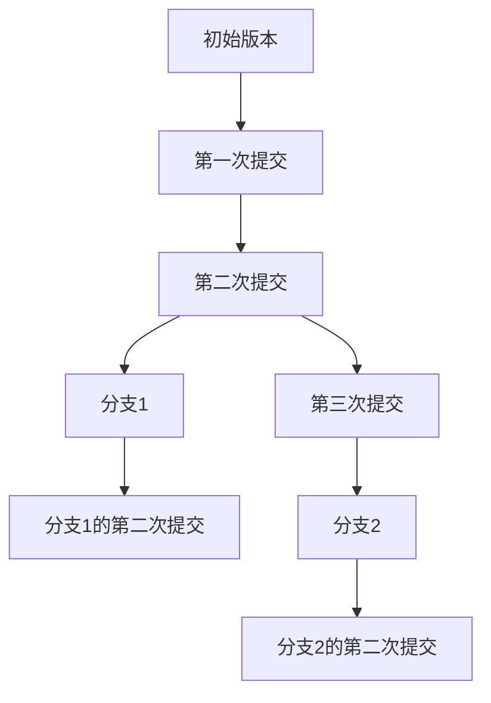
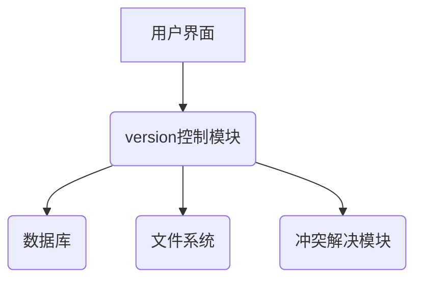
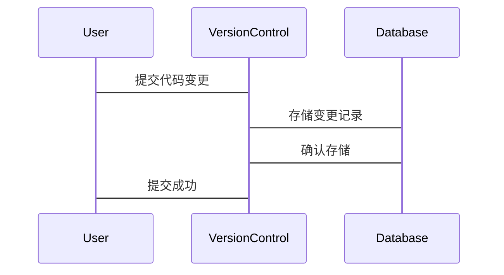

                 


# 版本控制：管理AI Agent的演进

> 关键词：版本控制、AI Agent、演进、动态模型、系统架构、算法原理

> 摘要：随着AI Agent在各个领域的广泛应用，其复杂性和动态性使得版本控制变得至关重要。本文详细探讨了版本控制在AI Agent演进中的应用，从核心概念到系统架构，再到实际案例，系统地分析了版本控制在AI Agent初始化、训练、部署等阶段的关键作用。通过结合具体算法和系统架构设计，本文为读者提供了全面的解决方案和实践指南。

---

## 第1章: 版本控制的基本概念

### 1.1 版本控制的定义与作用

版本控制是一种通过记录文件的修改历史，支持分支、合并和回溯等功能的工具或系统。它在软件开发中起着至关重要的作用，能够帮助开发人员管理代码的变更，协调团队协作，并确保系统的稳定性和可追溯性。

- **版本控制的核心功能**包括：
  - 记录文件的历史修改记录。
  - 支持多人协作开发，通过分支和合并管理不同开发路径。
  - 提供版本回溯功能，便于修复错误或恢复特定版本。

- **版本控制的类型**：
  - **集中式版本控制**：所有开发者共享一个中心仓库，如 SVN。
  - **分布式版本控制**：每个开发者都有自己的仓库副本，如 Git。

### 1.2 AI Agent的基本概念

AI Agent（智能体）是一种能够感知环境、自主决策并执行任务的智能系统。它具备以下核心特征：

- **自主性**：能够在没有外部干预的情况下独立运行。
- **反应性**：能够根据环境变化调整行为。
- **学习能力**：通过数据和经验不断优化自身性能。

AI Agent的演进过程包括初始化、训练优化和部署迭代三个阶段，每个阶段都需要版本控制的支持。

### 1.3 版本控制在AI Agent中的应用背景

AI Agent的动态演进需求使其对版本控制提出了新的挑战：

- **动态性**：AI Agent的模型和策略会不断更新，版本控制需要能够处理频繁的变更。
- **复杂性**：AI Agent的内部结构复杂，版本控制需要记录和管理多层次的依赖关系。
- **协作性**：AI Agent的开发通常涉及多个团队和工具，版本控制需要支持多方面的协作。

传统版本控制系统在处理AI Agent的动态性和复杂性方面存在局限性，因此需要专门针对AI Agent演进设计的版本控制方法。

---

## 第2章: AI Agent的演进模型

### 2.1 AI Agent的演进过程

AI Agent的演进可以分为三个主要阶段：

- **初始化阶段**：定义AI Agent的基本架构和初始模型，建立版本控制的基础。
- **训练阶段**：通过数据训练优化AI Agent的模型和策略，版本控制需要记录每次训练的参数和模型结构。
- **部署阶段**：将AI Agent部署到实际环境中运行，并根据反馈进行迭代优化，版本控制需要支持实时的版本回溯和对比分析。

### 2.2 版本控制在AI Agent演进中的角色

版本控制在AI Agent的演进过程中扮演着关键角色：

- **初始化阶段**：记录AI Agent的基本结构和初始模型，确保后续开发的基础。
- **训练阶段**：跟踪每一次训练的参数和模型变化，便于后续分析和优化。
- **部署阶段**：支持实时版本回溯，快速定位和修复问题。

通过版本控制，AI Agent的演进过程可以更加透明和可控，确保每一次更新都能够追溯和管理。

---

## 第3章: 版本控制的算法原理

### 3.1 版本控制的算法流程

版本控制的核心算法包括版本树的构建和冲突解决机制。以下是一个版本树构建的简单流程：

1. **初始化仓库**：创建一个新的版本控制系统，并初始化仓库。
2. **提交变更**：记录每一次文件的修改，并生成新的提交对象。
3. **分支与合并**：支持多个开发路径，并能够将不同分支的变更合并到主分支。
4. **冲突检测与解决**：在合并过程中检测冲突，并提供解决冲突的工具和方法。

### 3.2 版本树的构建过程

以下是一个版本树构建的流程图：



### 3.3 冲突检测与解决

在合并分支时，版本控制系统会检测冲突并提示用户进行解决。以下是冲突检测的流程：

1. **比较文件差异**：通过比较工具显示两个版本的差异。
2. **标记冲突区域**：标记需要人工干预的冲突部分。
3. **手动解决冲突**：用户根据需求选择保留哪一个版本的代码或进行修改。

以下是一个简单的冲突检测算法示例：

```python
def detect_conflicts(file1, file2):
    diff = []
    i = j = 0
    while i < len(file1) and j < len(file2):
        if file1[i] == file2[j]:
            diff.append(file1[i])
            i += 1
            j += 1
        elif file1[i] == file2[j] == '\n':
            i += 1
            j += 1
        else:
            diff.append('?')
            i += 1
            j += 1
    return diff
```

---

## 第4章: 系统架构设计

### 4.1 系统功能设计

版本控制系统的功能模块包括：

- **版本记录模块**：记录每一次修改的详细信息。
- **冲突检测模块**：检测和解决分支合并中的冲突。
- **回溯分析模块**：支持版本回溯和历史记录分析。

### 4.2 系统架构图

以下是系统的架构图：



### 4.3 接口设计

- **提交接口**：`submit(change_set: dict) -> bool`
- **回溯接口**：`revert(version: str) -> bool`
- **合并接口**：`merge(branch: str) -> bool`

### 4.4 交互流程

以下是用户与系统的主要交互流程：



---

## 第5章: 项目实战

### 5.1 环境安装

安装必要的工具和库：

```bash
pip install gitpython
pip install conflict
```

### 5.2 核心代码实现

以下是版本控制的核心代码实现：

```python
from gitpython import repository

def create_repository(path):
    return repository.RepositoryManager().create\Repository(path)

def commit(repository, message):
    repo = repository.repository
    repo.index.add_all()
    repo.index.commit(message)

def merge(repository, branch):
    repo = repository.repository
    repo.git.execute(['git', 'merge', branch])
```

### 5.3 案例分析

以一个NLP模型的AI Agent为例，展示版本控制的应用：

1. **初始化仓库**：创建一个新的Git仓库。
2. **提交初始模型**：将初始模型代码提交到仓库。
3. **创建训练分支**：为训练过程创建一个分支。
4. **提交每次训练结果**：每次训练后提交模型参数和结果。
5. **合并训练分支**：将训练结果合并到主分支。
6. **部署到生产环境**：将最终模型部署到生产环境，并进行实时监控。

---

## 第6章: 最佳实践与总结

### 6.1 最佳实践

- **定期备份**：确保版本记录的安全性和完整性。
- **模块化开发**：将AI Agent的各个部分独立管理，便于版本控制。
- **自动化测试**：在每次提交后自动运行测试，确保代码的稳定性。

### 6.2 小结

版本控制在AI Agent的演进中起着不可替代的作用，它不仅能够记录和管理AI Agent的每一次变化，还能够支持团队协作和系统的稳定运行。通过合理的系统架构和算法设计，版本控制能够有效应对AI Agent的动态性和复杂性。

### 6.3 注意事项

- **数据安全**：确保版本记录的安全，防止数据泄露。
- **性能优化**：在处理大量版本数据时，注意优化系统性能。
- **持续学习**：随着AI技术的发展，不断更新版本控制的方法和工具。

### 6.4 拓展阅读

- **分布式版本控制系统**：深入了解Git的内部实现。
- **AI Agent的演化研究**：研究AI Agent在不同领域的具体应用和版本控制需求。

---

通过本文的详细分析和实践，读者可以全面理解版本控制在AI Agent演进中的重要性，并能够将其应用到实际项目中，提升系统的开发效率和稳定性。

