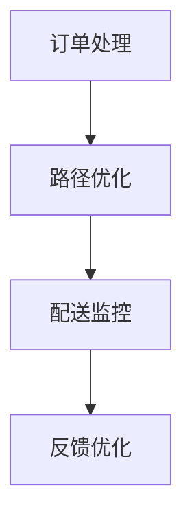

                 


# 物流行业的AI Agent优化配送路径

**关键词**：AI Agent、物流配送、路径优化、算法模型、智能调度

**摘要**：本文探讨了AI Agent在物流配送路径优化中的应用，分析了配送路径优化的核心问题，详细介绍了AI Agent的基本原理和优势，结合常见优化算法（如蚁群算法和遗传算法）的数学模型和Python实现，展示了系统架构设计，并通过项目实战分析实际案例，总结了最佳实践建议，为物流行业提供了优化配送路径的深度分析和技术指导。

---

## 第一章: 物流行业配送路径优化的背景与问题

### 1.1 物流行业的发展现状
物流行业是现代经济的重要组成部分，随着电子商务的快速发展，物流配送的需求急剧增长。传统的人工调度方式效率低下，难以应对日益复杂的配送需求。物流行业的分类主要包括快递、仓储、运输等，每个环节都面临着优化的挑战。

### 1.2 配送路径优化的背景与问题
配送路径优化是物流行业的核心问题之一，旨在通过合理规划配送路线，降低配送成本，提高效率。配送路径优化的核心问题是解决车辆路径问题（VRP），包括车辆数量、路线长度、客户分布等因素。

### 1.3 AI Agent在物流行业的应用前景
AI Agent（智能代理）能够通过学习和适应优化配送路径，显著提高配送效率。与传统算法相比，AI Agent具有自适应性和实时性，能够处理动态变化的物流环境。

---

## 第二章: AI Agent与配送路径优化的核心概念

### 2.1 AI Agent的原理与特点
AI Agent通过感知环境、决策、执行动作来优化路径。其特点包括自主性、反应性、目标导向和协作性。

### 2.2 配送路径优化的数学模型
目标函数：最小化总配送成本。
$$
\min \sum_{i=1}^{n} c_{i} \cdot x_{i}
$$
约束条件：满足所有客户的需求。
$$
\sum_{i=1}^{n} x_{i} = 1
$$

### 2.3 AI Agent与配送路径优化的联系
AI Agent通过模拟退火算法优化路径，结合实时数据动态调整配送计划，显著提高效率。

---

## 第三章: AI Agent优化配送路径的算法原理

### 3.1 常见的配送路径优化算法
- **蚁群算法**：模拟蚂蚁寻找最短路径的行为。
- **遗传算法**：通过交叉和变异操作优化路径。
- **模拟退火算法**：通过降温过程找到全局最优解。

### 3.2 蚁群算法的数学模型
信息素更新规则：
$$
\tau_{ij} = \tau_{ij} + \frac{1}{\text{路径长度}}
$$

### 3.3 转换为Python代码实现
```python
def ant Colony():
    initialize τ matrix
    while not converged:
        ants generate paths
        update τ based on path lengths
        evaporate τ
    return best path
```

---

## 第四章: AI Agent优化配送路径的系统架构设计

### 4.1 系统功能设计
系统功能包括订单处理、路径优化、配送监控和反馈优化。

### 4.2 系统架构图


---

## 第五章: 项目实战与案例分析

### 5.1 项目实战
环境安装：安装Python和相关库。
核心代码实现：
```python
import numpy as np

def genetic_algorithm():
    # 初始化种群
    population = np.random.rand(pop_size, n_vars)
    # 计算适应度
    fitness = np.array([evaluate(individual) for individual in population])
    # 选择、交叉、变异
    selected = select(population, fitness)
    offspring = crossover(selected)
    mutate(offspring)
    return best(offspring)
```

### 5.2 案例分析
以某物流公司为例，展示优化前后的效果对比，分析算法的优缺点和改进方向。

---

## 第六章: 最佳实践与总结

### 6.1 小结
AI Agent通过优化算法和系统架构设计，显著提升了物流配送效率。

### 6.2 注意事项
在实际应用中，需注意数据质量和算法选择，避免局部最优。

### 6.3 拓展阅读
建议读者进一步研究强化学习在物流优化中的应用。

---

通过以上步骤，文章系统地分析了AI Agent在物流配送路径优化中的应用，结合理论与实践，为读者提供了全面的技术指导。

