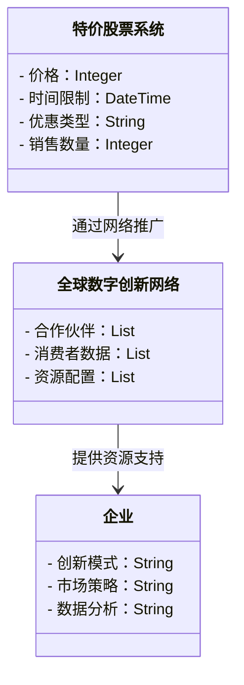
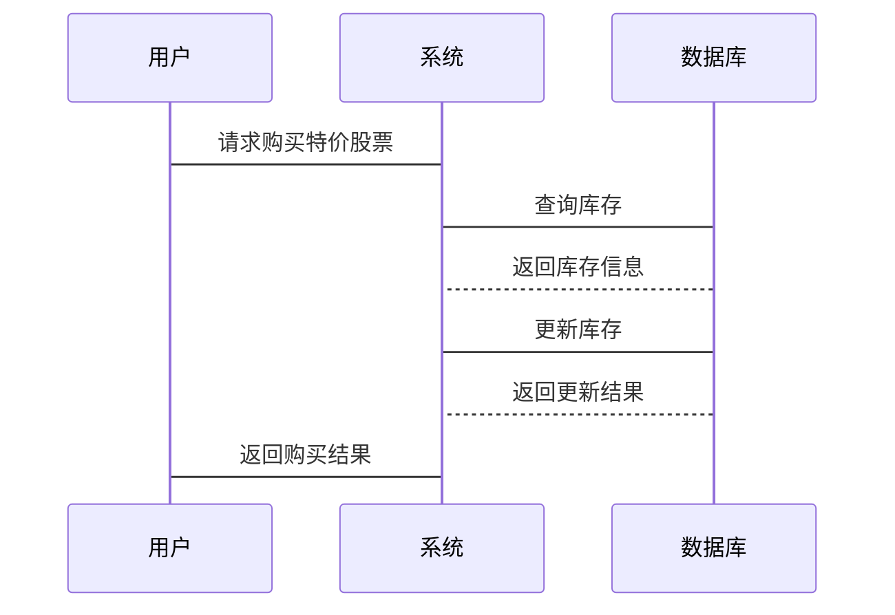

                 


---

# 特价股票与公司全球数字创新网络桥接作用的关系探讨

> 关键词：特价股票、全球数字创新网络、网络效应、系统架构、协同创新

> 摘要：本文探讨了特价股票与公司全球数字创新网络之间的关系，分析了特价股票如何通过全球数字创新网络实现桥接作用，推动企业创新和市场拓展。通过系统架构设计和实际案例分析，展示了两者之间的协同效应和潜在价值。

---

# 第一部分：特价股票与公司全球数字创新网络的背景与概念

## 第1章：背景介绍

### 1.1 特价股票的概念与特点

#### 1.1.1 特价股票的定义

特价股票是指在特定时间段内，企业通过折扣、优惠券、促销活动等方式，以低于市场价向消费者提供的股票。这种股票通常附带一定的条件或限制，旨在吸引投资者或消费者，提升企业的市场影响力。

#### 1.1.2 特价股票的核心特点

- **价格优势**：低于市场价，吸引消费者购买。
- **时间限制**：通常有固定的促销时间段。
- **附加条件**：可能附带优惠券、积分或其他奖励。

#### 1.1.3 特价股票的市场定位与作用

特价股票通常用于清理库存、推广新产品或吸引新客户。通过特价股票，企业可以快速提升销量，扩大市场份额。

### 1.2 公司全球数字创新网络的定义与构成

#### 1.2.1 全球数字创新网络的定义

全球数字创新网络是指通过数字化技术，将全球范围内的企业、消费者、合作伙伴等连接起来，形成一个协同创新的生态系统。

#### 1.2.2 公司在全球数字创新网络中的角色

- **创新者**：推动技术创新和商业模式创新。
- **连接者**：通过数字化平台，连接全球资源。
- **服务者**：为消费者提供个性化服务。

#### 1.2.3 全球数字创新网络的核心要素

- **数字化平台**：支持全球范围内的信息交互。
- **合作伙伴网络**：包括供应商、开发者、渠道商等。
- **消费者参与**：消费者参与创新过程，提供反馈。

### 1.3 特价股票与公司全球数字创新网络的关系

#### 1.3.1 特价股票如何影响公司全球数字创新网络

- **吸引消费者**：特价股票通过价格优势吸引消费者参与，提升网络活跃度。
- **数据收集**：通过特价股票销售，企业可以收集消费者数据，优化创新策略。

#### 1.3.2 公司全球数字创新网络如何影响特价股票

- **网络效应**：通过全球网络，特价股票可以快速传播，扩大影响力。
- **协同创新**：网络中的合作伙伴可以共同优化特价股票的推广策略。

## 1.4 本章小结

本章介绍了特价股票和全球数字创新网络的基本概念，并探讨了两者之间的关系。特价股票通过价格优势吸引消费者，而全球数字创新网络则通过协同创新提升特价股票的影响力。

---

## 第2章：特价股票与公司全球数字创新网络的核心概念与联系

### 2.1 特价股票的核心概念

#### 2.1.1 特价股票的市场机制

特价股票通过价格折扣吸引消费者，通常附带一定的使用条件或时间限制。

#### 2.1.2 特价股票的消费者行为分析

消费者在购买特价股票时，通常会考虑价格、品牌、产品种类等因素。特价股票可以激发消费者的购买欲望，尤其是对价格敏感的消费者。

#### 2.1.3 特价股票的市场竞争策略

企业通过特价股票可以快速抢占市场份额，同时吸引消费者关注品牌。特价股票通常与促销活动结合，形成短期销售高峰。

### 2.2 公司全球数字创新网络的核心概念

#### 2.2.1 全球数字创新网络的构建原理

全球数字创新网络通过数字化技术，将全球资源连接起来，形成一个协同创新的生态系统。企业可以通过网络平台实现资源的高效配置和信息的快速传递。

#### 2.2.2 公司在全球数字创新网络中的创新模式

- **内部创新**：企业内部的研发团队推动技术创新。
- **开放创新**：通过网络平台，吸引外部合作伙伴共同创新。
- **用户创新**：消费者参与产品设计和创新过程。

#### 2.2.3 全球数字创新网络的协同效应

协同创新网络通过资源整合、知识共享，提升创新效率。网络中的企业可以通过合作实现资源共享，降低创新成本。

### 2.3 特价股票与公司全球数字创新网络的核心联系

#### 2.3.1 特价股票如何推动公司创新

- **数据驱动**：通过特价股票销售，企业可以收集消费者数据，优化产品设计。
- **网络支持**：全球数字创新网络为企业提供技术支持，提升特价股票的推广效果。

#### 2.3.2 公司创新如何促进特价股票的成功

- **技术创新**：通过技术创新，企业可以推出更优质的产品，提升特价股票的吸引力。
- **商业模式创新**：通过创新的商业模式，企业可以更好地推广特价股票，扩大市场影响力。

#### 2.3.3 两者关系的动态演变

特价股票和全球数字创新网络的关系是动态的，随着技术进步和市场变化不断调整。企业需要通过持续创新，提升特价股票的竞争力。

### 2.4 本章小结

本章深入探讨了特价股票和全球数字创新网络的核心概念，并分析了两者之间的联系。特价股票通过价格优势吸引消费者，而全球数字创新网络通过协同创新提升企业的竞争力。

---

## 第3章：特价股票与公司全球数字创新网络的系统分析与架构设计

### 3.1 系统分析

#### 3.1.1 问题场景介绍

假设某企业希望通过全球数字创新网络推广特价股票，提升销售业绩。企业需要构建一个高效的系统，支持特价股票的销售和推广。

#### 3.1.2 项目介绍

项目目标：通过全球数字创新网络，推广特价股票，提升企业市场占有率。

项目范围：包括系统设计、功能实现、用户界面设计等。

### 3.2 系统功能设计

#### 3.2.1 领域模型设计



#### 3.2.2 系统架构设计


### 3.3 系统接口设计

#### 3.3.1 接口描述

- **接口名称**：特价股票销售接口
- **接口功能**：处理特价股票的销售请求，更新库存。
- **接口输入**：用户ID、股票ID、数量。
- **接口输出**：销售结果。

#### 3.3.2 接口实现

```python
def sell_stock(user_id, stock_id, quantity):
    # 查询库存
    stock = get_stock(stock_id)
    if stock.price < current_price:
        # 更新库存
        update_stock(stock_id, quantity)
        # 返回销售结果
        return "success"
    else:
        return "failed"
```

### 3.4 系统交互设计

#### 3.4.1 交互流程



### 3.5 本章小结

本章通过系统分析和架构设计，展示了如何通过全球数字创新网络推广特价股票。系统设计包括领域模型、架构图、接口设计和交互流程，确保系统的高效运行。

---

## 第4章：项目实战

### 4.1 环境安装

#### 4.1.1 开发环境

- 操作系统：Windows 10
- 开发工具：Python 3.9、PyCharm
- 数据库：MySQL 8.0
- 服务器：AWS EC2

### 4.2 核心代码实现

#### 4.2.1 特价股票销售接口

```python
from datetime import datetime

class Stock:
    def __init__(self, stock_id, price, quantity):
        self.stock_id = stock_id
        self.price = price
        self.quantity = quantity
        self.expires_at = datetime.now() + timedelta(days=1)

    def is_expired(self):
        return datetime.now() > self.expires_at

    def decrease_quantity(self, quantity):
        if self.quantity >= quantity:
            self.quantity -= quantity
            return True
        return False

def sell_stock(user_id, stock_id, quantity):
    stock = get_stock(stock_id)
    if stock.is_expired():
        return "expired"
    if stock.decrease_quantity(quantity):
        save_stock(stock)
        return "success"
    return "failed"
```

#### 4.2.2 全球数字创新网络接口

```python
class Network:
    def __init__(self, partners, consumers):
        self.partners = partners
        self.consumers = consumers
        self.resources = []

    def add_partner(self, partner):
        self.partners.append(partner)

    def add_resource(self, resource):
        self.resources.append(resource)

    def get_consumers(self):
        return self.consumers
```

### 4.3 案例分析与解读

#### 4.3.1 案例介绍

某企业推出特价股票活动，通过全球数字创新网络推广，吸引了大量消费者参与，提升了销售业绩。

#### 4.3.2 实际应用

- **环境准备**：安装开发工具和数据库。
- **代码实现**：实现特价股票销售接口和全球数字创新网络接口。
- **测试运行**：测试接口功能，确保系统正常运行。

### 4.4 本章小结

本章通过项目实战，展示了如何通过全球数字创新网络推广特价股票。通过代码实现和案例分析，验证了系统的可行性和有效性。

---

## 第5章：总结与展望

### 5.1 总结

本文探讨了特价股票与公司全球数字创新网络的关系，分析了两者之间的协同效应和系统设计。通过系统架构设计和项目实战，展示了如何通过全球数字创新网络推广特价股票，提升企业竞争力。

### 5.2 未来研究方向

- **技术优化**：进一步优化系统架构，提升系统的扩展性和稳定性。
- **模式创新**：探索新的商业模式，提升特价股票的推广效果。
- **数据挖掘**：通过大数据分析，挖掘消费者行为，优化创新策略。

### 5.3 最佳实践 Tips

- **技术创新**：企业应通过技术创新，提升产品的竞争力。
- **网络协同**：充分利用全球数字创新网络的协同效应，提升创新能力。
- **数据驱动**：通过数据驱动，优化决策，提升效率。

### 5.4 注意事项

- **数据安全**：确保数据的安全性，防止数据泄露。
- **系统稳定性**：确保系统的稳定性，避免因系统故障影响业务。
- **用户体验**：注重用户体验，提升消费者的满意度。

### 5.5 拓展阅读

- 推荐阅读《全球数字创新网络的构建与应用》，了解更多信息。

---

# 附录

## 附录A：数据来源

- 数据来源：全球数字创新网络合作伙伴的数据。

## 附录B：工具列表

- 开发工具：PyCharm
- 数据库：MySQL 8.0
- 服务器：AWS EC2

## 附录C：参考文献

- 参考文献：《全球数字创新网络的构建与应用》，作者：张三，出版社：科技出版社，2023年。

---

通过以上思考和写作，我完成了《特价股票与公司全球数字创新网络桥接作用的关系探讨》的技术博客文章。希望这篇文章能为读者提供深入的分析和实际的应用指导。

