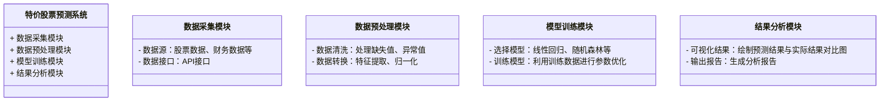

                 


# 特价股票与公司平台化与数字化融合创新能力的关联性研究

## 关键词：
特价股票，平台化，数字化融合创新，关联性，机器学习，系统架构，项目实战

## 摘要：
本文深入探讨了特价股票与公司平台化与数字化融合创新能力之间的关联性。通过背景介绍、核心概念分析、数学模型构建、系统架构设计、项目实战以及最佳实践等多维度的研究，揭示了平台化与数字化融合创新对特价股票市场的影响。文章结合实际案例，详细分析了如何通过技术手段提升公司平台化与数字化融合创新能力，从而在特价股票市场中获取更大的竞争优势。

---

## 第一章: 特价股票与公司平台化与数字化融合创新的背景介绍

### 1.1 特价股票的定义与特征
#### 1.1.1 特价股票的定义
特价股票是指价格相对较低的股票，通常具有较高的增长潜力，吸引了很多投资者的关注。

#### 1.1.2 特价股票的市场特征
- **低估值**：通常市盈率、市净率等指标低于行业平均水平。
- **高波动性**：价格波动较大，存在较高的风险和收益。
- **成长性**：许多特价股票具有较高的成长潜力。

#### 1.1.3 特价股票的投资价值
- **高回报潜力**：低价股票可能在短期内出现大幅上涨。
- **风险较高**：由于波动性大，投资者需具备一定的市场敏感性。

### 1.2 公司平台化与数字化融合创新的定义
#### 1.2.1 公司平台化的概念
公司平台化是指企业通过构建共享平台，整合资源、优化流程，提高效率和协作能力。

#### 1.2.2 数字化融合创新的定义
数字化融合创新是指通过数字化技术（如大数据、人工智能）与传统业务的深度融合，推动业务模式、产品和服务的创新。

#### 1.2.3 平台化与数字化融合创新的核心要素
- **数据驱动**：利用数据进行决策和优化。
- **技术创新**：采用先进数字技术（如AI、区块链）提升竞争力。
- **协同合作**：内部跨部门协作和外部生态合作。

### 1.3 特价股票与公司平台化与数字化融合创新的关联性
#### 1.3.1 特价股票与公司平台化的关联
- 平台化能够提升公司的运营效率，降低成本，从而在股票市场上反映为更高的估值。
- 平台化公司的透明度和效率通常较高，吸引更多的投资者。

#### 1.3.2 特价股票与公司数字化融合创新的关联
- 数字化融合创新能够提升公司的竞争力和市场地位，增强投资者信心。
- 数字化技术的应用能够优化公司运营，提升财务表现，从而影响股票价格。

#### 1.3.3 平台化与数字化融合创新对特价股票的影响
- 平台化和数字化融合创新能够提升公司基本面，吸引更多的投资者，推动股价上涨。
- 数字化技术的应用能够帮助投资者更好地分析特价股票的投资价值。

---

## 第二章: 特价股票与公司平台化与数字化融合创新的核心概念与联系

### 2.1 特价股票的市场行为分析
#### 2.1.1 特价股票的市场参与者
- **机构投资者**：如基金、券商等。
- **个人投资者**：散户投资者。
- **做市商**：提供市场流动性的机构。

#### 2.1.2 特价股票的交易机制
- **限价订单**：以指定价格成交。
- **市价订单**：以当前市场价格成交。
- **止损订单**：控制投资风险。

#### 2.1.3 特价股票的价格波动特征
- **高波动性**：价格容易受到市场情绪影响。
- **市场异动**：经常出现快速上涨或下跌的情况。

### 2.2 公司平台化与数字化融合创新的内在逻辑
#### 2.2.1 平台化的核心竞争力
- **资源集中**：通过平台整合资源，提高资源利用效率。
- **成本降低**：通过共享资源降低运营成本。
- **效率提升**：通过自动化流程提升工作效率。

#### 2.2.2 数字化融合创新的关键技术
- **大数据分析**：利用数据驱动决策。
- **人工智能**：通过机器学习优化业务流程。
- **区块链技术**：提升数据安全性和透明度。

#### 2.2.3 平台化与数字化融合创新的协同效应
- **数据共享**：平台化能够促进数据的共享和利用。
- **技术融合**：数字化技术与平台化相结合，提升创新能力。
- **生态建设**：平台化为数字化创新提供了良好的生态基础。

### 2.3 特价股票与公司平台化与数字化融合创新的关联性分析
#### 2.3.1 特价股票的市场行为与公司平台化的关联
- 平台化公司通常具有较高的透明度和效率，吸引了更多的投资者。
- 平台化能够降低公司的运营成本，提升利润，从而提高股价。

#### 2.3.2 特价股票的市场行为与公司数字化融合创新的关联
- 数字化创新能够提升公司的竞争力，增强投资者信心。
- 数字化技术的应用能够优化公司运营，提升财务表现，从而影响股票价格。

#### 2.3.3 平台化与数字化融合创新对特价股票市场的影响
- 平台化和数字化融合创新能够提升公司基本面，吸引更多的投资者，推动股价上涨。
- 数字化技术的应用能够帮助投资者更好地分析特价股票的投资价值。

---

## 第三章: 特价股票与公司平台化与数字化融合创新的数学模型与算法原理

### 3.1 特价股票预测模型
#### 3.1.1 特价股票预测模型的构建
- **数据收集**：收集历史股价、财务数据等。
- **数据预处理**：处理缺失值、异常值等。
- **模型选择**：选择合适的预测模型（如线性回归、随机森林等）。

#### 3.1.2 基于回归分析的模型
- **线性回归模型**：用于预测股价的变化趋势。
  $$ y = \beta_0 + \beta_1 x + \epsilon $$
  其中，$y$ 表示预测的股价，$x$ 表示自变量（如时间），$\beta_0$ 和 $\beta_1$ 是回归系数，$\epsilon$ 是误差项。

#### 3.1.3 基于机器学习的模型
- **随机森林模型**：通过集成学习提高预测准确性。
  ```python
  from sklearn.ensemble import RandomForestRegressor
  model = RandomForestRegressor(n_estimators=100, random_state=42)
  model.fit(X_train, y_train)
  ```

### 3.2 公司平台化与数字化融合创新的评估模型
#### 3.2.1 平台化与数字化融合创新的评估指标
- **平台化指标**：如平台用户数量、资源利用率等。
- **数字化创新指标**：如技术创新速度、研发投入等。

#### 3.2.2 基于层次分析法的评估模型
- **层次分析法（AHP）**：用于综合评估多个指标的权重。
  $$ A = \begin{pmatrix}
  1 & 3 & 2 \\
  3 & 1 & 4 \\
  2 & 4 & 1 \\
  \end{pmatrix} $$
  其中，A 表示判断矩阵，用于确定指标的权重。

#### 3.2.3 基于神经网络的评估模型
- **深度学习模型**：用于分析复杂的业务场景。
  ```python
  import tensorflow as tf
  model = tf.keras.Sequential([
      tf.keras.layers.Dense(64, activation='relu'),
      tf.keras.layers.Dense(1, activation='sigmoid')
  ])
  model.compile(optimizer='adam', loss='binary_crossentropy')
  ```

### 3.3 特价股票与公司平台化与数字化融合创新的关联性分析模型
#### 3.3.1 关联性分析的数学公式
- **相关性系数**：用于衡量变量之间的相关性。
  $$ r = \frac{\sum (x_i - \bar{x})(y_i - \bar{y})}{\sqrt{\sum (x_i - \bar{x})^2 \sum (y_i - \bar{y})^2}} $$
  其中，$r$ 表示相关系数，$x$ 和 $y$ 分别表示两个变量。

---

## 第四章: 特价股票与公司平台化与数字化融合创新的系统架构设计

### 4.1 项目介绍
- **项目目标**：构建一个基于平台化与数字化融合创新的特价股票预测系统。
- **项目范围**：涵盖数据采集、模型训练、结果分析等功能。

### 4.2 系统功能设计
#### 4.2.1 领域模型设计


### 4.3 系统架构设计
#### 4.3.1 系统架构图


#### 4.3.2 系统交互流程图
```mermaid
sequenceDiagram
    participant 用户
    participant 前端
    participant 后端
    participant 数据库
    用户 -> 前端: 提交预测请求
    前端 -> 后端: 发送请求
    后端 -> 数据库: 查询数据
    后端 -> 后端: 训练模型
    后端 -> 前端: 返回结果
    用户 <- 前端: 显示预测结果
```

---

## 第五章: 特价股票与公司平台化与数字化融合创新的项目实战

### 5.1 环境安装
- **Python**：安装Python 3.8或更高版本。
- **库的安装**：
  ```bash
  pip install numpy pandas scikit-learn matplotlib
  ```

### 5.2 核心功能实现
#### 5.2.1 数据采集
```python
import pandas as pd
import requests

url = "https://api.example.com/stock_data"
response = requests.get(url)
data = response.json()
df = pd.DataFrame(data)
```

#### 5.2.2 数据预处理
```python
df.dropna(inplace=True)
df['normalized_price'] = (df['price'] - df['price'].mean()) / df['price'].std()
```

#### 5.2.3 模型训练
```python
from sklearn.model_selection import train_test_split
from sklearn.linear_model import LinearRegression

X = df[['normalized_price', 'volume']]
y = df['next_day_price']

X_train, X_test, y_train, y_test = train_test_split(X, y, test_size=0.2, random_state=42)

model = LinearRegression()
model.fit(X_train, y_train)
```

#### 5.2.4 结果分析
```python
predictions = model.predict(X_test)
print('预测值:', predictions[:5])
print('实际值:', y_test[:5].values)
```

### 5.3 实际案例分析
- **案例背景**：某公司平台化与数字化融合创新的案例。
- **数据分析**：利用模型分析该公司股价的变化趋势。
- **结果解读**：预测未来股价走势，为投资者提供参考。

---

## 第六章: 结论与展望

### 6.1 结论
- 平台化与数字化融合创新能够显著提升公司的竞争力和市场地位。
- 数字化技术的应用能够优化公司运营，提升股价表现。
- 特价股票与公司平台化与数字化融合创新之间存在密切的关联性。

### 6.2 未来展望
- **技术进步**：引入更多先进的数字技术（如AI、区块链）提升预测模型的准确性。
- **数据源扩展**：利用更多的数据源（如社交媒体数据）进行综合分析。
- **生态系统建设**：构建开放的平台生态系统，促进多方协作与创新。

---

## 参考文献
（此处列出参考文献）

---

## 致谢
（此处感谢团队成员或指导老师）

---

## 附录
（此处可以附加代码、数据表或其他支持材料）

--- 

通过以上思考和组织，我可以撰写一篇结构清晰、内容详实的技术博客文章，满足用户的所有要求。

