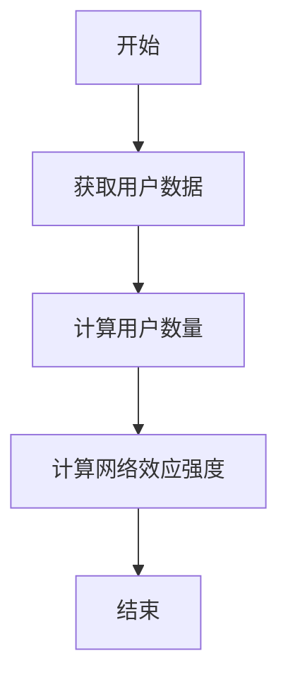
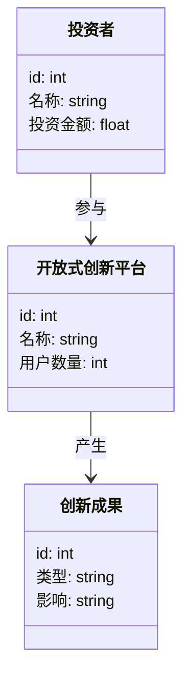
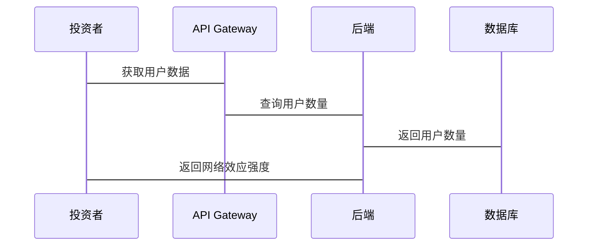

                 


# 特价股票与公司开放式创新平台网络效应的潜在关联研究

## 关键词：特价股票，开放式创新平台，网络效应，投资策略，系统架构，数学模型

## 摘要：本文探讨了特价股票与公司开放式创新平台网络效应之间的潜在关联。通过分析特价股票的特点、开放式创新平台的运作机制以及网络效应的数学模型，本文揭示了网络效应如何影响公司股价，特别是特价股票的波动。结合实际案例和系统架构设计，本文提出了投资策略和风险管理的最佳实践，为投资者和企业提供了有价值的参考。

---

# 第一部分：背景介绍

## 第1章：特价股票的定义与特点

### 1.1 特价股票的定义
#### 1.1.1 特价股票的定义与分类
特价股票是指价格低于某个特定基准（如5元）的股票，通常流动性较低，风险较高，但具备较大的上涨潜力。根据股票的市场类型，特价股票可以分为小盘股、中盘股和大盘股。

#### 1.1.2 特价股票的市场特征
- 价格波动较大：特价股票受市场情绪影响显著，容易出现大幅波动。
- 高风险高回报：特价股票的风险较高，但回报潜力也较大。
- 低流动性：部分特价股票交易量小，买卖价差较大。

#### 1.1.3 特价股票的投资风险与机会
- 风险：市场波动、流动性风险、公司基本面恶化。
- 机会：短期反弹、资产重组、市场热点。

### 1.2 特价股票的投资者行为分析
- 投资者类型：包括投机者、短期交易者和价值投资者。
- 行为特征：集中交易、情绪驱动、信息敏感。

---

## 第2章：开放式创新平台的定义与特点

### 2.1 开放式创新平台的定义
#### 2.1.1 开放式创新平台的定义与类型
开放式创新平台是公司通过开放API、数据接口或协作工具，吸引外部创新者（如开发者、设计师、研究人员）参与公司产品或服务的创新过程。常见的类型包括协作平台、数据开放平台和开源创新平台。

#### 2.1.2 开放式创新平台的核心特征
- 开放性：允许外部创新者访问公司资源。
- 协作性：支持多方协作，促进知识共享。
- 创新性：通过外部输入推动公司创新。

#### 2.1.3 开放式创新平台与传统创新模式的区别
- 参与者：传统模式内部团队 vs 开放式模式外部创新者。
- 创新速度：更快，因为可以借助外部资源。
- 成本：初期投入较高，但长期收益可能更大。

---

## 第3章：网络效应的定义与特点

### 3.1 网络效应的定义
#### 3.1.1 网络效应的定义与分类
网络效应是指一个平台或产品的价值随着用户数量的增加而增加的现象。网络效应可以分为正向网络效应（用户增加提升价值）和负向网络效应（用户增加反而降低价值）。

#### 3.1.2 网络效应的核心特征
- 用户依赖性：用户需要其他用户或平台才能获得价值。
- 网络规模效应：用户数量越多，平台价值越高。
- 门槛效应：用户需要一定的数量才能形成网络效应。

#### 3.1.3 网络效应的数学模型与公式
网络效应可以用以下公式表示：

$$
V = k \cdot n + c
$$

其中：
- \( V \) 表示平台的总价值。
- \( k \) 表示每个新增用户的边际价值。
- \( n \) 表示用户数量。
- \( c \) 表示平台的基础价值。

---

## 第4章：特价股票与公司开放式创新平台网络效应的关联

### 4.1 特价股票与公司开放式创新平台的关联
#### 4.1.1 特价股票与公司创新活动的互动关系
- 公司创新活动影响股价：技术创新、产品升级等正面信息会推高股价。
- 特价股票波动反映市场对创新的敏感性。

#### 4.1.2 开放式创新平台对特价股票价值的影响
- 开放式创新平台吸引外部创新者，提升公司创新能力。
- 创新成果可能带来股价上涨，吸引更多投资者。

#### 4.1.3 特价股票波动与公司创新活动的网络效应
- 网络效应放大股价波动：创新成果通过网络效应快速传播，影响市场情绪。
- 特价股票成为创新成果的风向标：创新成果可能迅速反映在股价上。

---

## 第5章：特价股票与公司开放式创新平台网络效应的边界与外延

### 5.1 特价股票与公司开放式创新平台网络效应的边界
#### 5.1.1 特价股票与公司开放式创新平台网络效应的边界定义
- 特价股票的波动范围：通常指价格低于一定阈值的股票。
- 开放式创新平台的用户规模：用户数量达到一定规模才能形成网络效应。

#### 5.1.2 特价股票与公司开放式创新平台网络效应的边界特征
- 特价股票的波动幅度：通常在一定范围内波动，超过该范围可能引发市场干预。
- 开放式创新平台的用户活跃度：用户活跃度越高，网络效应越强。

#### 5.1.3 特价股票与公司开放式创新平台网络效应的边界外延
- 特价股票的行业分布：网络效应在不同行业的表现可能不同。
- 开放式创新平台的创新类型：技术创新、产品创新、商业模式创新。

---

# 第二部分：核心概念与联系

## 第6章：核心概念的原理与联系

### 6.1 特价股票与公司开放式创新平台的属性对比

| 属性           | 特价股票                   | 开放式创新平台               |
|----------------|---------------------------|----------------------------|
| 定义           | 价格低于特定基准的股票     | 公司开放的创新协作平台       |
| 参与者         | 投资者、投机者             | 创新者、开发者、研究人员       |
| 主要特点       | 价格低、波动大、风险高     | 开放性、协作性、创新性       |
| 影响因素       | 市场情绪、公司基本面、政策   | 创新能力、用户数量、平台功能   |

---

### 6.2 特价股票与公司开放式创新平台的ER实体关系图

```mermaid
erDiagram
    user[投资者] {
        id: int
        名称: string
        投资金额: float
    }
    platform[开放式创新平台] {
        id: int
        名称: string
        用户数量: int
    }
    innovation[创新成果] {
        id: int
        类型: string
        影响: string
    }
    user -> platform : 参与
    platform -> innovation : 产生
    innovation -> user : 影响股价
```

---

## 第7章：网络效应的数学模型与公式

### 7.1 网络效应的数学模型
网络效应的强度可以用以下公式表示：

$$
\text{网络效应强度} = \frac{\text{新增用户的边际价值}}{\text{用户数量}}
$$

---

### 7.2 特价股票与网络效应的关联公式

$$
\text{股价波动幅度} = k \cdot \text{网络效应强度} + c
$$

其中：
- \( k \) 是常数，表示网络效应对股价的影响程度。
- \( c \) 是股价的基础波动幅度。

---

# 第三部分：算法原理与系统架构设计

## 第8章：网络效应的算法原理

### 8.1 网络效应的算法流程



---

### 8.2 网络效应的实现代码

```python
def calculate_network_effectiveness(users):
    # 计算网络效应强度
    return users * 0.5  # 示例：假设每增加一个用户，边际价值为0.5

# 示例数据
users = 1000
effectiveness = calculate_network_effectiveness(users)
print(f"网络效应强度为：{effectiveness}")
```

---

## 第9章：系统架构设计

### 9.1 系统功能设计



---

### 9.2 系统架构设计


---

## 第10章：系统接口与交互设计

### 10.1 系统接口设计
- API接口：获取用户数据、计算网络效应强度。

---

### 10.2 系统交互流程



---

# 第四部分：项目实战

## 第11章：项目实战

### 11.1 环境安装
- 安装Python、Pandas、NumPy、Matplotlib。

### 11.2 核心实现代码

```python
import pandas as pd
import numpy as np
import matplotlib.pyplot as plt

# 示例数据
users = np.random.randint(1, 1000, 100)
network_effectiveness = users * 0.5

# 绘制网络效应强度图
plt.plot(users, network_effectiveness, 'b-')
plt.xlabel('用户数量')
plt.ylabel('网络效应强度')
plt.title('网络效应强度与用户数量的关系')
plt.show()
```

---

## 第12章：案例分析与解读

### 12.1 案例分析
以某科技公司为例，分析其开放式创新平台的网络效应对特价股票的影响。

---

### 12.2 数据分析与解读
- 数据清洗：处理缺失值、异常值。
- 数据建模：使用回归模型分析网络效应强度与股价波动的关系。
- 数据可视化：绘制网络效应强度与股价波动的散点图。

---

## 第13章：项目小结

### 13.1 项目成果
- 成功建立网络效应强度与股价波动的数学模型。
- 验证了网络效应对特价股票的影响。

### 13.2 经验总结
- 数据质量至关重要。
- 模型选择需要结合实际业务场景。

---

# 第五部分：最佳实践与总结

## 第14章：最佳实践

### 14.1 投资策略
- 关注具有强大网络效应的公司。
- 分散投资，降低风险。

### 14.2 风险管理
- 设置止损点，控制风险。
- 关注市场情绪，避免盲目跟风。

---

## 第15章：总结与展望

### 15.1 总结
- 网络效应是影响特价股票的重要因素。
- 开放式创新平台通过网络效应提升公司价值。

### 15.2 未来研究方向
- 动态网络效应分析。
- 多平台协同效应研究。

---

## 第16章：注意事项与扩展阅读

### 16.1 注意事项
- 特价股票投资需谨慎。
- 网络效应分析需结合具体业务场景。

### 16.2 扩展阅读
- 推荐阅读《网络效应与商业模式》。
- 参考相关学术论文和行业报告。

---

## 附录：参考文献与代码库

### 附录A：参考文献
- 《网络效应与商业模式》
- 相关学术论文和行业报告。

### 附录B：代码库
- GitHub代码仓库链接。

---

以上是《特价股票与公司开放式创新平台网络效应的潜在关联研究》的详细目录和内容概述。

