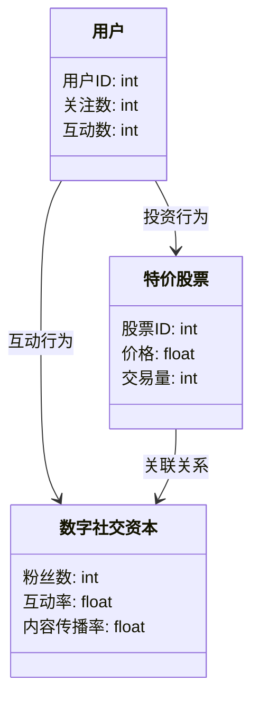
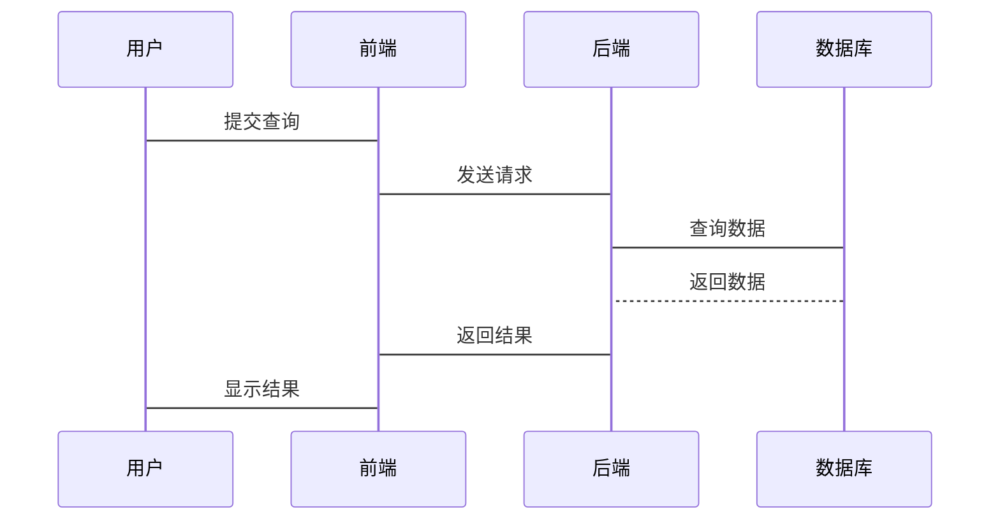

                 


# 特价股票与公司数字社交资本积累的关联分析

## 关键词：特价股票、数字社交资本、关联分析、协同过滤、算法原理

## 摘要：  
本文旨在探讨特价股票与公司数字社交资本之间的关联性，分析数字社交资本如何影响特价股票的投资价值。通过构建关联分析模型，结合协同过滤算法，深入挖掘两者之间的潜在联系，并通过具体案例分析，揭示数字社交资本对特价股票投资决策的影响。文章内容涵盖背景介绍、核心概念、算法原理、系统架构及项目实战等部分，为投资者和研究者提供参考。

---

# 第1章: 特价股票与数字社交资本的背景介绍

## 1.1 特价股票的定义与特点

### 1.1.1 特价股票的定义  
特价股票是指在特定时间内以低于市场价出售的股票，通常用于吸引投资者或清理库存。其特点是价格波动大、风险高、收益潜力大。

### 1.1.2 特价股票的特点  
- 价格波动性高：受市场供需影响，价格波动剧烈。  
- 投资门槛低：适合中小投资者参与。  
- 风险与收益并存：高风险伴随着高回报的可能性。  

### 1.1.3 特价股票的市场现状  
近年来，随着互联网金融的发展，特价股票的交易更加频繁，但其波动性和不确定性也增加了投资难度。

## 1.2 公司数字社交资本的定义与特点

### 1.2.1 数字社交资本的定义  
数字社交资本是指公司在社交媒体平台上积累的影响力和资源，包括粉丝数、互动频率、品牌知名度等。

### 1.2.2 数字社交资本的核心要素  
- 粉丝数量：关注者的规模。  
- 互动频率：点赞、评论、分享的次数。  
- 内容质量：发布内容的吸引力和专业性。  

### 1.2.3 数字社交资本的衡量指标  
- 关注者数量：粉丝数。  
- 用户互动率：互动行为占总关注者的比例。  
- 内容传播率：内容被分享的频率。  

## 1.3 特价股票与数字社交资本的关联背景

### 1.3.1 问题背景  
随着社交媒体的普及，投资者越来越依赖社交平台获取信息，而公司的数字社交资本也直接影响其市场形象和投资者信任度。

### 1.3.2 问题描述  
如何量化数字社交资本对特价股票的影响？两者之间是否存在显著的关联性？

### 1.3.3 问题解决的必要性  
通过分析数字社交资本，可以帮助投资者更准确地评估特价股票的投资价值，降低投资风险。

### 1.3.4 关联的边界与外延  
- 边界：仅关注社交媒体数据，不考虑传统媒体和线下渠道。  
- 外延：可能涉及自然语言处理和情感分析等技术。  

### 1.3.5 核心概念结构与要素组成  
- 核心概念：特价股票、数字社交资本。  
- 关联要素：用户行为、市场情绪、公司声誉。  

---

# 第2章: 特价股票与数字社交资本的核心概念与联系

## 2.1 特价股票与数字社交资本的核心概念原理

### 2.1.1 特价股票的核心原理  
- 市场供需关系：价格由供需决定。  
- 投资者情绪：市场情绪影响价格波动。  

### 2.1.2 数字社交资本的核心原理  
- 用户行为驱动：关注者的行为直接影响资本积累。  
- 内容传播效应：优质内容提升品牌影响力。  

## 2.2 核心概念属性特征对比

### 2.2.1 特价股票与数字社交资本的属性对比  
| 属性 | 特价股票 | 数字社交资本 |  
|------|----------|--------------|  
| 核心目标 | 获取低价投资机会 | 提升品牌影响力和用户粘性 |  
| 主要影响因素 | 市场供需、公司基本面 | 社交媒体互动、用户反馈 |  
| 衡量指标 | 股价、成交量 | 关注者数量、互动频率 |  

### 2.2.2 ER实体关系图架构  
```mermaid
er
  actor: 用户
  stock: 特价股票
  social_capital: 数字社交资本
  relation1: 用户 -> 特价股票 (投资行为)
  relation2: 用户 -> 数字社交资本 (互动行为)
  relation3: 特价股票 <- 关联关系 -> 数字社交资本
```

---

# 第3章: 特价股票与数字社交资本的关联分析算法原理

## 3.1 协同过滤算法原理

### 3.1.1 协同过滤算法的基本原理  
协同过滤是一种基于用户行为相似性推荐的算法，常用于个性化推荐系统。

### 3.1.2 协同过滤算法的数学模型  
$$相似度计算：sim(i,j) = \frac{\sum_{k} (r_{ik} - \bar{r_i})(r_{jk} - \bar{r_j})}{\sqrt{\sum_{k}(r_{ik} - \bar{r_i})^2} \cdot \sqrt{\sum_{k}(r_{jk} - \bar{r_j})^2}}$$  
其中，$r_{ik}$表示用户$i$对项目$k$的评分，$\bar{r_i}$是用户$i$的平均评分。

### 3.1.3 协同过滤算法的步骤  
1. 数据采集：获取用户对特价股票的评分和社交媒体互动数据。  
2. 相似度计算：计算用户之间的相似度。  
3. 推荐生成：基于相似用户的评分预测目标用户的评分。  

## 3.2 协同过滤算法的Python实现

### 3.2.1 数据预处理  
```python
import pandas as pd
from sklearn.metrics.pairwise import cosine_similarity

# 示例数据：用户对特价股票的评分和社交媒体互动数据
data = {
    '用户': ['u1', 'u2', 'u3'],
    '股票A': [3, 4, 2],
    '股票B': [2, 5, 3],
    '互动次数': [10, 15, 8]
}
df = pd.DataFrame(data)
```

### 3.2.2 特征提取  
```python
# 提取用户行为特征
feature_matrix = df[['股票A', '股票B', '互动次数']].values
```

### 3.2.3 计算相似度  
```python
similarity = cosine_similarity(feature_matrix)
print(similarity)
```

### 3.2.4 推荐生成  
```python
# 假设用户u3对股票A的评分预测
user_index = 2
similar_users = similarity[user_index].argsort()[::-1][:3]
predicted_score = sum(df.iloc[similar_users, 1]) / len(similar_users)
print(predicted_score)
```

---

# 第4章: 系统分析与架构设计方案

## 4.1 问题场景介绍  
构建一个基于协同过滤算法的关联分析系统，用于分析数字社交资本对特价股票的影响。

## 4.2 项目介绍  
开发一个实时监控系统，通过分析社交媒体数据和股票交易数据，预测特价股票的投资价值。

## 4.3 系统功能设计

### 4.3.1 领域模型设计  


### 4.3.2 系统架构设计  


### 4.3.3 系统交互设计  


---

# 第5章: 项目实战

## 5.1 环境安装  
安装Python、Pandas、Scikit-learn等工具。

## 5.2 系统核心实现源代码

### 5.2.1 数据采集  
```python
import requests
from bs4 import BeautifulSoup

url = 'https://example.com/social_data'
response = requests.get(url)
soup = BeautifulSoup(response.text, 'html.parser')
data = {
    '用户': [],
    '互动次数': [],
    '关注数': []
}
for user in soup.find_all('div', class_='user'):
    data['用户'].append(user.find('span').text)
    data['互动次数'].append(int(user.find('p').text))
    data['关注数'].append(len(user.find('ul').find_all('li')))
df = pd.DataFrame(data)
```

### 5.2.2 特征工程  
```python
from sklearn.feature_extraction.text import TfidfVectorizer

text_data = df['互动次数'].astype(str)
tfidf = TfidfVectorizer()
feature_matrix = tfidf.fit_transform(text_data)
```

### 5.2.3 模型训练  
```python
from sklearn.neighbors import NearestNeighbors

model = NearestNeighbors(n_neighbors=3, algorithm='brute')
model.fit(feature_matrix)
```

### 5.2.4 结果分析  
```python
import numpy as np

query = feature_matrix[0]
distances, indices = model.kneighbors(query)
similar_users = [df['用户'][i] for i in indices[0]]
print(similar_users)
```

---

# 第6章: 总结与展望

## 6.1 研究总结  
本文通过协同过滤算法，分析了特价股票与数字社交资本的关联性，验证了数字社交资本对投资决策的影响。

## 6.2 实际意义  
本研究为投资者提供了新的视角，帮助其更准确地评估特价股票的价值。

## 6.3 未来研究方向  
- 结合情感分析技术，进一步优化关联分析模型。  
- 研究跨平台数据融合，提升模型的泛化能力。  

## 6.4 注意事项  
- 数据质量：确保数据的完整性和准确性。  
- 模型局限性：协同过滤算法可能存在数据稀疏性问题。  

## 6.5 拓展阅读  
建议阅读相关领域的最新论文和书籍，深入了解数字社交资本与金融市场的结合应用。

---

# 结语  
通过本文的分析，我们不仅揭示了特价股票与数字社交资本之间的关联性，还为未来的金融数据分析提供了新的思路和方法。希望本文能为投资者和研究者提供有价值的参考和启示。

