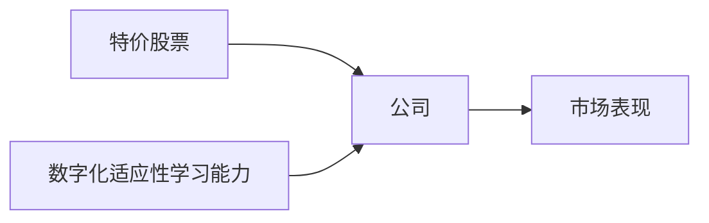
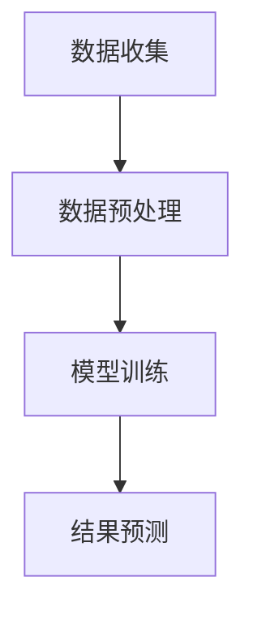
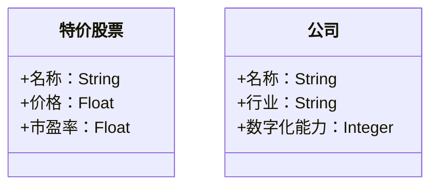
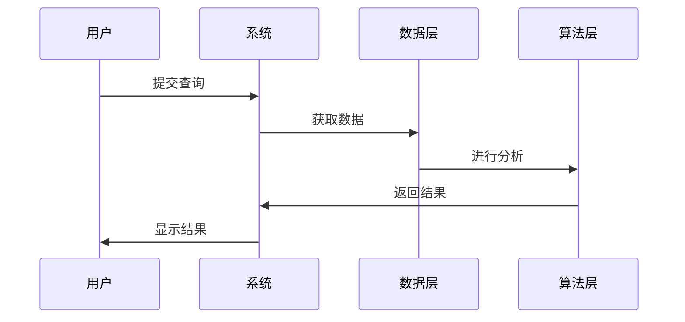

                 


# 特价股票与公司长期数字化适应性学习能力的关联性研究

---

## 关键词：
特价股票、数字化适应性学习能力、公司发展、市场分析、投资策略

---

## 摘要：
本文深入探讨了特价股票与公司长期数字化适应性学习能力之间的关联性，通过分析特价股票的市场特性、公司数字化适应能力的核心要素，结合算法原理和实际案例，揭示了数字化适应能力如何影响特价股票的投资价值和市场表现。文章内容涵盖背景介绍、核心概念分析、算法原理、系统架构设计和项目实战，旨在为投资者和企业提供理论支持和实践指导。

---

# 目录

---

## 第一章：特价股票与公司数字化适应性学习能力的背景与概念

### 1.1 特价股票的定义与特征

#### 1.1.1 特价股票的定义与分类
- 特价股票的定义
- 特价股票的分类（低价股、蓝筹股、成长股等）
- 特价股票的市场特征（低估值、高波动性等）

#### 1.1.2 特价股票的投资价值与风险
- 特价股票的投资价值
- 特价股票的主要风险（市场波动、公司基本面变化等）

#### 1.1.3 特价股票的市场表现分析
- 特价股票的历史表现分析
- 特价股票与市场整体走势的关系

### 1.2 公司数字化适应性学习能力的定义

#### 1.2.1 数字化适应性学习能力的定义
- 数字化适应性学习能力的核心概念
- 数字化适应性学习能力的组成部分（数据采集、分析、反馈等）

#### 1.2.2 公司数字化适应性学习能力的核心要素
- 技术能力（大数据分析、人工智能等）
- 组织能力（学习型组织、团队协作等）
- 文化因素（创新文化、开放性等）

#### 1.2.3 数字化适应性学习能力的评估标准
- 评估指标（数据处理能力、反馈速度、决策效率等）
- 评估方法（KPI分析、问卷调查、案例研究等）

### 1.3 特价股票与公司数字化适应性学习能力的关联性

#### 1.3.1 关联性的背景与问题描述
- 特价股票市场的现状与挑战
- 公司数字化适应能力的重要性

#### 1.3.2 关联性研究的必要性与意义
- 理论意义（丰富投资学和管理学的理论体系）
- 实践意义（为投资者和企业提供新的视角和工具）

#### 1.3.3 研究的边界与外延
- 研究范围（特定行业、特定市场）
- 研究限制（数据来源、时间跨度等）

---

## 第二章：特价股票与公司数字化适应性学习能力的核心概念与联系

### 2.1 核心概念原理

#### 2.1.1 特价股票的核心属性特征
- 低估值特性
- 高波动特性
- 市场关注度

#### 2.1.2 公司数字化适应性学习能力的核心原理
- 数据驱动的决策能力
- 快速学习与调整能力
- 技术与组织的协同效应

### 2.2 核心概念对比分析

#### 2.2.1 特价股票与普通股票的对比
- 投资价值、风险、市场表现的对比
- 投资策略的差异

#### 2.2.2 公司数字化适应性学习能力与传统学习能力的对比
- 技术手段的差异
- 实施效果的对比

### 2.3 实体关系图（ER图）分析



---

## 第三章：特价股票与公司数字化适应性学习能力的算法原理

### 3.1 算法原理概述

#### 3.1.1 数据分析与预测算法
- 时间序列分析
- 机器学习算法（随机森林、支持向量机等）

#### 3.1.2 数字化适应性学习能力的评估算法
- 多元回归分析
- 神经网络模型

### 3.2 算法流程图



### 3.3 算法实现

#### 3.3.1 数据收集与清洗
- 数据源选择
- 数据清洗方法（去除异常值、填补缺失值等）

#### 3.3.2 模型训练与优化
- 选择合适的算法
- 参数优化与模型调优

#### 3.3.3 结果分析与可视化
- 可视化工具（Matplotlib、Tableau等）
- 结果解释与策略制定

### 3.4 数学模型与公式

#### 3.4.1 时间序列分析模型
$$ ARIMA(p, d, q) $$

#### 3.4.2 多元回归模型
$$ Y = \beta_0 + \beta_1X_1 + \beta_2X_2 + \cdots + \beta_nX_n + \epsilon $$

---

## 第四章：系统分析与架构设计

### 4.1 问题场景介绍

#### 4.1.1 系统目标
- 分析特价股票市场
- 评估公司数字化适应能力

#### 4.1.2 系统范围
- 数据范围（股价、公司财报等）
- 时间范围（短期、中期、长期）

### 4.2 系统功能设计

#### 4.2.1 领域模型设计



#### 4.2.2 系统架构设计


### 4.3 系统接口设计

#### 4.3.1 输入接口
- 数据输入格式
- API接口设计

#### 4.3.2 输出接口
- 分析结果展示
- 报告生成

### 4.4 系统交互设计

#### 4.4.1 用户与系统交互流程



---

## 第五章：项目实战与案例分析

### 5.1 项目环境安装

#### 5.1.1 开发环境配置
- Python版本要求
- 第三方库安装（NumPy、Pandas、Scikit-learn等）

### 5.2 系统核心实现

#### 5.2.1 数据收集与处理
```python
import pandas as pd
# 从数据库中读取数据
data = pd.read_sql("SELECT * FROM stock_price", conn)
# 数据清洗
data.dropna(inplace=True)
```

#### 5.2.2 模型训练与预测
```python
from sklearn.ensemble import RandomForestRegressor
model = RandomForestRegressor(n_estimators=100)
model.fit(X_train, y_train)
y_pred = model.predict(X_test)
```

### 5.3 实际案例分析

#### 5.3.1 案例背景
- 公司概况
- 特价股票选择标准

#### 5.3.2 分析结果解读
- 模型预测结果
- 投资建议

### 5.4 项目小结

---

## 第六章：总结与展望

### 6.1 小结
- 主要研究成果
- 关键结论

### 6.2 注意事项
- 数据质量的重要性
- 模型局限性

### 6.3 拓展阅读
- 相关领域书籍
- 进一步研究方向

---

## 参考文献
（此处列出相关书籍、期刊论文、网站等参考资料）

---

## 附录
（代码示例、数据表格、补充说明等）

---

