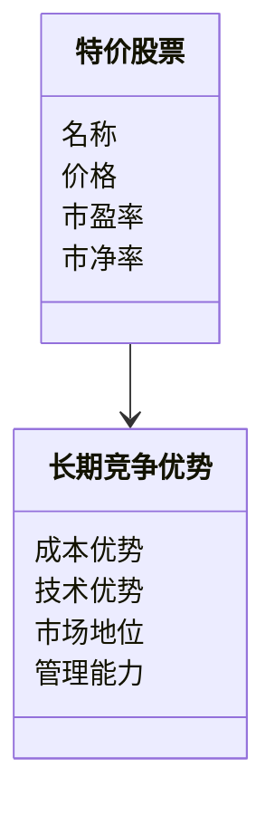
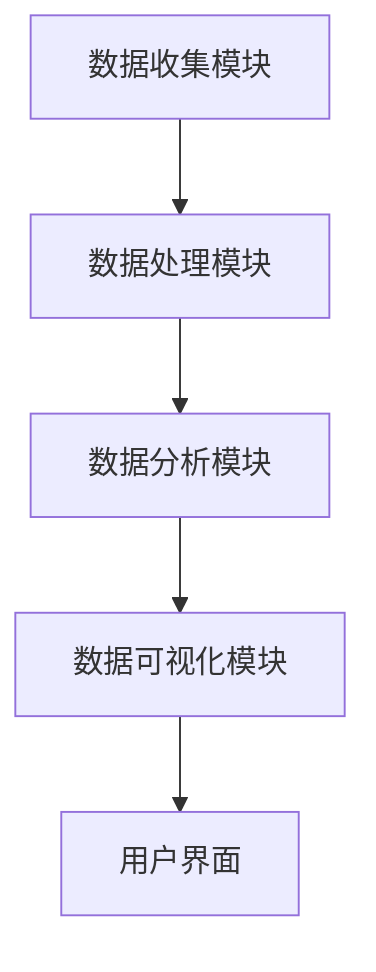

                 


# 特价股票与公司长期竞争优势的关联性

> 关键词：特价股票、长期竞争优势、关联性、数学模型、系统架构、项目实战

> 摘要：本文探讨了特价股票与公司长期竞争优势之间的关联性。通过分析特价股票的特性、长期竞争优势的构成及其市场表现，结合数学模型和系统架构，提出了如何利用这些因素进行股票投资的策略。文章还通过实际案例分析，展示了如何通过系统的方法来识别具有长期竞争优势的特价股票，并提供了相应的代码实现和数据解读。

---

## 第1章: 特价股票与长期竞争优势的基本概念

### 1.1 特价股票的定义与特点

#### 1.1.1 特价股票的定义
特价股票是指价格相对较低的股票，通常具有较高的市盈率、市净率等估值指标。这些股票可能因为市场低估、行业周期性或其他因素而被投资者关注。

#### 1.1.2 特价股票的市场定位
特价股票通常出现在中小盘股中，尤其是在市场低迷或行业不景气时，这些股票可能被市场忽视，从而价格被低估。

#### 1.1.3 特价股票的投资价值
特价股票的投资价值在于其价格与内在价值的差异。投资者认为这些股票具有长期增值的潜力，因此在低价时买入，等待价值回归。

### 1.2 长期竞争优势的定义与特征

#### 1.2.1 长期竞争优势的定义
长期竞争优势是指公司在行业中长期保持竞争优势的能力，通常体现在成本控制、技术创新、品牌影响力和市场占有率等方面。

#### 1.2.2 长期竞争优势的核心要素
- **成本优势**：公司能够以低于竞争对手的成本生产产品或提供服务。
- **技术优势**：公司拥有独特的技术或专利，能够在行业中保持领先地位。
- **市场地位**：公司拥有强大的品牌影响力和市场占有率。
- **管理能力**：公司具备高效的管理团队和组织结构。

#### 1.2.3 长期竞争优势与企业绩效的关系
长期竞争优势是企业绩效的核心驱动力。拥有长期竞争优势的企业通常能够实现更高的利润率和股价表现。

### 1.3 特价股票与长期竞争优势的关联性

#### 1.3.1 特价股票与长期竞争优势的初步关联
特价股票通常出现在具有长期竞争优势的公司中，尤其是在行业周期低谷时，这些公司的股票可能被市场低估。

#### 1.3.2 特价股票与长期竞争优势的内在逻辑
具有长期竞争优势的公司能够在行业波动中保持稳定，其股票价格往往在市场低估时出现特价，为投资者提供长期增值的机会。

#### 1.3.3 特价股票与长期竞争优势的实践意义
识别具有长期竞争优势的特价股票，可以帮助投资者在市场低估时买入，实现长期收益。

---

## 第2章: 特价股票的特性与市场表现

### 2.1 特价股票的市场表现分析

#### 2.1.1 特价股票的市场波动性
特价股票通常波动较大，尤其是在市场情绪变化时，价格可能大幅波动。

#### 2.1.2 特价股票的收益与风险
特价股票可能具有较高的收益潜力，但也伴随着较高的投资风险，尤其是在市场低迷时。

#### 2.1.3 特价股票的投资者行为分析
投资者在购买特价股票时，通常基于价值投资理念，寻找被市场低估的机会。

### 2.2 长期竞争优势的市场表现

#### 2.2.1 长期竞争优势的市场认可度
具有长期竞争优势的公司通常受到市场的高度认可，其股票价格表现优于行业平均水平。

#### 2.2.2 长期竞争优势的股价表现
具有长期竞争优势的公司股票通常表现出较强的抗跌性和长期增长潜力。

#### 2.2.3 长期竞争优势与股价波动的关系
长期竞争优势可以减少股价波动，尤其是在市场低迷时，具有长期竞争优势的公司股票能够保持相对稳定。

### 2.3 特价股票与长期竞争优势的市场互动

#### 2.3.1 特价股票对长期竞争优势的影响
特价股票的低价可能吸引投资者关注，从而提升公司市场认可度和股价表现。

#### 2.3.2 长期竞争优势对特价股票的影响
具有长期竞争优势的公司能够通过稳定表现逐步提升股价，从而退出特价股票行列。

#### 2.3.3 特价股票与长期竞争优势的市场反馈机制
市场通过股价波动对特价股票和长期竞争优势进行反馈，投资者基于市场信号调整投资策略。

---

## 第3章: 长期竞争优势的构成与评估

### 3.1 长期竞争优势的构成要素

#### 3.1.1 成本优势
公司通过技术创新和管理优化降低生产成本，从而在行业中获得价格优势。

#### 3.1.2 技术优势
公司拥有独特的技术或专利，能够在行业中保持技术领先。

#### 3.1.3 市场地位
公司拥有强大的品牌影响力和市场占有率，能够在行业中占据主导地位。

#### 3.1.4 管理能力
公司具备高效的管理团队和组织结构，能够有效应对市场变化和挑战。

### 3.2 长期竞争优势的评估方法

#### 3.2.1 企业核心竞争力评估
通过分析公司的成本控制、技术创新和市场地位等方面，评估其核心竞争力。

#### 3.2.2 企业价值链分析
通过分析公司价值链中的各个环节，识别其竞争优势和劣势。

#### 3.2.3 企业竞争优势的定量评估
通过财务指标、市场份额和技术创新等量化指标，评估公司的竞争优势。

### 3.3 特价股票与长期竞争优势的匹配分析

#### 3.3.1 特价股票与成本优势的匹配
具有成本优势的公司股票可能在市场低估时成为特价股票，投资者可以通过识别这些公司进行投资。

#### 3.3.2 特价股票与技术优势的匹配
具有技术优势的公司股票可能在市场低估时成为特价股票，投资者可以通过技术分析和市场研究识别这些公司。

#### 3.3.3 特价股票与市场地位的匹配
具有强大市场地位的公司股票可能在市场低估时成为特价股票，投资者可以通过行业分析和市场研究识别这些公司。

#### 3.3.4 特价股票与管理能力的匹配
具有优秀管理能力的公司股票可能在市场低估时成为特价股票，投资者可以通过公司治理和管理团队分析识别这些公司。

---

## 第4章: 特价股票与长期竞争优势的数学模型与算法

### 4.1 特价股票与长期竞争优势的关联性模型

#### 4.1.1 模型的构建逻辑
通过分析特价股票和长期竞争优势的相关性，构建数学模型，量化两者之间的关系。

#### 4.1.2 模型的数学表达式
$$ y = \beta_0 + \beta_1x_1 + \beta_2x_2 + \epsilon $$
其中，$y$ 表示股价，$x_1$ 表示成本优势，$x_2$ 表示技术优势，$\epsilon$ 表示误差项。

---

## 第5章: 系统分析与架构设计

### 5.1 问题场景介绍
为了识别具有长期竞争优势的特价股票，我们需要构建一个系统，通过数据收集、分析和可视化，帮助投资者做出决策。

### 5.2 系统功能设计

#### 5.2.1 领域模型


#### 5.2.2 系统架构


### 5.3 系统接口设计
- 数据接口：从数据库中获取特价股票和公司竞争优势数据。
- 分析接口：通过算法对数据进行分析，生成关联性报告。
- 可视化接口：将分析结果可视化，供投资者参考。

### 5.4 系统交互
```mermaid
sequenceDiagram
    User -> 数据收集模块: 请求数据
    数据收集模块 -> 数据库: 查询数据
    数据库 --> 数据收集模块: 返回数据
    数据收集模块 -> 数据处理模块: 提交数据
    数据处理模块 -> 数据分析模块: 分析数据
    数据分析模块 -> 数据可视化模块: 生成图表
    数据可视化模块 -> 用户界面: 显示结果
    User <- 用户界面: 结果展示
```

---

## 第6章: 项目实战

### 6.1 环境安装
- 安装Python和相关库（如pandas、numpy、matplotlib）。

### 6.2 核心实现

#### 6.2.1 数据收集
```python
import pandas as pd

# 假设我们有一个股票数据文件
df = pd.read_csv('stock_data.csv')
```

#### 6.2.2 数据处理
```python
# 计算股价与竞争优势的关联性
import numpy as np

correlation = np.corrcoef(df['股价'], df['竞争优势指数'])
print(f"相关性系数为：{correlation[0][1]:.2f}")
```

#### 6.2.3 数据分析
```python
# 使用线性回归模型分析关联性
from sklearn.linear_model import LinearRegression

model = LinearRegression()
model.fit(df[['成本优势', '技术优势']], df['股价'])
print(f"回归系数为：{model.coef_}")
```

#### 6.2.4 数据可视化
```python
import matplotlib.pyplot as plt

plt.scatter(df['成本优势'], df['股价'])
plt.title('成本优势与股价关系')
plt.xlabel('成本优势')
plt.ylabel('股价')
plt.show()
```

### 6.3 实际案例分析
通过实际数据和代码，分析某家公司的特价股票与其长期竞争优势的关系，展示如何通过系统方法识别投资机会。

---

## 第7章: 总结与展望

### 7.1 总结
本文探讨了特价股票与公司长期竞争优势的关联性，通过理论分析和实际案例展示了如何利用这些因素进行股票投资。

### 7.2 展望
未来的研究可以进一步探讨其他因素对特价股票和长期竞争优势的影响，例如宏观经济环境和政策变化。

---

通过本文的分析，投资者可以更好地理解特价股票与长期竞争优势之间的关系，并利用这些知识做出更明智的投资决策。

