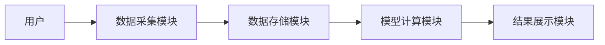

                 


# 特价股票投资中的企业元宇宙伦理与社会责任量化评估

> 关键词：特价股票、企业元宇宙、伦理、社会责任、量化评估

> 摘要：本文探讨了在企业元宇宙背景下，特价股票投资中的伦理与社会责任问题。通过构建量化评估模型，分析了企业行为对股票价值的影响，提出了伦理与社会责任在投资决策中的重要性。

---

# 第一章：特价股票投资与企业元宇宙概述

## 1.1 特价股票投资的基本概念

### 1.1.1 特价股票的定义与特点
- 特价股票是指市场价格低于其内在价值的股票。
- 其特点包括高波动性、高风险和高潜在回报。

### 1.1.2 特价股票投资的基本原理
- 投资者通过分析公司基本面和市场趋势，寻找被低估的股票。
- 价值投资和成长投资是两种主要策略。

### 1.1.3 特价股票投资的市场环境
- 特价股票通常出现在市场低迷或公司困境时期。
- 投资者需关注宏观经济和行业趋势。

## 1.2 企业元宇宙的概念与特征

### 1.2.1 元宇宙的基本定义
- 元宇宙是虚拟与现实融合的数字空间，支持社交、 commerce 和内容创作。
- 它依赖区块链、AR/VR 和 AI 技术。

### 1.2.2 企业元宇宙的核心特征
- 去中心化：基于区块链技术，确保数据安全和透明。
- 虚拟经济：通过虚拟货币和 NFT 实现价值交换。
- 用户生成内容：用户参与内容创作，形成生态系统。

### 1.2.3 企业元宇宙与传统企业的区别
- 传统企业主要参与实体经济，而企业元宇宙涉及虚拟经济。
- 元宇宙企业更具创新性和技术依赖性。

## 1.3 特价股票投资与企业元宇宙的结合

### 1.3.1 特价股票投资中的企业行为分析
- 投资者需关注企业的技术创新和市场竞争力。
- 企业元宇宙可能影响公司的估值和未来收益。

### 1.3.2 企业元宇宙对股票投资的影响
- 元宇宙技术可能提升企业的竞争优势。
- 元宇宙相关股票可能成为投资热点。

### 1.3.3 特价股票投资中的伦理与社会责任问题
- 投资者需关注企业的伦理行为，避免投资不道德的企业。
- 社会责任是影响股票长期价值的重要因素。

---

# 第二章：企业元宇宙中的伦理与社会责任

## 2.1 企业元宇宙中的伦理问题

### 2.1.1 企业行为的伦理边界
- 企业应避免虚假宣传和数据滥用。
- 需尊重用户隐私，避免数据泄露。

### 2.1.2 企业元宇宙中的虚拟经济伦理
- 需防止虚拟货币的过度投机。
- 确保虚拟经济的公平性，避免财富集中。

### 2.1.3 企业元宇宙中的隐私与数据伦理
- 企业需保护用户数据，避免滥用。
- 建立透明的数据使用政策。

## 2.2 企业元宇宙中的社会责任

### 2.2.1 企业社会责任的基本概念
- 企业应关注环境保护、员工福利和社会公益。
- 社会责任是企业可持续发展的基石。

### 2.2.2 企业元宇宙中的社会责任表现
- 企业应积极参与公益活动，推动社会进步。
- 提供就业机会，促进经济繁荣。

### 2.2.3 企业元宇宙中的社会责任挑战
- 元宇宙技术可能引发新的社会问题。
- 企业需平衡虚拟与现实的社会责任。

## 2.3 伦理与社会责任的量化评估框架

### 2.3.1 伦理与社会责任评估的基本原则
- 客观性：基于事实和数据进行评估。
- 全面性：涵盖经济、社会和环境三个方面。
- 可操作性：确保评估方法易于实施。

### 2.3.2 量化评估的核心指标
- 经济指标：企业盈利能力、市场占有率。
- 社会指标：员工满意度、社会责任投入。
- 环境指标：碳排放量、资源利用效率。

### 2.3.3 量化评估的方法与工具
- 数据分析：利用大数据技术进行评估。
- 案例分析：通过实际案例验证模型。

---

# 第三章：特价股票投资中的伦理与社会责任分析

## 3.1 特价股票投资中的伦理问题

### 3.1.1 投资行为的伦理影响
- 投资者需关注企业的伦理行为，避免投资不道德的企业。
- 伦理问题可能影响企业的长期发展。

### 3.1.2 特价股票投资中的短期主义与长期主义
- 短期投资可能忽视企业的社会责任。
- 长期投资需关注企业的可持续发展。

### 3.1.3 特价股票投资中的利益相关者分析
- 投资者需关注股东、员工、客户和环境的利益。
- 利益相关者的利益冲突可能影响投资决策。

## 3.2 特价股票投资中的社会责任

### 3.2.1 投资行为的社会责任表现
- 投资者应关注企业的社会责任表现。
- 社会责任是影响股票长期价值的重要因素。

### 3.2.2 特价股票投资中的社会影响评估
- 企业社会责任表现可能影响股票价值。
- 投资者需关注企业的社会影响力。

### 3.2.3 特价股票投资中的社会风险与机会
- 社会责任不佳的企业可能面临声誉风险。
- 社会责任优秀的企业可能获得长期收益。

## 3.3 伦理与社会责任对股票价值的影响

### 3.3.1 伦理与社会责任对股价的影响
- 伦理与社会责任表现优秀的企业可能获得更高的估值。
- 伦理问题可能引发股价下跌。

### 3.3.2 伦理与社会责任对投资回报的影响
- 长期来看，社会责任优秀的企业可能带来更高的回报。
- 短期来看，伦理问题可能影响投资收益。

### 3.3.3 伦理与社会责任对投资风险的影响
- 伦理与社会责任不佳的企业可能面临更大的风险。
- 投资者需关注企业的伦理和社会责任表现。

---

# 第四章：企业元宇宙中的伦理与社会责任量化模型

## 4.1 量化模型的基本原理

### 4.1.1 量化模型的构建逻辑
- 基于伦理和社会责任的核心指标，构建评估模型。
- 结合企业元宇宙的特点，设计权重和评分标准。

### 4.1.2 量化模型的核心算法
- 使用加权评分法，计算企业的伦理和社会责任得分。
- 结合股票价格数据，分析伦理与社会责任对股票价值的影响。

### 4.1.3 量化模型的输入与输出
- 输入：企业的伦理和社会责任指标数据。
- 输出：企业的伦理与社会责任评分，以及对股票价值的预测。

## 4.2 量化模型的数学公式与实现

### 4.2.1 数学模型的定义与公式
$$ \text{伦理与社会责任评分} = \sum_{i=1}^{n} w_i \cdot x_i $$
其中，$$w_i$$ 是指标的权重，$$x_i$$ 是指标的得分。

### 4.2.2 算法的实现步骤
1. 收集企业的伦理和社会责任指标数据。
2. 确定各指标的权重。
3. 计算企业的伦理与社会责任评分。
4. 结合股票价格数据，分析评分与股价的相关性。

### 4.2.3 算法的代码实现
```python
def calculate_ethical_score(company_data, weights):
    return sum(weights[i] * company_data[i] for i in range(len(weights)))

# 示例权重
weights = [0.3, 0.4, 0.3]

# 示例公司数据
company_data = [0.8, 0.6, 0.7]

# 计算伦理评分
ethical_score = calculate_ethical_score(company_data, weights)
print(f"伦理评分：{ethical_score}")
```

---

# 第五章：系统分析与架构设计方案

## 5.1 问题场景介绍
- 需要构建一个量化评估系统，评估企业在元宇宙中的伦理与社会责任表现。
- 系统需支持数据采集、模型计算和结果展示。

## 5.2 项目介绍
- 项目目标：构建企业元宇宙中的伦理与社会责任量化评估系统。
- 项目范围：包括数据采集、模型设计和系统实现。

## 5.3 系统功能设计
- 数据采集模块：收集企业的伦理和社会责任指标。
- 模型计算模块：计算企业的伦理与社会责任评分。
- 结果展示模块：显示评分与股票价值的关系。

## 5.4 系统架构设计



## 5.5 系统接口设计
- 数据接口：提供 REST API，供其他系统调用。
- 用户接口：提供 Web 界面，供用户查询结果。

## 5.6 系统交互流程

```mermaid
sequenceDiagram
    participant 用户
    participant 数据采集模块
    participant 模型计算模块
    participant 结果展示模块
    用户 -> 数据采集模块: 提交企业信息
    数据采集模块 -> 模型计算模块: 传输数据
    模型计算模块 -> 结果展示模块: 返回评分
    用户 <- 结果展示模块: 显示结果
```

---

# 第六章：项目实战

## 6.1 环境安装
- 安装 Python 和相关库（如 pandas、numpy、scikit-learn）。
- 安装 Jupyter Notebook 用于数据处理和建模。

## 6.2 系统核心实现源代码

```python
import pandas as pd
import numpy as np

def calculate_ethical_score(company_data, weights):
    return sum(weights[i] * company_data[i] for i in range(len(weights)))

# 示例数据
data = {
    '公司A': [0.8, 0.6, 0.7],
    '公司B': [0.7, 0.5, 0.6]
}

weights = [0.3, 0.4, 0.3]

# 计算评分
scores = {}
for company in data:
    company_data = data[company]
    score = calculate_ethical_score(company_data, weights)
    scores[company] = score

print(scores)
```

## 6.3 代码应用解读与分析
- 代码实现了一个简单的评分模型，可根据实际数据调整权重和指标。
- 通过分析评分结果，可评估企业在元宇宙中的伦理与社会责任表现。

## 6.4 实际案例分析
- 以某公司为例，分析其伦理与社会责任表现。
- 结合股票价格数据，验证模型的准确性。

## 6.5 项目小结
- 量化评估模型为投资者提供了科学的决策依据。
- 随着元宇宙的发展，模型需不断优化和更新。

---

# 第七章：总结与展望

## 7.1 本文总结
- 本文构建了企业元宇宙中的伦理与社会责任量化评估模型。
- 通过分析特价股票投资中的伦理问题，提出了社会责任在投资决策中的重要性。

## 7.2 未来展望
- 随着元宇宙的发展，伦理与社会责任评估将更加复杂。
- 投资者需关注技术伦理和企业行为，确保投资的可持续性。

---

# 结语

企业元宇宙的兴起带来了新的伦理和社会责任挑战。通过量化评估模型，投资者可更好地理解企业的行为，做出更明智的投资决策。未来，随着技术的发展，伦理与社会责任评估将更加重要，成为投资决策的核心考量因素。

