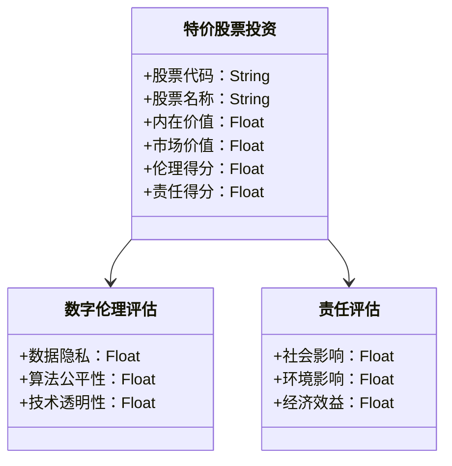

                 


# 特价股票投资中的企业数字伦理与责任评估因素考量

**关键词**：特价股票投资、数字伦理、责任评估、量化分析、投资决策

**摘要**：  
在当今的金融市场上，特价股票投资作为一种追求超额收益的投资策略，正日益受到投资者的关注。然而，在追求利益的同时，企业和社会对数字伦理和责任评估的要求也在不断提高。本文将深入探讨特价股票投资中的企业数字伦理与责任评估因素，分析其对投资决策的影响，并提出相应的解决方案。通过结合理论与实践，本文旨在为投资者提供一个全面的视角，以在追求收益的同时，兼顾企业的社会责任和数字伦理。

---

## 第一章：特价股票投资与数字伦理概述

### 1.1 特价股票投资的背景与定义

#### 1.1.1 特价股票投资的定义  
特价股票投资是指以低于市场公允价值的价格购买股票的投资策略。这种策略的核心在于寻找被市场低估的股票，通过长期持有或短期操作获取超额收益。

#### 1.1.2 特价股票投资的核心要素  
- **价值评估**：通过基本面分析，确定股票的内在价值。  
- **市场情绪**：分析市场参与者的心理和行为，判断是否存在非理性定价。  
- **风险控制**：通过分散投资和止损策略，降低投资风险。  

#### 1.1.3 特价股票投资的市场现状  
近年来，随着大数据和人工智能技术的发展，越来越多的投资者开始依赖量化分析工具进行特价股票投资。然而，这种技术驱动的投资方式也引发了关于数字伦理和责任评估的争议。

---

### 1.2 数字伦理与责任评估的定义

#### 1.2.1 数字伦理的核心概念  
数字伦理是指在数字技术应用中，个体和组织应遵循的道德准则。它涵盖数据隐私、算法公平性、技术滥用等方面。  

#### 1.2.2 责任评估的基本原理  
责任评估是对企业在社会、环境和经济等方面的影响进行全面评价的过程。它不仅关注企业的经济效益，还关注其对社会和环境的贡献与损害。  

#### 1.2.3 数字伦理与责任评估的关联性  
数字技术的应用使得企业的行为更加透明化，数字伦理和责任评估成为衡量企业社会责任的重要指标。  

---

### 1.3 特价股票投资中的数字伦理问题

#### 1.3.1 特价股票投资中的伦理困境  
- 投资者可能利用技术手段操纵股价，破坏市场公平性。  
- 量化交易可能导致市场波动，影响中小投资者的利益。  

#### 1.3.2 数字技术对企业伦理的影响  
技术的进步使得企业能够更高效地收集和分析数据，但也可能被滥用，导致数据泄露或隐私侵犯。  

#### 1.3.3 责任评估在投资决策中的作用  
通过责任评估，投资者可以识别那些在社会责任方面表现不佳的企业，避免投资风险。

---

## 第二章：数字伦理与责任评估的核心概念与联系

### 2.1 数字伦理的核心要素

#### 2.1.1 数字伦理的定义与原则  
数字伦理的定义与原则包括数据隐私、算法公平性、技术透明性等。以下是数字伦理的核心原则：  
- **数据隐私**：保护用户数据不被滥用。  
- **算法公平性**：确保算法决策的公正性。  
- **技术透明性**：向用户解释技术的工作原理。  

#### 2.1.2 数字伦理的核心要素  
- **数据收集**：合法、合规地收集和使用数据。  
- **数据处理**：避免数据滥用和误用。  
- **数据安全**：防止数据泄露和未经授权的访问。  

#### 2.1.3 数字伦理的实现路径  
- **法律规范**：制定相关法律法规，约束技术滥用行为。  
- **企业自律**：企业在技术研发和应用中遵循伦理准则。  
- **技术手段**：利用区块链等技术确保数据安全和透明性。  

---

### 2.2 责任评估的定义与框架

#### 2.2.1 责任评估的定义  
责任评估是对企业在社会、环境和经济等方面的影响进行全面评价的过程。  

#### 2.2.2 责任评估的核心要素  
- **社会影响**：企业对社会福利、公共利益的影响。  
- **环境影响**：企业对环境的保护和改善。  
- **经济效益**：企业的盈利能力和社会贡献。  

#### 2.2.3 责任评估的框架  
- **社会维度**：关注企业的员工权益、社会责任等。  
- **环境维度**：关注企业的碳排放、资源利用等。  
- **经济维度**：关注企业的盈利能力、税收贡献等。  

---

### 2.3 数字伦理与责任评估的关系

#### 2.3.1 数字伦理对责任评估的影响  
数字技术的应用使得企业的社会责任更容易被量化和评估。例如，通过数据分析可以评估企业的碳排放和能源消耗。  

#### 2.3.2 责任评估对数字伦理的支撑作用  
责任评估为企业提供了一个全面的伦理评价体系，帮助企业识别和改进在数字技术应用中的伦理问题。  

---

## 第三章：数字伦理与责任评估的算法原理

### 3.1 数字伦理评估的算法原理

#### 3.1.1 数字伦理评估的定义与目标  
数字伦理评估的目标是通过算法手段，对企业在数字技术应用中的伦理表现进行量化评价。  

#### 3.1.2 数字伦理评估的算法实现  
以下是数字伦理评估的算法流程：  
1. 数据收集：收集企业的公开数据，包括财务数据、社会责任报告等。  
2. 数据清洗：对数据进行预处理，去除噪声数据。  
3. 数据分析：利用机器学习算法对数据进行分析，识别企业的伦理风险。  
4. 结果输出：生成数字伦理评估报告，提供改进建议。  

#### 3.1.3 数字伦理评估的数学模型  
以下是数字伦理评估的数学模型：  
$$ \text{伦理得分} = \alpha \cdot \text{数据隐私} + \beta \cdot \text{算法公平性} + \gamma \cdot \text{技术透明性} $$  

---

### 3.2 责任评估的算法实现

#### 3.2.1 责任评估的定义与目标  
责任评估的目标是通过算法手段，对企业在社会责任方面的表现进行全面评价。  

#### 3.2.2 责任评估的算法实现  
以下是责任评估的算法流程：  
1. 数据收集：收集企业的社会责任数据，包括员工权益、环境保护等。  
2. 数据清洗：对数据进行预处理，去除噪声数据。  
3. 数据分析：利用机器学习算法对数据进行分析，识别企业的责任风险。  
4. 结果输出：生成责任评估报告，提供改进建议。  

#### 3.2.3 责任评估的数学模型  
以下是责任评估的数学模型：  
$$ \text{责任得分} = \alpha \cdot \text{社会影响} + \beta \cdot \text{环境影响} + \gamma \cdot \text{经济效益} $$  

---

## 第四章：数字伦理与责任评估的系统分析与架构设计

### 4.1 系统功能设计

#### 4.1.1 领域模型设计  
以下是领域模型设计的Mermaid类图：  


#### 4.1.2 系统架构设计  
以下是系统架构设计的Mermaid架构图：  
```mermaid
architecturalDiagram
    客户端 ↔ 网关 → 服务层 → 数据库
    服务层 ↔ API网关 → 外部系统
```

---

## 第五章：数字伦理与责任评估的项目实战

### 5.1 环境配置

```bash
pip install numpy pandas scikit-learn
```

### 5.2 核心实现代码

```python
import numpy as np
import pandas as pd
from sklearn.linear_model import LinearRegression

# 数字伦理评估模型
class DigitalEthicsEvaluator:
    def __init__(self):
        self.model = LinearRegression()
    
    def train(self, X, y):
        self.model.fit(X, y)
    
    def predict(self, X):
        return self.model.predict(X)

# 责任评估模型
class ResponsibilityEvaluator:
    def __init__(self):
        self.model = LinearRegression()
    
    def train(self, X, y):
        self.model.fit(X, y)
    
    def predict(self, X):
        return self.model.predict(X)
```

---

## 第六章：数字伦理与责任评估的最佳实践

### 6.1 伦理投资的策略与注意事项

#### 6.1.1 伦理投资的策略  
- **长期投资**：避免短期波动对企业社会责任的影响。  
- **分散投资**：降低单一企业的伦理风险。  
- **关注企业治理**：选择治理结构完善的企业。  

#### 6.1.2 伦理投资的注意事项  
- **数据质量**：确保数据的准确性和完整性。  
- **模型优化**：定期优化评估模型，适应市场变化。  
- **风险控制**：设置止损点，避免重大损失。  

---

## 第七章：总结与展望

### 7.1 本章小结  
本文从数字伦理和责任评估的角度，分析了特价股票投资中的伦理问题，并提出了相应的解决方案。通过量化分析和系统设计，为投资者提供了全面的伦理评估框架。

### 7.2 未来展望  
未来的研究可以进一步探索数字伦理与责任评估在其他投资领域的应用，同时结合人工智能技术，提升评估的准确性和效率。

---

**结束语**  
特价股票投资不仅是对市场价值的追求，更是对社会责任的承担。通过数字伦理与责任评估的考量，投资者可以在获取收益的同时，推动社会的可持续发展。

