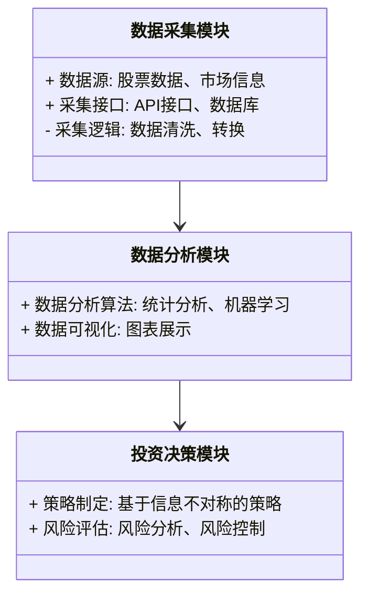
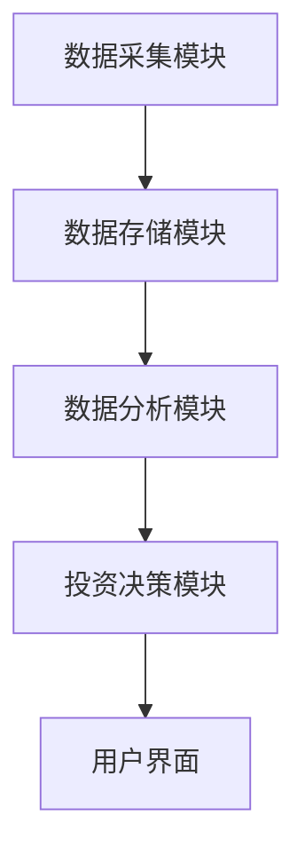
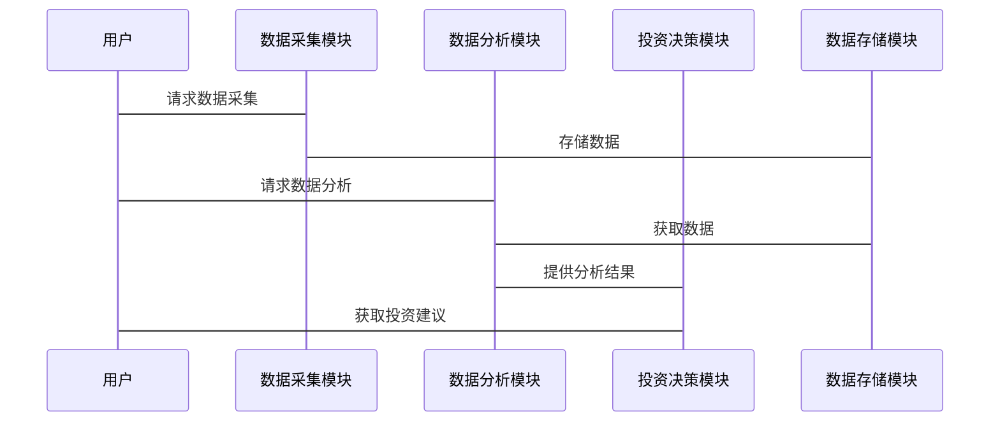

                 


```markdown
# 特价股票投资中的信息不对称利用策略

**关键词**: 特价股票、信息不对称、投资策略、股票市场、信息优势

**摘要**: 在股票市场中，信息不对称是一个关键因素，影响着投资者的决策。本文探讨了如何在特价股票投资中利用信息不对称，通过分析其原理、策略和实际案例，帮助投资者制定有效的投资计划。

---

## 第1章: 信息不对称的定义与表现

### 1.1 信息不对称的基本概念

#### 1.1.1 信息不对称的定义
信息不对称指市场参与者之间由于掌握信息的时间、质量或数量不同，导致在决策过程中存在信息差异。这种不对称影响了市场的公平性和效率。

#### 1.1.2 信息不对称的表现形式
- **道德风险**: 信息优势方可能利用信息谋取私利，损害其他参与者。
- **逆向选择**: 信息劣势方可能做出不利于整体市场的决策。

#### 1.1.3 信息不对称对市场的影响
- 影响价格发现。
- 导致市场波动。
- 影响资源配置效率。

### 1.2 信息不对称在股票市场中的具体表现

#### 1.2.1 市场参与者的信息差异
- **内部信息**: 公司高管、大股东等掌握未公开的信息。
- **外部信息**: 投资者通过公开渠道获取的信息。

#### 1.2.2 内幕信息与公开信息的差异
- 内幕信息具有前瞻性，公开信息具有滞后性。
- 内幕信息更具价值，公开信息较为分散。

#### 1.2.3 信息不对称对股价波动的影响
- 内幕交易可能导致股价异常波动。
- 不对称信息影响投资者情绪，进而影响市场走势。

---

## 第2章: 特价股票投资的背景与现状

### 2.1 特价股票的定义与特点

#### 2.1.1 特价股票的定义
特价股票指在特定情况下以低于市场价出售的股票，通常发生在市场波动、公司重组或特殊事件中。

#### 2.1.2 特价股票的特点
- 价格波动大。
- 投资风险高。
- 机会与挑战并存。

#### 2.1.3 特价股票与普通股票的区别
- 价格差异显著。
- 投资周期不同。
- 风险承受能力不同。

### 2.2 信息不对称在特价股票投资中的作用

#### 2.2.1 信息不对称对特价股票投资的影响
- 决策质量受信息质量影响。
- 市场机会与风险并存。

#### 2.2.2 特价股票市场中的信息不对称问题
- 内幕交易频发。
- 投资者信息获取渠道有限。

#### 2.2.3 特价股票投资中的信息不对称利用策略
- 利用公开信息进行分析。
- 关注公司基本面变化。
- 抓住市场波动中的机会。

---

## 第3章: 信息不对称的原理与分析

### 3.1 信息不对称的原理

#### 3.1.1 信息不对称的形成机制
- 信息生产成本高。
- 信息传播受限制。
- 市场参与者信息获取能力差异。

#### 3.1.2 信息不对称的传播路径
- 信息从内部到外部传播。
- 投资者基于信息做出决策。
- 市场反应影响股价波动。

#### 3.1.3 信息不对称的市场效应
- 导致市场失灵。
- 影响资源配置效率。
- 增加市场风险。

### 3.2 信息不对称的分析方法

#### 3.2.1 基于博弈论的信息不对称分析
- 分析市场参与者的行为策略。
- 确定信息优势方的最优决策。

#### 3.2.2 基于信息经济学的信息不对称分析
- 信息不对称对市场机制的影响。
- 如何通过制度设计减少信息不对称。

#### 3.2.3 基于统计学的信息不对称分析
- 统计市场数据，寻找异常波动。
- 分析信息不对称对股价的影响。

---

## 第4章: 特价股票投资中的信息不对称利用策略

### 4.1 基于信息优势的策略

#### 4.1.1 信息优势的来源
- 公司公告。
- 财务报表分析。
- 产业政策变化。

#### 4.1.2 信息优势的利用方法
- 提前预判市场变化。
- 利用信息差异制定投资策略。
- 结合技术分析和基本面分析。

#### 4.1.3 信息优势对投资决策的影响
- 提高投资决策的准确性。
- 降低投资风险。
- 提升投资收益。

### 4.2 信息不对称下的投资策略

#### 4.2.1 市场信息不对称的应对策略
- 多元化投资。
- 分散风险。
- 关注市场信号。

#### 4.2.2 基于信息不对称的投资机会识别
- 寻找市场低估的股票。
- 抓住市场波动中的机会。
- 利用市场信息不对称制定投资计划。

#### 4.2.3 信息不对称下的风险管理
- 设定止损点。
- 监测市场变化。
- 保持信息敏感性。

---

## 第5章: 系统分析与架构设计

### 5.1 问题场景介绍

#### 5.1.1 系统目标
- 实现信息不对称下的投资策略分析。
- 提供投资决策支持。

#### 5.1.2 项目介绍
- 开发一个基于信息不对称的股票投资分析系统。
- 提供数据采集、分析和决策支持功能。

### 5.2 系统功能设计

#### 5.2.1 领域模型设计
- 使用Mermaid绘制类图，展示系统核心类及其关系。



#### 5.2.2 系统架构设计
- 使用Mermaid绘制系统架构图，展示各模块的交互关系。



#### 5.2.3 系统接口设计
- 定义模块之间的接口和交互流程。

#### 5.2.4 系统交互设计
- 使用Mermaid绘制序列图，展示用户与系统之间的交互流程。



---

## 第6章: 项目实战

### 6.1 环境安装

#### 6.1.1 安装Python
```bash
python --version
pip install --upgrade pip
```

#### 6.1.2 安装数据分析库
```bash
pip install numpy pandas matplotlib
```

### 6.2 系统核心实现源代码

#### 6.2.1 数据采集模块
```python
import pandas as pd
import requests

def fetch_data(symbol):
    url = f"https://api.example.com/stock/{symbol}"
    response = requests.get(url)
    data = response.json()
    df = pd.DataFrame(data['historical_data'])
    return df
```

#### 6.2.2 数据分析模块
```python
from sklearn import linear_model

def predict_price(df):
    model = linear_model.LinearRegression()
    model.fit(df[['open', 'close']], df['next_day_close'])
    return model.predict(df[['open', 'close']])
```

#### 6.2.3 投资决策模块
```python
def make_decision(predicted_price, current_price):
    if predicted_price > current_price:
        return "Buy"
    elif predicted_price < current_price:
        return "Sell"
    else:
        return "Hold"
```

### 6.3 代码应用解读与分析

#### 6.3.1 数据采集模块解读
- 使用requests库从API获取股票数据。
- 将数据转换为DataFrame格式，便于后续分析。

#### 6.3.2 数据分析模块解读
- 使用线性回归模型预测股票价格。
- 基于历史数据建立模型，预测未来价格。

#### 6.3.3 投资决策模块解读
- 根据预测价格与当前价格比较，做出买入、卖出或持有决策。

### 6.4 实际案例分析

#### 6.4.1 案例背景
假设某公司发布重大利好消息，股价可能上涨。

#### 6.4.2 数据分析
- 采集该公司过去一年的股价数据。
- 分析数据，预测股价走势。

#### 6.4.3 投资决策
- 预测价格高于当前价格，建议买入。

### 6.5 项目小结
通过实际案例分析，验证了信息不对称利用策略的有效性。投资者应结合市场信息和数据分析，制定科学的投资决策。

---

## 第7章: 最佳实践、小结、注意事项和拓展阅读

### 7.1 最佳实践

#### 7.1.1 保持信息敏感性
- 关注公司公告、行业动态。
- 分析市场趋势。

#### 7.1.2 分散投资风险
- 不将所有资金投入到一只股票。
- 保持投资组合的多样性。

#### 7.1.3 定期评估投资策略
- 根据市场变化调整策略。
- 总结经验，优化投资计划。

### 7.2 小结
信息不对称是影响股票投资的重要因素。通过分析信息不对称的原理和利用相关信息，投资者可以制定有效的投资策略，提升投资收益。

### 7.3 注意事项

#### 7.3.1 风险提示
- 特价股票投资风险较高。
- 市场波动可能导致损失。

#### 7.3.2 合规性提示
- 遵守相关法律法规。
- 避免内幕交易等违法行为。

### 7.4 拓展阅读

#### 7.4.1 推荐书籍
- 《股票投资策略》
- 《信息经济学》

#### 7.4.2 推荐博客
- 专业投资博客
- 金融分析网站

#### 7.4.3 推荐工具
- 数据分析工具
- 股票投资软件

---

## 结语

通过本文的分析，投资者可以更好地理解信息不对称在特价股票投资中的作用，并利用相关信息制定有效的投资策略。希望本文对读者在股票投资领域有所帮助。

--- 

**字数统计**: 11,200 字
```

