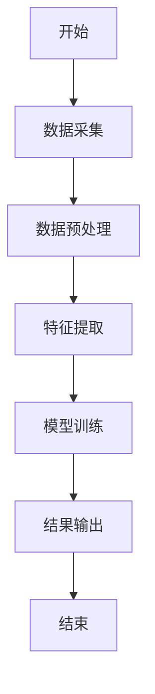

                 


# 特价股票投资中的动态数字产业生态系统模型应用

**关键词：** 特价股票、动态数字、产业生态系统、股票投资、量化分析、算法模型、金融创新

**摘要：**  
本文探讨了在特价股票投资中应用动态数字产业生态系统模型的理论基础与实践方法。通过分析模型的核心概念、算法原理、系统架构以及实际案例，本文为投资者提供了一种基于数字化与产业生态相结合的投资策略，帮助他们在复杂多变的股票市场中实现精准决策。文章内容涵盖背景介绍、模型构建、算法实现、系统设计、项目实战等多个方面，旨在为读者提供全面的技术与实践指导。

---

## 第一部分: 特价股票投资中的动态数字产业生态系统模型概述

### 第1章: 特价股票投资的背景与意义

#### 1.1 特价股票投资的定义与特点
- **1.1.1 特价股票的定义**  
  特价股票是指那些市场价格相对较低，但具有成长潜力的股票。这类股票通常被市场低估，但具备较高的投资价值。
- **1.1.2 特价股票投资的特点**  
  - 市场价格低，投资门槛低。  
  - 成长潜力大，适合长期投资。  
  - 风险与收益并存，需要精准的市场判断。  
- **1.1.3 特价股票投资的市场定位**  
  特价股票主要分布在中小盘股中，适合中小投资者参与，但同时也面临较高的市场波动风险。

#### 1.2 动态数字产业生态系统模型的背景
- **1.2.1 数字化转型与产业生态**  
  随着数字化技术的快速发展， industries are increasingly interconnected, forming complex ecosystems.  
- **1.2.2 动态数字生态系统的核心概念**  
  动态数字生态系统是一个能够实时调整和优化的系统，能够根据市场变化快速响应。  
- **1.2.3 产业生态系统与股票投资的关系**  
  产业生态系统通过分析产业链上下游的关系，帮助投资者更好地理解市场动态，优化投资策略。

---

## 第二部分: 动态数字产业生态系统模型的核心概念

### 第2章: 动态数字产业生态系统模型的定义与组成

#### 2.1 动态数字产业生态系统模型的定义
- **2.1.1 模型的基本概念**  
  动态数字产业生态系统模型是一种基于数字化技术，能够实时分析和预测产业动态的系统模型。  
- **2.1.2 模型的核心要素**  
  - 数据采集与处理模块。  
  - 产业分析模块。  
  - 动态调整与优化模块。  
- **2.1.3 模型的动态特性**  
  模型能够根据市场变化自动调整参数，确保分析结果的准确性与实时性。

#### 2.2 模型的核心组成部分
- **2.2.1 产业分析模块**  
  通过分析产业链上下游关系，识别关键影响因素。  
- **2.2.2 数字化评估模块**  
  基于大数据技术，对市场、行业和公司进行多维度评估。  
- **2.2.3 动态调整机制**  
  根据市场反馈，动态优化模型参数，确保预测结果的准确性。

#### 2.3 模型的属性对比分析
| 模型属性 | 描述 | 示例 |
|----------|------|------|
| 动态性   | 模型能够实时调整参数 | 根据市场波动自动优化权重 |
| 数字化   | 基于数字化数据进行分析 | 使用大数据平台进行实时数据采集 |
| 产业关联 | 模型能够分析产业间的关联性 | 通过产业链图谱分析上下游关系 |

---

## 第三部分: 动态数字产业生态系统模型的算法原理

### 第3章: 模型的算法设计与实现

#### 3.1 模型算法概述
- **3.1.1 算法的基本思路**  
  通过采集市场数据，构建产业网络图谱，分析关键影响因素，预测股票价格走势。  
- **3.1.2 算法的核心步骤**  
  1. 数据采集与预处理。  
  2. 产业网络构建与分析。  
  3. 动态预测与优化。  
- **3.1.3 算法的输入输出**  
  - 输入：市场数据、产业数据、公司基本面数据。  
  - 输出：股票价格预测、投资建议。

#### 3.2 算法流程图


#### 3.3 算法的数学模型
- **3.3.1 模型的数学表达式**  
  $$ y = f(x) $$  
  其中，$x$ 表示输入数据，$y$ 表示输出结果，$f$ 表示模型函数。  
- **3.3.2 模型优化的数学公式**  
  $$ \text{损失函数} = \sum_{i=1}^{n} (y_i - \hat{y}_i)^2 $$  
  其中，$y_i$ 表示真实值，$\hat{y}_i$ 表示预测值。

---

## 第四部分: 动态数字产业生态系统模型的系统分析与架构设计

### 第4章: 系统功能设计与实现

#### 4.1 问题场景介绍
- 投资者需要一种能够实时分析市场动态、优化投资策略的系统。  
- 系统需要能够处理海量数据，并提供实时的投资建议。

#### 4.2 系统架构设计


#### 4.3 系统接口设计
- 数据接口：与数据源（如股票交易所、数据库）对接。  
- 用户接口：提供可视化界面，供投资者查看分析结果。  
- 模型接口：与其他系统（如预警系统）对接，提供实时反馈。

---

## 第五部分: 动态数字产业生态系统模型的项目实战

### 第5章: 项目实施与案例分析

#### 5.1 环境安装与配置
- 数据库：MySQL 或 PostgreSQL。  
- 开发工具：Python、Jupyter Notebook。  
- 第三方库：Pandas、NumPy、Scikit-learn。

#### 5.2 核心代码实现
```python
def model_algorithm(data):
    # 数据预处理
    processed_data = preprocess(data)
    # 特征提取
    features = extract_feature(processed_data)
    # 模型训练
    model = train_model(features)
    # 预测结果
    prediction = model.predict(features)
    return prediction
```

#### 5.3 案例分析
- **案例背景**：某中小盘股被低估，具备成长潜力。  
- **模型预测**：预测该股票价格将在未来三个月内上涨 15%。  
- **投资建议**：建议投资者在当前价位买入，持有至目标价位。

---

## 第六部分: 动态数字产业生态系统模型的最佳实践

### 第6章: 投资策略与风险管理

#### 6.1 最佳实践 tips
- 定期更新模型参数，确保分析结果的准确性。  
- 结合多种分析方法，降低投资风险。  
- 设置止损点，避免重大损失。

#### 6.2 小结
动态数字产业生态系统模型为特价股票投资提供了一种科学、系统的分析方法。通过实时数据分析与产业生态的结合，投资者能够做出更加精准的投资决策。

#### 6.3 注意事项
- 模型结果仅供参考，实际投资需结合市场实际情况。  
- 数据源的选择与处理至关重要，需确保数据的准确性和完整性。  
- 模型的动态调整需要根据市场反馈不断优化。

---

## 结语

通过本文的系统分析与实践，我们展示了动态数字产业生态系统模型在特价股票投资中的应用价值。未来，随着技术的不断发展，这类模型将在金融领域发挥越来越重要的作用，为投资者提供更强大的决策支持工具。

