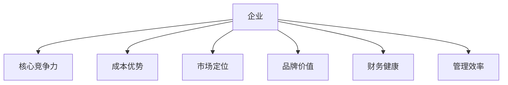
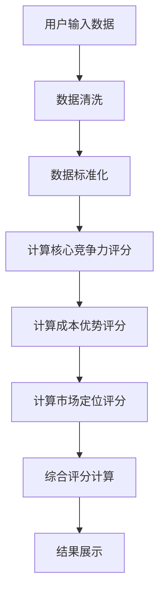
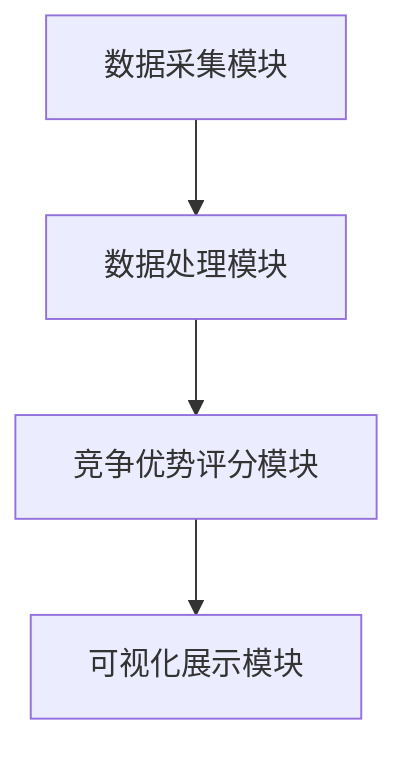

                 


# 特价股票投资中的可持续竞争优势模型应用

## 关键词：
- 特价股票投资
- 可持续竞争优势模型
- 股票分析
- 竞争优势分析
- 股票投资策略

## 摘要：
本文深入探讨了可持续竞争优势模型在特价股票投资中的应用。通过分析模型的核心概念、算法原理、系统架构以及实际案例，本文为投资者提供了一种基于竞争优势的股票筛选方法。文章详细讲解了模型的数学公式、系统设计和代码实现，并通过实际案例分析验证了模型的有效性，为投资者在特价股票投资中提供了科学的决策支持。

---

# 第一部分: 特价股票投资中的可持续竞争优势模型背景与概述

## 第1章: 特价股票投资的背景与意义

### 1.1 特价股票投资的定义与特点

#### 1.1.1 特价股票的定义
特价股票是指市场价格显著低于其内在价值的股票。通常，这些股票可能被市场低估，或者因短期市场波动而被抛售。投资者通过识别这些股票，可以在市场恢复时获得超额收益。

#### 1.1.2 特价股票投资的特点
- **低估值**：市场价格低于内在价值。
- **短期波动**：通常因市场情绪或突发事件导致价格下跌。
- **潜在高回报**：一旦市场恢复，股价可能迅速回升。

#### 1.1.3 特价股票投资的市场机会
特价股票的投资机会主要集中在以下领域：
1. 周期性行业：如能源、材料和工业等行业的周期性波动可能导致股票价格短期被低估。
2. 小盘股：小盘股因市场关注度较低，更容易出现低估情况。
3. 事件驱动：如并购、重组等事件可能导致股价短期下跌，但长期价值不变。

---

### 1.2 可持续竞争优势模型的定义与特点

#### 1.2.1 可持续竞争优势的定义
可持续竞争优势是指企业在长期经营中，通过核心竞争力、成本优势、市场定位、品牌价值、财务健康和管理效率等要素，能够在行业内持续获得超额利润的能力。

#### 1.2.2 可持续竞争优势的核心要素
- **核心竞争力**：企业的核心技术、专利和创新能力。
- **成本优势**：相对于竞争对手的更低生产成本或运营成本。
- **市场定位**：企业在市场中的定位和目标客户群体。
- **品牌价值**：品牌知名度和客户忠诚度。
- **财务健康**：企业的财务状况和盈利能力。
- **管理效率**：管理团队的效率和战略执行能力。

#### 1.2.3 可持续竞争优势与企业长期价值的关系
可持续竞争优势是企业长期价值的核心驱动力。企业通过构建和维持可持续竞争优势，可以在激烈的市场竞争中占据优势地位，从而为股东创造持续的超额回报。

---

### 1.3 特价股票投资与可持续竞争优势模型的结合

#### 1.3.1 特价股票投资中的竞争优势分析
在特价股票投资中，投资者需要识别那些因短期市场波动而被低估，但具备可持续竞争优势的企业。这些企业即使当前股价被低估，但其核心竞争力和长期盈利能力使其具有长期投资价值。

#### 1.3.2 可持续竞争优势模型在股票投资中的应用价值
- **筛选潜在投资标的**：通过模型筛选出具备可持续竞争优势的特价股票。
- **评估企业长期价值**：量化分析企业的竞争优势，评估其长期投资价值。
- **降低投资风险**：通过模型分析，识别那些因短期波动被低估的优质企业。

#### 1.3.3 模型应用的边界与外延
- **边界**：模型主要适用于具备明确竞争优势的公司，不适用于处于衰退期或缺乏竞争优势的企业。
- **外延**：模型可以扩展应用于行业分析、投资组合优化等领域。

---

## 第2章: 可持续竞争优势模型的核心概念与联系

### 2.1 可持续竞争优势模型的原理

#### 2.1.1 模型的基本假设
- 企业的长期价值取决于其可持续竞争优势。
- 可持续竞争优势可以通过多个维度进行量化评估。

#### 2.1.2 模型的核心假设
- 企业的竞争优势可以通过核心竞争力、成本优势、市场定位等维度进行衡量。
- 企业的竞争优势越强，其长期盈利能力越高。

#### 2.1.3 模型的数学表达式
可持续竞争优势评分公式：
$$
\text{竞争优势评分} = \frac{\text{核心竞争力评分} + \text{成本优势评分} + \text{市场定位评分}}{3}
$$

---

### 2.2 可持续竞争优势模型的属性特征对比

#### 2.2.1 核心竞争力与成本优势的对比
| 属性      | 核心竞争力                 | 成本优势                 |
|-----------|--------------------------|--------------------------|
| 定义      | 核心技术、专利、创新能力   | 生产成本、运营成本       |
| 评估指标  | 专利数量、研发投入占比     | 毛利率、成本控制能力     |
| 影响因素  | 技术壁垒、行业竞争格局     | 生产效率、供应链管理     |

#### 2.2.2 市场定位与品牌价值的对比
| 属性      | 市场定位                 | 品牌价值                 |
|-----------|--------------------------|--------------------------|
| 定义      | 目标客户群体、市场定位策略 | 品牌知名度、客户忠诚度   |
| 评估指标  | 市场占有率、目标客户数     | 品牌认知度、品牌影响力   |
| 影响因素  | 行业趋势、竞争对手策略     | 营销投入、品牌历史       |

#### 2.2.3 财务健康与管理效率的对比
| 属性      | 财务健康                 | 管理效率                 |
|-----------|--------------------------|--------------------------|
| 定义      | 财务状况、盈利能力       | 管理团队效率、战略执行能力|
| 评估指标  | 净利润、资产负债率       | 管理团队稳定性、战略一致性|
| 影响因素  | 财务报表、行业周期       | 组织结构、团队能力       |

---

### 2.3 可持续竞争优势模型的ER实体关系图



---

## 第3章: 可持续竞争优势模型的算法原理

### 3.1 模型的输入与输出

#### 3.1.1 输入变量
- 企业核心竞争力评分
- 企业成本优势评分
- 企业市场定位评分
- 企业品牌价值评分
- 企业财务健康评分
- 企业管理效率评分

#### 3.1.2 输出变量
- 可持续竞争优势综合评分
- 企业竞争优势排名

#### 3.1.3 模型的边界条件
- 每个评分维度的权重相同（权重均为1/3）。
- 评分范围为1到5分，1分为最低，5分为最高。

---

### 3.2 模型的数学表达式

#### 3.2.1 核心竞争力评分计算公式
$$
\text{核心竞争力评分} = \frac{\text{专利数量} + \text{研发投入占比}}{2}
$$

---

#### 3.2.2 可持续竞争优势模型的综合评分公式
$$
\text{竞争优势综合评分} = \frac{\text{核心竞争力评分} + \text{成本优势评分} + \text{市场定位评分}}{3}
$$

---

### 3.3 模型的实现步骤

#### 3.3.1 数据收集
- 收集企业的专利数量、研发投入占比、毛利率、市场占有率、品牌认知度等数据。

#### 3.3.2 数据处理
- 标准化数据，确保每个维度的评分在1到5分之间。

#### 3.3.3 竞争优势评分计算
- 分别计算核心竞争力评分、成本优势评分、市场定位评分。
- 计算综合竞争优势评分。

#### 3.3.4 结果分析
- 根据综合竞争优势评分，筛选出具备可持续竞争优势的特价股票。

---

## 第4章: 可持续竞争优势模型的系统架构设计

### 4.1 系统功能设计

#### 4.1.1 系统功能模块
- 数据采集模块：采集企业的各项数据。
- 数据处理模块：对数据进行清洗和标准化。
- 竞争优势评分模块：计算各项评分并输出综合评分。
- 可视化分析模块：将评分结果可视化展示。

#### 4.1.2 系统功能流程


---

### 4.2 系统架构设计

#### 4.2.1 系统架构图


---

## 第5章: 可持续竞争优势模型的项目实战

### 5.1 项目环境安装

#### 5.1.1 环境要求
- Python 3.8+
- Jupyter Notebook
- Pandas、NumPy、Matplotlib库

#### 5.1.2 安装依赖
```bash
pip install pandas numpy matplotlib
```

---

### 5.2 系统核心实现源代码

#### 5.2.1 数据加载与处理
```python
import pandas as pd
import numpy as np
import matplotlib.pyplot as plt

# 加载数据
data = pd.read_csv('stock_data.csv')

# 数据清洗
data.dropna(inplace=True)
data['专利数量'] = data['专利数量'].astype(int)
data['研发投入占比'] = data['研发投入占比'].astype(float)
data['毛利率'] = data['毛利率'].astype(float)
data['市场占有率'] = data['市场占有率'].astype(float)
data['品牌认知度'] = data['品牌认知度'].astype(float)
```

#### 5.2.2 竞争优势评分计算
```python
# 核心竞争力评分
data['核心竞争力评分'] = (data['专利数量'] + data['研发投入占比']) / 2

# 成本优势评分
data['成本优势评分'] = (data['毛利率'] + data['市场占有率']) / 2

# 市场定位评分
data['市场定位评分'] = (data['品牌认知度'] + data['市场占有率']) / 2

# 综合竞争优势评分
data['综合竞争优势评分'] = (data['核心竞争力评分'] + data['成本优势评分'] + data['市场定位评分']) / 3
```

#### 5.2.3 结果可视化
```python
plt.figure(figsize=(10, 6))
plt.hist(data['综合竞争优势评分'], bins=5, alpha=0.7, color='blue')
plt.title('综合竞争优势评分分布')
plt.xlabel('评分')
plt.ylabel('频数')
plt.show()
```

---

### 5.3 案例分析与详细解读

#### 5.3.1 案例背景
假设我们有两家公司，A公司和B公司，分别属于不同的行业。

#### 5.3.2 数据分析
```python
# 案例分析
company_A = data[data['公司名称'] == 'A公司']
company_B = data[data['公司名称'] == 'B公司']

print(f"A公司的综合竞争优势评分为：{company_A['综合竞争优势评分'].values[0]:.2f}")
print(f"B公司的综合竞争优势评分为：{company_B['综合竞争优势评分'].values[0]:.2f}")
```

#### 5.3.3 模型结果解读
通过上述代码，我们可以得出A公司和B公司的综合竞争优势评分，从而判断哪一家公司具备更强的可持续竞争优势。

---

## 第6章: 可持续竞争优势模型的总结与展望

### 6.1 总结

#### 6.1.1 模型的优势
- 可量化评估企业的竞争优势。
- 能够帮助投资者筛选出具备长期投资价值的特价股票。

#### 6.1.2 模型的不足
- 模型假设各竞争优势维度的权重相同，实际情况可能有所不同。
- 数据的获取和准确性可能影响模型的准确性。

---

### 6.2 小结与展望

#### 6.2.1 小结
本文通过构建可持续竞争优势模型，为投资者在特价股票投资中提供了一种科学的决策工具。通过分析企业的核心竞争力、成本优势、市场定位等维度，模型能够有效识别具备长期竞争优势的特价股票。

#### 6.2.2 未来展望
未来的研究可以进一步优化模型，例如引入动态权重调整、多维度数据挖掘等方法，以提高模型的准确性和适用性。此外，模型还可以扩展应用于行业分析、投资组合优化等领域，为投资者提供更全面的支持。

---

### 6.3 注意事项

#### 6.3.1 模型的应用边界
模型主要适用于具备明确竞争优势的公司，不适用于处于衰退期或缺乏竞争优势的企业。

#### 6.3.2 数据质量的重要性
模型的准确性依赖于数据的准确性和完整性，因此在实际应用中需要确保数据来源可靠。

#### 6.3.3 模型的局限性
模型的假设可能存在局限性，投资者在实际操作中需要结合市场实际情况进行综合判断。

---

### 6.4 拓展阅读

#### 6.4.1 相关书籍
- 《竞争优势：企业成功的关键》
- 《股票投资：从入门到精通》

#### 6.4.2 相关博客
- 《可持续竞争优势模型的深入分析》
- 《特价股票投资的策略与技巧》

---

## 结语

通过本文的详细讲解，读者可以深入了解可持续竞争优势模型在特价股票投资中的应用。无论是从理论分析还是实际案例，模型都为投资者提供了有效的工具和方法。未来，随着模型的不断优化和扩展，相信它将在股票投资领域发挥更大的作用。

