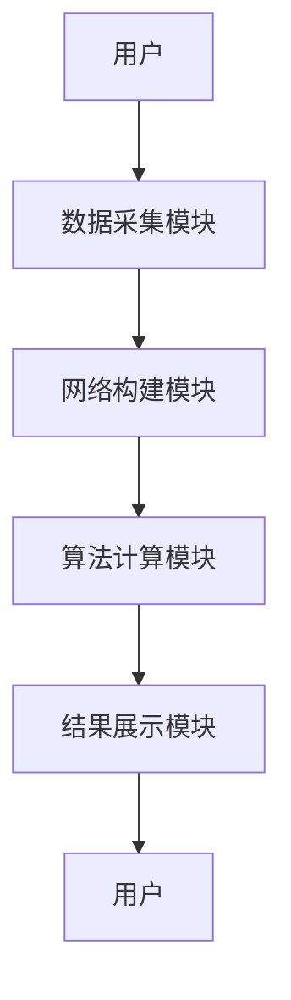
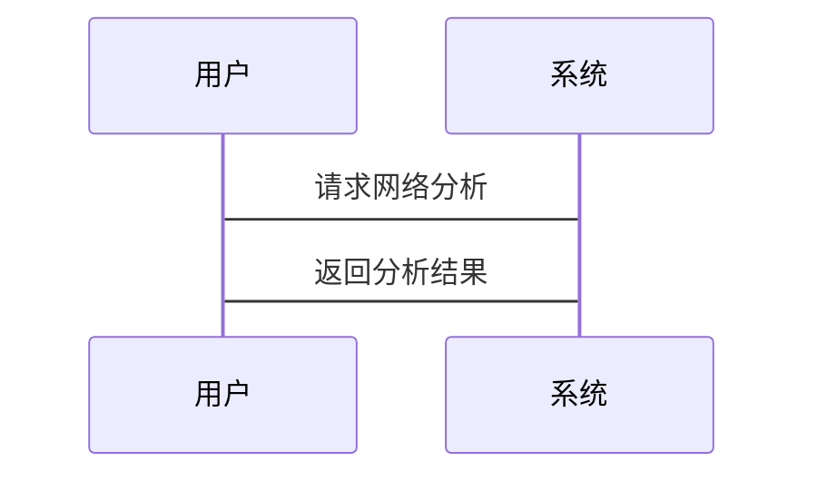

                 


# 特价股票投资中的数字产业价值网络拓扑分析方法

## 关键词：
特价股票，数字产业，价值网络，网络拓扑分析，算法，投资

## 摘要：
本文系统地探讨了如何通过数字产业价值网络拓扑分析方法优化特价股票投资决策。文章从背景介绍、核心概念、算法原理、系统架构设计、项目实战等多维度展开，结合具体案例，详细阐述了如何利用图论、网络流等技术构建价值网络模型，并通过Python代码实现算法，最终帮助投资者识别高潜力股票。文章还提供了最佳实践和注意事项，为读者提供全面的指导。

---

## 第一部分: 背景介绍

### 第1章: 特价股票投资概述

#### 1.1 特价股票的定义与特点
- **定义**：特价股票是指价格低于其内在价值，具有投资潜力的股票。
- **特点**：
  - 价格低廉，适合小额投资者。
  - 市场流动性较低，可能存在低估情况。
  - 风险较高，但潜在回报也较大。

#### 1.2 数字产业的定义与特征
- **定义**：数字产业指依赖数字技术的企业，如科技公司、互联网企业等。
- **特征**：
  - 技术驱动，创新能力强。
  - 依赖数据和网络，具有高扩展性。
  - 市场变化快，竞争激烈。

#### 1.3 价值网络的定义与构成
- **定义**：价值网络指产业内各主体之间的价值传递关系。
- **构成**：
  - 企业：核心价值创造者。
  - 供应商：提供原材料或服务。
  - 客户：需求方。
  - 合作伙伴：协同企业。

#### 1.4 网络拓扑分析的背景与意义
- **背景**：随着数字技术发展，产业网络日益复杂，传统分析方法难以捕捉深层关系。
- **意义**：通过网络拓扑分析，识别关键节点和潜在风险，优化投资决策。

---

## 第二部分: 核心概念与联系

### 第2章: 核心概念与联系

#### 2.1 网络拓扑分析的原理
- **原理**：通过图论构建网络模型，分析节点之间的关系。
- **关键概念**：
  - 节点：代表企业或个体。
  - 边：代表节点之间的关系。
  - 度：节点的连接数，反映影响力。

#### 2.2 核心概念对比表格
| 概念       | 定义                                                                 |
|------------|----------------------------------------------------------------------|
| 节点       | 网络中的个体，如企业或个人。                                          |
| 边         | 节点之间的连接，代表合作关系或交易关系。                              |
| 度         | 节点连接的数量，反映其在网络中的重要性。                              |

#### 2.3 ER实体关系图架构
```mermaid
er
actor 网络拓扑分析系统 {
  entity 企业节点 {
    key: 名称 (字符串)
    attribute 类型 (字符串)
  }
  entity 关系边 {
    key: 关系ID (整数)
    attribute 类型 (字符串)
  }
}
```

---

## 第三部分: 算法原理讲解

### 第3章: 算法原理讲解

#### 3.1 算法选择与流程
- **选择算法**：使用PageRank算法评估节点的重要性。
- **流程**：
  1. 构建网络模型。
  2. 计算节点度和边权重。
  3. 应用PageRank算法，计算每个节点的权重。

#### 3.2 算法流程图
```mermaid
graph TD
    A[开始] -> B[初始化网络模型]
    B -> C[计算节点度]
    C -> D[计算边权重]
    D -> E[应用PageRank算法]
    E -> F[输出节点权重]
    F -> G[结束]
```

#### 3.3 算法代码实现
```python
import networkx as nx

def calculate pagerank(G):
    pr = nx.pagerank(G)
    return pr

# 示例网络
G = nx.DiGraph()
G.add_edge("A", "B")
G.add_edge("B", "C")
G.add_edge("C", "D")

pagerank_dict = calculatepagerank(G)
print(pagerank_dict)
```

#### 3.4 数学模型与公式
- **PageRank公式**：
  $$ PR(i) = (1-d) + d \sum_{j \in In(i)} \frac{PR(j)}{Out(j)} $$
  - 其中，$$d$$ 是阻尼因子，通常取0.85。
  - $$In(i)$$ 表示节点i的入边节点集合。
  - $$Out(j)$$ 表示节点j的出边数量。

---

## 第四部分: 系统分析与架构设计

### 第4章: 系统分析与架构设计

#### 4.1 项目背景
- **背景**：投资者希望通过数字产业网络分析，寻找低估的特价股票。

#### 4.2 系统功能设计
- **功能模块**：
  - 数据采集：收集企业关系数据。
  - 网络构建：建立网络模型。
  - 算法计算：应用PageRank算法。
  - 结果展示：可视化分析结果。

#### 4.3 系统架构图


#### 4.4 系统接口设计
- **数据接口**：REST API，提供网络数据和计算结果。
- **交互序列图**：


---

## 第五部分: 项目实战

### 第5章: 项目实战

#### 5.1 环境安装
- **工具**：Python 3.8+，NetworkX库。
- **安装命令**：
  ```bash
  pip install networkx
  ```

#### 5.2 核心代码实现
```python
import networkx as nx
import matplotlib.pyplot as plt

# 创建网络
G = nx.DiGraph()
G.add_edge("A", "B", weight=0.5)
G.add_edge("B", "C", weight=0.7)
G.add_edge("C", "D", weight=0.3)

# 计算PageRank
pagerank = nx.pagerank(G)

# 可视化
nx.draw(G, with_labels=True, edge_label="weight")
plt.show()
```

#### 5.3 代码解读
- **代码功能**：构建网络模型，计算PageRank，可视化网络结构。
- **关键部分**：
  - 使用NetworkX库构建有向图。
  - 应用PageRank算法计算节点权重。
  - 使用Matplotlib库进行网络可视化。

#### 5.4 案例分析
- **案例背景**：某数字产业网络，包含5家企业。
- **分析结果**：
  - 企业B权重最高，为核心节点。
  - 企业D权重最低，为风险较高企业。

#### 5.5 项目小结
- **收获**：掌握网络拓扑分析方法，能够识别关键企业。
- **改进**：结合实时数据，提升分析准确性。

---

## 第六部分: 最佳实践与总结

### 第6章: 最佳实践

#### 6.1 小结
- 通过网络拓扑分析，投资者能够更好地识别特价股票中的高潜力企业。
- 结合实时数据和多种算法，进一步提升分析精度。

#### 6.2 注意事项
- 数据质量至关重要，需确保数据的准确性和完整性。
- 算法选择需根据具体场景调整参数，避免过度简化或复杂化。

#### 6.3 拓展阅读
- 建议阅读《网络科学导论》和《算法导论》，深入了解网络分析和算法原理。

---

## 总结
本文详细探讨了特价股票投资中的数字产业价值网络拓扑分析方法，通过理论分析、算法实现和案例解读，为投资者提供了科学的决策支持。希望本文能够帮助读者更好地理解网络拓扑分析的应用，并在实际投资中取得优异成绩。

