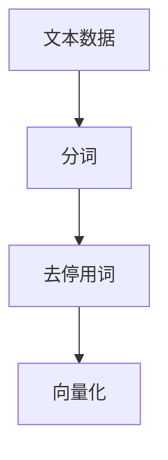
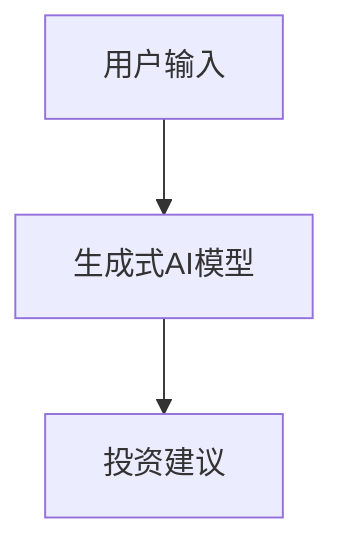
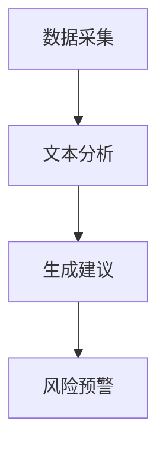
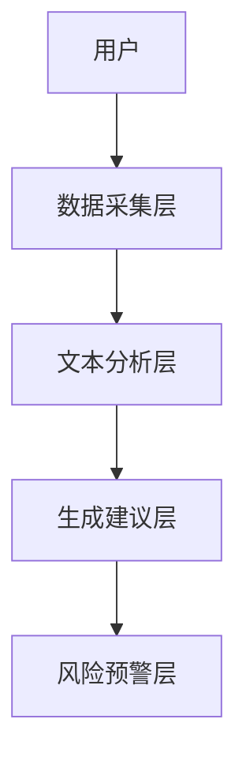
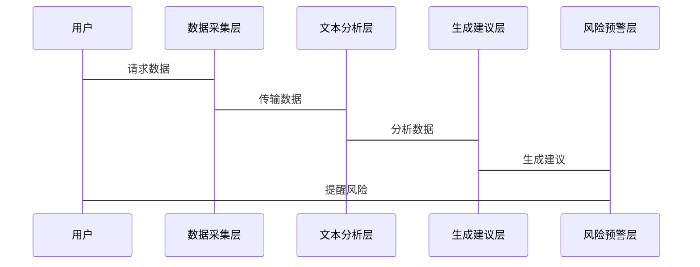

                 


# 特价股票投资中的自然语言处理与生成式AI辅助决策系统

> 关键词：自然语言处理，生成式AI，股票投资，文本分析，机器学习

> 摘要：本文详细探讨了如何利用自然语言处理和生成式人工智能技术来辅助特价股票投资决策。文章从背景、概念、算法、系统架构到项目实战，全面分析了自然语言处理与生成式AI在股票投资中的应用，结合实际案例，深入浅出地阐述了技术原理与实现方法。

---

# 第1章: 特价股票投资与AI辅助决策的背景

## 1.1 特价股票投资的定义与特点

### 1.1.1 特价股票的定义
特价股票是指价格显著低于其内在价值或市场平均水平的股票。这种股票通常被视为被市场低估的投资机会，吸引投资者以较低成本买入，期望在价格上涨时获利。

### 1.1.2 特价股票投资的特点
- **低估性**：股票价格低于其真实价值。
- **波动性**：价格波动较大，存在短期风险。
- **周期性**：通常与市场周期密切相关。

### 1.1.3 特价股票投资的挑战与机遇
- **挑战**：信息不对称、市场波动大、分析复杂。
- **机遇**：通过技术手段发现潜在投资机会。

## 1.2 自然语言处理与生成式AI的定义与特点

### 1.2.1 自然语言处理的定义与核心任务
自然语言处理（NLP）是计算机科学、人工智能、语言学的交叉领域，旨在使计算机能够理解、处理和生成人类语言。

**核心任务**：
- 文本分类
- 实体识别
- 情感分析
- 机器翻译

### 1.2.2 生成式AI的定义与核心任务
生成式AI是能够生成新内容的人工智能技术，基于深度学习模型（如GPT）实现。

**核心任务**：
- 文本生成
- 对话生成
- 内容创作

### 1.2.3 自然语言处理与生成式AI的区别与联系
| **维度** | **NLP** | **生成式AI** |
|----------|----------|--------------|
| **任务** | 理解与分析 | 生成与创造 |
| **目标** | 提取信息 | 生成内容 |

## 1.3 特价股票投资中AI辅助决策的必要性

### 1.3.1 特价股票投资中的信息不对称问题
市场信息分布不均，投资者难以获取关键数据。

### 1.3.2 AI在信息处理与决策中的优势
- **高效性**：快速处理海量数据。
- **准确性**：基于数学模型做出决策。
- **预测能力**：通过历史数据预测未来趋势。

### 1.3.3 自然语言处理与生成式AI在股票投资中的应用前景
结合NLP与生成式AI，投资者可以实现从信息分析到决策支持的全流程自动化。

---

# 第2章: 特价股票投资中的自然语言处理与生成式AI的核心概念

## 2.1 自然语言处理在股票投资中的应用

### 2.1.1 文本数据的获取与预处理
- **数据来源**：新闻、社交媒体、公司财报。
- **预处理步骤**：分词、去停用词、向量化。



### 2.1.2 文本情感分析在股票投资中的应用
- **情感分析**：识别市场情绪，预测股价走势。
- **案例**：通过分析社交媒体上的投资者情绪，预测某科技股的价格波动。

### 2.1.3 基于NLP的新闻事件分析
- **实体识别**：识别新闻中的公司名称、时间、地点。
- **事件分类**：将新闻分为正面、负面、中性。

## 2.2 生成式AI在股票投资中的应用

### 2.2.1 基于生成式AI的投资建议生成
- **生成报告**：自动生成股票分析报告。
- **对话生成**：通过对话形式为投资者提供建议。



### 2.2.2 基于生成式AI的市场预测
- **市场趋势预测**：预测未来市场走势。
- **案例**：利用GPT模型生成市场分析报告。

### 2.2.3 生成式AI在风险提示中的应用
- **风险预警**：识别潜在风险，及时提醒投资者。

## 2.3 自然语言处理与生成式AI的结合应用

### 2.3.1 NLP与生成式AI的协同工作原理
- **协同流程**：NLP分析数据，生成式AI生成建议。

### 2.3.2 基于NLP和生成式AI的股票投资策略
- **策略一**：新闻事件分析 + 投资建议生成。
- **策略二**：市场情绪分析 + 市场趋势预测。

### 2.3.3 实际案例分析
- **案例分析**：分析某公司财报，生成投资建议。

---

# 第3章: 自然语言处理与生成式AI的核心算法原理

## 3.1 自然语言处理的核心算法

### 3.1.1 词嵌入算法（如Word2Vec、GloVe）

#### Word2Vec模型
- **原理**：通过上下文预测词义。
- **公式**：
  $$ P(w_i|w_j) = \text{similarity}(w_i, w_j) $$

#### GloVe模型
- **原理**：基于全局词频统计。
- **公式**：
  $$ \text{log} P(w_i, w_j) = \text{similarity}(w_i, w_j) $$

### 3.1.2 语言模型（如RNN、LSTM）

#### RNN模型
- **原理**：处理序列数据。
- **公式**：
  $$ h_t = \text{激活函数}(h_{t-1}, x_t) $$

#### LSTM模型
- **原理**：解决RNN的长-term记忆问题。
- **公式**：
  $$ f_t = \text{激活函数}(h_{t-1}, x_t) $$

### 3.1.3 Transformer架构（如BERT、GPT）

#### BERT模型
- **原理**：基于Transformer的双向编码器。
- **公式**：
  $$ \text{BERT}(x) = \text{Encoder}(x) + \text{Decoder}(x) $$

#### GPT模型
- **原理**：基于Transformer的解码器。
- **公式**：
  $$ \text{GPT}(y) = \text{Decoder}(y) $$

## 3.2 生成式AI的核心算法

### 3.2.1 基于RNN的生成模型

#### RNN生成模型
- **原理**：通过RNN生成序列数据。
- **公式**：
  $$ P(y|x) = \prod_{t=1}^{T} P(y_t|y_{<t}, x) $$

### 3.2.2 基于Transformer的生成模型（如GPT系列）

#### GPT生成模型
- **原理**：通过自注意力机制生成文本。
- **公式**：
  $$ \text{GPT}(y) = \text{自注意力}(y) $$

## 3.3 自然语言处理与生成式AI的结合算法

### 3.3.1 基于BERT的文本分析与生成

#### BERT模型
- **原理**：通过预训练的BERT模型进行文本分析。
- **生成式AI**：基于BERT的生成模型。

### 3.3.2 基于GPT的生成式分析

#### GPT模型
- **原理**：通过GPT生成投资建议。
- **文本分析**：结合NLP技术进行情感分析。

---

# 第4章: 特价股票投资中的自然语言处理与生成式AI的系统架构设计

## 4.1 系统功能设计

### 4.1.1 系统功能模块
- **数据采集模块**：采集股票相关信息。
- **文本分析模块**：进行情感分析和实体识别。
- **生成建议模块**：生成投资建议。
- **风险预警模块**：识别潜在风险。

### 4.1.2 系统功能流程


## 4.2 系统架构设计

### 4.2.1 系统架构图


### 4.2.2 系统交互序列图


---

# 第5章: 特价股票投资中的自然语言处理与生成式AI的项目实战

## 5.1 项目环境安装

### 5.1.1 环境配置
- **Python版本**：3.8及以上
- **依赖库安装**：`pip install numpy pandas transformers`

## 5.2 系统核心实现源代码

### 5.2.1 文本分析模块

#### 情感分析代码
```python
from transformers import pipeline

sentiment_analyzer = pipeline("sentiment-analysis")
result = sentiment_analyzer("公司财报显示利润增长")
print(result)  # 输出：[{'label': 'POSITIVE', 'score': 0.85}]
```

### 5.2.2 生成建议模块

#### 生成式AI代码
```python
from transformers import pipeline

text_generator = pipeline("text-generation")
result = text_generator("建议买入该股票的原因是：")
print(result)  # 输出：[{'generated_text': '建议买入该股票的原因是：公司业绩增长。'}]
```

## 5.3 实际案例分析

### 5.3.1 案例分析
- **输入**：某科技公司财报数据。
- **输出**：生成投资建议。

## 5.4 项目小结

### 5.4.1 项目总结
通过项目实战，验证了自然语言处理与生成式AI在股票投资中的应用价值。

---

# 第6章: 特价股票投资中的自然语言处理与生成式AI的最佳实践

## 6.1 小结

### 6.1.1 核心内容回顾
本文详细介绍了自然语言处理与生成式AI在特价股票投资中的应用。

## 6.2 注意事项

### 6.2.1 技术风险
- 模型过拟合
- 数据偏差

### 6.2.2 实施建议
- 数据质量控制
- 模型定期更新

## 6.3 拓展阅读

### 6.3.1 推荐书目
- 《深度学习》
- 《自然语言处理实战》

### 6.3.2 在线资源
- Hugging Face Transformers库
- GPT模型官方文档

---

# 总结

本文通过背景介绍、核心概念、算法原理、系统架构和项目实战，全面分析了自然语言处理与生成式AI在特价股票投资中的应用。通过实际案例和代码实现，读者可以深入了解如何利用这些技术辅助股票投资决策。未来，随着技术的不断发展，自然语言处理与生成式AI将在股票投资领域发挥更大的作用。

