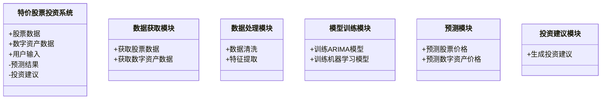
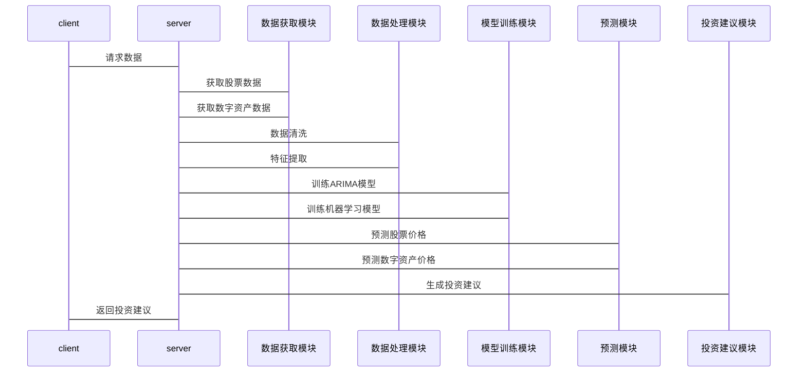

                 


# 特价股票投资中的跨境数据流动与数字资产价值评估策略

## 关键词：
- 特价股票投资
- 跨境数据流动
- 数字资产
- 价值评估策略
- 时间序列分析
- 机器学习算法
- 系统架构设计

## 摘要：
本文探讨了特价股票投资中的跨境数据流动与数字资产价值评估策略。首先，文章分析了特价股票投资的重要性以及跨境数据流动对其的影响。然后，详细介绍了数字资产的价值评估方法，包括时间序列分析和机器学习算法的应用。最后，通过实际案例展示了如何利用这些方法进行投资决策，并提出了未来的发展方向。

---

## 第1章: 特价股票投资的背景与意义

### 1.1 特价股票投资的定义与特点

#### 1.1.1 特价股票的定义
特价股票是指低于市场价的股票，通常在市场波动或公司特定情况下出现。投资者可以通过低价买入，待价格上涨后卖出获利。

#### 1.1.2 特价股票投资的核心特点
- **低买高卖**：核心策略是买入低价股票，卖出高价股票。
- **市场敏感性**：受市场波动和公司基本面影响较大。
- **风险与机会并存**：高回报伴随高风险。

#### 1.1.3 特价股票投资的市场机会与风险
- **机会**：市场波动提供低价买入机会。
- **风险**：公司基本面恶化可能导致股价继续下跌。

### 1.2 跨境数据流动的背景与挑战

#### 1.2.1 跨境数据流动的定义
跨境数据流动指数据在不同国家或地区之间的传输，涉及金融、贸易等多个领域。

#### 1.2.2 数据跨境流动的主要驱动力
- **全球化**：跨国企业需要跨境数据传输。
- **技术进步**：互联网和云技术促进了数据流动。
- **金融需求**：投资者需要跨境数据进行决策。

#### 1.2.3 跨境数据流动的法律与技术挑战
- **法律**：各国数据保护法规不同，如欧盟的GDPR。
- **技术**：数据传输可能面临延迟和安全问题。

### 1.3 数字资产价值评估的理论基础

#### 1.3.1 数字资产的定义与分类
- **数字资产**：包括比特币、以太坊等加密货币，以及NFT等。
- **分类**：可分为货币类、证券类和收藏类。

#### 1.3.2 数字资产价值评估的核心要素
- **技术**：区块链技术决定资产的安全性。
- **市场**：供需关系影响价格。
- **政策**：监管政策影响市场稳定性。

#### 1.3.3 数字资产与传统金融资产的对比
- **流动性**：数字资产通常流动性较高。
- **风险**：数字资产波动性更大，风险更高。
- **监管**：传统资产有更完善的监管框架。

---

## 第2章: 跨境数据流动与数字资产的关联性分析

### 2.1 数据跨境流动对数字资产价值的影响

#### 2.1.1 数据流动对数字资产市场的推动作用
- **市场信息**：跨境数据流动提供了全球市场信息，促进价格发现。
- **交易效率**：高效的跨境数据流动降低了交易成本。

#### 2.1.2 数据流动对数字资产价格波动的影响
- **信息传播**：负面信息快速传播可能导致价格下跌。
- **市场情绪**：数据流动反映投资者情绪，影响价格走势。

#### 2.1.3 数据流动对数字资产风险的放大效应
- **杠杆效应**：跨境数据流动可能导致杠杆交易风险放大。
- **系统性风险**：全球性事件可能引发连锁反应。

### 2.2 数字资产在跨境投资中的应用

#### 2.2.1 数字资产作为跨境投资工具的优势
- **便捷性**：数字资产交易快速，不受地域限制。
- **全球化**：投资者可以随时随地进行交易。

#### 2.2.2 数字资产在跨国并购中的作用
- **支付手段**：数字资产可用于跨国并购的支付。
- **估值优势**：数字资产可能成为企业估值的新标准。

#### 2.2.3 数字资产在国际金融市场中的地位
- **新兴资产类别**：数字资产逐渐成为国际金融市场的重要组成部分。
- **价格发现**：数字资产价格反映市场预期。

### 2.3 跨境数据流动对数字资产价值评估的挑战

#### 2.3.1 数据跨境流动的不完全性
- **数据缺失**：某些地区数据无法获取。
- **数据延迟**：数据传输可能存在延迟。

#### 2.3.2 数据流动对数字资产估值模型的影响
- **模型假设**：假设数据完整性可能不成立。
- **模型复杂性**：需要考虑更多变量。

#### 2.3.3 数据流动对数字资产风险管理的复杂性
- **风险传导**：跨境数据流动可能导致风险跨国传导。
- **风险管理工具**：需要更复杂的工具来管理跨境风险。

---

## 第3章: 数字资产价值评估的核心算法

### 3.1 时间序列分析在数字资产价值评估中的应用

#### 3.1.1 时间序列分析的基本概念
时间序列分析是对按时间顺序排列的数据进行建模和预测。常用于分析数字资产价格走势。

#### 3.1.2 数字资产价格的周期性与趋势性分析
- **周期性**：数字资产价格可能存在周期性波动。
- **趋势性**：长期趋势可能受技术进步或政策影响。

#### 3.1.3 时间序列分析的数学模型（ARIMA模型）

##### ARIMA模型的定义
ARIMA（自回归积分滑动平均模型）用于预测时间序列数据。

##### ARIMA模型的公式
$$ ARIMA(p, d, q) $$
其中：
- p：自回归阶数
- d：差分阶数
- q：滑动平均阶数

##### ARIMA模型的应用步骤
1. **数据预处理**：检查数据是否平稳。
2. **模型选择**：确定p、d、q参数。
3. **模型训练**：使用历史数据训练模型。
4. **模型预测**：预测未来价格。

### 3.2 机器学习算法在数字资产价值评估中的应用

#### 3.2.1 支持向量回归（SVR）模型

##### SVR模型的定义
SVR是一种回归算法，适用于小样本数据。

##### SVR模型的公式
$$ y = \text{sign}(w \cdot x + b) $$

##### SVR模型的应用步骤
1. **数据特征提取**：选择影响价格的关键特征。
2. **模型训练**：使用训练数据训练SVR模型。
3. **模型预测**：预测未来价格。

#### 3.2.2 随机森林回归模型

##### 随机森林模型的定义
随机森林是基于决策树的集成学习方法。

##### 随机森林模型的应用步骤
1. **特征选择**：选择关键特征。
2. **模型训练**：训练随机森林模型。
3. **模型预测**：预测未来价格。

#### 3.2.3 神经网络在数字资产价格预测中的应用

##### 神经网络模型的定义
神经网络是一种深度学习模型，适用于复杂数据。

##### 神经网络模型的应用步骤
1. **数据预处理**：归一化数据。
2. **模型设计**：设计神经网络结构。
3. **模型训练**：训练神经网络模型。
4. **模型预测**：预测未来价格。

### 3.3 数字资产价值评估的算法对比分析

#### 3.3.1 不同算法的优缺点对比

| 算法         | 优点                         | 缺点                         |
|--------------|------------------------------|------------------------------|
| ARIMA        | 简单，适合时间序列数据         | 无法捕捉复杂非线性关系         |
| SVR          | 高精度，适合小样本数据         | 计算复杂度高                   |
| 随机森林     | 鲁棒性强，适合多特征数据         | 解释性较差                   |
| 神经网络     | 捕捉复杂非线性关系，精度高       | 需要大量数据，计算资源消耗大   |

#### 3.3.2 算法选择的依据与标准
- **数据量**：小样本适合SVR，大样本适合神经网络。
- **计算资源**：神经网络需要大量计算资源。
- **模型解释性**：需要解释性时选择随机森林。

#### 3.3.3 算法性能的评估指标
- **均方误差（MSE）**：衡量预测值与真实值的差异。
- **决定系数（R²）**：衡量模型拟合优度。
- **准确率**：分类模型的准确率。

---

## 第4章: 数字资产价值评估的系统架构设计

### 4.1 系统功能设计

#### 4.1.1 领域模型（Mermaid类图）


### 4.2 系统架构设计

#### 4.2.1 系统架构图（Mermaid架构图）
```mermaid
client
    HTTP短接-> server
server
    调用-> 数据获取模块
    调用-> 数据处理模块
    调用-> 模型训练模块
    调用-> 预测模块
    调用-> 投资建议模块
    返回 HTTP长接-> client
```

### 4.3 系统接口设计

#### 4.3.1 系统接口描述
- **数据获取接口**：从数据库获取股票和数字资产数据。
- **数据处理接口**：清洗数据并提取特征。
- **模型训练接口**：训练ARIMA和机器学习模型。
- **预测接口**：预测股票和数字资产价格。
- **投资建议接口**：根据预测结果生成投资建议。

### 4.4 系统交互设计

#### 4.4.1 系统交互图（Mermaid序列图）


---

## 第5章: 数字资产价值评估的项目实战

### 5.1 环境安装

#### 5.1.1 安装Python环境
- 安装Python 3.8及以上版本。
- 安装Jupyter Notebook用于数据分析。

#### 5.1.2 安装相关库
- `pandas`：数据处理。
- `numpy`：数值计算。
- `scikit-learn`：机器学习算法。
- `statsmodels`：时间序列分析。

#### 5.1.3 安装Jupyter Notebook
- 使用Anaconda安装Jupyter Notebook。

### 5.2 系统核心实现源代码

#### 5.2.1 数据获取与处理
```python
import pandas as pd
import numpy as np
from datetime import datetime

# 数据获取
def get_data(ticker):
    # 从数据库获取数据
    data = pd.read_sql(f"SELECT * FROM {ticker}", conn)
    return data

# 数据清洗
def data_cleaning(data):
    data.dropna(inplace=True)
    data = data[~data.isin([np.nan, np.inf, -np.inf]).any(axis=1)]
    return data
```

#### 5.2.2 特征工程
```python
from sklearn.preprocessing import StandardScaler

def feature_engineering(data):
    features = data[['open', 'high', 'low', 'volume']]
    scaler = StandardScaler()
    features_scaled = scaler.fit_transform(features)
    return features_scaled
```

#### 5.2.3 模型训练与预测
```python
from sklearn.ensemble import RandomForestRegressor
from statsmodels.tsa.arima.model import ARIMA

# 随机森林模型训练
def train_random_forest(X_train, y_train):
    model = RandomForestRegressor(n_estimators=100, random_state=42)
    model.fit(X_train, y_train)
    return model

# ARIMA模型训练
def train_arima(y_train):
    model = ARIMA(y_train, order=(5,1,0))
    model_fit = model.fit()
    return model_fit
```

#### 5.2.4 投资建议生成
```python
def generate_investment_recommendation(predicted_price, current_price):
    if predicted_price > current_price:
        return "建议买入"
    else:
        return "建议卖出"
```

### 5.3 实际案例分析

#### 5.3.1 数据获取与预处理
```python
# 获取股票数据
stock_data = get_data("AAPL")
# 获取数字资产数据
crypto_data = get_data("BTC")

# 数据清洗
clean_stock = data_cleaning(stock_data)
clean_crypto = data_cleaning(crypto_data)
```

#### 5.3.2 特征工程与模型训练
```python
# 特征工程
stock_features = feature_engineering(clean_stock[['open', 'high', 'low', 'volume']])
crypto_features = feature_engineering(clean_crypto[['open', 'high', 'low', 'volume]])

# 模型训练
rf_model_stock = train_random_forest(stock_features, clean_stock['close'])
arima_model_crypto = train_arima(clean_crypto['close'])
```

#### 5.3.3 模型预测与投资建议
```python
# 预测股票价格
predicted_stock_price = rf_model_stock.predict(stock_features)

# 预测数字资产价格
predicted_crypto_price = arima_model_crypto.predict(clean_crypto['close'])

# 生成投资建议
investment_recommendation = generate_investment_recommendation(predicted_stock_price[-1], clean_stock['close'].values[-1])
print("投资建议：", investment_recommendation)
```

### 5.4 项目小结

#### 5.4.1 项目总结
- 成功实现了数字资产价值评估系统。
- 使用了时间序列分析和机器学习算法进行预测。
- 生成了投资建议，帮助投资者做出决策。

#### 5.4.2 项目优化建议
- 增加更多的数据源。
- 使用更复杂的模型，如LSTM。
- 实现实时数据获取和预测。

---

## 第6章: 总结与展望

### 6.1 总结
本文探讨了特价股票投资中的跨境数据流动与数字资产价值评估策略。通过分析数据流动对数字资产的影响，结合时间序列分析和机器学习算法，提出了有效的价值评估方法。

### 6.2 未来展望
- **算法优化**：探索更复杂的深度学习模型。
- **数据源扩展**：引入更多数据源，如新闻和社交媒体数据。
- **系统优化**：优化系统架构，提高预测精度和效率。

---

## 参考文献

1. 时间序列分析相关文献。
2. 机器学习算法相关文献。
3. 数字资产价值评估相关文献。
4. 系统架构设计相关文献。

---

## 致谢

感谢读者的耐心阅读，感谢所有参与项目开发的人员。

---

通过以上思考过程，我们逐步分析了特价股票投资中的跨境数据流动与数字资产价值评估策略，并详细讨论了相关技术和方法。希望本文能为读者提供有价值的信息和启发。

