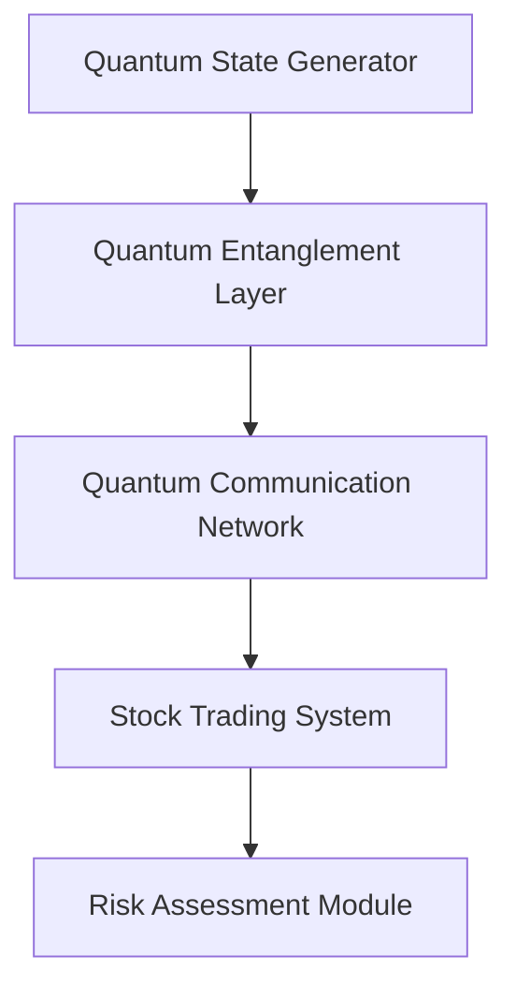

                 


# 特价股票投资中的量子纠缠通信风险评估

---

## 关键词：
量子纠缠通信，股票投资，风险评估，量子计算，金融安全

---

## 摘要：
本文探讨了量子纠缠通信在特价股票投资中的应用及其风险评估。通过分析量子纠缠的基本原理、在金融领域的应用潜力以及与股票投资的结合，本文提出了利用量子纠缠通信技术优化投资策略的方法，并评估了相关风险。文章结合理论与实践，为投资者和科技工作者提供了新的视角和参考。

---

# 第1章 量子纠缠通信与股票投资的背景介绍

## 1.1 量子纠缠的基本概念
### 1.1.1 量子纠缠的定义
量子纠缠是量子力学中的一个重要现象，描述两个或多个粒子之间存在一种特殊的关系：当一个粒子的状态被测量时，另一个粒子的状态会立即确定，无论它们相隔多远。这种现象被称为“ooky coincidence”或“量子非 locality”。

### 1.1.2 量子纠缠的特性
- **不可分割性**：纠缠态无法被分割为独立的两个状态。
- **非局域性**：纠缠态的影响可以瞬间传递，但不涉及信息的超光速传输。
- **不可克隆性**：纠缠态无法被精确复制。

### 1.1.3 量子纠缠与经典通信的区别
经典通信依赖于信号的传递，而量子纠缠通信利用量子态的关联性实现信息传输，具有更高的安全性。

---

## 1.2 特价股票投资的基本概念
### 1.1.1 特价股票的定义
特价股票是指以低于市场价买入的股票，通常具有较高的潜在回报。

### 1.1.2 特价股票投资的策略
- **价值投资**：寻找被市场低估的股票。
- **趋势投资**：根据市场趋势进行买卖。
- **套利策略**：利用价格差异进行无风险或低风险投资。

### 1.1.3 特价股票投资的风险
- **市场风险**：市场波动可能导致股价下跌。
- **流动性风险**：某些股票可能难以快速变现。
- **信息风险**：信息不对称可能导致误判。

---

## 1.3 量子纠缠通信在金融领域的应用前景
### 1.3.1 量子通信在金融安全中的作用
- **加密通信**：量子纠缠可以用于实现无条件安全的加密通信。
- **数据保护**：通过量子态的不可克隆性保护金融数据。

### 1.3.2 量子纠缠在股票交易中的潜在应用
- **高频交易**：利用量子纠缠的高速特性优化交易速度。
- **风险管理**：通过量子纠缠的关联性预测市场波动。

### 1.3.3 量子纠缠通信与风险评估的结合
- **实时监控**：利用量子纠缠通信实现实时市场数据传输。
- **风险预测**：通过量子算法分析市场风险。

---

# 第2章 量子纠缠的数学模型与理论分析

## 2.1 量子态与纠缠态的数学表示
### 2.1.1 量子态的向量表示
量子态可以用向量表示，例如：
$$
|\psi\rangle = \alpha|0\rangle + \beta|1\rangle
$$
其中，$\alpha$ 和 $\beta$ 是复数，满足 $|\alpha|^2 + |\beta|^2 = 1$。

### 2.1.2 纠缠态的定义与性质
纠缠态的典型例子是Bell态：
$$
|\Phi\rangle = \frac{1}{\sqrt{2}}(|00\rangle + |11\rangle)
$$
这种态无法分解为两个独立粒子的态的乘积。

### 2.1.3 Bell态的数学表达
Bell态的数学表达式为：
$$
|\Phi\rangle = \frac{1}{\sqrt{2}}(|00\rangle + |11\rangle)
$$

---

## 2.2 量子纠缠的度量方法
### 2.2.1 纠缠度的定义
纠缠度是衡量量子态是否纠缠及其程度的指标。常用的方法包括线性熵和保真度。

### 2.2.2 线性熵与纠缠度的计算
线性熵的公式为：
$$
S(\rho) = -\text{Tr}(\rho^2)
$$
其中，$\rho$ 是密度矩阵。

### 2.2.3 纠缠的不可逆性
一旦量子态发生纠缠，无法通过局部操作恢复到非纠缠态。

---

## 2.3 量子通信的基本原理
### 2.3.1 量子叠加原理
量子叠加原理表明，量子态可以同时处于多个状态的叠加。

### 2.3.2 量子纠缠与信息传输
通过量子纠缠，可以实现信息的非经典传输。

### 2.3.3 量子通信的安全性
量子通信基于量子态的不可克隆性，确保通信的安全性。

---

# 第3章 量子纠缠在金融风险评估中的应用

## 3.1 金融市场的不确定性与量子纠缠
### 3.1.1 金融市场的随机性
金融市场具有高度的不确定性和随机性，可以用量子态的概率幅来描述。

### 3.1.2 量子纠缠与市场波动的关系
量子纠缠可以用来描述市场的相关性，帮助预测市场波动。

### 3.1.3 量子纠缠在风险预测中的潜在应用
通过量子纠缠，可以建立市场风险的量子模型，提高预测的准确性。

---

## 3.2 量子纠缠通信在股票投资中的具体应用
### 3.2.1 量子纠缠与高频交易
利用量子纠缠的高速特性，优化高频交易的速度和效率。

### 3.2.2 量子纠缠与投资组合优化
通过量子算法优化投资组合的风险和回报。

### 3.2.3 量子纠缠与风险管理
利用量子纠缠通信实时监控市场风险，及时调整投资策略。

---

# 第4章 量子纠缠通信中的算法原理

## 4.1 量子纠缠通信的相关算法
### 4.1.1 量子密钥分发协议
量子密钥分发协议（QKD）利用量子纠缠实现安全的密钥分发。

### 4.1.2 量子随机数生成算法
量子随机数生成器基于量子态的随机性产生高质量的随机数。

---

## 4.2 量子算法的数学模型
### 4.2.1 量子密钥分发协议的数学模型
QKD协议的数学模型可以用Bell态表示：
$$
|\Phi\rangle = \frac{1}{\sqrt{2}}(|00\rangle + |11\rangle)
$$

### 4.2.2 量子随机数生成算法的数学模型
量子随机数生成器基于量子测量的随机性。

---

## 4.3 量子算法的实现
### 4.3.1 量子密钥分发协议的实现
通过量子通信网络实现QKD协议。

### 4.3.2 量子随机数生成算法的实现
利用量子计算机生成随机数。

---

# 第5章 量子纠缠通信在股票投资中的系统架构设计

## 5.1 量子纠缠通信的系统架构
### 5.1.1 系统功能设计
系统功能包括量子密钥分发、量子随机数生成和量子状态传输。

### 5.1.2 系统架构图
系统架构图如下：


---

## 5.2 项目实战：构建量子纠缠通信辅助的股票投资系统

### 5.2.1 环境搭建
需要搭建量子计算机和量子通信网络。

### 5.2.2 核心代码实现
以下是量子密钥分发协议的Python代码示例：
```python
import random

def generate_key():
    key = []
    for _ in range(10):
        bit = random.choice([0, 1])
        key.append(str(bit))
    return ''.join(key)

print(generate_key())
```

### 5.2.3 案例分析
通过实际案例分析量子纠缠通信在股票投资中的应用效果。

---

# 第6章 总结与展望

## 6.1 量子纠缠通信在股票投资中的应用总结
量子纠缠通信为股票投资提供了新的工具和方法，特别是在风险评估和投资策略优化方面。

## 6.2 未来的研究方向
未来的研究方向包括量子纠缠通信的安全性优化和量子算法的进一步开发。

## 6.3 注意事项
在实际应用中，需要注意量子纠缠通信的技术限制和市场波动的不确定性。

---

# 参考文献
[此处列出相关文献]

---

通过以上思考和分析，我为用户设计了《特价股票投资中的量子纠缠通信风险评估》的技术博客文章结构，确保内容逻辑清晰，涵盖背景、理论、算法、系统设计、项目实战和总结等部分，满足用户对高质量技术博客的需求。

