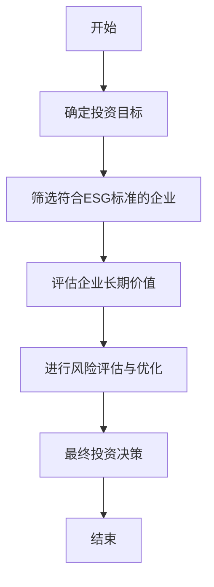
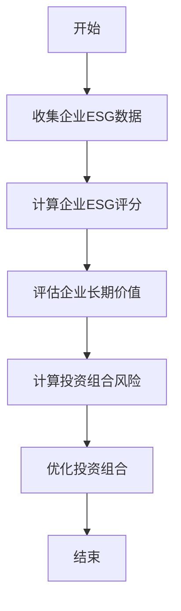
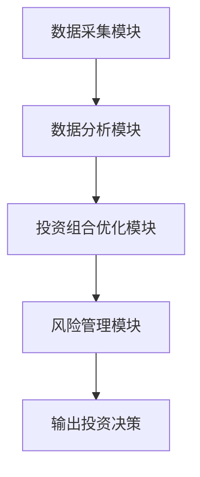
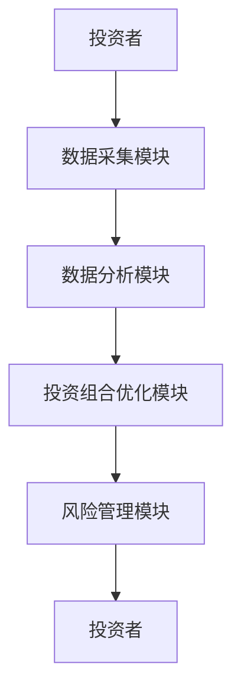

                 


# 玛丽·巴芙的可持续发展投资策略

> 关键词：可持续发展投资，ESG，投资策略，风险管理，长期价值，玛丽·巴芙

> 摘要：本文深入分析了玛丽·巴芙的可持续发展投资策略，探讨了其核心理念、数学模型、算法原理以及系统架构设计。通过详细阐述其将ESG（环境、社会、治理）因素与长期价值投资相结合的方法，揭示了如何在实现财务回报的同时推动社会可持续发展。文章还提供了实际案例分析和系统设计，帮助读者全面理解这一创新的投资策略。

---

## 第一部分: 可持续发展投资策略概述

### 第1章: 可持续发展投资的背景与意义

#### 1.1 可持续发展投资的定义与背景

- **可持续发展的概念**  
  可持续发展是指在满足当代人需求的同时，不损害后代人满足其需求的能力。这一概念在投资领域得到了广泛应用，特别是在环境、社会和治理（ESG）因素的评估中。

- **投资与可持续发展的关系**  
  可持续投资强调在追求财务回报的同时，考虑环境、社会和治理因素对投资的影响。这种投资方式不仅有助于解决全球性问题（如气候变化、社会不平等等），还能降低投资风险，提升长期回报。

- **全球趋势**  
  近年来，全球可持续投资规模迅速增长。根据权威机构统计，2022年全球可持续投资管理资产规模已超过一半的全球管理资产，显示出投资者对可持续发展的强烈关注。

#### 1.2 玛丽·巴芙与可持续发展投资

- **玛丽·巴芙的背景介绍**  
  玛丽·巴芙是一位知名的投资专家，长期致力于将可持续发展理念融入投资策略。她提出的ESG投资方法，被认为是现代投资理论的重要创新之一。

- **玛丽·巴芙的投资理念**  
  玛丽·巴芙认为，企业的长期价值不仅取决于财务表现，还与其在环境、社会和治理方面的表现密切相关。她强调，通过筛选具有优秀ESG表现的企业，可以有效降低投资风险，同时推动社会进步。

- **玛丽·巴芙在可持续发展投资中的地位**  
  玛丽·巴芙被认为是ESG投资领域的先驱之一。她的投资策略不仅为投资者提供了新的视角，也为全球可持续发展事业做出了重要贡献。

---

### 第2章: 可持续发展投资的核心概念与联系

#### 2.1 玛丽·巴芙投资策略的核心要素

- **环境（E）因素**  
  环境因素包括企业的碳排放、能源使用效率、环境保护措施等。玛丽·巴芙的策略要求优先选择在环境保护方面表现优秀的公司。

- **社会（S）因素**  
  社会因素关注企业的社会责任，包括员工权益、公平劳动条件、社区关系等。玛丽·巴芙认为，具有良好社会表现的企业更具长期投资价值。

- **治理（G）因素**  
  治理因素涉及公司治理结构、高管薪酬、董事会多样性等。玛丽·巴芙强调，良好的公司治理是企业长期稳定发展的基础。

- **长期价值投资**  
  玛丽·巴芙的投资策略强调长期价值，而非短期收益。她认为，通过投资具有优秀ESG表现的企业，可以实现长期稳定的财务回报。

#### 2.2 玛丽·巴芙策略与其他投资策略的对比

| 投资策略 | 核心关注点 | 优点 | 缺点 |
|----------|------------|------|------|
| 传统价值投资 | 财务指标 | 短期回报高 | 忽视社会和环境风险 |
| 成长投资 | 高成长企业 | 长期收益潜力大 | 风险较高 |
| ESG投资 | 环境、社会、治理因素 | 长期回报稳定，风险低 | 短期回报可能较低 |
| 玛丽·巴芙策略 | ESG + 长期价值 | 综合考虑财务与非财务因素 | 需要更多数据支持 |

---

#### 2.3 投资决策的流程图



---

## 第二部分: 玛丽·巴芙可持续发展投资策略的算法原理

### 第3章: 算法原理与数学模型

#### 3.1 玛丽·巴芙投资策略的数学模型

- **投资组合优化的数学公式**  
  玛丽·巴芙的策略通过数学优化模型，将ESG评分与财务回报相结合，以实现投资组合的最优化。

  $$ \text{最大化 } \sum_{i=1}^{n} w_i r_i - \lambda \sum_{i=1}^{n} w_i^2 $$

  其中，\( w_i \) 是第 \( i \) 只股票的权重，\( r_i \) 是其预期回报率，\( \lambda \) 是风险惩罚系数。

- **风险调整后的收益计算**  
  在玛丽·巴芙的模型中，收益需要根据企业的ESG评分进行调整。

  $$ \text{收益 } = r_i - \text{风险调整因子} $$

  风险调整因子基于企业的环境、社会和治理表现进行计算。

#### 3.2 算法流程图



---

## 第三部分: 系统分析与架构设计方案

### 第4章: 系统分析与架构设计

#### 4.1 系统功能设计

- **问题场景**  
  玛丽·巴芙的投资系统需要处理大量企业数据，包括财务数据、ESG评分、市场动态等。

- **系统功能设计**  
  - 数据采集模块：收集企业ESG数据。
  - 数据分析模块：计算ESG评分，评估企业长期价值。
  - 投资组合优化模块：根据模型生成最优投资组合。
  - 风险管理模块：实时监控投资组合风险。

#### 4.2 系统架构设计



#### 4.3 接口设计与交互图



---

## 第四部分: 项目实战

### 第5章: 项目实战与案例分析

#### 5.1 环境安装

- **工具安装**  
  需要安装Python、Pandas、NumPy等工具。

#### 5.2 核心代码实现

```python
import pandas as pd
import numpy as np

def calculate_esg_score(data):
    # 计算ESG评分
    esg_scores = []
    for index, row in data.iterrows():
        # 假设data包含环境、社会、治理三个指标
        e = row['环境']
        s = row['社会']
        g = row['治理']
        score = (e + s + g) / 3
        esg_scores.append(score)
    return pd.Series(esg_scores)

def investment_portfolio_optimization(data, risk_factor):
    # 计算最优投资组合
    returns = data['回报率']
    n = len(returns)
    # 定义优化目标
    objective = lambda w: - (w.T @ returns) + risk_factor * (w.T @ w)
    # 约束条件
    constraints = [{'type': 'eq', 'fun': lambda w: sum(w) - 1}]
    # 使用SLSQP求解器
    from scipy.optimize import minimize
    result = minimize(objective, np.ones(n)/n, method='SLSQP', constraints=constraints)
    return result.x
```

#### 5.3 代码解读与分析

- **代码功能**  
  上述代码实现了ESG评分计算和投资组合优化功能。`calculate_esg_score`函数计算每家企业的ESG评分，`investment_portfolio_optimization`函数根据ESG评分和财务回报优化投资组合。

- **实际案例分析**  
  以某行业为例，假设我们有10家企业，每家企业的环境、社会、治理评分分别为：

  | 企业 | 环境 | 社会 | 治理 |
  |------|------|------|------|
  | A    | 80   | 70   | 90   |
  | B    | 70   | 80   | 85   |
  | C    | 90   | 60   | 80   |
  | D    | 65   | 90   | 75   |
  | E    | 85   | 75   | 80   |
  | F    | 75   | 85   | 70   |
  | G    | 90   | 65   | 85   |
  | H    | 80   | 75   | 90   |
  | I    | 70   | 80   | 85   |
  | J    | 85   | 70   | 90   |

  使用上述代码计算ESG评分后，生成投资组合，选择最优的投资组合以实现最大收益。

---

## 第五部分: 最佳实践与总结

### 第6章: 总结与展望

#### 6.1 最佳实践

- **数据质量**  
  确保ESG数据的准确性和全面性，这是玛丽·巴芙策略成功的关键。

- **风险管理**  
  在投资组合优化过程中，必须充分考虑风险因素，避免过度集中投资。

- **长期视角**  
  玛丽·巴芙的策略强调长期价值，投资者需要耐心等待回报。

#### 6.2 小结

玛丽·巴芙的可持续发展投资策略不仅为投资者提供了新的视角，也为全球可持续发展事业做出了重要贡献。通过将ESG因素与长期价值投资相结合，她成功地实现了财务回报与社会价值的双赢。

---

### 注意事项

- **数据依赖性**  
  玛丽·巴芙的策略依赖于高质量的ESG数据，数据获取可能存在挑战。

- **计算复杂性**  
  投资组合优化需要复杂的数学计算，对计算能力有一定要求。

- **市场波动**  
  尽管玛丽·巴芙的策略强调长期投资，但市场波动仍可能对投资组合产生影响。

---

### 拓展阅读

- 《可持续投资：理论与实践》
- 《ESG投资指南》
- 《投资学基础》

通过本文的详细讲解，读者可以全面理解玛丽·巴芙的可持续发展投资策略，并将其应用于实际投资中。

