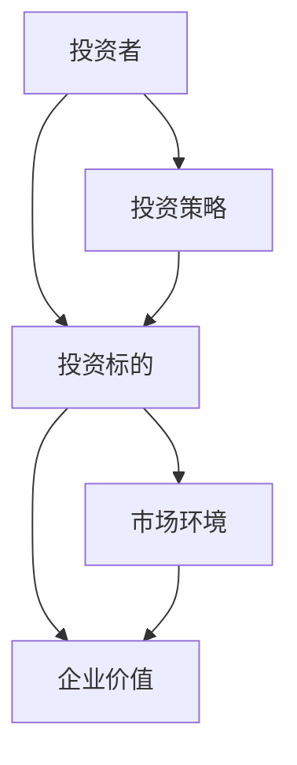
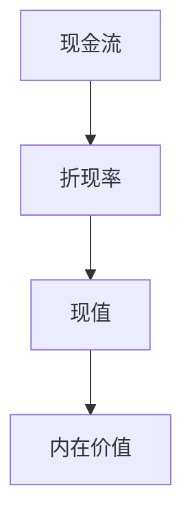
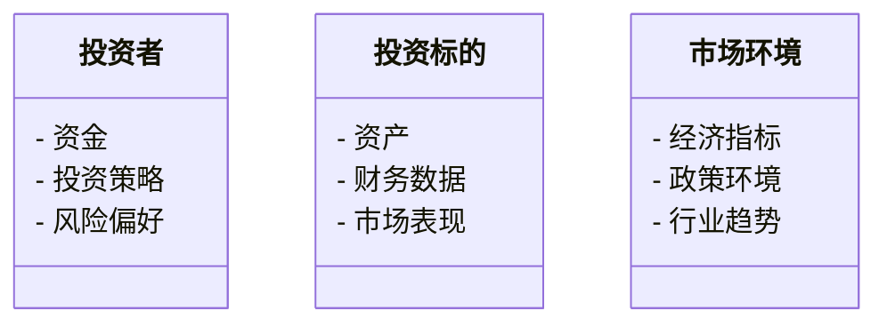
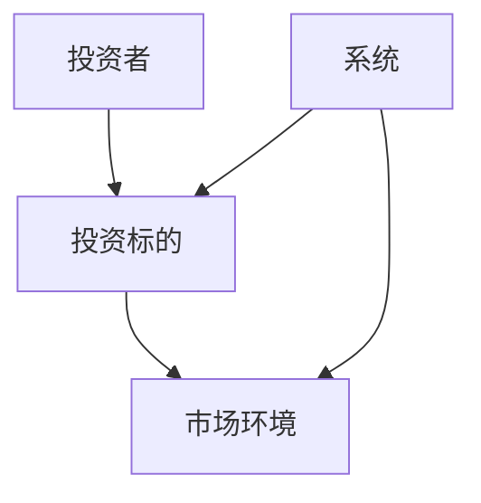
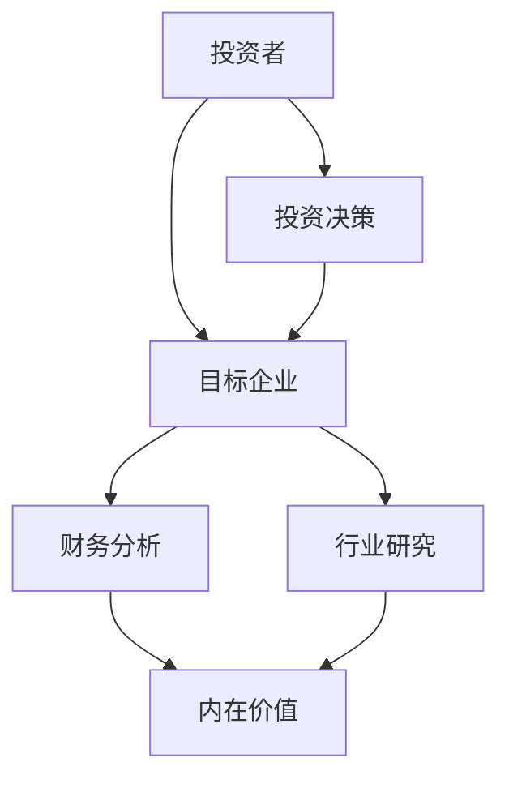

                 


# 玛丽·巴芙达的患者资本理论

> 关键词：患者资本理论，玛丽·巴芙达，长期投资，价值创造，风险管理，投资策略，系统架构

## 摘要

本文详细介绍了玛丽·巴芙达的患者资本理论，从理论背景到核心概念，再到算法原理、系统架构设计和项目实战，全面剖析了这一投资理论的深刻内涵。通过详细的图表和代码示例，结合实际案例，帮助读者理解如何在实际投资中应用这一理论，并提供了一些实用的最佳实践建议。

---

# 第一部分：患者资本理论的背景与核心概念

## 第1章：患者资本理论的背景与发展

### 1.1 投资理论的历史演变

投资者在选择投资策略时，往往面临短期波动与长期价值之间的权衡。传统投资理论多关注市场波动和技术分析，而玛丽·巴芙达提出的患者资本理论则强调通过深入研究和长期持有优质资产来实现价值增长。这一理论颠覆了传统的短期投资观念，为投资者提供了全新的视角。

### 1.2 玛丽·巴芙达的贡献与影响

玛丽·巴芙达以其独特的方法论闻名，她主张投资者应像企业所有者一样思考，关注企业的基本面和长期发展潜力。她的理论不仅改变了投资者的思维方式，还推动了价值投资理念的普及，对现代投资理论的发展产生了深远影响。

### 1.3 患者资本理论的核心观点

患者资本理论的核心观点包括：
1. 长期投资的重要性：通过持有优质资产，投资者能够抵御短期市场波动，实现长期收益。
2. 价值创造的关键性：企业创造价值的能力是投资决策的核心考量因素。
3. 风险管理的必要性：通过分散投资和深入研究，降低投资风险，实现稳健收益。

---

## 第2章：患者资本理论的核心概念与联系

### 2.1 长期投资的原理

长期投资通过持有优质资产，能够在市场波动中实现价值增值。玛丽·巴芙达强调，投资者应选择那些具有强大竞争优势和持续盈利能力的企业进行投资。通过长期持有，投资者能够获得企业的复利效应，从而实现财富的稳步增长。

### 2.2 价值创造的机制

价值创造是患者资本理论的核心概念之一。企业通过提高利润率、扩大市场份额、优化管理等方式创造价值，这些因素直接关系到企业的内在价值和投资回报。投资者需要深入分析企业的财务状况、行业地位和管理团队，才能准确评估其价值创造能力。

### 2.3 风险管理的核心思想

患者资本理论强调风险管理的重要性。通过分散投资、严格筛选投资标的以及持续监控市场环境，投资者可以有效降低投资风险。玛丽·巴芙达认为，风险管理不仅是控制损失的工具，更是实现稳健投资回报的关键因素。

---

## 第3章：患者资本理论的核心概念对比

### 3.1 核心概念属性对比表

| 概念       | 时间跨度 | 资金投入 | 风险承受 |
|------------|----------|----------|----------|
| 长期投资    | 长期     | 高       | 较高     |
| 价值创造    | 短期     | 中       | 较低     |
| 风险管理    | 短期     | 低       | 较低     |

### 3.2 ER实体关系图

以下是患者资本理论中的核心实体关系图：



---

## 第4章：患者资本理论的算法原理

### 4.1 巴氏估值模型

巴氏估值模型是一种用于评估企业内在价值的工具。其基本原理是通过折现现金流的方法计算企业的现值。以下是巴氏估值模型的流程图：



### 4.2 巴氏估值模型代码实现

以下是一个简单的巴氏估值模型的Python代码示例：

```python
def calculate_intrinsic_value(cash_flow, discount_rate):
    present_value = cash_flow / (1 + discount_rate)
    return present_value

cash_flow = 1000
discount_rate = 0.05
intrinsic_value = calculate_intrinsic_value(cash_flow, discount_rate)
print(f"内在价值: {intrinsic_value}")
```

### 4.3 数学模型与公式

巴氏估值模型的数学表达式如下：

$$\text{内在价值} = \sum_{t=1}^{n} \frac{\text{现金流}_t}{(1 + r)^t}$$

其中，$r$ 是折现率，$n$ 是时间跨度。

---

## 第5章：患者资本理论的系统架构设计

### 5.1 系统功能设计

以下是患者资本理论的系统功能设计：



### 5.2 系统架构图

以下是系统的总体架构图：



---

## 第6章：患者资本理论的项目实战

### 6.1 环境安装

以下是项目所需的环境安装代码：

```bash
pip install numpy pandas
```

### 6.2 核心代码实现

以下是一个简单的巴氏估值模型的Python代码实现：

```python
import numpy as np
import pandas as pd

def calculate_intrinsic_value(cash_flows, discount_rate):
    return np.sum(cash_flows / (1 + discount_rate))

cash_flows = [1000, 1200, 1500]
discount_rate = 0.05
intrinsic_value = calculate_intrinsic_value(cash_flows, discount_rate)
print(f"内在价值: {intrinsic_value}")
```

### 6.3 实际案例分析

以下是患者资本理论在实际投资中的应用案例：



---

## 第7章：最佳实践与小结

### 7.1 最佳实践

- **长期持有**：坚持长期投资，避免频繁交易。
- **深入研究**：全面分析企业的财务状况和行业地位。
- **风险管理**：通过分散投资和严格筛选降低风险。

### 7.2 小结

患者资本理论通过强调长期投资、价值创造和风险管理，为投资者提供了一种稳健的投资方法。通过系统的架构设计和实际案例分析，读者可以更好地理解这一理论的应用。

### 7.3 注意事项

- 投资者需根据自身风险偏好和资金状况调整投资策略。
- 市场环境的变化可能会影响投资决策，需保持灵活性。

### 7.4 拓展阅读

- 《The Intelligent Investor》 by Benjamin Graham
- 《价值投资实战》 by 玛丽·巴芙达

---

通过以上目录结构，您可以逐步深入理解玛丽·巴芙达的患者资本理论，并在实际投资中加以应用。

