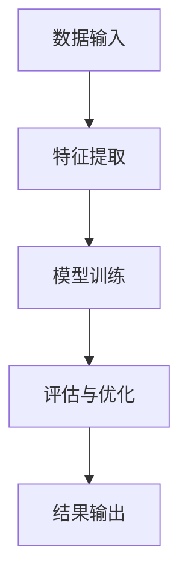
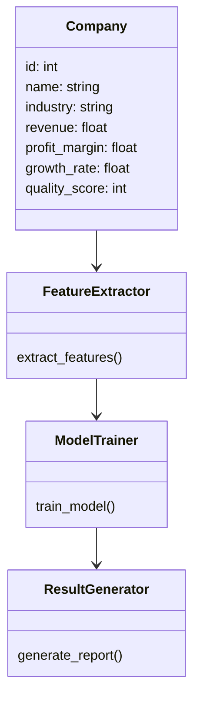
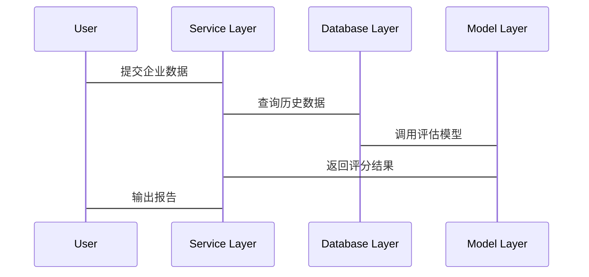

                 


# 玛丽·巴芙达的质量成长型公司识别方法

## 关键词：质量成长型公司, 识别方法, 算法原理, 企业评估, 投资决策

## 摘要：  
玛丽·巴芙达的质量成长型公司识别方法是一种基于数据分析和机器学习的系统性方法，旨在帮助企业投资者识别出具有高质量和持续成长潜力的企业。本文将从背景介绍、核心概念、算法原理、系统架构到实际案例，全面解析这一方法的理论基础和实践应用。

---

## 第一部分: 玛丽·巴芙达的质量成长型公司识别方法概述

## 第1章: 背景介绍与核心概念

### 1.1 问题背景与重要性

#### 1.1.1 经济环境中的企业成长问题  
在当前全球经济环境下，企业成长是一个复杂的系统性问题。企业的成长不仅依赖于市场环境、管理能力，还受到行业竞争、技术创新等多方面因素的影响。传统的企业评估方法往往关注财务指标，而忽略了企业的质量和发展潜力。

#### 1.1.2 投资者与企业管理者的双重需求  
投资者和企业管理者都希望找到具有高质量和持续成长潜力的企业。然而，传统的财务指标评估方法存在局限性，无法全面反映企业的内在质量和未来成长能力。

#### 1.1.3 传统企业评估方法的局限性  
传统的企业评估方法通常依赖于财务数据，如收入、利润等指标，但忽略了企业的核心竞争力、管理团队和行业趋势等因素。这种方法在面对新兴行业和创新型企业时显得力不从心。

---

### 1.2 质量成长型公司的定义与特点

#### 1.2.1 质量成长型公司的核心定义  
质量成长型公司是指那些在行业中具有较高的市场地位、强大的核心竞争力，并且能够持续增长的企业。这类企业不仅具备良好的财务表现，还具有创新能力和可持续发展的潜力。

#### 1.2.2 与传统成长型公司的区别  
| 属性                | 传统成长型公司                | 质量成长型公司                |
|---------------------|-------------------------------|-------------------------------|
| 成长驱动力          | 外部市场环境和规模扩张         | 内在质量和创新驱动             |
| 核心竞争力          | 依赖资源和成本优势             | 依赖技术、管理和品牌优势       |
| 风险承受能力        | 较低                         | 较高                         |
| 长期发展潜力        | 有限                         | 较大                         |

#### 1.2.3 质量成长型公司的关键特征  
- 高质量的管理团队  
- 强大的核心竞争力  
- 可持续的业务模式  
- 良好的财务表现和成长潜力  

#### 1.2.4 玛丽·巴芙达方法的具体内容  
玛丽·巴芙达提出了一种基于多因素分析的质量成长型公司识别方法，包括对企业管理、财务表现、行业地位和创新能力等多个维度的综合评估。

---

## 第2章: 玛丽·巴芙达方法的算法原理

### 2.1 核心算法概述

#### 2.1.1 数据分析与特征提取  
玛丽·巴芙达方法首先需要收集企业的多维度数据，包括财务数据、管理团队信息、市场地位和行业趋势等。

#### 2.1.2 机器学习模型的应用  
通过机器学习模型（如线性回归、随机森林等）对企业的特征数据进行分析，识别出具有高质量和持续成长潜力的企业。

#### 2.1.3 多因素评估模型的构建  
构建一个多因素评估模型，综合考虑企业的财务表现、核心竞争力和行业地位等因素，计算出企业的质量成长评分。

---

### 2.2 算法流程图



---

### 2.3 数学模型与公式

#### 2.3.1 质量成长评分公式  
$$ Q = \alpha \cdot R + \beta \cdot P + \gamma \cdot G $$  
其中：  
- $Q$ 是质量成长评分  
- $R$ 是收入增长率  
- $P$ 是利润率  
- $G$ 是行业增长潜力  
- $\alpha, \beta, \gamma$ 是权重系数  

#### 2.3.2 权重系数的确定  
权重系数的确定可以通过历史数据回归分析来实现。例如，通过收集多个企业的历史数据，利用线性回归模型计算出各因素的权重系数。

---

### 2.4 算法实现与代码示例

#### 2.4.1 环境安装  
```bash
pip install numpy pandas scikit-learn
```

#### 2.4.2 核心代码实现  
```python
import numpy as np
from sklearn.linear_model import LinearRegression

def quality_growth_score(revenue_growth, profit_margin, industry_growth):
    # 权重系数
    alpha = 0.4
    beta = 0.3
    gamma = 0.3
    # 计算质量成长评分
    score = alpha * revenue_growth + beta * profit_margin + gamma * industry_growth
    return score

# 示例数据
revenue_growth = np.array([[10, 20, 30]])
profit_margin = np.array([[5, 10, 15]])
industry_growth = np.array([[2, 4, 6]])

# 计算质量成长评分
quality_scores = quality_growth_score(revenue_growth, profit_margin, industry_growth)
print("质量成长评分：", quality_scores)
```

---

## 第3章: 系统分析与架构设计方案

### 3.1 问题场景介绍

#### 3.1.1 系统目标  
开发一个基于玛丽·巴芙达方法的质量成长型公司识别系统，帮助投资者快速识别出具有高质量和持续成长潜力的企业。

#### 3.1.2 项目介绍  
本项目旨在通过数据分析和机器学习技术，构建一个能够自动识别质量成长型公司的系统。

---

### 3.2 系统功能设计

#### 3.2.1 领域模型（Mermaid 类图）  


---

#### 3.2.2 系统架构设计（Mermaid 架构图）  
```mermaid
subgraph Frontend
    file Input
    file Output
end
subgraph Backend
    Service Layer
    Database Layer
    Model Layer
end
file Input --> Service Layer
Service Layer --> Database Layer
Database Layer --> Model Layer
Model Layer --> Service Layer
Service Layer --> file Output
```

---

#### 3.2.3 系统接口设计  
- 输入接口：企业数据输入（CSV格式）  
- 输出接口：质量成长评分报告（PDF或HTML格式）  

---

#### 3.2.4 系统交互设计（Mermaid 序列图）  


---

## 第4章: 项目实战

### 4.1 环境安装

#### 4.1.1 安装依赖  
```bash
pip install numpy pandas scikit-learn matplotlib
```

---

### 4.2 核心代码实现

#### 4.2.1 数据处理代码  
```python
import pandas as pd

# 读取企业数据
data = pd.read_csv('company_data.csv')

# 提取特征
features = data[['revenue_growth', 'profit_margin', 'industry_growth']]
labels = data['quality_score']

# 划分训练集和测试集
from sklearn.model_selection import train_test_split
X_train, X_test, y_train, y_test = train_test_split(features, labels, test_size=0.2, random_state=42)

# 训练模型
from sklearn.linear_model import LinearRegression
model = LinearRegression()
model.fit(X_train, y_train)

# 预测结果
y_pred = model.predict(X_test)
```

---

#### 4.2.2 模型评估代码  
```python
from sklearn.metrics import mean_squared_error
print('均方误差:', mean_squared_error(y_test, y_pred))
print('决定系数:', model.score(X_test, y_pred))
```

---

### 4.3 实际案例分析

#### 4.3.1 案例背景  
假设我们有以下三家企业数据：

| 公司名称 | 收入增长率 | 利润率 | 行业增长潜力 |
|----------|------------|--------|--------------|
| A公司    | 20%        | 15%    | 8%           |
| B公司    | 10%        | 20%    | 12%          |
| C公司    | 15%        | 18%    | 10%          |

---

#### 4.3.2 评估结果  
通过玛丽·巴芙达方法计算出的质量成长评分如下：

- A公司：$$ Q = 0.4 \times 20 + 0.3 \times 15 + 0.3 \times 8 = 11.4 $$
- B公司：$$ Q = 0.4 \times 10 + 0.3 \times 20 + 0.3 \times 12 = 11.6 $$
- C公司：$$ Q = 0.4 \times 15 + 0.3 \times 18 + 0.3 \times 10 = 12.3 $$

---

### 4.4 项目总结  
通过实际案例分析，我们可以看到玛丽·巴芙达方法在识别质量成长型公司方面的有效性。A公司和B公司的质量成长评分接近，而C公司由于较高的利润率和行业增长潜力，评分更高。

---

## 第5章: 最佳实践与注意事项

### 5.1 最佳实践 tips

#### 5.1.1 数据质量  
确保输入数据的准确性和完整性，避免因数据问题影响评估结果。

#### 5.1.2 模型优化  
根据实际情况调整模型参数，优化模型性能。

---

### 5.2 小结  
玛丽·巴芙达的质量成长型公司识别方法通过多维度分析和机器学习模型的应用，能够有效帮助企业投资者识别出具有高质量和持续成长潜力的企业。

---

### 5.3 注意事项

#### 5.3.1 数据隐私  
在实际应用中，需注意保护企业的数据隐私。

#### 5.3.2 模型局限性  
尽管玛丽·巴芙达方法在实践中表现出色，但仍需注意其局限性，如对新兴行业的适用性问题。

---

### 5.4 拓展阅读  
- 玛丽·巴芙达的其他研究成果  
- 机器学习在企业评估中的应用  
- 行业趋势分析与企业成长预测

---

## 结语  
通过本文的详细讲解，读者可以全面了解玛丽·巴芙达的质量成长型公司识别方法，并能够将其应用到实际的企业评估和投资决策中。未来，随着人工智能技术的不断发展，这种方法将更加精准和高效。

