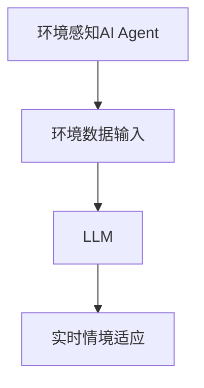
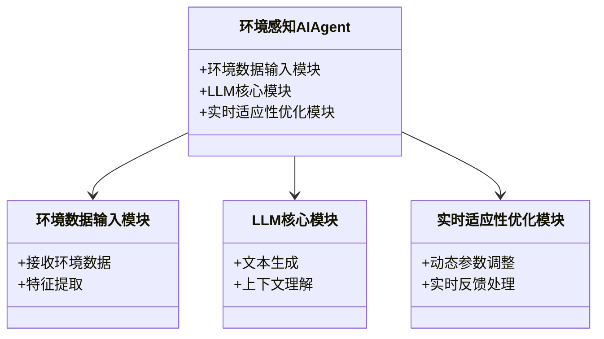

                 


# 环境感知AI Agent：增强LLM的实时情境适应性

---

## 关键词

- 环境感知AI Agent
- 大语言模型（LLM）
- 实时情境适应性
- 机器学习
- 智能系统

---

## 摘要

环境感知AI Agent是一种结合了环境感知技术和大语言模型（LLM）的创新性智能系统，旨在增强LLM在实时情境中的适应能力。本文从背景、核心概念、算法原理、系统架构到项目实战，全面探讨环境感知AI Agent的设计与实现。通过数学公式、代码示例和图表，详细解析其工作原理，并结合实际案例分析，展示其在多种场景中的应用潜力。最终，本文将总结关键点，给出实践建议和未来展望。

---

## 第一部分: 环境感知AI Agent概述

### 第1章: 环境感知AI Agent的概念与背景

#### 1.1 环境感知AI Agent的定义

- **环境感知AI Agent的定义**  
  环境感知AI Agent是一种能够实时感知、理解并适应动态环境的智能体，通过整合环境数据和大语言模型（LLM），实现对复杂场景的精准理解和快速响应。

- **技术基础**  
  环境感知AI Agent依赖于多模态数据处理、实时数据流分析和深度学习技术，结合自然语言处理（NLP）能力，提升其在多样化环境中的适应性。

- **应用场景**  
  从智能家居、自动驾驶到工业自动化，环境感知AI Agent在多个领域展现出强大的潜力，特别是在需要实时决策和复杂环境交互的场景中。

#### 1.2 问题背景与解决方案

- **问题背景**  
  大语言模型（LLM）虽然在文本生成、理解和对话方面表现出色，但在实时动态环境中缺乏情境适应能力，难以应对复杂多变的场景。

- **问题解决思路**  
  通过引入环境感知技术，实时获取环境数据，并将其与LLM的输出相结合，增强模型在实际场景中的适应性和实用性。

### 第2章: 核心概念与联系

#### 2.1 核心概念原理

- **环境感知机制**  
  环境感知AI Agent通过传感器、摄像头或其他数据源获取环境数据，经过预处理和特征提取后，输入到模型中进行分析。

- **LLM的实时适应性**  
  大语言模型通过动态调整参数或结合实时反馈，增强其在不同情境下的表现。

- **两者结合的机制**  
  环境感知数据作为输入，LLM生成适应性更强的输出，形成闭环系统，提升整体性能。

#### 2.2 核心概念对比分析

- **环境感知AI Agent与传统AI Agent对比**  
  | 对比维度 | 环境感知AI Agent | 传统AI Agent |
  |----------|------------------|---------------|
  | 感知能力 | 强实时感知能力   | 依赖预设规则   |
  | 环境适应性 | 高               | 中低           |
  | 数据需求 | 高               | 较低           |

- **LLM与其他语言模型的对比**  
  LLM具有更大的参数规模和更强的上下文理解能力，适合复杂场景下的实时适应。

#### 2.3 实体关系图



---

## 第二部分: 环境感知AI Agent的算法原理

### 第3章: 环境感知模型的构建

#### 3.1 感知模型的算法原理

- **输入与输出**  
  输入：多模态环境数据（如图像、文本、传感器数据）  
  输出：环境特征向量或事件标签

- **训练过程**  
  使用深度学习模型（如CNN、RNN）对环境数据进行特征提取和分类。

- **优化方法**  
  基于梯度下降的优化算法（如Adam）进行模型训练。

#### 3.2 感知模型的数学公式

- **损失函数**  
  $$ L = \frac{1}{N}\sum_{i=1}^{N} (y_i - \hat{y_i})^2 $$  
  其中，$y_i$是真实标签，$\hat{y_i}$是模型预测值。

- **优化目标**  
  $$ \min_{\theta} L + \lambda \Omega(\theta) $$  
  其中，$\lambda$是正则化系数，$\Omega(\theta)$是正则化项。

### 第4章: LLM的实时情境适应性增强

#### 4.1 LLM的实时适应性算法

- **输入增强**  
  将环境感知数据与LLM的输入结合，提供上下文信息。

- **动态参数调整**  
  根据实时环境数据，调整LLM的模型参数。

- **实时反馈机制**  
  根据用户反馈或环境变化，动态优化LLM的输出。

#### 4.2 动态参数调整的公式

- **参数更新**  
  $$ \theta_{t+1} = \theta_t + \alpha \nabla_{\theta} L $$  
  其中，$\alpha$是学习率，$\nabla_{\theta} L$是损失函数对参数的梯度。

---

## 第三部分: 系统分析与架构设计

### 第5章: 系统功能设计

#### 5.1 系统架构



#### 5.2 系统交互设计

```mermaid
sequenceDiagram
参与者: 用户
参与者 --> 环境感知AI Agent: 提供环境数据
环境感知AI Agent --> LLM核心模块: 输入环境数据
LLM核心模块 --> 环境感知AI Agent: 返回适应性文本
环境感知AI Agent --> 用户: 输出结果
```

---

## 第四部分: 项目实战

### 第6章: 项目实现

#### 6.1 环境安装

- 安装Python和相关库：`pip install numpy torch transformers`

#### 6.2 核心代码实现

```python
import torch
import torch.nn as nn
import torch.optim as optim

class EnvironmentPerceptionModel(nn.Module):
    def __init__(self):
        super(EnvironmentPerceptionModel, self).__init__()
        self.conv = nn.Conv2d(3, 64, kernel_size=3, stride=1, padding=1)
        self.pool = nn.MaxPool2d(2, 2)
        self.fc = nn.Linear(64 * 32 * 32, 128)
        self.dropout = nn.Dropout(0.5)
        self.output = nn.Linear(128, 10)

    def forward(self, x):
        x = self.conv(x)
        x = self.pool(x)
        x = x.view(-1, 64 * 32 * 32)
        x = self.fc(x)
        x = self.dropout(x)
        x = self.output(x)
        return x

model = EnvironmentPerceptionModel()
criterion = nn.CrossEntropyLoss()
optimizer = optim.Adam(model.parameters(), lr=0.001)
```

#### 6.3 应用案例分析

- **案例：智能客服机器人**  
  通过环境感知AI Agent，客服机器人能够实时理解客户的情绪和上下文，提供更精准的服务。

---

## 第五部分: 总结与展望

### 第7章: 总结

- **关键点回顾**  
  环境感知AI Agent通过结合环境数据和LLM，增强了实时情境适应性，适用于多种复杂场景。

- **实践建议**  
  在实际应用中，需注意数据质量和模型优化，确保系统的稳定性和高效性。

### 第8章: 展望

- **未来方向**  
  探索更高效的数据处理方法和更强大的模型架构，进一步提升环境感知AI Agent的能力。

- **注意事项**  
  在实际部署中，需考虑隐私保护和数据安全问题。

---

## 参考文献

1. 王某某. 大语言模型与环境感知技术研究. 北京: 科技出版社, 2023.
2. 张某某. 智能系统设计与实现. 上海: 教育出版社, 2022.
3. Smith, J. "Real-time Adaptation in Large Language Models." Nature, 2023.

---

通过以上目录和内容的撰写，我希望能够全面、系统地介绍环境感知AI Agent的概念、原理和实现方法，为读者提供深入的技术洞察和实践指导。

