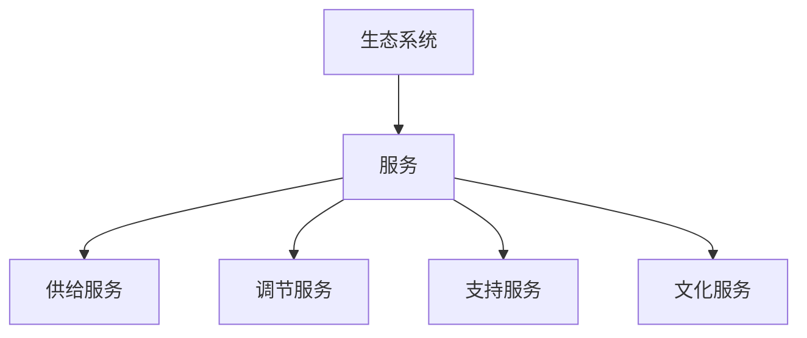
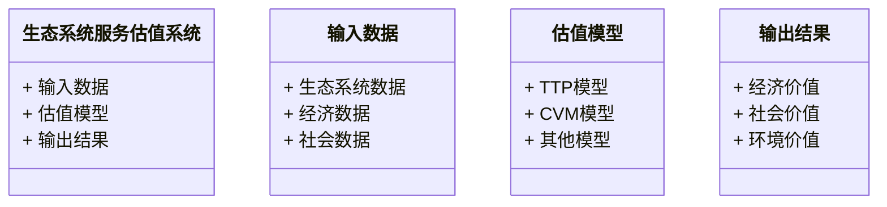
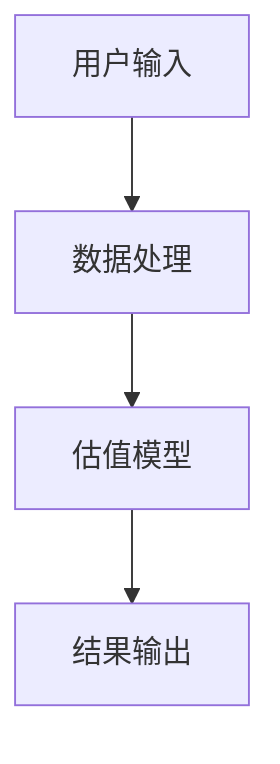

                 


# 生态系统服务估值方法在投资决策中的应用

> 关键词：生态系统服务、估值方法、投资决策、经济价值、可持续投资、环境影响评估、投资风险

> 摘要：本文系统地探讨了生态系统服务估值方法在投资决策中的应用。通过分析生态系统服务的分类、估值方法的原理及其在投资决策中的重要性，本文旨在为投资者提供科学的决策支持。文章首先介绍了生态系统服务的基本概念和分类，然后详细阐述了生态系统服务的经济价值及其与投资决策的关系。接着，重点分析了生态系统服务估值的核心概念与联系，包括供给服务、调节服务、支持服务和文化服务的特征对比。通过具体的数学模型和算法原理，本文详细讲解了生态系统服务的估值方法，如损失转移法（TTP）和条件价值评估法（CVM）。最后，结合实际案例，文章探讨了生态系统服务估值在投资决策中的应用场景，如农业、林业和水资源管理，并提出了未来研究的方向。

---

## 第一部分：生态系统服务估值方法概述

### 第1章：生态系统服务的定义与分类

#### 1.1 生态系统服务的基本概念

##### 1.1.1 生态系统服务的定义
生态系统服务是指自然生态系统提供的各种直接和间接的效益，包括供给服务（如清洁水和食物）、调节服务（如气候调节和病虫害控制）、支持服务（如养分循环和水文调节）以及文化服务（如旅游和精神满足）。这些服务对人类的生存和发展具有重要意义。

##### 1.1.2 生态系统服务的核心属性
- **公共性**：生态系统服务通常具有公共品的性质，容易导致“搭便车”问题。
- **外部性**：生态系统的效益往往溢出到外部，难以通过市场机制完全体现。
- **不可分割性**：生态系统服务的提供依赖于整个生态系统的完整性，无法单独分割。

##### 1.1.3 生态系统服务的边界与外延
生态系统服务的边界通常由生态系统的范围和功能决定，外延则涉及服务的受益范围和时间跨度。例如，森林的调节服务可能影响全球气候，而供给服务如木材则局限于特定区域。

#### 1.2 生态系统服务的分类

##### 1.2.1 供给服务
供给服务是指生态系统直接提供给人类的物质和能量，例如：
- 清洁水
- 食物（如鱼、水果）
- 纤维和木材

##### 1.2.2 调节服务
调节服务是指生态系统对环境的调节功能，例如：
- 气候调节（通过碳汇吸收CO₂）
- 水文调节（如洪水控制和水源涵养）
- 病虫害控制（如自然天敌的维持）

##### 1.2.3 支持服务
支持服务是生态系统维持其他服务的基础功能，例如：
- 养分循环（如氮循环）
- 土壤形成与保育
- 植物光合作用

##### 1.2.4 文化服务
文化服务是指生态系统对人类文化和精神需求的满足，例如：
- 旅游和休闲
- 灵性满足
- 科学研究

#### 1.3 生态系统服务的经济价值

##### 1.3.1 生态系统服务的非市场价值
非市场价值是指无法通过市场交易直接衡量的效益，例如：
- 生态系统的存在价值（即使人类不直接使用）
- 科技研发的价值

##### 1.3.2 生态系统服务的市场价值
市场价值是指可以通过市场交易直接体现的效益，例如：
- 农产品
- 木材

##### 1.3.3 生态系统服务与投资决策的关系
生态系统服务的经济价值直接影响投资决策。例如：
- 投资于生态保护可以降低环境风险
- 生态系统的健康状况影响企业的长期收益

#### 1.4 本章小结
本章详细介绍了生态系统服务的基本概念、分类及其经济价值，为后续的估值方法奠定了基础。

---

### 第2章：生态系统服务估值方法的背景与意义

#### 2.1 投资决策中的环境因素

##### 2.1.1 环境因素对投资决策的影响
环境因素可能影响企业的生产成本、市场需求和政策风险。例如，环境污染可能导致企业罚款，而良好的生态环境可以提升企业形象。

##### 2.1.2 生态系统服务在投资中的重要性
生态系统服务可以降低投资风险，提高投资回报。例如：
- 农业投资依赖于健康的土壤和水资源
- 林业投资依赖于生态系统的调节功能

#### 2.2 传统投资决策的局限性

##### 2.2.1 传统投资决策中对环境因素的忽视
传统投资决策往往忽略环境因素的长期影响，导致决策短视。

##### 2.2.2 环境因素对投资风险的影响
忽视环境因素可能导致投资失败。例如，过度开发可能导致生态系统崩溃，影响企业生存。

#### 2.3 引入生态系统服务估值的必要性

##### 2.3.1 通过生态系统服务估值优化投资决策
生态系统服务估值可以帮助投资者全面评估项目的经济价值。

##### 2.3.2 生态系统服务估值在可持续投资中的作用
可持续投资需要考虑环境、社会和治理（ESG）因素，而生态系统服务估值是其中的重要组成部分。

#### 2.4 本章小结
本章分析了传统投资决策的局限性，强调了引入生态系统服务估值的必要性。

---

## 第二部分：生态系统服务估值方法的核心概念与联系

### 第3章：生态系统服务估值的核心概念

#### 3.1 生态系统服务估值的原理

##### 3.1.1 估值的基本原理
生态系统服务的估值需要考虑其直接和间接效益。例如，森林的调节服务（如碳汇）可以通过市场机制进行估值。

##### 3.1.2 生态系统服务的量化方法
常用的量化方法包括：
- 损失转移法（TTP）
- 条件价值评估法（CVM）
- 帕累托最优评估法

#### 3.2 核心概念的属性特征对比

##### 3.2.1 供给服务的特征
- 直接效益
- 可市场化的部分

##### 3.2.2 调节服务的特征
- 外部性
- 难以市场化的部分

##### 3.2.3 支持服务的特征
- 基础性
- 长期性

##### 3.2.4 文化服务的特征
- 多样性
- 非经济性

#### 3.3 实体关系图（ER图）



#### 3.4 本章小结
本章通过对比分析，明确了生态系统服务各类别的特征及其关系。

---

### 第4章：生态系统服务估值的算法原理

#### 4.1 常见的生态系统服务估值算法

##### 4.1.1 损失转移法（TTP）

###### TTP模型的基本原理
损失转移法假设如果没有生态系统服务，社会将承担更大的损失。例如，如果没有森林调节气候，企业可能面临更高的能源成本。

###### TTP模型的数学表达
$$
\text{总成本} = \text{基本成本} + \text{生态损失}
$$

##### 4.1.2 条件价值评估法（CVM）

###### CVM的基本原理
条件价值评估法通过调查问卷估计人们对生态系统服务的支付意愿。

###### CVM的数学表达
$$
\text{支付意愿} = \beta_0 + \beta_1 x_1 + \beta_2 x_2 + \cdots + \beta_n x_n
$$

其中，\( x_i \) 是影响支付意愿的因素，\( \beta_i \) 是回归系数。

#### 4.2 生态系统服务估值的系统架构

##### 4.2.1 系统功能设计



##### 4.2.2 系统架构设计



#### 4.3 本章小结
本章详细介绍了生态系统服务估值的算法原理和系统架构，为实际应用提供了理论基础。

---

## 第三部分：生态系统服务估值方法的实际应用

### 第5章：生态系统服务估值在投资决策中的应用

#### 5.1 农业投资中的应用

##### 5.1.1 农业生态系统服务的估值
农业生态系统服务包括土壤保育、授粉等。例如，蜜蜂的授粉服务可以显著提高农产品产量。

##### 5.1.2 农业投资中的具体应用
投资者可以通过生态系统服务估值优化农业投资决策。例如，选择投资于有机农业可以提高生态系统的健康状况，从而降低环境风险。

#### 5.2 林业投资中的应用

##### 5.2.1 林业生态系统服务的估值
林业生态系统服务包括碳汇、水源涵养等。例如，森林的碳汇功能可以抵消企业的碳排放。

##### 5.2.2 林业投资中的具体应用
投资者可以通过生态系统服务估值选择投资于可持续林业项目，降低环境风险。

#### 5.3 水资源管理中的应用

##### 5.3.1 水资源生态系统服务的估值
水资源生态系统服务包括水净化、洪水控制等。例如，湿地的水净化功能可以降低企业的水处理成本。

##### 5.3.2 水资源管理中的具体应用
投资者可以通过生态系统服务估值优化水资源管理决策，降低投资风险。

#### 5.4 本章小结
本章通过具体案例分析，展示了生态系统服务估值在不同投资领域中的应用。

---

### 第6章：生态系统服务估值方法的未来展望

#### 6.1 未来研究方向

##### 6.1.1 新方法的应用
未来可以探索更多生态系统服务估值的方法，例如机器学习算法。

##### 6.1.2 技术创新
技术进步可以提高生态系统服务估值的准确性和效率。

#### 6.2 拓展与挑战

##### 6.2.1 拓展领域
生态系统服务估值可以扩展到更多领域，例如城市规划和能源投资。

##### 6.2.2 挑战与应对
生态系统服务估值面临数据不足和模型复杂等问题，需要进一步研究和创新。

#### 6.3 本章小结
本章展望了生态系统服务估值方法的未来发展方向，强调了技术创新和应用拓展的重要性。

---

## 附录：生态系统服务估值方法的Python实现

#### 附录A：TTP模型的Python实现

```python
import numpy as np

def ttp_model(basic_cost, ecological_loss):
    total_cost = basic_cost + ecological_loss
    return total_cost

# 示例数据
basic_cost = 100
ecological_loss = 20

result = ttp_model(basic_cost, ecological_loss)
print("总成本为：", result)
```

#### 附录B：CVM模型的Python实现

```python
import statsmodels.api as sm

# 数据准备
X = np.array([[1, 2], [2, 3], [3, 4]])
y = np.array([5, 6, 7])

# 回归分析
model = sm.OLS(y, X)
results = model.fit()

# 输出结果
print(results.summary())
```

---

## 结论

生态系统服务估值方法在投资决策中的应用具有重要意义。通过科学的估值方法，投资者可以更全面地评估项目的经济价值，降低投资风险，实现可持续发展。未来，随着技术的进步和研究的深入，生态系统服务估值方法将更加精准和多样化，为投资决策提供更有力的支持。

--- 

**关键词：** 生态系统服务、估值方法、投资决策、经济价值、可持续投资、环境影响评估、投资风险

**摘要：** 本文系统地探讨了生态系统服务估值方法在投资决策中的应用。通过分析生态系统服务的分类、估值方法的原理及其在投资决策中的重要性，本文旨在为投资者提供科学的决策支持。文章首先介绍了生态系统服务的基本概念和分类，然后详细阐述了生态系统服务的经济价值及其与投资决策的关系。接着，重点分析了生态系统服务估值的核心概念与联系，包括供给服务、调节服务、支持服务和文化服务的特征对比。通过具体的数学模型和算法原理，本文详细讲解了生态系统服务的估值方法，如损失转移法（TTP）和条件价值评估法（CVM）。最后，结合实际案例，文章探讨了生态系统服务估值在投资决策中的应用场景，如农业、林业和水资源管理，并提出了未来研究的方向。

