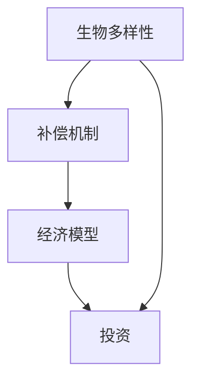
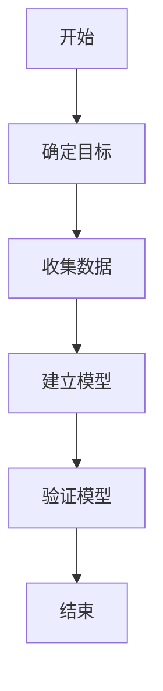
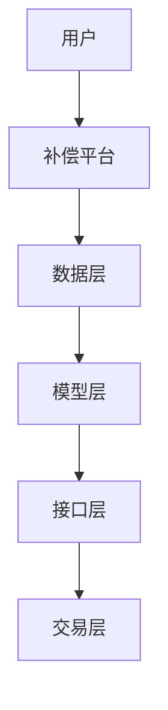

                 


# 生物多样性补偿机制的经济模型与投资

> 关键词：生物多样性补偿机制、经济模型、投资、生态经济学、可持续发展

> 摘要：本文探讨了生物多样性补偿机制的经济模型与投资策略，通过分析其背景、核心概念、算法原理、系统架构以及项目实战，提供了详细的经济分析和实际案例，为投资决策提供科学依据。

---

## 第一部分: 生物多样性补偿机制的背景与概念

### 第1章: 生物多样性与补偿机制的概述

#### 1.1 生物多样性的概念与价值
生物多样性是指地球上生物的多样性和它们的遗传、生态和进化上的差异。它不仅对生态系统的稳定性和功能至关重要，还为人类提供了食物、药物、工业原料等资源。生物多样性具有生态价值、经济价值和社会价值。

#### 1.2 补偿机制的定义与目标
补偿机制是一种通过经济手段来抵消因人类活动对生物多样性造成的负面影响的机制。其目标是保护和恢复生态系统，促进可持续发展，同时激励各方参与生态保护。

#### 1.3 生物多样性补偿机制的必要性
由于人类活动如砍伐森林、开垦土地、工业排放等，导致生物多样性急剧下降。补偿机制能够通过经济激励，引导企业和个人减少对环境的破坏，促进生态恢复。

---

### 第2章: 生物多样性补偿机制的核心概念与联系

#### 2.1 核心概念的原理
生物多样性补偿机制基于生态经济学的原理，通过建立数学模型，评估生物多样性的价值，并设计相应的经济激励措施。例如，碳汇项目通过计算森林的碳储量，确定补偿金额。

#### 2.2 核心概念的属性特征对比
| 概念       | 属性特征                     |
|------------|------------------------------|
| 生物多样性   | 多样性、复杂性、动态性       |
| 补偿机制     | 经济性、可操作性、激励性     |
| 经济模型     | 数量化、可计算性、可优化性   |

#### 2.3 ER实体关系图


---

## 第二部分: 生物多样性补偿机制的经济模型

### 第3章: 经济模型的原理与算法

#### 3.1 经济模型的原理
经济模型用于量化生物多样性的价值，评估补偿成本，并预测投资回报。例如，使用成本效益分析确定最优的保护措施。

#### 3.2 经济模型的数学公式
1. 生物多样性价值的计算公式：
   $$ V = \sum_{i=1}^{n} v_i $$
   其中，\( v_i \) 表示第 \( i \) 种生物的经济价值。

2. 补偿成本的计算公式：
   $$ C = \sum_{j=1}^{m} c_j $$
   其中，\( c_j \) 表示第 \( j \) 项保护措施的成本。

3. 投资回报率的计算公式：
   $$ ROI = \frac{(R - C)}{C} \times 100\% $$
   其中，\( R \) 是收入，\( C \) 是成本。

#### 3.3 算法流程图


---

### 第4章: 系统架构设计

#### 4.1 系统功能设计
系统包括数据采集、模型计算、交易管理等功能模块。

#### 4.2 系统架构图


#### 4.3 系统接口设计
1. 补偿平台接口：提供用户注册、登录功能。
2. 数据接口：与环境监测系统连接，获取实时数据。
3. 交易接口：处理补偿交易，记录交易信息。

---

## 第三部分: 项目实战与总结

### 第5章: 项目实战

#### 5.1 环境安装
需要安装Python、数据库和相关库，如Pandas、NumPy等。

#### 5.2 核心实现代码
```python
def calculate_compen

