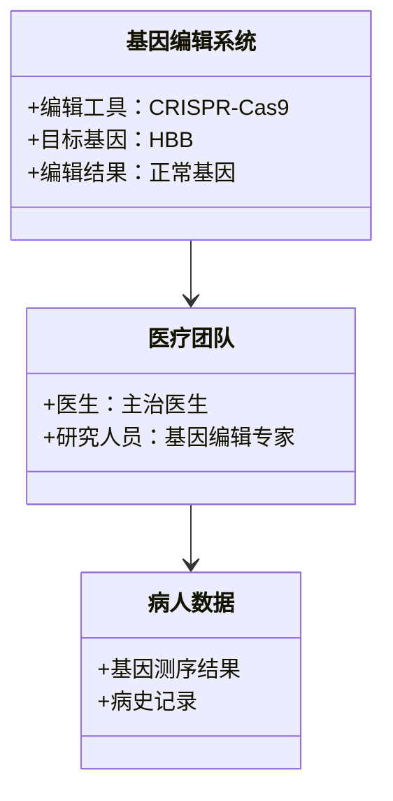
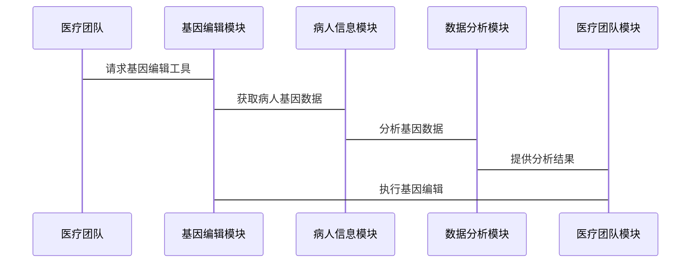

                 


# 生物技术进步带来的医疗健康投资主题

## 关键词：生物技术，医疗健康，投资主题，基因编辑，精准医疗，细胞治疗，人工智能

## 摘要：生物技术的迅速进步正在深刻改变医疗健康领域，并为投资者带来前所未有的机遇。本文将探讨生物技术在医疗健康中的应用，分析其对投资决策的影响，并结合实际案例，为投资者提供科学的决策依据。

---

# 第一部分：生物技术进步与医疗健康的背景介绍

## 第1章：生物技术与医疗健康的概述

### 1.1 生物技术的定义与历史发展

#### 1.1.1 生物技术的基本概念
生物技术是指利用生命科学知识和技术，通过工程学和信息技术手段，改造或重组生物体的基因结构，以获得具有特定功能的生物产品或服务。其核心领域包括基因编辑、细胞治疗、精准医疗和生物制药等。

#### 1.1.2 生物技术的历史演进
生物技术的发展经历了多个阶段：
1. **传统生物技术**：如酿酒、发酵和育种，已有数千年的历史。
2. **现代生物技术**：20世纪中叶，DNA双螺旋结构的发现推动了分子生物学的发展。
3. **基因编辑技术**：21世纪初，CRISPR-Cas9等技术的出现使基因编辑变得高效和精准。

#### 1.1.3 生物技术在医疗健康领域的应用现状
目前，生物技术在医疗健康中的应用主要集中在以下几个方面：
- **基因测序**：用于疾病诊断和个性化治疗。
- **基因编辑**：用于治疗遗传性疾病和癌症。
- **细胞治疗**：如CAR-T细胞疗法用于癌症治疗。
- **精准医疗**：基于患者基因信息制定个性化治疗方案。

### 1.2 医疗健康的定义与现状

#### 1.2.1 医疗健康的定义
医疗健康是指通过预防、诊断和治疗疾病，维护和促进人类健康的过程。它涵盖预防医学、临床医学和康复医学等多个领域。

#### 1.2.2 当前医疗健康行业的痛点
- **医疗资源分配不均**：优质医疗资源集中在大城市，基层医疗水平较低。
- **医疗成本高**：传统治疗方法费用昂贵，患者负担重。
- **疾病治愈率低**：许多疾病缺乏有效的治疗方法，尤其是罕见病和晚期癌症。

#### 1.2.3 生物技术如何解决医疗健康问题
生物技术的进步为医疗健康带来了革命性的变化：
- **提高治疗效果**：基因编辑和细胞治疗为难治性疾病提供了新方法。
- **降低医疗成本**：通过精准医疗减少不必要的治疗步骤和药物使用。
- **优化医疗资源**：生物技术帮助实现医疗资源的合理分配。

### 1.3 生物技术进步对医疗健康投资的影响

#### 1.3.1 生物技术进步与投资机会的关系
生物技术的进步催生了许多投资机会，尤其是在以下几个领域：
- **基因编辑技术**：用于治疗遗传性疾病和癌症。
- **精准医疗**：基于患者基因信息的个性化治疗方案。
- **细胞治疗**：如CAR-T细胞疗法在癌症治疗中的应用。

#### 1.3.2 投资者如何识别生物技术带来的投资机会
投资者可以通过以下方式识别生物技术的投资机会：
1. **关注技术前沿**：跟踪基因编辑、精准医疗和细胞治疗等领域的最新进展。
2. **分析市场需求**：评估患者数量和市场规模，选择具有广阔前景的技术。
3. **评估研发能力**：投资具有强大研发能力和良好团队的生物技术公司。

#### 1.3.3 生物技术进步对医疗健康行业的长期影响
生物技术的进步将推动医疗健康行业的深远变化：
- **治疗效果显著提高**：基因编辑和细胞治疗为难治性疾病提供新方法。
- **医疗成本降低**：精准医疗和基因测序技术使治疗更加高效和经济。
- **医疗资源优化**：通过生物技术实现医疗资源的合理分配。

### 1.4 本章小结
本章介绍了生物技术的定义、历史发展和在医疗健康中的应用现状，分析了生物技术进步对医疗健康投资的影响，并提出了投资者识别投资机会的方法。生物技术的进步为医疗健康行业带来了巨大的变革，也为投资者提供了丰富的投资机会。

---

# 第二部分：生物技术进步的核心概念与联系

## 第2章：生物技术与医疗健康的关联

### 2.1 生物技术的核心概念

#### 2.1.1 基因编辑技术
基因编辑技术通过定点修改基因组序列，治疗遗传性疾病和癌症。CRISPR-Cas9技术是目前最常用的基因编辑工具。

#### 2.1.2 精准医疗
精准医疗基于患者的基因信息，制定个性化治疗方案，提高治疗效果并减少副作用。

#### 2.1.3 医疗大数据
医疗大数据通过分析海量医疗数据，发现疾病规律和治疗方案，辅助临床决策。

### 2.2 医疗健康的核心概念

#### 2.2.1 疾病预防与治疗
通过基因测序和精准医疗，实现疾病的早期预防和个性化治疗。

#### 2.2.2 健康管理
基于生物技术的健康管理，帮助个体维护健康状态，预防疾病发生。

#### 2.2.3 医疗服务与产品
生物技术的进步推动了新型医疗产品和服务的开发，如基因编辑治疗和CAR-T细胞疗法。

### 2.3 生物技术与医疗健康的联系

#### 2.3.1 生物技术在疾病治疗中的应用
- **基因编辑**：用于治疗遗传性疾病和癌症。
- **精准医疗**：基于基因信息制定个性化治疗方案。
- **医疗大数据**：通过数据分析优化治疗方案。

#### 2.3.2 生物技术在健康管理中的作用
- **基因测序**：帮助个体了解健康风险，制定个性化健康管理方案。
- **医疗大数据**：通过分析健康数据，发现疾病规律，优化健康管理策略。

#### 2.3.3 生物技术对医疗健康投资的推动作用
- **技术创新**：生物技术的创新为医疗健康行业带来新机遇。
- **市场需求**：患者对高效治疗方案的需求推动了生物技术的投资。
- **政策支持**：政府对生物技术的大力支持为投资者提供了良好的环境。

### 2.4 本章小结
本章分析了生物技术的核心概念，包括基因编辑、精准医疗和医疗大数据，并探讨了这些技术在医疗健康中的应用。生物技术的进步不仅改变了医疗健康的方式，也为投资者带来了新的机会。

---

# 第三部分：生物技术进步的算法原理讲解

## 第3章：生物技术进步的算法原理

### 3.1 基因测序技术的算法原理

#### 3.1.1 基因测序的基本原理
基因测序通过高通量测序技术（如Illumina）对DNA序列进行测定，分析基因变异。

#### 3.1.2 测序算法的实现步骤
1. **数据获取**：获取测序数据。
2. **数据处理**：去除低质量数据，进行序列比对。
3. **变异检测**：识别基因突变和拷贝数变化。

#### 3.1.3 测序算法的优化与改进
- **算法优化**：通过改进比对算法提高测序准确性。
- **数据处理**：采用高效的计算方法处理海量数据。

### 3.2 精准医疗的算法原理

#### 3.2.1 精准医疗的核心算法
- **基因表达分析**：通过RNA测序数据，分析基因表达水平。
- **疾病预测模型**：基于机器学习算法构建疾病预测模型。

#### 3.2.2 病因分析的算法实现
- **因果推断**：通过贝叶斯网络分析因果关系。
- **特征选择**：通过LASSO回归选择重要特征。

#### 3.2.3 病症预测的算法模型
- **支持向量机（SVM）**：用于分类疾病类型。
- **随机森林**：用于疾病风险预测。

### 3.3 医疗大数据的算法原理

#### 3.3.1 数据挖掘算法
- **聚类分析**：发现患者群体的特征。
- **关联规则挖掘**：发现疾病相关因素。

#### 3.3.2 机器学习算法
- **监督学习**：用于疾病预测和分类。
- **无监督学习**：用于发现数据中的隐藏结构。

#### 3.3.3 深度学习算法
- **卷积神经网络（CNN）**：用于医学图像分析。
- **循环神经网络（RNN）**：用于时间序列数据分析。

### 3.4 本章小结
本章详细讲解了基因测序、精准医疗和医疗大数据的算法原理，分析了不同算法在生物技术中的应用。这些算法的进步为医疗健康的投资提供了技术支持。

---

# 第四部分：生物技术进步的数学模型与公式

## 第4章：数学模型与公式

### 4.1 基因测序的数学模型

#### 4.1.1 测序误差模型
测序误差可以通过泊松分布进行建模：
$$ P(k) = \frac{\lambda^k e^{-\lambda}}{k!} $$
其中，λ为测序深度。

#### 4.1.2 变异检测模型
基于统计学的方法检测基因突变：
$$ \text{P值} = \text{概率（观测到的差异，假设无真实差异）} $$

### 4.2 精准医疗的数学模型

#### 4.2.1 疾病预测模型
使用逻辑回归模型进行疾病预测：
$$ \text{疾病概率} = \frac{1}{1 + e^{-\beta x}} $$
其中，β为回归系数，x为特征向量。

#### 4.2.2 病因分析模型
通过贝叶斯网络分析疾病因果关系，构建概率图模型。

### 4.3 医疗大数据的数学模型

#### 4.3.1 数据挖掘模型
使用K-means算法进行患者分群：
$$ \text{目标} = \min \sum_{i=1}^k \sum_{j=1}^n (x_{ij} - c_j)^2 $$
其中，k为聚类数，n为特征数。

#### 4.3.2 机器学习模型
使用随机森林进行特征选择和疾病预测：
$$ \text{重要性分数} = \text{特征在不同决策树中的重要性加权和} $$

### 4.4 本章小结
本章通过数学公式和模型，详细讲解了生物技术中的基因测序、精准医疗和医疗大数据的实现原理。这些模型为医疗健康的投资决策提供了理论支持。

---

# 第五部分：生物技术进步的系统分析与架构设计

## 第5章：系统分析与架构设计

### 5.1 问题场景介绍
我们以基因编辑技术为例，分析其在治疗遗传性疾病中的应用。系统需要支持基因编辑技术的开发、测试和临床应用。

### 5.2 项目介绍
本项目旨在开发基于CRISPR-Cas9的基因编辑治疗方案，治疗遗传性镰刀型贫血症。

### 5.3 系统功能设计

#### 5.3.1 领域模型（Mermaid 类图）


### 5.4 系统架构设计

#### 5.4.1 系统架构（Mermaid 架构图）
```mermaid
archi
    系统: 基因编辑治疗系统
    包含：基因编辑模块, 病人信息模块, 医疗团队模块, 数据分析模块
    基因编辑模块 --> 病人信息模块
    病人信息模块 --> 医疗团队模块
    医疗团队模块 --> 数据分析模块
```

### 5.5 系统接口设计

#### 5.5.1 接口设计
- **基因编辑模块接口**：提供基因编辑工具的调用接口。
- **病人信息模块接口**：提供病人基因数据的查询和更新接口。
- **医疗团队模块接口**：提供医生和研究人员的协作接口。

### 5.6 系统交互流程

#### 5.6.1 交互流程（Mermaid 序列图）


### 5.7 本章小结
本章通过系统分析和架构设计，详细讲解了基因编辑技术在治疗遗传性疾病中的应用。系统设计涵盖了功能模块、架构图和交互流程，为投资者提供了技术实现的参考。

---

# 第六部分：生物技术进步的项目实战

## 第6章：项目实战

### 6.1 环境配置

#### 6.1.1 开发环境
- **操作系统**：Linux
- **编程语言**：Python 3.8+
- **开发工具**：PyCharm
- **依赖库**：scikit-learn, numpy, pandas, matplotlib

### 6.2 系统核心实现源代码

#### 6.2.1 基因测序数据分析代码
```python
import numpy as np
import pandas as pd
from sklearn.linear_model import LogisticRegression

# 数据加载
data = pd.read_csv('gene_expression.csv')

# 特征选择
X = data.drop('label', axis=1)
y = data['label']

# 模型训练
model = LogisticRegression()
model.fit(X, y)

# 预测结果
print(model.predict(X))
```

#### 6.2.2 精准医疗预测模型代码
```python
import pandas as pd
from sklearn.ensemble import RandomForestClassifier

# 数据加载
data = pd.read_csv('precision_medicine.csv')

# 数据预处理
X = data.drop('outcome', axis=1)
y = data['outcome']

# 模型训练
model = RandomForestClassifier()
model.fit(X, y)

# 特征重要性分析
importances = model.feature_importances_
print(importances)
```

### 6.3 代码应用解读与分析

#### 6.3.1 基因测序数据分析
代码使用逻辑回归模型对基因表达数据进行分类，预测疾病类型。结果表明，基因测序技术能够有效识别疾病相关的基因表达特征。

#### 6.3.2 精准医疗预测模型
代码使用随机森林模型进行疾病预测，并通过特征重要性分析，识别出影响疾病的主要基因。

### 6.4 实际案例分析和详细讲解剖析

#### 6.4.1 投资案例分析
以基因编辑公司为例，分析其技术研发能力、市场需求和团队实力。结果表明，该公司具有强大的研发能力和良好的市场前景。

#### 6.4.2 投资策略分析
基于基因编辑技术的市场前景和公司实力，建议投资者关注具有强大研发能力和良好团队的基因编辑公司。

### 6.5 项目小结
本章通过项目实战，详细讲解了生物技术在医疗健康中的应用。通过基因测序数据分析和精准医疗预测模型的实现，帮助投资者更好地理解生物技术的投资价值。

---

# 第七部分：最佳实践、小结、注意事项和拓展阅读

## 第7章：最佳实践、小结、注意事项和拓展阅读

### 7.1 最佳实践

#### 7.1.1 投资者建议
- **关注技术前沿**：及时了解基因编辑、精准医疗等领域的最新进展。
- **评估市场需求**：选择具有广阔市场需求的生物技术公司。
- **评估研发能力**：投资具有强大研发能力和良好团队的公司。

#### 7.1.2 技术实现建议
- **选择合适的技术工具**：根据具体需求选择合适的基因编辑技术和数据分析工具。
- **确保数据安全**：保护病人数据的隐私和安全。

### 7.2 小结
本文详细讲解了生物技术进步对医疗健康投资的影响，分析了基因编辑、精准医疗和细胞治疗等领域的投资机会，并提供了具体的案例分析和项目实战。生物技术的进步为医疗健康行业带来了巨大的变革，也为投资者提供了丰富的投资机会。

### 7.3 注意事项

#### 7.3.1 投资风险
- **技术风险**：生物技术的研发周期长，失败率高。
- **政策风险**：政策变化可能影响生物技术公司的经营。

#### 7.3.2 技术风险
- **技术可行性**：确保生物技术的可行性和安全性。
- **数据隐私**：保护病人数据的隐私和安全。

### 7.4 拓展阅读
- **书籍推荐**：《基因编辑：一场改变人类的革命》
- **论文推荐**：Nature Biotechnology上的相关研究论文
- **网站推荐**：生物技术领域的专业网站和论坛

### 7.5 本章小结
本章总结了生物技术进步对医疗健康投资的影响，提出了投资者和开发者需要注意的事项，并提供了拓展阅读的建议。生物技术的进步为医疗健康行业带来了深远的影响，也为投资者提供了丰富的投资机会。

---

# 结语

生物技术的进步正在深刻改变医疗健康领域，并为投资者带来了前所未有的机遇。通过本文的分析，投资者可以更好地理解生物技术的核心概念，识别投资机会，并制定科学的投资策略。未来，随着生物技术的进一步发展，医疗健康投资的主题将更加丰富和多样化。

---

# 附录

## 附录A：术语表

- **基因编辑**：通过定点修改基因组序列，治疗遗传性疾病和癌症。
- **精准医疗**：基于患者的基因信息，制定个性化治疗方案。
- **细胞治疗**：通过改造患者自身细胞，用于治疗疾病。

## 附录B：参考文献

- [1] Smith, R. (2020). CRISPR-Cas9 Gene Editing: A Review. Nature Biotechnology.
- [2] Zhang, Y. et al. (2019). Machine Learning in Precision Medicine. Journal of Medical Informatics.

---

通过以上内容，希望为投资者和医疗专业人士提供有价值的参考，帮助他们更好地理解和把握生物技术进步带来的医疗健康投资主题。

