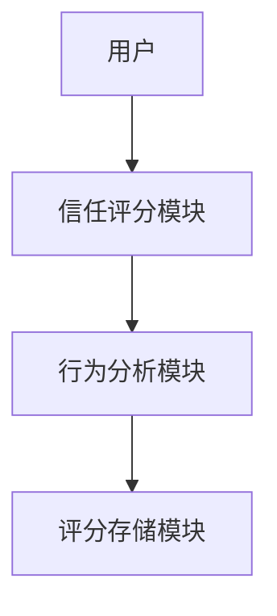

                 


# 用户信任的建立与维护

> 关键词：用户信任，信任评分模型，信任传播，系统架构，信任管理

> 摘要：用户信任是现代数字社会中的基石，本文章从理论到实践，系统地探讨了用户信任的建立与维护机制。通过分析信任的核心概念、数学模型、系统设计和实际案例，本文详细阐述了如何在技术与管理层面构建和维护用户信任，为信任管理系统的设计提供了理论和实践指导。

---

## 第一章：用户信任的背景与概念

### 1.1 信任的定义与背景

信任是社会互动的基础，是人类社会得以运转的重要机制。在数字时代，信任的重要性更加凸显，尤其是在在线服务、电子商务、社交媒体等领域。信任不仅关乎用户体验，还直接关系到企业的生存与发展。

#### 1.1.1 信任的定义与内涵

信任可以定义为一方对另一方在特定情境下表现出可靠行为的预期。信任具有以下特征：

- **心理属性**：信任是一种心理状态，涉及情感和认知的结合。
- **动态性**：信任会随着互动的深入而变化。
- **情境性**：信任在特定的情境下建立，并可能因情境变化而改变。

#### 1.1.2 用户信任在现代社会中的重要性

在数字社会中，用户信任是企业与用户之间建立长期关系的关键。信任缺失可能导致用户流失，而信任的建立则有助于提升用户忠诚度和满意度。例如，在电子商务中，用户信任直接影响购买决策。

#### 1.1.3 信任的分类与层次

信任可以分为以下几种类型：

- **基于经验的信任**：通过多次互动积累的信任。
- **基于声誉的信任**：通过第三方评价或他人推荐建立的信任。
- **基于承诺的信任**：基于对方的承诺或合同的信任。

### 1.2 信任的形成机制

信任的形成是一个复杂的过程，涉及心理学、社会学和行为科学等多个领域。

#### 1.2.1 信任的形成过程

信任的形成通常包括以下几个阶段：

1. **初始信任**：基于第一印象或初步接触。
2. **信任建立**：通过多次互动积累信任。
3. **信任维护**：通过持续的可靠行为保持信任。
4. **信任破裂**：由于不可靠行为导致信任下降或消失。

#### 1.2.2 影响信任的因素

以下因素会影响信任的建立：

- **可靠性**：行为是否符合预期。
- **透明性**：信息是否公开透明。
- **可预测性**：行为是否可预测。

#### 1.2.3 信任的动态变化

信任不是静态的，而是动态变化的。信任的增减取决于用户的实际体验和互动。

---

## 第二章：用户信任的核心概念与理论

### 2.1 信任的核心要素

信任的核心要素包括：

- **可靠性**：行为是否符合预期。
- **透明性**：信息是否公开透明。
- **可预测性**：行为是否可预测。

#### 2.1.1 可靠性

可靠性是信任的核心要素之一。用户信任企业或个人的前提是其行为符合预期。例如，在电子商务中，用户信任商家按时发货。

#### 2.1.2 透明性

透明性是指信息的公开程度。透明性高的企业和个人更容易获得用户的信任。例如，开放源代码项目通常更容易获得社区的信任。

#### 2.1.3 可预测性

可预测性是指行为的可预测程度。用户更倾向于信任行为可预测的实体。例如，定期发布产品的供应商更容易获得用户的信任。

### 2.2 信任与不信任的对比分析

#### 2.2.1 信任的特征

信任的特征包括：

- **积极预期**：信任是基于积极预期的。
- **依赖性**：信任需要依赖对方。
- **脆弱性**：信任容易因负面事件而破裂。

#### 2.2.2 不信任的特征

不信任的特征包括：

- **消极预期**：不信任基于消极预期。
- **独立性**：不信任状态下，用户更倾向于独立行动。
- **防御性**：不信任状态下，用户更倾向于防御性行为。

#### 2.2.3 信任与不信任的转换机制

信任与不信任之间可以通过以下方式转换：

- **积极互动**：通过积极互动恢复信任。
- **公开道歉与修复**：通过公开道歉和修复行为恢复信任。

---

## 第三章：用户信任的数学模型与算法

### 3.1 信任评分模型

#### 3.1.1 基于用户行为的评分系统

信任评分模型是一种通过用户行为计算信任评分的系统。以下是基于用户行为的评分系统示例：

- **行为评分**：每个行为赋予一个评分（例如，1表示正面，-1表示负面）。
- **信任评分计算**：通过加权平均计算信任评分。

#### 3.1.2 信任传播模型

信任传播模型是一种通过用户之间的信任传播计算信任评分的模型。以下是基于概率的传播模型示例：

- **初始评分**：每个用户的初始信任评分为0。
- **传播过程**：通过信任传播算法更新信任评分。

#### 3.1.3 基于图论的信任网络构建

信任网络是通过图论方法构建的信任关系网络。以下是信任网络构建的步骤：

1. **节点表示**：每个用户表示为一个节点。
2. **边表示**：边表示用户之间的信任关系。
3. **信任评分计算**：通过算法计算节点之间的信任评分。

### 3.2 信任评分的数学模型

#### 3.2.1 基于概率的评分计算

信任评分的计算可以通过概率模型实现。以下是基于概率的评分计算公式：

$$ P(A \text{信任} B) = P(B \text{可靠}) \times P(A \text{观察到} B \text{的可靠行为}) $$

#### 3.2.2 基于统计的评分计算

信任评分的计算也可以通过统计模型实现。以下是基于统计的评分计算公式：

$$ \text{信任评分} = \frac{\sum \text{历史行为评分}}{\text{行为次数}} $$

---

## 第四章：用户信任的系统分析与架构设计

### 4.1 信任管理系统的需求分析

#### 4.1.1 系统目标

信任管理系统的目标是通过收集和分析用户行为数据，计算用户信任评分，并提供信任管理功能。

#### 4.1.2 系统范围

信任管理系统的范围包括：

- 用户行为收集
- 信任评分计算
- 信任评分展示

#### 4.1.3 系统功能需求

信任管理系统的功能需求包括：

- 用户行为分析
- 信任评分计算
- 信任评分展示

### 4.2 信任管理系统的架构设计

#### 4.2.1 系统架构图

以下是信任管理系统的架构图：



#### 4.2.2 系统功能模块设计

信任管理系统的功能模块包括：

- 用户行为分析模块
- 信任评分计算模块
- 信任评分展示模块

---

## 第五章：用户信任的算法实现与项目实战

### 5.1 环境安装与配置

#### 5.1.1 开发环境搭建

信任评分系统的开发环境包括：

- Python 3.8+
- 开发工具（例如，PyCharm）
- 数据库（例如，MySQL）

#### 5.1.2 依赖库安装

信任评分系统的依赖库包括：

- Pandas
- NumPy
- Matplotlib

#### 5.1.3 数据集准备

信任评分系统需要以下数据集：

- 用户行为数据集
- 信任评分数据集

### 5.2 信任评分算法实现

#### 5.2.1 基于Python的信任评分系统实现

以下是基于Python的信任评分系统实现代码：

```python
def calculate_trust_score(user_behavior):
    score = 0
    for action in user_behavior:
        if action == 'positive':
            score += 1
        elif action == 'negativ

---

通过以上章节的详细阐述，我们从理论到实践，全面探讨了用户信任的建立与维护。希望本文能够为信任管理系统的设计和实现提供有价值的参考和指导。

