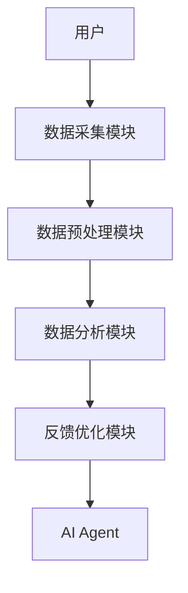

                 


# 用户反馈分析：从用户视角优化AI Agent

## 关键词
用户反馈分析, AI Agent, 优化, 用户体验, 人机交互

## 摘要
本文探讨了从用户反馈分析的角度优化AI Agent的方法，通过系统性地分析用户反馈数据，提出了一系列改进策略，旨在提升AI Agent的用户体验和性能。文章从用户反馈的采集与处理、基于反馈的优化方法、系统设计与架构，以及实际项目案例等方面展开，结合理论与实践，为优化AI Agent提供了全面的指导。

---

## 第一部分：用户反馈分析的背景与基础

### 第1章：用户反馈分析的背景与意义

#### 1.1 用户需求与反馈的重要性

##### 1.1.1 用户需求的核心概念
用户需求是产品设计和优化的核心，反映了用户在使用过程中期望达到的目标和满足的欲望。需求可以分为功能性需求和非功能性需求，前者关注具体的功能实现，后者关注性能、安全性和用户体验等方面。

用户需求的核心概念可以用下表进行对比：

| 属性 | 功能性需求 | 非功能性需求 |
|------|------------|--------------|
| 定义 | 用户期望系统执行的具体任务 | 用户期望系统具备的特性和属性 |
| 示例 | 登录功能 | 响应时间不超过2秒 |

用户需求是动态变化的，受到用户环境、个人偏好和使用场景的影响。理解用户需求是优化AI Agent的第一步，也是最为关键的一步。

##### 1.1.2 用户反馈在产品优化中的作用
用户反馈是用户对产品使用过程中体验的直接表达，是产品优化的重要依据。有效的反馈可以帮助开发人员识别产品中的问题和改进的机会。用户反馈的作用可以分为以下几个方面：

- **问题识别**：通过用户反馈发现产品中存在的缺陷和不足。
- **需求优先级排序**：根据用户反馈的频率和强度，确定需求的优先级。
- **用户体验提升**：通过反馈了解用户痛点，针对性地优化产品。

##### 1.1.3 用户反馈优化的意义
优化用户反馈分析的过程，可以提高反馈的准确性和及时性，从而更快地指导产品优化。具体意义包括：

- **提高用户满意度**：通过反馈分析，解决用户痛点，提升用户体验。
- **降低开发成本**：通过早期发现问题，减少后期修复的成本。
- **提升产品竞争力**：通过持续优化，使产品更好地满足用户需求，增强市场竞争力。

#### 1.2 AI Agent的基本概念

##### 1.2.1 AI Agent的定义与类型
AI Agent（智能体）是指在计算机系统中能够感知环境并采取行动以实现目标的实体。AI Agent可以分为以下几类：

- **简单反射Agent**：基于当前感知做出反应，没有内部状态。
- **基于模型的反射Agent**：维护内部状态，并基于当前状态和感知做出决策。
- **目标驱动Agent**：根据预设的目标采取行动。
- **效用驱动Agent**：通过最大化效用函数来做出决策。

##### 1.2.2 AI Agent的核心功能与应用场景
AI Agent的核心功能包括感知、决策、行动和学习。感知是通过传感器或数据输入获取环境信息；决策是基于感知信息做出选择；行动是通过执行器或输出模块采取行动；学习是通过机器学习算法不断优化自身的性能。

AI Agent的应用场景非常广泛，包括智能助手、自动驾驶、智能客服、推荐系统等。

##### 1.2.3 用户反馈在AI Agent优化中的作用
用户反馈是优化AI Agent的重要输入，能够帮助AI Agent更好地理解用户需求，调整其行为策略。具体作用包括：

- **提升用户体验**：通过反馈了解用户偏好，优化AI Agent的交互方式。
- **提高准确性**：通过反馈校正AI Agent的错误认知。
- **增强适应性**：通过反馈使AI Agent能够更好地适应不同用户的需求。

#### 1.3 用户反馈分析的目标与价值

##### 1.3.1 提升用户体验的目标
用户反馈分析的目标是通过分析用户反馈，识别用户体验中的痛点，提出改进方案，从而提升用户的满意度和忠诚度。

##### 1.3.2 用户反馈分析对AI Agent优化的价值
用户反馈分析为AI Agent的优化提供了重要的数据支持。通过分析用户反馈，可以发现AI Agent在功能、性能和用户体验上的不足，指导后续优化工作。

##### 1.3.3 反馈分析的边界与外延
用户反馈分析的边界在于如何有效地收集、处理和分析反馈数据，同时避免信息过载和数据噪声的干扰。外延则包括将反馈分析结果应用于实际的产品优化中，并通过持续的反馈循环不断改进AI Agent的性能。

---

## 第二部分：用户反馈分析的核心方法

### 第2章：用户反馈数据的采集与处理

#### 2.1 用户反馈数据的采集方法

##### 2.1.1 直接采集：问卷、访谈与日志
直接采集用户反馈的方法包括问卷调查、用户访谈和日志记录。问卷调查是一种常用的反馈采集方式，可以通过设计合理的问卷模板，收集用户对AI Agent的使用体验和改进建议。用户访谈则是通过与用户进行一对一的交流，深入了解用户的实际需求和使用感受。日志记录则是通过记录用户的操作行为，分析用户在使用过程中的问题和痛点。

##### 2.1.2 间接采集：行为数据分析
间接采集用户反馈的方法主要是通过分析用户的行为数据，如点击率、停留时间、错误率等，来推测用户的使用体验和需求。这种方法无需用户主动参与，能够客观反映用户的真实需求。

##### 2.1.3 数据采集工具与技术
常用的用户反馈采集工具包括问卷星、Google Forms、Hotjar等。这些工具可以帮助开发人员轻松地收集用户反馈数据。同时，还可以通过日志分析工具（如ELK stack）和行为分析工具（如Google Analytics）进行间接采集。

#### 2.2 用户反馈数据的清洗与预处理

##### 2.2.1 数据清洗的基本步骤
数据清洗是用户反馈分析的重要步骤，主要包括去除噪声数据、填补缺失值、处理异常值等。噪声数据是指那些不相关或不准确的数据，可以通过过滤和筛选的方法进行去除。填补缺失值可以通过均值、中位数或插值法进行处理。处理异常值可以通过统计方法（如Z-score）或机器学习方法（如Isolation Forest）进行识别和处理。

##### 2.2.2 噪声数据的识别与处理
噪声数据的识别可以通过多种方法进行，如基于频率的识别、基于统计的方法和基于机器学习的方法。噪声数据的处理可以通过删除、归一化或降噪处理等方式进行。

##### 2.2.3 数据标准化与格式化
数据标准化是将不同来源和格式的数据统一到一个标准格式，以便后续的处理和分析。数据格式化则是将数据转换为适合分析的格式，如结构化数据、半结构化数据和非结构化数据。

#### 2.3 用户反馈特征的提取与分析

##### 2.3.1 反馈特征的分类与提取
用户反馈特征的分类可以基于不同的维度，如情感特征、行为特征和语义特征。情感特征关注用户反馈中表达的情感倾向，如正面、负面或中性。行为特征关注用户在使用过程中的行为数据，如点击率、停留时间等。语义特征关注用户反馈中的关键词和主题。

##### 2.3.2 基于NLP的反馈分析
基于自然语言处理（NLP）的反馈分析是通过文本挖掘技术，提取用户反馈中的关键词和主题，识别用户的情感倾向，并生成情感分析结果。常用的技术包括分词、词干提取、情感分类和主题建模。

##### 2.3.3 反馈数据的可视化
反馈数据的可视化可以通过图表、仪表盘和热图等方式进行，帮助开发人员直观地了解用户反馈的分布和趋势。常用的可视化工具包括Tableau、Power BI和D3.js等。

### 第3章：基于用户反馈的AI Agent优化方法

#### 3.1 反馈驱动的优化策略

##### 3.1.1 基于反馈的参数调整
基于用户反馈的参数调整是通过分析用户反馈数据，调整AI Agent的参数设置，以优化其性能。例如，可以通过调整推荐算法的权重参数，改善推荐结果的相关性和准确性。

##### 3.1.2 反馈驱动的行为优化
基于用户反馈的行为优化是通过分析用户反馈数据，优化AI Agent的行为策略，使其更好地适应用户需求。例如，可以通过调整对话系统的响应策略，改善用户体验。

##### 3.1.3 反馈分析与模型迭代
基于用户反馈的模型迭代是通过持续收集和分析用户反馈数据，不断优化AI Agent的模型参数和算法，以提高其性能和准确性。

#### 3.2 反馈分析的数学模型与算法

##### 3.2.1 情感分析模型
情感分析模型用于识别用户反馈中的情感倾向，常用的方法包括基于规则的分类、基于词典的情感分析和基于机器学习的情感分类。以下是一个简单的基于机器学习的情感分类模型的公式：

$$
P(\text{positive}|x) = \frac{\exp(\beta x)}{1 + \exp(\beta x)}
$$

其中，$\beta$是模型参数，$x$是用户反馈文本的特征向量。

##### 3.2.2 用户行为建模
用户行为建模是通过分析用户的行为数据，建立用户行为模型，预测用户的下一步行为。常用的方法包括马尔可夫链、隐马尔可夫模型（HMM）和深度学习模型（如LSTM）。以下是一个简单的马尔可夫链模型的公式：

$$
P(s_{t+1}|s_t) = \theta
$$

其中，$\theta$是转移概率矩阵，$s_t$是当前状态，$s_{t+1}$是下一个状态。

##### 3.2.3 反馈驱动的推荐算法
反馈驱动的推荐算法是通过分析用户反馈数据，优化推荐算法，提高推荐结果的相关性和准确性。常用的方法包括协同过滤、基于内容的推荐和基于模型的推荐。以下是一个简单的协同过滤算法的公式：

$$
\hat{r}_{u,i} = \bar{r} + \sum_{k=1}^K \theta_k (r_{u,k} - \bar{r}_k)
$$

其中，$\hat{r}_{u,i}$是用户$u$对物品$i$的预测评分，$\bar{r}$是全局平均评分，$\theta_k$是物品$i$的特征权重，$r_{u,k}$是用户$u$对物品$k$的实际评分，$\bar{r}_k$是物品$k$的平均评分。

---

## 第三部分：用户反馈分析的系统设计与架构

### 第4章：用户反馈分析系统架构设计

#### 4.1 系统功能设计

##### 4.1.1 数据采集模块
数据采集模块负责从多种渠道采集用户反馈数据，包括问卷调查、用户访谈和日志记录等。模块的功能如下：

1. **数据采集**：通过多种渠道采集用户反馈数据。
2. **数据预处理**：对采集到的数据进行初步清洗和格式化。
3. **数据存储**：将预处理后的数据存储到数据库中。

##### 4.1.2 数据分析模块
数据分析模块负责对用户反馈数据进行深入分析，提取有用的特征和模式。模块的功能如下：

1. **数据清洗**：对数据进行去噪和填补缺失值。
2. **特征提取**：提取用户反馈的特征，如情感特征、行为特征和语义特征。
3. **反馈分析**：通过NLP技术分析用户反馈，识别情感倾向和主题。

##### 4.1.3 反馈优化模块
反馈优化模块负责基于用户反馈分析结果，优化AI Agent的行为和模型。模块的功能如下：

1. **参数调整**：根据反馈分析结果，调整AI Agent的参数设置。
2. **行为优化**：优化AI Agent的行为策略，使其更好地适应用户需求。
3. **模型迭代**：通过反馈分析结果，不断优化AI Agent的模型参数和算法。

#### 4.2 系统架构设计

##### 4.2.1 系统架构设计
用户反馈分析系统的架构设计如下图所示：



其中，用户通过数据采集模块提交反馈数据，数据预处理模块对数据进行清洗和格式化，数据分析模块对数据进行特征提取和反馈分析，反馈优化模块基于分析结果优化AI Agent的行为和模型。

##### 4.2.2 关键系统组件

###### 数据采集模块
数据采集模块的主要组件包括：

- 数据采集工具：如问卷星、Google Forms等。
- 数据预处理工具：如Python的pandas库。

###### 数据分析模块
数据分析模块的主要组件包括：

- NLP工具：如spaCy、NLTK等。
- 数据可视化工具：如Matplotlib、Seaborn等。

###### 反馈优化模块
反馈优化模块的主要组件包括：

- 参数调整工具：如机器学习框架（如Scikit-learn）。
- 行为优化工具：如强化学习框架（如OpenAI Gym）。

#### 4.3 系统实现与优化

##### 4.3.1 数据采集与预处理的实现
数据采集与预处理的实现步骤如下：

1. **数据采集**：通过问卷调查或日志记录采集用户反馈数据。
2. **数据清洗**：去除噪声数据，填补缺失值，处理异常值。
3. **数据格式化**：将数据转换为适合分析的格式，如结构化数据、半结构化数据和非结构化数据。

##### 4.3.2 数据分析与反馈优化的实现
数据分析与反馈优化的实现步骤如下：

1. **特征提取**：提取用户反馈的情感特征、行为特征和语义特征。
2. **反馈分析**：通过NLP技术分析用户反馈，识别情感倾向和主题。
3. **参数调整**：根据反馈分析结果，调整AI Agent的参数设置。
4. **行为优化**：优化AI Agent的行为策略，使其更好地适应用户需求。
5. **模型迭代**：通过反馈分析结果，不断优化AI Agent的模型参数和算法。

---

## 第四部分：用户反馈分析的项目实战

### 第5章：用户反馈分析实战案例

#### 5.1 项目背景与目标

##### 5.1.1 项目背景
本项目旨在通过分析用户反馈数据，优化一个智能客服系统。智能客服系统是一个基于自然语言处理的对话系统，能够为用户提供24小时在线的客户服务。然而，用户在使用过程中反馈了一些问题，如响应速度慢、理解能力差、回答不准确等。为了提高用户体验，需要通过用户反馈分析，优化智能客服系统的行为策略和模型参数。

##### 5.1.2 项目目标
项目的总体目标是通过用户反馈分析，优化智能客服系统的性能和用户体验。具体目标包括：

- **提升响应速度**：通过优化对话系统，提高用户的响应速度。
- **提高理解能力**：通过优化NLP模型，提高对话系统的理解能力。
- **改善回答准确性**：通过优化知识库和对话策略，提高回答的准确性。

#### 5.2 项目环境与工具

##### 5.2.1 项目环境
项目的开发环境包括以下工具和库：

- **编程语言**：Python
- **NLP库**：spaCy、NLTK
- **机器学习库**：Scikit-learn
- **数据可视化库**：Matplotlib、Seaborn
- **数据库**：MySQL、MongoDB
- **云服务**：AWS、阿里云

##### 5.2.2 项目工具
项目中使用的工具包括：

- **数据采集工具**：问卷星、Google Forms
- **数据清洗工具**：Python的pandas库
- **数据分析工具**：Python的numpy库
- **数据可视化工具**：Matplotlib、Seaborn
- **模型训练工具**：Scikit-learn、spaCy

#### 5.3 项目核心代码实现

##### 5.3.1 数据采集与预处理
以下是数据采集与预处理的Python代码示例：

```python
import pandas as pd
import numpy as np

# 数据采集
def collect_data():
    # 从问卷星获取数据
    data = pd.read_csv('feedback.csv')
    return data

# 数据清洗
def preprocess_data(data):
    # 删除缺失值
    data = data.dropna()
    # 去除重复数据
    data = data.drop_duplicates()
    # 转换数据格式
    data['timestamp'] = pd.to_datetime(data['timestamp'])
    return data

# 数据预处理
data = collect_data()
data_cleaned = preprocess_data(data)
data_cleaned.to_csv('cleaned_feedback.csv', index=False)
```

##### 5.3.2 数据分析与反馈优化
以下是数据分析与反馈优化的Python代码示例：

```python
import spacy
from sklearn.feature_extraction.text import TfidfVectorizer
from sklearn.naive_bayes import MultinomialNB

# 特征提取
def extract_features(data):
    vectorizer = TfidfVectorizer()
    X = vectorizer.fit_transform(data['feedback'])
    return X, vectorizer

# 情感分类
def train_classifier(X, y):
    clf = MultinomialNB()
    clf.fit(X, y)
    return clf

# 模型评估
def evaluate_model(clf, X_test, y_test):
    accuracy = clf.score(X_test, y_test)
    return accuracy

# 反馈优化
def optimize_agent(agent, feedback, clf):
    # 提取反馈特征
    features = extract_features(feedback)[0]
    # 预测情感倾向
    predicted_emotion = clf.predict(features)
    # 调整agent的行为策略
    agent.adjust_behavior(predicted_emotion)
    return agent
```

##### 5.3.3 项目总结与经验分享
通过本项目的实施，我们成功地优化了智能客服系统的性能和用户体验。主要的经验包括：

- **数据清洗的重要性**：数据清洗是用户反馈分析的关键步骤，直接影响分析结果的准确性和可靠性。
- **NLP技术的应用**：NLP技术在用户反馈分析中具有重要作用，能够有效地提取情感特征和语义特征。
- **反馈优化的策略**：反馈优化需要结合具体的业务需求和用户反馈，制定合理的优化策略。

#### 5.4 案例分析与经验总结

##### 5.4.1 项目成功经验
项目的成功经验包括：

- **数据采集的全面性**：通过多种渠道采集用户反馈数据，确保数据的全面性和代表性。
- **数据分析的准确性**：通过合理的数据清洗和特征提取，提高了数据分析的准确性和可靠性。
- **反馈优化的有效性**：通过基于反馈的参数调整和行为优化，显著提高了智能客服系统的性能和用户体验。

##### 5.4.2 项目失败教训
项目的失败教训包括：

- **数据清洗的不彻底性**：由于数据清洗不够彻底，导致部分噪声数据进入分析模块，影响了分析结果的准确性。
- **模型迭代的不及时性**：由于模型迭代不够及时，未能及时捕捉用户需求的变化，影响了优化效果。
- **用户反馈的不准确性**：由于用户反馈的不准确性和模糊性，导致部分优化策略未能取得预期效果。

---

## 第五部分：用户反馈分析的进阶内容

### 第6章：用户行为建模与情感分析

#### 6.1 用户行为建模

##### 6.1.1 用户行为建模的方法
用户行为建模的方法包括马尔可夫链、隐马尔可夫模型（HMM）和深度学习模型（如LSTM）。以下是一个简单的马尔可夫链模型的公式：

$$
P(s_{t+1}|s_t) = \theta
$$

其中，$\theta$是转移概率矩阵，$s_t$是当前状态，$s_{t+1}$是下一个状态。

##### 6.1.2 用户行为建模的应用
用户行为建模在用户反馈分析中的应用包括：

- **用户行为预测**：通过用户行为建模，预测用户的下一步行为，优化AI Agent的行为策略。
- **用户行为分析**：通过用户行为建模，分析用户的行为模式，识别用户的需求和痛点。
- **用户行为优化**：通过用户行为建模，优化用户的使用流程，提高用户体验。

#### 6.2 情感分析与语义分析

##### 6.2.1 情感分析的高级方法
情感分析的高级方法包括基于深度学习的情感分类和情感强度分析。以下是一个简单的基于深度学习的情感分类模型的公式：

$$
P(\text{positive}|x) = \frac{\exp(\beta x)}{1 + \exp(\beta x)}
$$

其中，$\beta$是模型参数，$x$是用户反馈文本的特征向量。

##### 6.2.2 语义分析的应用
语义分析在用户反馈分析中的应用包括：

- **主题建模**：通过主题建模，识别用户反馈中的主要主题和关键词。
- **情感分析**：通过情感分析，识别用户反馈中的情感倾向和强度。
- **意图识别**：通过意图识别，理解用户的使用意图和需求。

---

## 第六部分：用户反馈分析的总结与展望

### 第7章：总结与展望

#### 7.1 总结
用户反馈分析是优化AI Agent的重要手段，通过分析用户反馈数据，识别用户体验中的痛点，优化AI Agent的行为策略和模型参数，提高用户体验和产品性能。本文从用户反馈分析的背景与基础、核心方法、系统设计与架构、项目实战、进阶内容等方面进行了全面的探讨，为优化AI Agent提供了系统的指导。

#### 7.2 未来展望
未来，用户反馈分析将朝着以下几个方向发展：

1. **实时反馈分析**：通过实时采集和分析用户反馈数据，实现实时优化。
2. **多模态反馈分析**：结合文本、语音、图像等多种模态的数据，进行综合分析。
3. **个性化反馈分析**：根据用户的个性化需求，进行定制化的反馈分析和优化。
4. **智能化反馈优化**：通过强化学习等技术，实现智能化的反馈优化和自适应优化。

---

## 结语

用户反馈分析是优化AI Agent的重要手段，通过分析用户反馈数据，识别用户体验中的痛点，优化AI Agent的行为策略和模型参数，提高用户体验和产品性能。本文从用户反馈分析的背景与基础、核心方法、系统设计与架构、项目实战、进阶内容等方面进行了全面的探讨，为优化AI Agent提供了系统的指导。未来，用户反馈分析将朝着实时反馈分析、多模态反馈分析、个性化反馈分析和智能化反馈优化的方向发展，为AI Agent的优化和进化提供更加有力的支持。

