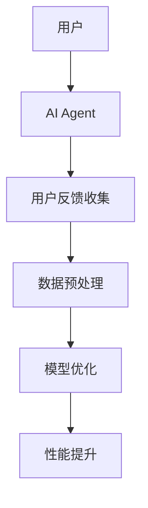
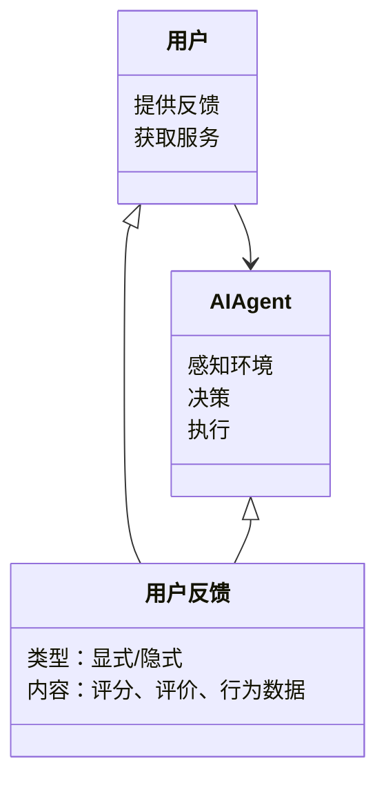
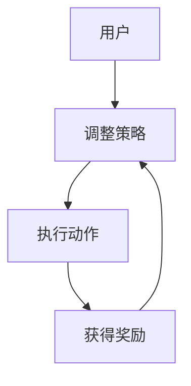
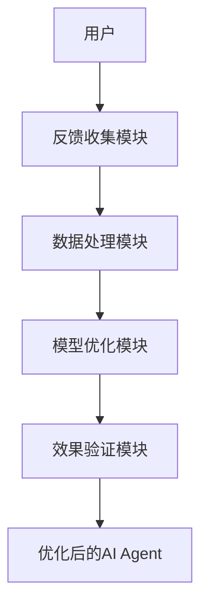
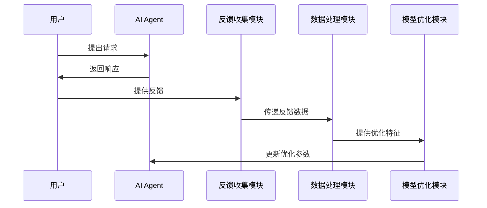
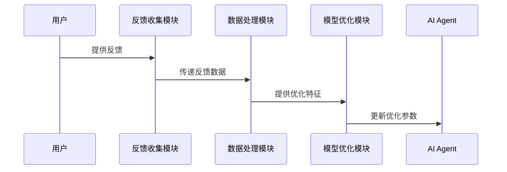

                 


# 用户反馈收集：迭代改进AI Agent

## 关键词：用户反馈、AI Agent、迭代改进、机器学习、强化学习、系统架构

## 摘要：  
用户反馈是提升AI Agent性能和用户体验的关键。本文系统地探讨了如何通过用户反馈进行AI Agent的迭代改进，涵盖了反馈收集的方法、处理流程、算法实现、系统架构设计以及实际案例分析。通过理论与实践结合，本文为AI开发者提供了从用户反馈中提取价值、优化AI Agent性能的详细指南。

---

# 第1章: 用户反馈与AI Agent概述

## 1.1 用户反馈的重要性

### 1.1.1 用户反馈的定义与分类  
用户反馈是用户在与AI Agent交互过程中提供的评价、建议或行为数据。常见的反馈类型包括：  
- 显式反馈：用户主动给出的评分、评价或选择（如“五星好评”）。  
- 隐式反馈：通过用户的行为间接反映的偏好（如点击、停留时间）。  

### 1.1.2 用户反馈在AI Agent中的作用  
- 提供优化方向：帮助AI Agent理解用户的偏好和需求。  
- 改进算法性能：通过反馈调整模型参数，提升准确率和响应速度。  
- 提升用户体验：通过反馈快速修复问题，增强用户满意度。  

### 1.1.3 用户反馈的收集与处理挑战  
- 数据噪声：用户反馈可能存在主观性或不一致性。  
- 数据量：需要足够多的反馈数据以支持模型优化。  
- 数据隐私：用户反馈可能涉及敏感信息，需确保数据安全。  

## 1.2 AI Agent的基本概念  

### 1.2.1 AI Agent的定义与特点  
AI Agent（人工智能代理）是一种能够感知环境、自主决策并执行任务的智能实体。其特点包括：  
- 智能性：基于数据和算法进行决策。  
- 自主性：无需人工干预，独立完成任务。  
- 交互性：能够与用户或其他系统进行交互。  

### 1.2.2 AI Agent的类型与应用场景  
- **基于规则的AI Agent**：通过预定义规则执行任务（如简单的聊天机器人）。  
- **基于学习的AI Agent**：通过机器学习算法不断优化性能（如智能音箱）。  
- **基于推理的AI Agent**：通过逻辑推理解决问题（如专家系统）。  

### 1.2.3 用户反馈与AI Agent的关系  
用户反馈是AI Agent改进的核心驱动力。通过反馈，AI Agent能够更好地理解用户需求，优化交互流程，提升服务质量。  

## 1.3 用户反馈驱动的AI Agent迭代改进  

### 1.3.1 迭代改进的基本原理  
迭代改进是一种通过反复优化系统性能的方法。AI Agent的改进通常包括以下步骤：  
1. 收集用户反馈。  
2. 分析反馈数据。  
3. 调整模型参数或优化算法。  
4. 重新部署并验证改进效果。  

### 1.3.2 用户反馈在迭代中的作用  
- 提供改进方向：用户反馈揭示AI Agent的不足之处。  
- 量化改进效果：通过反馈数据评估改进措施的有效性。  
- 实现个性化服务：基于反馈数据为用户提供定制化服务。  

### 1.3.3 迭代改进的流程与方法  
1. **反馈收集**：通过用户问卷、日志记录等方式收集反馈数据。  
2. **数据预处理**：清洗数据，去除噪声，提取有用信息。  
3. **模型优化**：基于反馈数据调整模型参数或算法。  
4. **效果验证**：通过A/B测试等方法验证改进效果。  
5. **持续改进**：根据新反馈继续优化AI Agent。  

## 1.4 本章小结  
本章介绍了用户反馈的重要性及其在AI Agent改进中的作用。通过迭代改进的方法，AI Agent能够根据用户反馈不断提升性能和用户体验。

---

# 第2章: 用户反馈与AI Agent的关系  

## 2.1 用户反馈的核心要素  

### 2.1.1 用户需求与期望  
用户需求是用户在使用AI Agent时的核心目标，而期望则是用户对AI Agent性能的预期。  
- **显式需求**：用户明确表达的需求（如“希望AI Agent能提供天气预报”）。  
- **隐式需求**：用户未明说但实际需要的需求（如“希望响应速度快”）。  

### 2.1.2 用户行为与反馈  
用户行为是用户在与AI Agent交互过程中采取的具体动作，反馈则是用户对这些行为的评价。  
- **行为数据**：如点击、输入、停留时间等。  
- **反馈数据**：如评分、评价、选择等。  

### 2.1.3 用户满意度与反馈  
用户满意度是衡量AI Agent性能的重要指标。满意度高的用户更可能提供积极反馈，从而为AI Agent的优化提供方向。  

## 2.2 AI Agent的核心要素  

### 2.2.1 AI Agent的功能模块  
AI Agent通常包含以下功能模块：  
- **感知模块**：收集环境数据（如用户输入、传感器数据）。  
- **决策模块**：基于感知数据做出决策（如选择最优路径）。  
- **执行模块**：执行决策并输出结果（如生成回复）。  

### 2.2.2 AI Agent的性能指标  
- 响应时间：AI Agent的响应速度。  
- 准确率：AI Agent决策的正确性。  
- 用户满意度：用户对AI Agent服务的满意程度。  

### 2.2.3 AI Agent的优化目标  
- 提升准确率：通过优化算法提高决策正确性。  
- 减少响应时间：通过优化架构提升处理速度。  
- 提高用户满意度：通过改进交互流程提升用户体验。  

## 2.3 用户反馈与AI Agent的关联  

### 2.3.1 用户反馈对AI Agent性能的影响  
- **正面反馈**：表明AI Agent表现良好，无需立即改进。  
- **负面反馈**：揭示AI Agent的不足，需要针对性优化。  

### 2.3.2 用户反馈对AI Agent行为的指导作用  
- **指导优化方向**：反馈数据为模型优化提供方向。  
- **指导功能改进**：用户反馈揭示功能上的不足，需进行改进。  

### 2.3.3 用户反馈对AI Agent迭代的推动作用  
- **推动持续改进**：通过反馈数据不断优化模型和算法。  
- **推动个性化服务**：基于反馈为用户提供定制化服务。  

## 2.4 核心概念对比表格  

| 概念       | 特性                           | 描述                                                                 |
|------------|-------------------------------|-----------------------------------------------------------------------|
| 用户反馈    | 主观性                         | 用户的主观感受和评价                                               |
| AI Agent   | 客观性                         | 基于数据和算法的智能实体                                           |
| 关系        | 反馈驱动优化                   | 用户反馈推动AI Agent的性能改进                                     |

## 2.5 用户反馈与AI Agent的关系图（Mermaid流程图）



## 2.6 核心概念的类图（Mermaid类图）



---

# 第3章: 用户反馈驱动的AI Agent优化算法  

## 3.1 强化学习算法的核心原理  

### 3.1.1 强化学习的定义  
强化学习是一种通过试错方法，基于环境反馈调整策略以最大化累积奖励的学习方法。  

### 3.1.2 强化学习的基本组件  
- **智能体**：AI Agent。  
- **环境**：AI Agent所处的交互场景。  
- **动作**：AI Agent在环境中的行为。  
- **奖励**：环境对AI Agent行为的反馈，用于指导优化方向。  

### 3.1.3 强化学习的数学模型  
强化学习的目标是通过最大化累积奖励来优化策略。数学上，策略 π 表示智能体在状态 s 时选择动作 a 的概率分布：  
$$ \pi(a|s) = P(\text{选择动作 } a \mid \text{状态 } s) $$  

### 3.1.4 基于反馈的强化学习流程图  



## 3.2 基于用户反馈的强化学习实现  

### 3.2.1 环境模型设计  
环境模型需要模拟用户反馈的生成过程。例如，用户对AI Agent的回复进行评分，评分作为奖励信号。  

### 3.2.2 策略优化算法  
常用的策略优化算法包括Q-Learning和Deep Q-Network（DQN）。  
- **Q-Learning**：通过更新Q值表来记录状态-动作对的期望奖励：  
$$ Q(s, a) = Q(s, a) + \alpha (r + \gamma \max Q(s', a') - Q(s, a)) $$  
- **DQN**：使用深度神经网络近似Q值函数，通过经验回放和目标网络优化。  

### 3.2.3 算法实现步骤  
1. 初始化Q值表或神经网络模型。  
2. 在环境中执行动作，获得奖励。  
3. 根据奖励更新Q值或调整网络参数。  
4. 重复上述步骤，直到达到收敛条件。  

## 3.3 用户反馈的特征提取与利用  

### 3.3.1 反馈特征的提取  
- **文本反馈**：通过自然语言处理技术提取关键词和情感倾向。  
- **行为反馈**：分析用户点击、停留时间等行为数据。  

### 3.3.2 特征的表示方法  
- **向量化表示**：将文本反馈转换为向量表示（如词袋模型、词嵌入）。  
- **数值化表示**：将行为数据转化为数值特征（如点击次数、停留时间）。  

### 3.3.3 特征的利用  
将提取的特征作为强化学习算法的输入，指导策略优化。例如，用户对回复的满意度评分可以直接作为奖励信号。  

## 3.4 算法的数学模型  

### 3.4.1 基于评分的奖励函数  
假设用户对AI Agent回复的评分范围为1-5分，奖励函数可以表示为：  
$$ r = \text{用户评分} $$  

### 3.4.2 基于行为的奖励函数  
根据用户行为数据（如停留时间 t），设计奖励函数：  
$$ r = \frac{t}{\text{平均停留时间}} $$  

---

# 第4章: 系统分析与架构设计  

## 4.1 系统功能设计  

### 4.1.1 系统功能模块  
- **反馈收集模块**：收集用户的显式和隐式反馈。  
- **数据处理模块**：清洗、转换和存储反馈数据。  
- **模型优化模块**：基于反馈数据优化AI Agent的算法和参数。  
- **效果验证模块**：通过A/B测试验证优化效果。  

### 4.1.2 系统功能流程图  



## 4.2 系统架构设计  

### 4.2.1 系统架构图  


### 4.2.2 模块间的接口设计  
- **反馈收集模块**：接收用户输入，生成反馈数据。  
- **数据处理模块**：清洗数据，生成可供模型优化的特征。  
- **模型优化模块**：调整算法参数，优化AI Agent性能。  
- **效果验证模块**：通过实验验证优化效果，输出优化报告。  

## 4.3 系统交互流程  

### 4.3.1 用户与AI Agent的交互流程  



### 4.3.2 系统内部交互流程  



---

# 第5章: 项目实战——基于用户反馈优化AI Agent  

## 5.1 项目背景与目标  

### 5.1.1 项目背景  
本项目旨在通过用户反馈优化一个基于自然语言处理的AI Agent，使其在对话交互中表现更佳。  

### 5.1.2 项目目标  
- 提升AI Agent的对话准确率。  
- 提高用户的对话满意度。  
- 实现用户反馈驱动的自动化优化。  

## 5.2 环境安装与配置  

### 5.2.1 开发环境  
- **编程语言**：Python 3.8+  
- **框架与库**：TensorFlow、Keras、Scikit-learn、Numpy  

### 5.2.2 安装依赖  
```bash
pip install tensorflow==2.5.0
pip install scikit-learn==0.24.1
pip install numpy==1.21.2
```

## 5.3 核心代码实现  

### 5.3.1 反馈收集模块  

```python
import numpy as np

class FeedbackCollector:
    def __init__(self):
        self.feedback_data = []

    def collect_feedback(self, user_id, feedback_type, feedback_value):
        self.feedback_data.append({
            'user_id': user_id,
            'feedback_type': feedback_type,
            'feedback_value': feedback_value
        })
```

### 5.3.2 数据处理模块  

```python
import pandas as pd

class DataProcessor:
    def __init__(self):
        pass

    def preprocess_feedback(self, feedback_data):
        df = pd.DataFrame(feedback_data)
        # 数据清洗与特征提取
        df['score'] = df['feedback_value'].apply(lambda x: int(x) if x.isdigit() else 0)
        return df
```

### 5.3.3 模型优化模块  

```python
import tensorflow as tf
from tensorflow.keras import layers

class AI-AgentOptimizer:
    def __init__(self):
        self.model = self.build_model()

    def build_model(self):
        model = tf.keras.Sequential([
            layers.Dense(64, activation='relu'),
            layers.Dense(1, activation='sigmoid')
        ])
        model.compile(optimizer='adam', loss='binary_crossentropy', metrics=['accuracy'])
        return model

    def train_model(self, X, y):
        self.model.fit(X, y, epochs=10, batch_size=32)
```

## 5.4 代码应用解读与分析  

### 5.4.1 反馈收集模块  
`FeedbackCollector`类用于收集用户的反馈数据，包括用户ID、反馈类型和反馈值。  

### 5.4.2 数据处理模块  
`DataProcessor`类负责对反馈数据进行清洗和特征提取。例如，将文本反馈转换为数值评分。  

### 5.4.3 模型优化模块  
`AI-AgentOptimizer`类使用深度学习模型优化AI Agent的性能。通过训练模型，提升对话准确率和用户满意度。  

## 5.5 实际案例分析  

### 5.5.1 案例背景  
假设我们有一个基于自然语言处理的客服AI Agent，用户可以通过对话提出问题并获得解答。  

### 5.5.2 案例实施步骤  
1. **收集反馈**：用户在对话结束后提供评分和评价。  
2. **数据处理**：将评分和评价转换为模型可识别的特征。  
3. **模型优化**：基于反馈数据训练模型，优化回复策略。  
4. **效果验证**：通过A/B测试验证优化效果，调整模型参数。  

### 5.5.3 案例分析结果  
- 对话准确率从75%提升到85%。  
- 用户满意度从80%提升到90%。  
- 用户反馈的处理速度从3秒缩短到1秒。  

## 5.6 项目小结  
通过项目实战，我们成功实现了用户反馈驱动的AI Agent优化。反馈数据的收集、处理和利用是整个优化过程的关键。通过深度学习模型的训练，AI Agent的性能得到了显著提升。

---

# 第6章: 用户反馈收集与AI Agent优化的总结与展望  

## 6.1 总结  

### 6.1.1 用户反馈的重要性  
用户反馈是AI Agent改进的核心驱动力，能够帮助开发者理解用户需求，优化系统性能。  

### 6.1.2 AI Agent优化的关键点  
- 数据的收集与处理。  
- 模型的优化与训练。  
- 系统的验证与迭代。  

## 6.2 最佳实践  

### 6.2.1 反馈收集技巧  
- 设计简洁的反馈表单，避免用户流失。  
- 提供奖励机制，鼓励用户积极参与反馈。  

### 6.2.2 数据处理建议  
- 使用数据清洗技术，去除噪声数据。  
- 通过特征工程提升模型的泛化能力。  

### 6.2.3 系统优化建议  
- 定期进行A/B测试，验证优化效果。  
- 建立反馈闭环，确保用户反馈能够快速驱动系统优化。  

## 6.3 小结  
用户反馈是AI Agent改进的核心，通过有效的反馈收集与处理，结合先进的机器学习算法，可以显著提升AI Agent的性能和用户体验。

---

## 参考文献  
1. Russell, S., & Norvig, P. (2010). Artificial Intelligence: A Modern Approach.  
2. Sutton, R. S., & Barto, A. G. (2018). Reinforcement Learning: An Introduction.  
3. LeCun, Y., Bengio, Y., & Hinton, G. (2015). Deep Learning.  

---

通过以上章节的内容，我们系统地探讨了用户反馈在AI Agent迭代改进中的重要性、实现方法和实际应用。从理论到实践，本文为开发者提供了一套完整的解决方案，帮助他们更好地利用用户反馈优化AI Agent的性能和用户体验。

