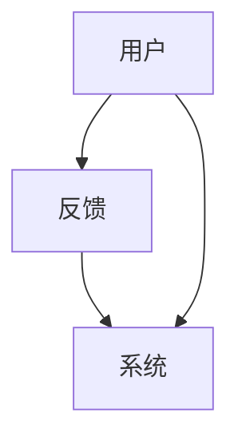
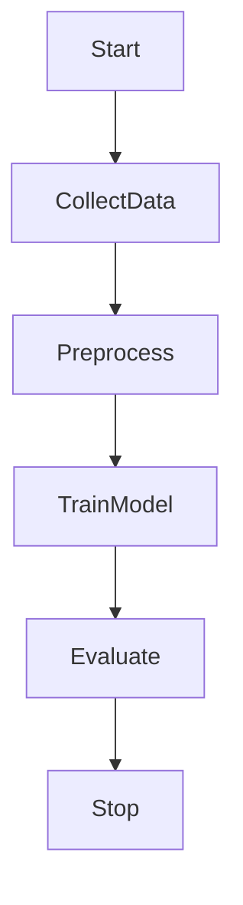
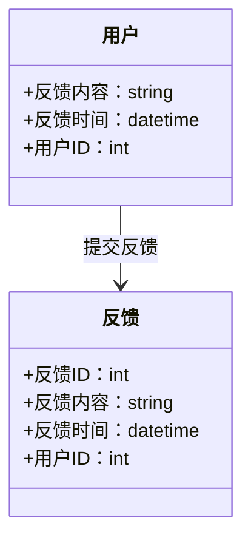

                 


# 用户反馈机制

> 关键词：用户反馈机制、系统设计、算法原理、实体关系、反馈分类、用户行为分析、系统优化

> 摘要：用户反馈机制是计算机系统设计中的关键环节，本文从基础概念、核心原理、算法实现、系统架构设计等多方面深入探讨用户反馈机制的实现与应用。通过理论分析与实践结合，详细阐述用户反馈机制在实际项目中的应用价值和优化策略。

---

## 第一部分: 用户反馈机制基础

### 第1章: 用户反馈机制概述

#### 1.1 用户反馈机制的定义与背景

##### 1.1.1 问题背景与描述

用户反馈机制是指用户在与系统交互过程中，通过提供意见、建议或评价，帮助系统改进功能、优化性能或修复问题的一种机制。随着人机交互的普及，用户反馈机制在软件开发、用户体验优化等领域扮演着越来越重要的角色。

##### 1.1.2 用户反馈机制的核心问题

用户反馈机制的核心问题包括：

- 如何高效地收集用户反馈？
- 如何准确地理解和处理用户反馈？
- 如何将用户反馈转化为系统优化的驱动力？

##### 1.1.3 问题解决的思路与方法

用户反馈机制的实现思路包括：

1. **反馈收集**：通过界面、日志等方式收集用户反馈。
2. **反馈分析**：对反馈进行分类、标注和语义分析。
3. **反馈应用**：将分析结果应用于系统优化。

#### 1.2 用户反馈机制的核心概念

##### 1.2.1 反馈的类型与特点

用户反馈可以分为以下几类：

- **正向反馈**：用户对系统功能的肯定或表扬。
- **负向反馈**：用户对系统功能的不满或批评。
- **中性反馈**：用户对系统功能的中性评价或建议。

| 反馈类型 | 描述 | 示例 |
|----------|------|------|
| 正向反馈 | 表彰或奖励行为 | "您做得很好！" |
| 负向反馈 | 指出问题或不足 | "需要改进" |
| 中性反馈 | 提供建设性建议 | "建议增加功能" |

##### 1.2.2 反馈的收集与处理流程

用户反馈的处理流程包括：

1. **收集**：通过界面按钮、表单等方式收集用户反馈。
2. **存储**：将反馈信息存储在数据库中。
3. **分析**：对反馈进行分类、语义分析。
4. **处理**：根据反馈内容进行系统优化。

##### 1.2.3 反馈机制的边界与外延

用户反馈机制的边界包括：

- **用户权限**：仅限于特定用户或所有用户。
- **反馈范围**：仅限于系统功能或包括用户体验。
- **反馈渠道**：通过界面或日志等方式。

#### 1.3 用户反馈机制的实体关系分析

用户反馈机制涉及的主要实体包括用户、反馈、系统。以下是实体关系图：



---

### 第2章: 用户反馈机制的核心原理

#### 2.1 反馈机制的基本原理

##### 2.1.1 反馈的分类与属性对比

用户反馈的分类可以通过以下表格进行对比：

| 属性 | 正向反馈 | 负向反馈 | 中性反馈 |
|------|----------|----------|----------|
| 描述 | 肯定或表扬 | 批评或建议 | 中立或建议 |
| 示例 | "很好，继续" | "需要改进" | "建议增加功能" |

##### 2.1.2 反馈机制的数学模型

用户反馈机制的数学模型可以表示为：

$$ F = f(u, a) $$

其中：
- \( F \) 表示反馈结果
- \( u \) 表示用户行为
- \( a \) 表示系统响应

---

## 第二部分: 用户反馈机制的核心概念与联系

### 第3章: 用户反馈机制的算法实现

#### 3.1 反馈分类算法

##### 3.1.1 基于机器学习的反馈分类

用户反馈分类的流程如下：



##### 3.1.2 常见算法对比

以下是对常见算法的对比：

| 算法 | 优点 | 缺点 |
|------|------|------|
| 决策树 | 易解释 | 易过拟合 |
| 随机森林 | 高准确性 | 计算复杂 |

---

## 第三部分: 用户反馈机制的系统架构与设计

### 第4章: 用户反馈机制的系统架构

#### 4.1 系统功能设计

##### 4.1.1 领域模型

以下是领域模型的类图：



---

## 第四部分: 用户反馈机制的项目实战

### 第5章: 用户反馈机制的项目实战

#### 5.1 环境安装

以下是项目实战的环境安装步骤：

1. **安装Python**：确保安装了Python 3.8或更高版本。
2. **安装依赖库**：使用以下命令安装依赖库：

   ```bash
   pip install numpy pandas scikit-learn
   ```

---

### 总结

用户反馈机制是系统设计中的重要组成部分，本文从基础概念、核心原理、算法实现、系统架构设计等多方面进行了深入探讨。通过理论分析与实践结合，详细阐述了用户反馈机制在实际项目中的应用价值和优化策略。

---

### 最佳实践 Tips

- **及时反馈**：用户反馈应尽快处理，避免积压。
- **分类存储**：根据反馈类型分类存储，便于后续分析。
- **用户隐私**：确保用户反馈中的隐私信息得到妥善保护。

---

### 小结

用户反馈机制是系统设计中的关键环节，本文从多个角度进行了深入探讨，为实际项目提供了理论支持和实践指导。

---

### 注意事项

- **数据安全**：用户反馈中可能包含敏感信息，需注意数据安全。
- **用户体验**：反馈界面设计应简洁明了，确保用户体验良好。

---

### 拓展阅读

- 《Effective User Feedback: A Guide to Collecting and Acting on User Feedback》
- 《Data-Driven User Feedback Analysis for System Optimization》

