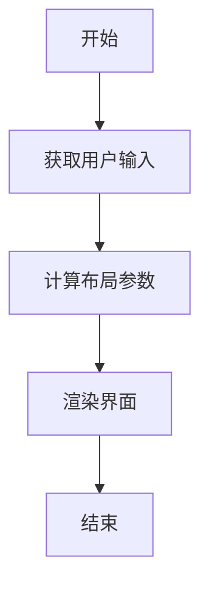
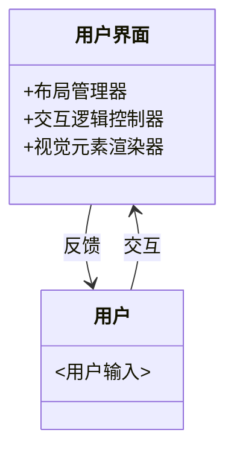
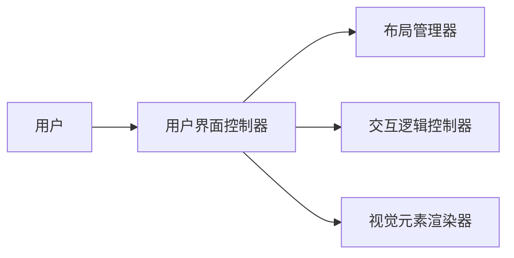
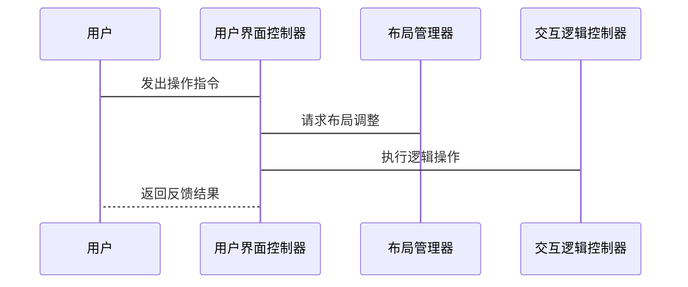

                 


# 用户界面设计

> 关键词：用户界面设计，用户体验，交互设计，响应式设计，用户行为分析，系统架构，数学模型

> 摘要：用户界面设计是计算机科学和人机交互领域的重要组成部分，本文将从背景、核心概念、算法原理、系统架构、项目实战等多个角度深入剖析用户界面设计的各个方面，结合丰富的图表、数学模型和实际案例，帮助读者全面理解用户界面设计的理论与实践。

---

## 第一部分: 用户界面设计的背景与核心概念

### 第1章: 用户界面设计概述

#### 1.1 用户界面设计的基本概念

##### 1.1.1 什么是用户界面设计
用户界面设计（User Interface Design，简称UI设计）是指通过设计和规划用户与计算机系统或其他产品交互的界面，以提高用户体验和产品可用性的过程。UI设计的核心目标是使用户能够以最直观、最高效的方式与系统进行交互。

##### 1.1.2 用户界面设计的重要性
- 提升用户体验：通过优化界面设计，减少用户的学习成本，提高操作效率。
- 增强产品竞争力：优秀的界面设计能够提升产品的市场竞争力，吸引更多的用户。
- 提高产品易用性：直观的界面设计能够降低用户的学习成本，减少误操作的可能性。

##### 1.1.3 用户界面设计的分类与应用领域
用户界面设计可以分为以下几类：
- **图形用户界面（GUI）**：基于图形的界面设计，广泛应用于桌面应用、移动应用和Web应用。
- **文本用户界面（TUI）**：基于文本的界面设计，常见于命令行工具和早期的终端界面。
- **语音用户界面（VUI）**：通过语音交互设计的界面，常见于智能音箱、车载系统等场景。

用户界面设计的应用领域包括：
- 操作系统设计
- 软件应用程序开发
- 网站设计
- 移动应用开发
- 游戏界面设计

#### 1.2 用户界面设计的核心要素

##### 1.2.1 用户体验（UX）与用户界面（UI）的区别与联系
- **用户体验（UX）**：关注用户在使用产品过程中的整体体验，包括功能的可用性、操作的流畅性以及情感上的愉悦感。
- **用户界面（UI）**：关注用户与产品交互的界面设计，包括视觉元素、布局和交互逻辑。

用户界面设计是用户体验设计的重要组成部分，但用户体验设计还包括更广泛的内容，如用户调研、任务分析和用户行为研究。

##### 1.2.2 用户界面设计的核心要素
- **可用性（Usability）**：界面是否易于理解和操作。
- **美观性（Aesthetics）**：界面是否符合用户的审美需求。
- **一致性（Consistency）**：界面元素和交互逻辑是否一致，减少用户的认知负担。

##### 1.2.3 用户界面设计的边界与外延
用户界面设计的边界包括：
- **输入输出**：如何接收用户输入并反馈结果。
- **交互逻辑**：用户操作与系统反馈的对应关系。
- **视觉呈现**：界面元素的布局和视觉效果。

用户界面设计的外延包括：
- **用户行为研究**：分析用户如何与界面交互。
- **用户心理模型**：理解用户的认知过程和心理预期。

#### 1.3 用户界面设计的核心概念与联系

##### 1.3.1 用户界面设计的核心原理
用户界面设计的核心原理包括：
- **用户认知与行为心理学**：研究用户如何理解和记忆界面元素。
- **交互逻辑与流程**：设计用户操作的流程和步骤。
- **视觉层次与信息架构**：通过视觉元素引导用户的注意力。

##### 1.3.2 核心概念的属性特征对比表格
以下是用户界面设计核心要素的属性特征对比：

| 核心要素 | 可用性 | 美观性 | 一致性 |
|----------|--------|--------|--------|
| 定义     | 界面是否易于使用 | 界面是否符合审美需求 | 界面元素和交互逻辑是否一致 |
| 关键点   | 操作流程、反馈机制 | 视觉设计、色彩搭配 | 标准化、模块化 |

##### 1.3.3 用户界面设计的ER实体关系图架构
以下是用户界面设计的核心概念ER图（Mermaid流程图）：

```mermaid
erDiagram
    actor 用户 : 用户
    actor 设计师 : 设计师
    actor 开发者 : 开发者
    actor 产品 : 产品
    用户 --> 用户界面 : 使用
    设计师 --> 用户界面 : 设计
    开发者 --> 用户界面 : 实现
    产品 --> 用户界面 : 定义需求
```

---

## 第二部分: 用户界面设计的算法原理与数学模型

### 第2章: 用户界面设计的算法原理

#### 2.1 用户界面设计中的算法应用

##### 2.1.1 响应式设计的实现算法
响应式设计是一种通过媒体查询动态调整界面布局的技术，其实现算法如下：

1. 检测设备屏幕宽度。
2. 根据屏幕宽度选择合适的布局方案。
3. 应用相应的CSS样式。

##### 2.1.2 用户行为预测算法
用户行为预测算法可以通过以下步骤实现：

1. 数据采集：记录用户的操作行为数据。
2. 数据分析：使用机器学习算法预测用户的下一步操作。

##### 2.1.3 视觉元素优化算法
视觉元素优化算法包括颜色、字体和图标的选择，以确保界面的美观性和可用性。

#### 2.2 用户界面设计算法的数学模型

##### 2.2.1 响应式布局的数学模型
响应式布局的核心公式为：

$$
\text{屏幕宽度} = \text{视口宽度} \times \text{缩放比例}
$$

##### 2.2.2 用户行为预测的数学模型
用户行为预测的概率模型为：

$$
P(\text{点击}) = \frac{\text{点击次数}}{\text{总展示次数}}
$$

#### 2.3 用户界面设计算法的流程图
以下是用户界面设计算法的流程图（Mermaid）：



---

## 第三章: 用户界面设计的系统分析与架构设计

### 3.1 系统分析与架构设计方案

#### 3.1.1 问题场景介绍
用户界面设计需要解决的问题包括：
- 如何提高界面的可用性。
- 如何优化界面的美观性。
- 如何实现界面的响应式设计。

#### 3.1.2 系统功能设计
以下是用户界面设计的领域模型（Mermaid类图）：



#### 3.1.3 系统架构设计
以下是用户界面设计的系统架构图（Mermaid）：



#### 3.1.4 系统接口设计
用户界面设计的系统接口设计包括：
- 用户输入接口：接收用户的操作指令。
- 系统反馈接口：向用户展示操作结果。

#### 3.1.5 系统交互设计
以下是用户界面设计的系统交互图（Mermaid序列图）：



---

## 第四章: 用户界面设计的项目实战

### 4.1 项目实战

#### 4.1.1 环境安装与配置
以下是项目实战的环境安装步骤：

1. 安装开发工具：如Visual Studio、IntelliJ IDEA或Xcode。
2. 安装UI设计工具：如Figma、Sketch或Adobe XD。
3. 安装版本控制工具：如Git。

#### 4.1.2 系统核心实现源代码
以下是用户界面设计的核心实现代码（Python示例）：

```python
import math

def calculate_layout(screen_width, screen_height):
    # 计算布局参数
    aspect_ratio = screen_width / screen_height
    # 根据比例调整布局
    if aspect_ratio > 1.5:
        return "横屏布局"
    else:
        return "竖屏布局"

# 示例调用
print(calculate_layout(1920, 1080))  # 输出：横屏布局
```

#### 4.1.3 代码应用解读与分析
上述代码通过计算屏幕宽高比来决定界面的布局方式。具体步骤如下：

1. 计算屏幕宽高比。
2. 根据宽高比选择布局方式。

#### 4.1.4 实际案例分析
以下是一个实际案例的分析：

- **案例名称**：移动应用界面设计
- **项目需求**：设计一个响应式移动应用界面，支持不同屏幕尺寸的设备。
- **实现步骤**：
  1. 使用Figma设计界面原型。
  2. 实现响应式布局。
  3. 进行用户测试和优化。

#### 4.1.5 项目小结
通过本项目，我们掌握了用户界面设计的核心技能，包括响应式设计、交互逻辑实现和视觉元素优化。

---

## 第五章: 用户界面设计的最佳实践

### 5.1 最佳实践

#### 5.1.1 设计规范与原则
- 遵循一致性原则：确保界面元素和交互逻辑一致。
- 遵循可扩展性原则：设计能够适应未来需求的界面。

#### 5.1.2 设计工具推荐
- **图形设计工具**：Figma、Sketch、Adobe XD。
- **代码编辑工具**：VS Code、IntelliJ IDEA、Xcode。

#### 5.1.3 设计流程与方法
1. 需求分析：明确设计目标和用户需求。
2. 原型设计：使用工具设计界面原型。
3. 交互设计：定义交互逻辑和用户流程。
4. 视觉设计：优化界面的美观性和一致性。
5. 测试优化：通过用户测试优化设计。

#### 5.1.4 注意事项
- 避免过度设计：保持界面简洁。
- 避免忽略用户反馈：及时根据用户反馈进行优化。

#### 5.1.5 拓展阅读
推荐书籍和资源：
- 《设计心理学》
- 《用户体验要素》
- 《交互设计精髓》

---

## 第六章: 总结

### 6.1 小结
用户界面设计是计算机科学和人机交互领域的重要组成部分，本文从背景、核心概念、算法原理、系统架构、项目实战等多个角度深入剖析了用户界面设计的各个方面，结合丰富的图表、数学模型和实际案例，帮助读者全面理解用户界面设计的理论与实践。

### 6.2 注意事项
- 用户界面设计需要结合用户需求和产品目标。
- 需要不断优化和迭代设计。

### 6.3 拓展阅读
- 推荐学习响应式设计、用户行为分析和系统架构设计的相关知识。

---

以上是《用户界面设计》的技术博客文章的完整内容，希望对您有所帮助！

