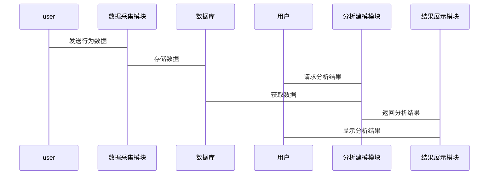

                 


# 用户行为分析

> 关键词：用户行为分析，数据分析，算法原理，系统架构，项目实战

> 摘要：用户行为分析是通过收集和分析用户在系统或产品中的行为数据，以理解用户需求、优化用户体验和提高产品性能的过程。本文将详细介绍用户行为分析的核心概念、算法原理、系统架构设计、项目实战以及最佳实践，帮助读者全面掌握用户行为分析的方法和应用。

---

## 第1章: 用户行为分析概述

### 1.1 用户行为分析的背景与意义

用户行为分析是一种通过对用户在系统或产品中的行为数据进行收集、处理和分析，以理解用户需求、优化产品设计和提升用户体验的方法。随着互联网和数字化产品的普及，用户行为分析在商业决策、用户体验优化和产品改进中扮演着越来越重要的角色。

#### 1.1.1 用户行为分析的定义

用户行为分析是通过对用户在系统或产品中的行为数据进行收集、处理和分析，以理解用户需求、优化产品设计和提升用户体验的过程。

#### 1.1.2 用户行为分析的重要性

用户行为分析的重要性体现在以下几个方面：
- **提升用户体验**：通过分析用户行为，可以发现用户在使用产品时遇到的问题，从而优化产品设计，提升用户体验。
- **优化商业决策**：用户行为数据可以帮助企业了解用户需求和偏好，从而制定更精准的营销策略和产品定位。
- **提高产品性能**：通过分析用户行为，可以发现产品中的瓶颈和问题，从而优化系统性能，提高产品稳定性。

#### 1.1.3 用户行为分析的解决方法

用户行为分析的解决方法主要包括以下几个步骤：
1. **数据采集**：通过日志记录、用户调查等方式收集用户行为数据。
2. **数据处理**：对收集到的数据进行清洗、转换和集成，确保数据的完整性和一致性。
3. **数据分析**：使用统计分析、机器学习等方法对数据进行建模和分析，提取有用的信息和模式。
4. **结果应用**：将分析结果应用于产品设计、用户画像构建和商业策略优化等方面。

#### 1.1.4 用户行为分析的边界与外延

用户行为分析的边界在于用户行为数据的收集和分析，其外延则涉及数据挖掘、机器学习和自然语言处理等多个领域。

---

### 1.2 用户行为分析的核心概念

用户行为分析的核心概念包括用户行为的定义、分类、目标和方法。

#### 1.2.1 用户行为的定义与分类

用户行为可以分为以下几类：
- **操作行为**：用户在系统中执行的具体操作，如点击、输入、提交等。
- **浏览行为**：用户在系统中浏览内容的行为，如页面浏览量（PV）、独立访客（UV）等。
- **时间行为**：用户在系统中花费的时间，如停留时间、跳出率等。

#### 1.2.2 用户行为分析的目标与方法

用户行为分析的目标是通过分析用户行为数据，提取有用的信息和模式，为产品设计和商业决策提供支持。常用的方法包括：
- **统计分析**：通过描述性统计、回归分析等方法，发现数据中的规律和趋势。
- **机器学习**：利用分类、聚类等机器学习算法，发现用户行为的模式和异常。
- **数据可视化**：通过图表和仪表盘等方式，直观展示用户行为数据。

---

### 1.3 用户行为分析的流程与框架

用户行为分析的流程通常包括以下几个阶段：
1. **数据采集**：通过日志系统、用户调查等方式收集用户行为数据。
2. **数据处理**：对数据进行清洗、转换和集成，确保数据的准确性和一致性。
3. **数据分析**：使用统计分析、机器学习等方法对数据进行建模和分析。
4. **结果可视化与应用**：将分析结果以图表、报告等形式呈现，并应用于产品设计和商业策略优化。

---

## 第2章: 用户行为分析的核心概念与联系

### 2.1 用户行为分析的理论基础

用户行为分析的理论基础包括用户心理学、认知科学和信息科学等领域的知识。

#### 2.1.1 用户行为分析的理论框架

用户行为分析的理论框架主要包括以下内容：
- **用户心理模型**：用户在使用产品时的心理活动和认知过程。
- **用户行为模型**：用户在系统中执行的具体操作和行为模式。

#### 2.1.2 用户行为分析的数学模型

用户行为分析的数学模型包括概率模型、回归模型和分类模型等。

#### 2.1.3 用户行为分析的算法原理

用户行为分析的算法原理包括协同过滤、聚类分析和关联规则挖掘等。

---

### 2.2 用户行为分析的核心属性特征对比

用户行为分析的核心属性特征包括用户ID、时间戳、行为类型和行为目标等。

#### 2.2.1 用户行为特征的分类

用户行为特征可以分为以下几类：
- **用户特征**：如年龄、性别、地理位置等。
- **行为特征**：如点击次数、停留时间等。

#### 2.2.2 用户行为特征的对比分析

用户行为特征的对比分析可以通过数据可视化和统计分析等方式进行。

#### 2.2.3 用户行为特征的可视化

用户行为特征的可视化可以通过柱状图、折线图和散点图等方式进行。

---

### 2.3 用户行为分析的ER实体关系图

用户行为分析的ER实体关系图可以帮助我们更好地理解用户行为数据的结构和关系。

#### 2.3.1 实体关系图的定义

实体关系图（ER图）是一种用于描述系统中实体及其关系的工具。

#### 2.3.2 用户行为分析的实体关系图设计

以下是用户行为分析的实体关系图设计：

```mermaid
erDiagram
    user {
        id : int
        username : string
        password : string
    }
    action {
        id : int
        type : string
        timestamp : datetime
    }
    user -> action : "执行"
```

#### 2.3.3 实体关系图的实现与应用

实体关系图的实现可以通过数据库设计工具进行，其应用可以帮助我们更好地理解和管理用户行为数据。

---

## 第3章: 用户行为分析的算法原理与数学模型

### 3.1 用户行为分析的核心算法

用户行为分析的核心算法包括协同过滤、聚类分析和关联规则挖掘等。

#### 3.1.1 协同过滤算法

协同过滤算法是一种基于用户行为相似性推荐算法。

##### 协同过滤算法的实现步骤

1. **数据预处理**：对用户行为数据进行清洗和转换。
2. **相似性计算**：计算用户之间的相似性，如余弦相似度。
3. **推荐生成**：基于相似用户的偏好，生成推荐列表。

##### 协同过滤算法的Python实现

```python
import numpy as np

def cosine_similarity(matrix):
    # 计算余弦相似度
    return matrix.T.dot(matrix) / (np.linalg.norm(matrix, axis=1) * np.linalg.norm(matrix.T, axis=0))
```

#### 3.1.2 聚类分析算法

聚类分析算法是一种基于用户行为数据的分群算法。

##### 聚类分析算法的实现步骤

1. **数据预处理**：对用户行为数据进行清洗和转换。
2. **特征提取**：提取用户行为特征，如点击次数、停留时间等。
3. **聚类实现**：使用K-means算法进行聚类。

##### 聚类分析算法的Python实现

```python
from sklearn.cluster import KMeans

def user_clustering(features, n_clusters=3):
    kmeans = KMeans(n_clusters=n_clusters)
    kmeans.fit(features)
    return kmeans.labels_
```

#### 3.1.3 关联规则挖掘算法

关联规则挖掘算法是一种基于用户行为数据的关联规则挖掘算法。

##### 关联规则挖掘算法的实现步骤

1. **数据预处理**：对用户行为数据进行清洗和转换。
2. **频繁项集挖掘**：挖掘频繁项集，如Apriori算法。
3. **关联规则生成**：基于频繁项集生成关联规则。

##### 关联规则挖掘算法的Python实现

```python
from mlxtend.frequent_itemsets import apriori

def association_rules(data, min_support=0.1):
    frequent_items = apriori(data, min_support)
    return frequent_items
```

---

### 3.2 用户行为分析的数学模型

用户行为分析的数学模型包括概率模型、回归模型和分类模型等。

#### 3.2.1 概率模型

概率模型用于描述用户行为的不确定性。

##### 概率模型的数学公式

$$ P(A|B) = \frac{P(B|A)P(A)}{P(B)} $$

#### 3.2.2 回归模型

回归模型用于预测用户行为的数值结果。

##### 回归模型的数学公式

$$ y = \beta_0 + \beta_1x_1 + \beta_2x_2 + \cdots + \beta_nx_n + \epsilon $$

#### 3.2.3 分类模型

分类模型用于分类用户行为的类别结果。

##### 分类模型的数学公式

$$ P(y|x) = \frac{e^{\beta_0 + \beta_1x_1 + \cdots + \beta_nx_n}}{1 + e^{\beta_0 + \beta_1x_1 + \cdots + \beta_nx_n}} $$

---

## 第4章: 用户行为分析的系统分析与架构设计

### 4.1 用户行为分析的系统功能设计

用户行为分析的系统功能设计包括数据采集、数据处理、分析建模和结果展示。

#### 4.1.1 数据采集模块

数据采集模块负责收集用户行为数据，如点击、浏览等。

##### 数据采集模块的功能实现

1. **日志采集**：通过日志系统采集用户行为数据。
2. **数据存储**：将采集到的数据存储到数据库中。

#### 4.1.2 数据处理模块

数据处理模块负责对采集到的数据进行清洗和转换。

##### 数据处理模块的功能实现

1. **数据清洗**：删除无效数据和异常值。
2. **数据转换**：将数据转换为适合分析的格式。

#### 4.1.3 分析建模模块

分析建模模块负责对数据进行建模和分析。

##### 分析建模模块的功能实现

1. **特征提取**：提取用户行为特征。
2. **模型训练**：使用机器学习算法训练模型。

#### 4.1.4 结果展示模块

结果展示模块负责将分析结果以图表和报告的形式展示。

##### 结果展示模块的功能实现

1. **结果可视化**：使用图表展示分析结果。
2. **报告生成**：生成分析报告。

---

### 4.2 用户行为分析的系统架构设计

用户行为分析的系统架构设计包括前端、后端和数据库三部分。

#### 4.2.1 系统架构设计

以下是用户行为分析系统的架构设计：


#### 4.2.2 系统交互设计

系统交互设计包括用户与系统的交互流程。

##### 系统交互设计的流程图



---

## 第5章: 用户行为分析的项目实战

### 5.1 环境安装与核心代码实现

#### 5.1.1 环境安装

1. **安装Python**：下载并安装Python 3.8或更高版本。
2. **安装依赖库**：使用pip安装所需的依赖库，如pandas、numpy、scikit-learn等。

#### 5.1.2 核心代码实现

##### 数据采集模块

```python
import logging
import os

def setup_logging():
    logging.basicConfig(
        level=logging.INFO,
        format='%(asctime)s - %(levelname)s - %(message)s'
    )

def main():
    setup_logging()
    logging.info("开始采集用户行为数据")
    # 实现数据采集逻辑
    pass

if __name__ == '__main__':
    main()
```

##### 数据处理模块

```python
import pandas as pd

def load_data(file_path):
    return pd.read_csv(file_path)

def preprocess_data(data):
    # 数据清洗和转换
    return data.dropna()

def save_data(data, file_path):
    data.to_csv(file_path, index=False)

if __name__ == '__main__':
    file_path = 'user_behavior.csv'
    data = load_data(file_path)
    processed_data = preprocess_data(data)
    save_data(processed_data, 'processed_user_behavior.csv')
```

##### 分析建模模块

```python
from sklearn.cluster import KMeans
from sklearn.preprocessing import StandardScaler

def train_model(data):
    scaler = StandardScaler()
    features = scaler.fit_transform(data)
    kmeans = KMeans(n_clusters=3)
    kmeans.fit(features)
    return kmeans.labels_

if __name__ == '__main__':
    file_path = 'processed_user_behavior.csv'
    data = pd.read_csv(file_path)
    labels = train_model(data)
    print(labels)
```

##### 结果展示模块

```python
import matplotlib.pyplot as plt

def visualize_results(labels):
    plt.hist(labels, bins=3)
    plt.title('User Clustering Results')
    plt.xlabel('Cluster')
    plt.ylabel('Count')
    plt.show()

if __name__ == '__main__':
    labels = train_model(data)
    visualize_results(labels)
```

---

### 5.2 项目实战案例分析

#### 5.2.1 案例背景

假设我们有一个电子商务网站，需要通过用户行为分析来优化用户体验和提高销售额。

#### 5.2.2 数据采集与处理

我们可以通过网站日志采集用户行为数据，包括用户的点击、浏览和购买行为。

#### 5.2.3 数据分析与建模

使用聚类分析算法将用户分为不同的群体，如高价值用户、中价值用户和低价值用户。

#### 5.2.4 结果展示与应用

通过图表展示用户群体分布，并根据分析结果制定针对性的营销策略。

---

## 第6章: 用户行为分析的最佳实践与小结

### 6.1 最佳实践 tips

1. **数据质量**：确保数据的完整性和准确性。
2. **模型选择**：根据具体问题选择合适的算法和模型。
3. **结果解读**：结合业务背景解读分析结果，避免过度解读。

### 6.2 本章小结

用户行为分析是一种重要的数据分析方法，通过分析用户行为数据，可以帮助企业优化产品设计和提升用户体验。在实际应用中，需要结合具体的业务场景选择合适的算法和模型，并确保数据的准确性和分析结果的可解释性。

---

## 第7章: 注意事项与拓展阅读

### 7.1 注意事项

1. **数据隐私**：在处理用户行为数据时，需要注意数据隐私和用户隐私保护。
2. **模型解释性**：选择具有较高解释性的模型，便于业务人员理解和应用。
3. **实时分析**：在实时用户行为分析中，需要注意系统的实时性和响应速度。

### 7.2 拓展阅读

1. **《数据挖掘导论》**：了解数据挖掘的基本概念和方法。
2. **《机器学习实战》**：学习机器学习的实现和应用。
3. **《用户体验设计》**：理解用户体验设计的理论和实践。

---

以上是《用户行为分析》技术博客文章的完整目录大纲结构，接下来将按照上述结构展开详细内容。

