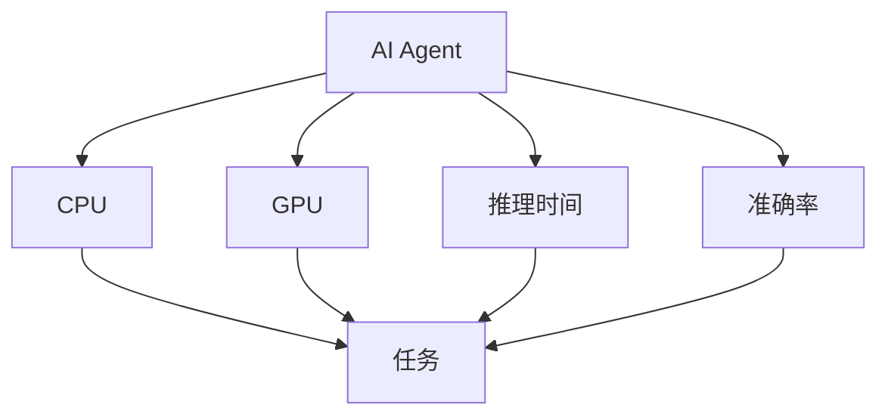
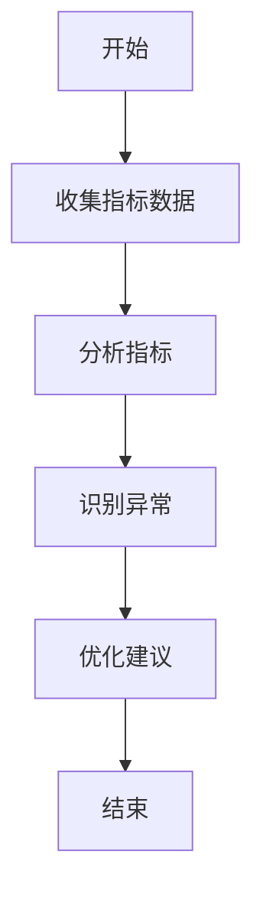
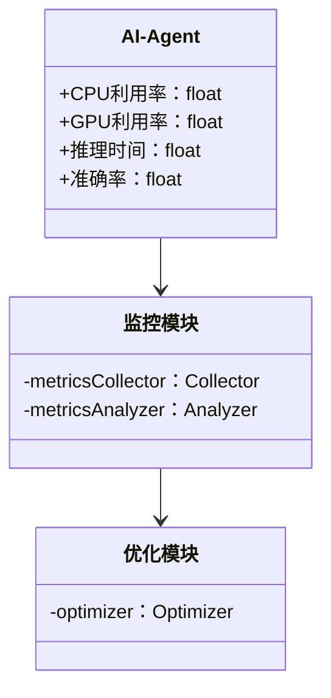
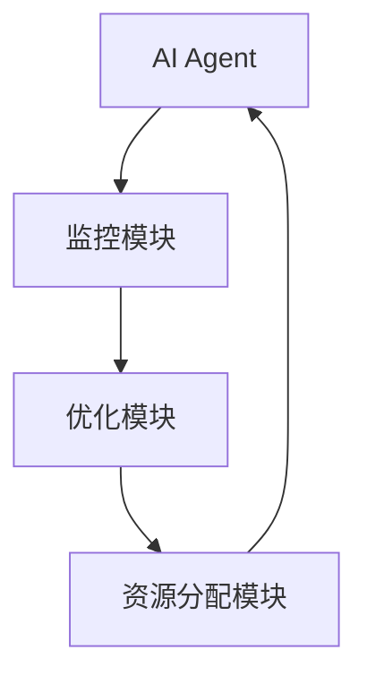
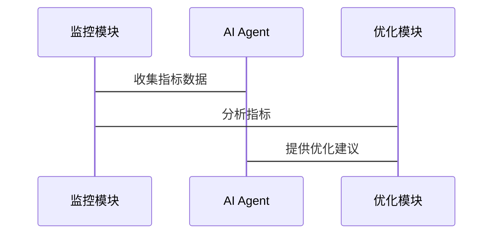

                 


# 监控与优化AI Agent性能的关键指标

> 关键词：AI Agent、性能监控、关键指标、系统优化、算法优化

> 摘要：本文将深入探讨监控与优化AI Agent性能的关键指标，通过分析AI Agent的性能监控与优化的核心概念、关键指标、算法原理、系统架构设计、项目实战和总结与展望，帮助读者系统地理解和掌握如何有效监控与优化AI Agent的性能。

---

## 第一部分：背景介绍

### 第1章：AI Agent性能监控与优化的背景

#### 1.1 问题背景

- **1.1.1 AI Agent在现代系统中的广泛应用**
  - AI Agent在智能推荐、自动驾驶、智能客服等领域的应用案例。
  - AI Agent性能的重要性：响应速度、准确性、资源利用率等。

- **1.1.2 性能监控与优化的重要性**
  - 高性能AI Agent对用户体验和系统效率的影响。
  - 性能问题可能导致的后果：用户流失、系统崩溃、资源浪费。

- **1.1.3 当前AI Agent性能问题的主要挑战**
  - 数据量大、计算复杂度高、动态环境变化快。
  - 多目标优化的复杂性：准确率、响应时间、资源消耗之间的平衡。

#### 1.2 问题描述

- **1.2.1 AI Agent性能监控的核心目标**
  - 监控AI Agent的运行状态，发现性能瓶颈。
  - 优化AI Agent的性能，提升用户体验和系统效率。

- **1.2.2 性能问题的多维度表现**
  - 计算延迟：推理时间过长。
  - 资源消耗：CPU、内存、GPU利用率过高。
  - 精度下降：模型预测准确性降低。

- **1.2.3 监控与优化的边界与外延**
  - 监控的边界：仅关注性能指标，不涉及功能层面。
  - 优化的外延：结合算法改进和系统调优。

#### 1.3 问题解决

- **1.3.1 监控与优化的基本思路**
  - 数据采集：收集AI Agent的运行数据。
  - 数据分析：识别性能瓶颈。
  - 优化实施：调整参数或优化算法。

- **1.3.2 关键指标的选择与应用**
  - 选择合适的指标：CPU利用率、GPU利用率、推理时间、准确率等。
  - 指标权重：不同场景下指标的重要性不同。

- **1.3.3 系统性优化策略**
  - 分阶段优化：先优化算法，再优化系统架构。
  - 综合调优：结合硬件资源和算法改进。

#### 1.4 关键指标的核心要素

- **1.4.1 指标的分类与特征**
  - 计算资源：CPU、GPU利用率。
  - 时间性能：推理时间、响应时间。
  - 服务质量：准确率、召回率。

- **1.4.2 指标之间的相互关系**
  - 高CPU利用率可能导致推理时间增加。
  - 精度下降可能与模型复杂度不足有关。

- **1.4.3 指标选择的策略与原则**
  - 根据场景选择指标：高并发场景关注资源利用率，低延迟场景关注响应时间。

---

## 第二部分：核心概念与联系

### 第2章：监控与优化的关键指标

#### 2.1 关键指标的原理

- **2.1.1 指标监控的基本原理**
  - 数据采集：通过传感器或监控工具获取指标数据。
  - 数据分析：统计分析和机器学习模型分析。

- **2.1.2 指标优化的数学模型**
  - 回归分析：用于预测性能变化。
  - 聚类分析：用于识别性能异常。

#### 2.2 关键指标的特征对比

| 指标类型   | 特征               | 示例                     |
|------------|--------------------|--------------------------|
| 计算资源    | CPU利用率、GPU利用率 | CPU利用率：80%以上异常 |
| 时间性能    | 推理时间、响应时间 | 推理时间：超过阈值异常 |
| 服务质量    | 准确率、召回率     | 准确率：低于阈值异常   |

#### 2.3 实体关系图



---

## 第三部分：算法原理讲解

### 第3章：监控与优化算法

#### 3.1 算法原理

- **3.1.1 基于指标的监控算法**
  - 使用回归分析预测性能变化。
  - 使用聚类分析识别异常指标。

#### 3.2 算法流程图



#### 3.3 算法实现

```python
import numpy as np
from sklearn.linear_model import LinearRegression

def collect_metrics():
    # 收集指标数据
    return np.random.rand(100, 4)

def analyze_metrics(metrics):
    # 使用回归分析预测性能
    model = LinearRegression()
    model.fit(metrics[:, :2], metrics[:, 2])
    return model

# 示例代码
metrics = collect_metrics()
model = analyze_metrics(metrics)
```

#### 3.4 数学模型和公式

- **回归分析模型：**
  $$ y = \beta_0 + \beta_1 x_1 + \beta_2 x_2 + \epsilon $$
  其中，$y$是目标变量，$x_1, x_2$是自变量，$\epsilon$是误差项。

- **聚类分析模型：**
  使用K-means算法将指标数据分为簇，识别异常点。

---

## 第四部分：系统分析与架构设计方案

### 第4章：系统分析与架构设计

#### 4.1 问题场景介绍

- 监控与优化AI Agent性能的场景：实时监控、动态优化。

#### 4.2 系统功能设计



#### 4.3 系统架构设计



#### 4.4 接口设计

- 数据接口：metricsCollector收集指标数据。
- 优化接口：optimizer模块提供优化建议。

#### 4.5 交互序列图



---

## 第五部分：项目实战

### 第5章：项目实战

#### 5.1 环境安装

```bash
pip install numpy matplotlib scikit-learn
```

#### 5.2 系统核心实现

```python
import numpy as np
import matplotlib.pyplot as plt
from sklearn.cluster import KMeans

def collect_data():
    return np.random.rand(100, 4)

def optimize_metrics(data):
    # 使用K-means识别异常点
    model = KMeans(n_clusters=2)
    model.fit(data)
    return model.labels_

# 示例代码
data = collect_data()
labels = optimize_metrics(data)
plt.scatter(data[:, 0], data[:, 1], c=labels)
plt.show()
```

#### 5.3 代码应用解读与分析

- 数据可视化：通过散点图识别异常点。
- 模型优化：基于聚类分析的结果调整AI Agent的参数。

#### 5.4 实际案例分析

- 案例：优化一个图像识别AI Agent的性能。
  - 数据收集：CPU利用率、GPU利用率、推理时间、准确率。
  - 数据分析：发现GPU利用率过高，推理时间过长。
  - 优化措施：优化模型结构，增加GPU资源。

#### 5.5 项目小结

- 关键指标分析的重要性。
- 算法优化与系统调优的结合。

---

## 第六部分：总结与展望

### 第6章：总结与展望

#### 6.1 最佳实践 tips

- 定期监控AI Agent的性能指标。
- 根据场景选择合适的优化策略。
- 结合算法优化和系统调优。

#### 6.2 小结

- 监控与优化AI Agent性能的关键指标是提升系统性能和用户体验的核心方法。
- 通过本文的学习，读者可以掌握如何系统地监控与优化AI Agent的性能。

#### 6.3 注意事项

- 数据采集的准确性：确保监控数据的准确性。
- 优化策略的合理性：避免过度优化导致资源浪费。
- 持续监控与优化：性能优化是一个持续的过程。

#### 6.4 拓展阅读

- 推荐阅读《机器学习实战》、《深度学习》等书籍，深入理解算法优化和系统调优的技巧。

---

通过以上内容，您可以系统地监控与优化AI Agent的性能，提升用户体验和系统效率。希望本文对您有所帮助！

