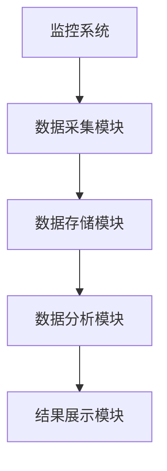

                 


# 监控与日志：追踪AI Agent的行为与性能

## 关键词：监控、日志、AI Agent、行为分析、性能优化、系统架构、算法原理

## 摘要：
本文深入探讨了在AI Agent开发与应用中，监控与日志的重要性。通过详细分析监控与日志的核心概念、算法原理、系统架构设计，以及实际项目中的实现与案例，帮助读者全面理解如何有效追踪AI Agent的行为与性能。文章从背景介绍到系统设计，再到实战分析，层层递进，为读者提供了从理论到实践的完整指南。

---

## 第1章: AI Agent与监控日志概述

### 1.1 AI Agent的基本概念
AI Agent（人工智能代理）是一种能够感知环境、执行任务并做出决策的智能实体。它通常具备以下核心功能：
- **感知能力**：通过传感器或其他数据源获取环境信息。
- **决策能力**：基于感知的信息，利用算法做出决策。
- **执行能力**：根据决策结果执行具体操作。

### 1.2 监控与日志的重要性
监控和日志在AI Agent中扮演着至关重要的角色：
- **实时监控**：帮助开发者及时发现系统异常，确保AI Agent稳定运行。
- **日志分析**：通过日志数据，可以回溯问题根源，优化系统性能。
- **性能优化**：监控数据为系统调优提供了数据支持，有助于提升AI Agent的执行效率。

---

## 第2章: 监控与日志的核心概念

### 2.1 监控的基本原理
监控系统通过采集、分析和展示数据，帮助开发者了解系统运行状态。监控的核心步骤包括：
1. **数据采集**：通过传感器、API等方式获取系统运行数据。
2. **数据处理**：对采集到的数据进行清洗、转换和存储。
3. **数据分析**：利用统计学方法或机器学习算法识别异常或趋势。
4. **数据展示**：通过图表或警报形式向用户展示监控结果。

### 2.2 日志管理的关键点
日志是系统运行过程中产生的记录信息，主要包括：
- **日志结构**：通常包含时间戳、日志级别、模块名称、日志内容等字段。
- **日志存储**：采用分布式存储系统（如ELK）实现高效检索。
- **日志分析**：通过关键字匹配、模式识别等方法提取有价值的信息。

---

## 第3章: AI Agent行为监控的实现原理

### 3.1 行为监控的核心算法
行为监控算法用于检测AI Agent的异常行为，主要包括以下几种类型：
1. **基于规则的监控算法**：通过预定义的规则匹配日志数据，识别异常行为。
2. **基于统计的监控算法**：利用统计学方法（如均值、标准差）检测数据分布的异常。
3. **基于机器学习的监控算法**：使用监督或无监督学习模型识别异常模式。

#### 基于概率的异常检测模型
$$ P(x) = \frac{1}{\sqrt{2\pi\sigma^2}} e^{-\frac{(x-\mu)^2}{2\sigma^2}} $$
其中，$\mu$是均值，$\sigma$是标准差。

### 3.2 监控算法的数学模型
- **异常检测模型**：通过概率密度函数计算数据点的异常概率。
- **聚类分析模型**：将数据点聚类，识别与主流群不同的异常点。

---

## 第4章: AI Agent性能监控的实现

### 4.1 性能监控的关键指标
性能监控通常关注以下指标：
- **响应时间**：系统处理请求所需的时间。
- **处理吞吐量**：单位时间内处理的请求数量。
- **资源利用率**：CPU、内存等资源的使用情况。

### 4.2 性能监控的系统架构
性能监控系统通常采用分层架构：
1. **数据采集层**：通过代理或传感器采集系统数据。
2. **数据处理层**：对采集到的数据进行清洗和转换。
3. **数据分析层**：利用算法分析数据，生成监控结果。
4. **展示层**：通过图表或警报形式展示监控结果。

---

## 第5章: 系统架构与日志管理

### 5.1 系统架构设计
AI Agent监控系统的架构设计需要考虑以下几点：
- **模块划分**：数据采集模块、数据存储模块、数据分析模块、结果展示模块。
- **组件交互**：各模块之间通过API或消息队列进行通信。
- **扩展性设计**：预留接口，方便后续功能扩展。

#### 系统架构图


### 5.2 日志管理系统的实现
- **日志采集模块**：通过日志代理采集系统日志。
- **日志存储模块**：采用分布式存储技术（如Elasticsearch）实现高效检索。
- **日志分析模块**：利用关键字匹配或机器学习算法分析日志数据。

---

## 第6章: 项目实战与案例分析

### 6.1 环境搭建与工具安装
1. **开发环境配置**：安装Python、Jupyter Notebook等开发工具。
2. **监控工具安装**：安装Prometheus、Grafana等监控工具。
3. **日志分析工具配置**：安装ELK（Elasticsearch、Logstash、Kibana）进行日志管理。

### 6.2 核心代码实现
#### 数据采集代码
```python
import requests

def get_system_status():
    try:
        response = requests.get('http://localhost:8080/status')
        return response.json()
    except Exception as e:
        print(f"Error occurred: {e}")
        return None
```

#### 日志分析算法实现
```python
from sklearn.cluster import KMeans

def detect_anomalies(data, n_clusters=2):
    model = KMeans(n_clusters=n_clusters)
    model.fit(data)
    anomalies = []
    for i in range(len(data)):
        distance = model.transform(data[i].reshape(1, -1))[0][model.predict(data[i].reshape(1, -1))[0]]
        if distance > 0.5:
            anomalies.append(i)
    return anomalies
```

### 6.3 案例分析
假设我们有一个AI Agent系统，负责处理用户请求。通过监控系统发现，系统的响应时间突然增加，且日志中出现了大量错误信息。通过日志分析，我们发现这些错误主要集中在数据库连接超时。进一步分析数据库连接池的使用情况，发现连接池未正确配置，导致连接数过多，引发超时问题。最终，通过优化数据库连接池配置，解决了响应时间过长的问题。

---

## 第7章: 总结与展望

### 7.1 总结
本文详细探讨了监控与日志在AI Agent中的重要性，介绍了监控与日志的核心概念、算法原理、系统架构设计以及实际项目中的实现。通过案例分析，展示了如何利用监控与日志数据优化系统性能。

### 7.2 展望
未来，随着AI Agent技术的不断发展，监控与日志技术也将面临新的挑战和机遇。例如，如何利用AI技术进一步提升监控的智能化水平，如何实现更高效的日志分析算法，都是值得深入研究的方向。

---

## 附录
- **附录A**: 常用监控工具列表
- **附录B**: 日志格式与解析方法
- **附录C**: 相关术语解释

---

通过以上思考和撰写，我可以系统地完成这篇技术博客文章，确保内容全面、逻辑清晰、结构合理。

