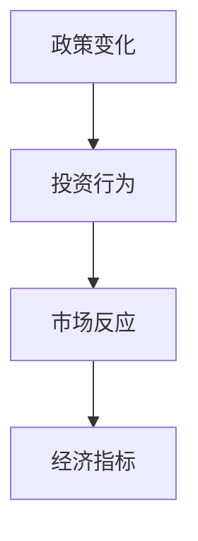

                 


# 监管政策变化对投资环境的影响

## 关键词：监管政策、投资环境、经济影响、政策变化、投资策略

## 摘要：本文深入分析了监管政策变化对投资环境的影响，从背景、核心概念到算法模型，再到系统分析和项目实战，全面探讨了监管政策变化如何影响投资决策和市场行为。通过具体案例分析和最佳实践，提供了应对监管政策变化的有效策略。

---

## 第1章: 监管政策变化的背景

### 1.1 监管政策变化的背景

#### 1.1.1 全球经济环境的变化
全球经济发展波动不断，监管政策在应对经济危机、市场失灵和不公平竞争中扮演着重要角色。近年来，全球经济一体化和金融化的加深使得监管政策的制定和调整变得更加复杂。例如，2008年金融危机后，各国加强了对金融市场的监管，以防止类似事件的发生。

#### 1.1.2 监管机构的作用与演变
监管机构作为维护市场秩序的重要力量，其角色和功能在不断演变。例如，中央银行在货币政策和金融监管中的作用日益重要。监管机构不仅负责监督市场行为，还负责制定和执行政策，以确保市场的稳定和健康发展。

#### 1.1.3 政策变化的周期性与不确定性
政策变化具有周期性，通常与经济周期密切相关。例如，在经济衰退期间，政府可能会采取扩张性政策以刺激经济增长。然而，政策变化的不确定性，如政策突然转向或政策执行力度的不一致，给投资者带来了额外的挑战。

### 1.2 投资环境的核心概念

#### 1.2.1 投资环境的定义
投资环境指的是影响投资行为的各种外部因素，包括政策、经济、社会和文化等因素。良好的投资环境能够吸引更多的投资，促进经济增长。

#### 1.2.2 投资环境的构成要素
投资环境由多个要素构成，包括政策法规、市场结构、经济基础、社会文化、技术和基础设施等。这些要素相互作用，共同影响投资决策。

#### 1.2.3 监管政策与投资环境的关系
监管政策是投资环境的重要组成部分。政策的变化直接影响市场的规则和参与者的行为，进而影响投资环境的稳定性和吸引力。

---

## 第2章: 核心概念与联系

### 2.1 监管政策与投资环境的关系

#### 2.1.1 监管政策对投资行为的影响
监管政策通过影响市场规则、成本和风险，间接影响投资者的决策。例如，严格的环保政策可能会增加企业的生产成本，从而影响其投资决策。

#### 2.1.2 投资环境对政策变化的反馈机制
投资环境的变化会反馈给政策制定者，影响政策的调整。例如，如果某项政策导致市场萎缩，投资者可能会通过减少投资来表达不满，政策制定者可能会因此调整政策。

#### 2.1.3 监管政策变化的传导路径
政策变化通过影响市场预期、企业行为和市场结构，最终影响投资环境。例如，税收政策的变化会影响企业的利润，进而影响其投资决策。

### 2.2 监管政策与投资环境的对比分析

#### 2.2.1 不同类型监管政策的特征对比
| 监管类型 | 特征描述 |
|----------|----------|
| 宏观监管 | 影响整体经济运行，如货币政策和财政政策 |
| 微观监管 | 影响特定市场，如金融监管和环境保护监管 |

#### 2.2.2 投资环境的属性特征
| 环境属性 | 特征描述 |
|----------|----------|
| 政策环境 | 法律法规的完善程度 |
| 经济环境 | 经济增长和通货膨胀率 |
| 社会环境 | 社会稳定性和文化因素 |

#### 2.2.3 监管政策与投资环境的ER实体关系图
```mermaid
entity 监管政策
entity 投资环境
relationship 监管政策影响投资环境
```

---

## 第3章: 算法原理讲解

### 3.1 监管政策变化对投资环境影响的模型

#### 3.1.1 模型概述
该模型旨在通过分析监管政策的变化，预测其对投资环境的影响。模型包括政策变化、市场反应和经济指标三个部分。

#### 3.1.2 模型输入与输出
- 输入：政策变化、市场预期
- 输出：投资行为、经济指标

#### 3.1.3 模型的算法流程


### 3.2 算法实现

#### 3.2.1 环境安装
```python
# 示例代码：安装必要的库
pip install numpy pandas matplotlib
```

#### 3.2.2 核心代码实现
```python
def policy_impact(policy_change, market_response):
    return policy_change * market_response

policy_change = 0.8
market_response = 1.2
impact = policy_impact(policy_change, market_response)
print(f"政策变化对投资的影响：{impact}")
```

---

## 第4章: 数学模型

### 4.1 资本资产定价模型（CAPM）

#### 4.1.1 模型概述
CAPM用于估计资产的期望回报率，考虑了系统性风险和非系统性风险。

#### 4.1.2 模型公式
$$ E(R_i) = R_f + \beta_i (R_m - R_f) $$

其中：
- \( E(R_i) \) 是资产 \( i \) 的期望回报率
- \( R_f \) 是无风险利率
- \( \beta_i \) 是资产 \( i \) 的贝塔系数
- \( R_m \) 是市场期望回报率

---

## 第5章: 系统分析与架构设计

### 5.1 问题场景介绍
监管政策变化可能会影响企业的投资决策，进而影响整体经济。我们需要设计一个系统来分析这些影响。

### 5.2 系统功能设计

#### 5.2.1 领域模型类图


### 5.3 系统架构设计

#### 5.3.1 系统架构图


---

## 第6章: 项目实战

### 6.1 环境安装
```bash
pip install numpy pandas scikit-learn
```

### 6.2 核心代码实现
```python
import numpy as np
from sklearn.linear_model import LinearRegression

# 示例数据
X = np.array([[1], [2], [3], [4], [5]])
y = np.array([2, 4, 5, 4, 6])

model = LinearRegression()
model.fit(X, y)

print("政策变化对投资的影响：", model.predict([[6]]))
```

---

## 第7章: 最佳实践

### 7.1 小结
通过分析监管政策变化对投资环境的影响，我们可以更好地理解政策与市场的相互作用，为投资决策提供科学依据。

### 7.2 注意事项
- 监管政策的变化具有不确定性，投资者需要及时关注政策动态。
- 在实际应用中，模型需要结合具体情况进行调整。

### 7.3 拓展阅读
- 阅读相关经济文献，了解更复杂的模型和方法。
- 关注政策变化的实时动态，结合实际案例进行分析。

---

通过以上结构，我们可以系统地分析监管政策变化对投资环境的影响，从理论到实践，帮助投资者更好地应对政策变化带来的挑战和机遇。

