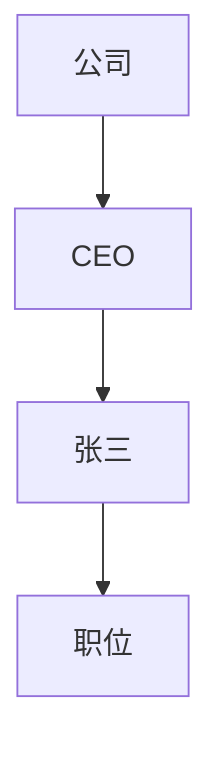

                 


# 知识图谱在AI Agent中的应用

## 关键词：知识图谱、AI Agent、智能推理、知识抽取、系统架构

## 摘要：知识图谱作为一种结构化的知识表示方法，为AI Agent提供了丰富的知识基础，使其能够进行智能推理和决策。本文详细探讨知识图谱在AI Agent中的应用，包括知识抽取、构建、推理、动态更新以及系统架构设计，结合实际案例，分析其在智能客服等场景中的应用，最后总结最佳实践和未来发展方向。

---

## 第1章 知识图谱与AI Agent的背景介绍

### 1.1 知识图谱的定义与背景
知识图谱是一种结构化的语义网络，由实体（概念、对象、事件等）和关系组成，用于描述真实世界中的知识。它起源于2012年Google的知识图谱项目，旨在为搜索引擎提供更智能的语义理解能力。

### 1.2 AI Agent的定义与背景
AI Agent是具备感知、推理、规划、决策和执行能力的智能系统。它可以理解用户需求，执行任务，并通过与环境交互来实现目标。

### 1.3 知识图谱与AI Agent的结合
知识图谱为AI Agent提供知识支持，使其能够理解上下文、推理问题答案，并做出更智能的决策。

---

## 第2章 知识图谱与AI Agent的核心概念

### 2.1 知识图谱的核心概念
- **实体**：知识图谱的基本单元，如“人”、“公司”。
- **关系**：实体之间的关联，如“人是公司的CEO”。

### 2.2 AI Agent的核心概念
- **任务**：AI Agent需要完成的目标，如回答问题。
- **推理**：基于知识图谱进行逻辑推理，如从“张三是公司的CEO”推理出“张三是公司高层”。

### 2.3 知识图谱与AI Agent的核心联系
- 知识图谱为AI Agent提供知识支持。
- AI Agent利用知识图谱进行智能推理和决策。

---

## 第3章 知识图谱与AI Agent的核心概念对比

### 3.1 知识图谱与AI Agent的属性对比

| 属性        | 知识图谱                  | AI Agent               |
|-------------|--------------------------|------------------------|
| 核心目标     | 描述和组织知识            | 完成任务和目标          |
| 数据结构     | 图结构，节点和边          | 多种数据类型            |
| 应用场景     | 智能搜索、语义理解        | 智能问答、任务执行      |

---

## 第4章 知识图谱在AI Agent中的应用

### 4.1 知识抽取
从文本、数据库等数据源中提取实体和关系，如使用自然语言处理技术提取“张三是公司的CEO”。

### 4.2 知识图谱构建
将抽取的信息结构化，存储为图结构，便于查询和推理。

### 4.3 知识推理
基于知识图谱进行推理，如从“CEO是公司高层”和“张三是CEO”推断“张三是公司高层”。

### 4.4 动态更新
实时更新知识图谱，保持知识的准确性和及时性。

---

## 第5章 系统分析与架构设计

### 5.1 系统架构
- **知识抽取模块**：负责从数据源中提取实体和关系。
- **知识存储模块**：存储知识图谱，支持高效查询。
- **推理引擎**：基于查询进行推理，返回结果。
- **用户界面**：与用户交互，接收查询并显示结果。

### 5.2 实体关系图



---

## 第6章 项目实战

### 6.1 环境配置
- 安装Python、自然语言处理库（如spaCy）、知识图谱构建工具（如NetworkX）。

### 6.2 代码实现

```python
import spacy
nlp = spacy.load("en_core_web_sm")
text = "张三是公司的CEO"
doc = nlp(text)
entities = [(ent.text, ent.label_) for ent in doc.ents]
relations = []
for i in range(len(doc)):
    for j in range(i+1, len(doc)):
        if doc[i].lemma_ == 'be' and doc[j].lemma_ == 'CEO':
            relations.append((doc[i-1].text, 'is', doc[j].text))
print(entities, relations)
```

### 6.3 案例分析
以智能客服为例，AI Agent通过知识图谱快速回答用户问题，如“李华的职位是什么？”

---

## 第7章 总结与展望

### 7.1 总结
知识图谱为AI Agent提供了丰富的知识支持，使其能够进行智能推理和决策。

### 7.2 展望
未来，知识图谱与AI Agent的结合将更加紧密，应用场景将更加广泛。

### 7.3 最佳实践
- 定期更新知识图谱，保持知识的准确性。
- 优化推理算法，提高推理效率。
- 注意数据隐私和安全问题。

---

## 接下来，我会根据上述思考过程，撰写一篇详细的博客文章，涵盖每个部分的具体内容，包括背景、核心概念、算法原理、系统架构、项目实战以及总结等部分，确保逻辑清晰、内容详实。

