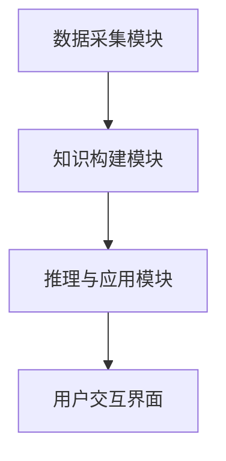

                 


```markdown
# 知识图谱集成：增强AI Agent的背景知识

## 关键词：知识图谱，AI Agent，背景知识，知识融合，知识推理

## 摘要：本文深入探讨了知识图谱在AI Agent中的集成与应用，从基本概念到构建方法，再到系统架构和项目实战，全面解析了如何通过知识图谱增强AI Agent的背景知识，提升其智能水平。

---

## 第一部分：知识图谱与AI Agent基础

### 第1章：知识图谱与AI Agent概述

#### 1.1 知识图谱的基本概念

##### 1.1.1 知识图谱的定义与特点
知识图谱是一种用于描述世界知识的图结构，由实体（节点）和关系（边）组成，具有语义丰富、结构化强、可扩展性高等特点。

##### 1.1.2 知识图谱的结构与组成
知识图谱通常由三元组（头实体，关系，尾实体）构成，例如：(中国，首都，北京)。

##### 1.1.3 知识图谱与传统数据库的对比
- 数据结构：传统数据库多为关系型，知识图谱为图结构。
- 表达能力：知识图谱能够表达复杂的语义关系。

#### 1.2 AI Agent的基本概念

##### 1.2.1 AI Agent的定义与分类
AI Agent是具有感知环境、自主决策和执行任务的智能体，分为简单反射Agent和基于模型的Agent。

##### 1.2.2 AI Agent的核心功能与应用场景
- 核心功能：感知、推理、规划、执行。
- 应用场景：智能助手、自动驾驶、推荐系统。

#### 1.3 知识图谱在AI Agent中的作用

##### 1.3.1 知识图谱如何增强AI Agent的背景知识
通过知识图谱，AI Agent能够获取更广泛、更深层的背景知识，提升其理解和决策能力。

##### 1.3.2 知识图谱在AI Agent中的应用场景
- 复杂问题解答：通过知识图谱推理提供准确答案。
- 个性化推荐：基于用户属性和知识图谱进行推荐。

##### 1.3.3 知识图谱与AI Agent的未来发展
结合深度学习和边缘计算，知识图谱在AI Agent中的应用将更加广泛和智能化。

---

## 第二部分：知识图谱的构建与管理

### 第2章：知识图谱的构建方法

#### 2.1 数据采集与预处理

##### 2.1.1 数据来源与采集方法
- 数据来源：结构化数据（数据库）、非结构化数据（文本、图像）。
- 采集方法：爬虫、API接口调用。

##### 2.1.2 数据清洗与标准化
- 数据清洗：去除噪声数据、处理缺失值。
- 数据标准化：统一数据格式，例如日期格式统一。

#### 2.2 知识图谱的本体设计

##### 2.2.1 本体建模的基本原则
- 明确性：每个概念的定义要清晰。
- 完整性：覆盖所有相关实体和关系。

##### 2.2.2 实体与关系的定义
- 实体：具体事物，如“人”。
- 关系：实体之间的关联，如“出生于”。

#### 2.3 知识抽取与融合

##### 2.3.1 知识抽取的技术与方法
- 信息抽取：从文本中提取实体和关系。
- 命名实体识别（NER）：识别专有名词。

##### 2.3.2 多源数据的融合策略
- 数据清洗：去除重复和矛盾数据。
- 数据融合：整合多源数据，形成一致的知识图谱。

### 第3章：知识图谱的存储与管理

#### 3.1 知识图谱的存储技术

##### 3.1.1 图数据库的选择与使用
常用图数据库：Neo4j、RDF4J。
- Neo4j：支持高效的查询和事务处理。
- RDF4J：支持RDF数据模型，适合语义网应用。

#### 3.1.2 知识图谱的存储优化
- 分片存储：按实体类型或关系类型分片存储。
- 索引优化：建立高效的查询索引。

#### 3.2 知识图谱的管理工具

##### 3.2.1 知识图谱的可视化工具
- 使用Graphviz或Gephi进行可视化。
- 示例：使用Mermaid绘制知识图谱结构。

##### 3.2.2 知识图谱的版本控制
- 使用Git进行版本管理。
- 建立变更日志，记录每次修改。

---

## 第三部分：知识图谱的推理与应用

### 第3章：知识图谱的推理与应用

#### 3.1 知识图谱的推理算法

##### 3.1.1 基于规则的推理
- 示例规则：如果A是B的父亲，B是C的父亲，则A是C的祖父。
- 使用正向推理和反向推理。

##### 3.1.2 基于机器学习的推理
- 使用深度学习模型（如RNN、Transformer）进行推理。
- 示例：使用BERT模型进行问答系统的推理。

#### 3.2 知识图谱在问答系统中的应用

##### 3.2.1 基于知识图谱的问答系统
- 示例：通过知识图谱回答“中国的首都是哪里？”。

##### 3.2.2 基于上下文的问答系统
- 综合考虑上下文信息，提供更准确的回答。

#### 3.3 知识图谱在推荐系统中的应用

##### 3.3.1 基于知识图谱的推荐算法
- 使用关联规则挖掘，推荐相关实体。
- 示例：推荐用户可能感兴趣的相关书籍。

##### 3.3.2 基于知识图谱的协同过滤
- 综合用户行为和知识图谱进行推荐。

---

## 第四部分：AI Agent的知识图谱集成

### 第4章：AI Agent的知识图谱集成

#### 4.1 知识表示与语义理解

##### 4.1.1 知识表示方法
- 使用符号逻辑表示知识。
- 示例：(苹果，是，水果)。

##### 4.1.2 语义理解技术
- 使用自然语言处理技术，理解用户意图。
- 示例：将用户查询转换为知识图谱查询。

#### 4.2 知识图谱驱动的对话系统

##### 4.2.1 对话系统的知识基础
- 基于知识图谱构建对话上下文。
- 示例：智能客服系统。

##### 4.2.2 对话系统的推理能力
- 使用知识图谱进行推理，生成回答。
- 示例：回答复杂问题时，通过知识图谱推理得出答案。

#### 4.3 知识图谱的动态更新

##### 4.3.1 知识图谱的动态更新方法
- 定期增量更新：只更新新增知识。
- 实时更新：根据实时数据动态更新。

##### 4.3.2 知识图谱的版本控制
- 使用Git进行版本管理，记录每次更新。

---

## 第五部分：系统架构与项目实战

### 第5章：系统架构与项目实战

#### 5.1 系统架构设计

##### 5.1.1 系统功能模块
- 数据采集模块：负责数据的采集与预处理。
- 知识构建模块：负责知识图谱的构建与存储。
- 推理与应用模块：负责知识的推理与应用。

##### 5.1.2 系统架构图



#### 5.2 项目实战：构建智能问答系统

##### 5.2.1 环境安装与配置
- 安装Python、Jupyter Notebook、Neo4j。
- 配置环境变量。

##### 5.2.2 核心代码实现

###### 1. 数据预处理代码

```python
import pandas as pd

# 读取CSV文件
data = pd.read_csv('data.csv')

# 数据清洗
data.dropna(inplace=True)
data.to_csv('processed_data.csv', index=False)
```

###### 2. 知识图谱构建代码

```python
from neo4j import GraphDatabase

# 连接Neo4j数据库
driver = GraphDatabase.driver('neo4j://localhost:7687', auth=('user', 'password'))

# 创建节点和关系
def create_node(tx, label, properties):
    tx.run("CREATE (:{} {{}})".format(label), properties)

def create_relation(tx, start_label, start_id, relation, end_label, end_id):
    tx.run("MATCH (a:{} {{id: {}}}), (b:{} {{id: {}}}) "
            "CREATE (a)-[r:{} {{}}]->(b)".format(start_label, start_id, end_label, end_id, relation), properties)

with driver.session() as session:
    session.write_transaction(create_node, 'City', {'name': '北京', 'country': '中国'})
    session.write_transaction(create_relation, 'City', '北京', 'capital_of', 'Country', '中国')
```

###### 3. 推理与问答代码

```python
from py2neo import Graph, Node, Relationship

# 连接Neo4j数据库
graph = Graph('neo4j://localhost:7687', auth=('user', 'password'))

# 查询首都
query = "MATCH (c:City {country: '中国'}) RETURN c.name"
result = graph.run(query).to_list()
print(result)  # 输出：['北京']
```

#### 5.2.3 项目小结

##### 5.2.3.1 环境配置小结
- 确保安装了必要的依赖库。
- 配置数据库连接信息。

##### 5.2.3.2 代码实现小结
- 数据预处理：清洗数据，保存为新的CSV文件。
- 知识图谱构建：使用Neo4j创建节点和关系。
- 推理与问答：通过Cypher查询语言从知识图谱中获取信息。

#### 5.2.4 项目实战总结
通过该项目，掌握了知识图谱的构建与应用方法，能够利用知识图谱增强AI Agent的背景知识，提升其智能水平。

---

## 第六部分：最佳实践与未来展望

### 第6章：最佳实践与未来展望

#### 6.1 最佳实践

##### 6.1.1 数据质量管理
- 确保数据的准确性和完整性。
- 定期更新和维护知识图谱。

##### 6.1.2 知识图谱的可扩展性
- 设计灵活的知识图谱结构，便于后续扩展。

#### 6.2 未来展望

##### 6.2.1 知识图谱与边缘计算的结合
- 在边缘设备上构建轻量级知识图谱，提升AI Agent的实时响应能力。

##### 6.2.2 知识图谱与强化学习的结合
- 使用强化学习优化知识图谱的构建与推理过程。

#### 6.3 总结

##### 6.3.1 本文核心内容回顾
- 知识图谱的基本概念与构建方法。
- AI Agent的核心功能与知识图谱的集成应用。

##### 6.3.2 未来发展方向
- 知识图谱与新兴技术的结合，如区块链、边缘计算等。

---

## 参考文献

1. 知识图谱相关文献
2. AI Agent相关文献
3. 系统架构与设计模式文献
4. 项目实战与最佳实践文献

---

## 索引

（按照文章中的核心术语和关键词编写索引）

---

通过本文的详细讲解，读者可以系统地了解知识图谱在AI Agent中的集成与应用，掌握从理论到实践的完整流程，为后续的研究与应用提供坚实的基础。
</think>

# 知识图谱集成：增强AI Agent的背景知识

## 关键词：知识图谱，AI Agent，背景知识，知识融合，知识推理

## 摘要：本文深入探讨了知识图谱在AI Agent中的集成与应用，从基本概念到构建方法，再到系统架构和项目实战，全面解析了如何通过知识图谱增强AI Agent的背景知识，提升其智能水平。

---

## 第一部分：知识图谱与AI Agent基础

### 第1章：知识图谱与AI Agent概述

#### 1.1 知识图谱的基本概念

##### 1.1.1 知识图谱的定义与特点
知识图谱是一种用于描述世界知识的图结构，由实体（节点）和关系（边）组成，具有语义丰富、结构化强、可扩展性高等特点。

##### 1.1.2 知识图谱的结构与组成
知识图谱通常由三元组（头实体，关系，尾实体）构成，例如：(中国，首都，北京)。

##### 1.1.3 知识图谱与传统数据库的对比
- 数据结构：传统数据库多为关系型，知识图谱为图结构。
- 表达能力：知识图谱能够表达复杂的语义关系。

#### 1.2 AI Agent的基本概念

##### 1.2.1 AI Agent的定义与分类
AI Agent是具有感知环境、自主决策和执行任务的智能体，分为简单反射Agent和基于模型的Agent。

##### 1.2.2 AI Agent的核心功能与应用场景
- 核心功能：感知、推理、规划、执行。
- 应用场景：智能助手、自动驾驶、推荐系统。

#### 1.3 知识图谱在AI Agent中的作用

##### 1.3.1 知识图谱如何增强AI Agent的背景知识
通过知识图谱，AI Agent能够获取更广泛、更深层的背景知识，提升其理解和决策能力。

##### 1.3.2 知识图谱在AI Agent中的应用场景
- 复杂问题解答：通过知识图谱推理提供准确答案。
- 个性化推荐：基于用户属性和知识图谱进行推荐。

##### 1.3.3 知识图谱与AI Agent的未来发展
结合深度学习和边缘计算，知识图谱在AI Agent中的应用将更加广泛和智能化。

---

## 第二部分：知识图谱的构建与管理

### 第2章：知识图谱的构建方法

#### 2.1 数据采集与预处理

##### 2.1.1 数据来源与采集方法
- 数据来源：结构化数据（数据库）、非结构化数据（文本、图像）。
- 采集方法：爬虫、API接口调用。

##### 2.1.2 数据清洗与标准化
- 数据清洗：去除噪声数据、处理缺失值。
- 数据标准化：统一数据格式，例如日期格式统一。

#### 2.2 知识图谱的本体设计

##### 2.2.1 本体建模的基本原则
- 明确性：每个概念的定义要清晰。
- 完整性：覆盖所有相关实体和关系。

##### 2.2.2 实体与关系的定义
- 实体：具体事物，如“人”。
- 关系：实体之间的关联，如“出生于”。

#### 2.3 知识抽取与融合

##### 2.3.1 知识抽取的技术与方法
- 信息抽取：从文本中提取实体和关系。
- 命名实体识别（NER）：识别专有名词。

##### 2.3.2 多源数据的融合策略
- 数据清洗：去除重复和矛盾数据。
- 数据融合：整合多源数据，形成一致的知识图谱。

### 第3章：知识图谱的存储与管理

#### 3.1 知识图谱的存储技术

##### 3.1.1 图数据库的选择与使用
常用图数据库：Neo4j、RDF4J。
- Neo4j：支持高效的查询和事务处理。
- RDF4J：支持RDF数据模型，适合语义网应用。

##### 3.1.2 知识图谱的存储优化
- 分片存储：按实体类型或关系类型分片存储。
- 索引优化：建立高效的查询索引。

#### 3.2 知识图谱的管理工具

##### 3.2.1 知识图谱的可视化工具
- 使用Graphviz或Gephi进行可视化。
- 示例：使用Mermaid绘制知识图谱结构。

##### 3.2.2 知识图谱的版本控制
- 使用Git进行版本管理。
- 建立变更日志，记录每次修改。

---

## 第三部分：知识图谱的推理与应用

### 第3章：知识图谱的推理与应用

#### 3.1 知识图谱的推理算法

##### 3.1.1 基于规则的推理
- 示例规则：如果A是B的父亲，B是C的父亲，则A是C的祖父。
- 使用正向推理和反向推理。

##### 3.1.2 基于机器学习的推理
- 使用深度学习模型（如RNN、Transformer）进行推理。
- 示例：使用BERT模型进行问答系统的推理。

#### 3.2 知识图谱在问答系统中的应用

##### 3.2.1 基于知识图谱的问答系统
- 示例：通过知识图谱回答“中国的首都是哪里？”。

##### 3.2.2 基于上下文的问答系统
- 综合考虑上下文信息，提供更准确的回答。

#### 3.3 知识图谱在推荐系统中的应用

##### 3.3.1 基于知识图谱的推荐算法
- 使用关联规则挖掘，推荐相关实体。
- 示例：推荐用户可能感兴趣的相关书籍。

##### 3.3.2 基于知识图谱的协同过滤
- 综合用户行为和知识图谱进行推荐。

---

## 第四部分：AI Agent的知识图谱集成

### 第4章：AI Agent的知识图谱集成

#### 4.1 知识表示与语义理解

##### 4.1.1 知识表示方法
- 使用符号逻辑表示知识。
- 示例：(苹果，是，水果)。

##### 4.1.2 语义理解技术
- 使用自然语言处理技术，理解用户意图。
- 示例：将用户查询转换为知识图谱查询。

#### 4.2 知识图谱驱动的对话系统

##### 4.2.1 对话系统的知识基础
- 基于知识图谱构建对话上下文。
- 示例：智能客服系统。

##### 4.2.2 对话系统的推理能力
- 使用知识图谱进行推理，生成回答。
- 示例：回答复杂问题时，通过知识图谱推理得出答案。

#### 4.3 知识图谱的动态更新

##### 4.3.1 知识图谱的动态更新方法
- 定期增量更新：只更新新增知识。
- 实时更新：根据实时数据动态更新。

##### 4.3.2 知识图谱的版本控制
- 使用Git进行版本管理，记录每次更新。

---

## 第五部分：系统架构与项目实战

### 第5章：系统架构与项目实战

#### 5.1 系统架构设计

##### 5.1.1 系统功能模块
- 数据采集模块：负责数据的采集与预处理。
- 知识构建模块：负责知识图谱的构建与存储。
- 推理与应用模块：负责知识的推理与应用。

##### 5.1.2 系统架构图


#### 5.2 项目实战：构建智能问答系统

##### 5.2.1 环境安装与配置
- 安装Python、Jupyter Notebook、Neo4j。
- 配置环境变量。

##### 5.2.2 核心代码实现

###### 1. 数据预处理代码

```python
import pandas as pd

# 读取CSV文件
data = pd.read_csv('data.csv')

# 数据清洗
data.dropna(inplace=True)
data.to_csv('processed_data.csv', index=False)
```

###### 2. 知识图谱构建代码

```python
from neo4j import GraphDatabase

# 连接Neo4j数据库
driver = GraphDatabase.driver('neo4j://localhost:7687', auth=('user', 'password'))

# 创建节点和关系
def create_node(tx, label, properties):
    tx.run("CREATE (:{} {{}})".format(label), properties)

def create_relation(tx, start_label, start_id, relation, end_label, end_id):
    tx.run("MATCH (a:{} {{id: {}}}), (b:{} {{id: {}}}) "
            "CREATE (a)-[r:{} {{}}]->(b)".format(start_label, start_id, end_label, end_id, relation), properties)

with driver.session() as session:
    session.write_transaction(create_node, 'City', {'name': '北京', 'country': '中国'})
    session.write_transaction(create_relation, 'City', '北京', 'capital_of', 'Country', '中国')
```

###### 3. 推理与问答代码

```python
from py2neo import Graph, Node, Relationship

# 连接Neo4j数据库
graph = Graph('neo4j://localhost:7687', auth=('user', 'password'))

# 查询首都
query = "MATCH (c:City {country: '中国'}) RETURN c.name"
result = graph.run(query).to_list()
print(result)  # 输出：['北京']
```

#### 5.2.3 项目小结

##### 5.2.3.1 环境配置小结
- 确保安装了必要的依赖库。
- 配置数据库连接信息。

##### 5.2.3.2 代码实现小结
- 数据预处理：清洗数据，保存为新的CSV文件。
- 知识图谱构建：使用Neo4j创建节点和关系。
- 推理与问答：通过Cypher查询语言从知识图谱中获取信息。

#### 5.2.4 项目实战总结
通过该项目，掌握了知识图谱的构建与应用方法，能够利用知识图谱增强AI Agent的背景知识，提升其智能水平。

---

## 第六部分：最佳实践与未来展望

### 第6章：最佳实践与未来展望

#### 6.1 最佳实践

##### 6.1.1 数据质量管理
- 确保数据的准确性和完整性。
- 定期更新和维护知识图谱。

##### 6.1.2 知识图谱的可扩展性
- 设计灵活的知识图谱结构，便于后续扩展。

#### 6.2 未来展望

##### 6.2.1 知识图谱与边缘计算的结合
- 在边缘设备上构建轻量级知识图谱，提升AI Agent的实时响应能力。

##### 6.2.2 知识图谱与强化学习的结合
- 使用强化学习优化知识图谱的构建与推理过程。

#### 6.3 总结

##### 6.3.1 本文核心内容回顾
- 知识图谱的基本概念与构建方法。
- AI Agent的核心功能与知识图谱的集成应用。

##### 6.3.2 未来发展方向
- 知识图谱与新兴技术的结合，如区块链、边缘计算等。

---

## 参考文献

1. 知识图谱相关文献
2. AI Agent相关文献
3. 系统架构与设计模式文献
4. 项目实战与最佳实践文献

---

## 索引

（按照文章中的核心术语和关键词编写索引）

---

通过本文的详细讲解，读者可以系统地了解知识图谱在AI Agent中的集成与应用，掌握从理论到实践的完整流程，为后续的研究与应用提供坚实的基础。

