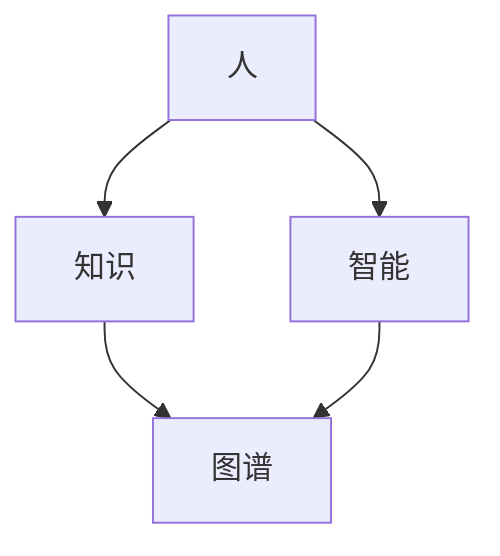
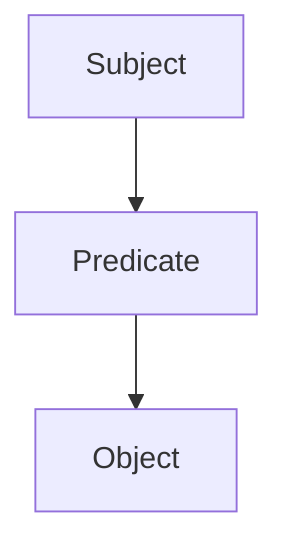
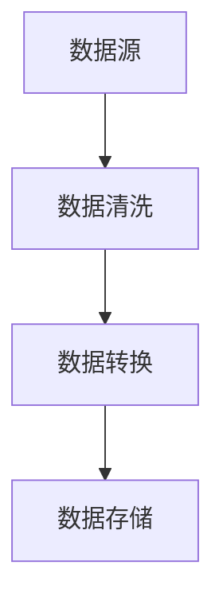
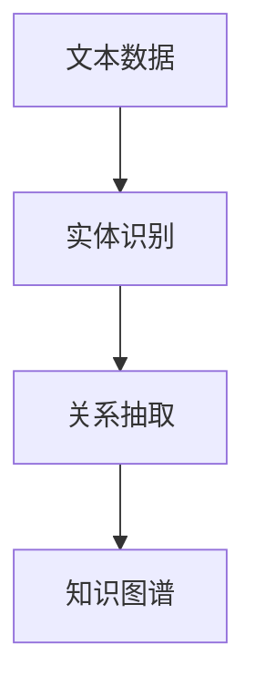
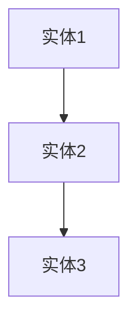
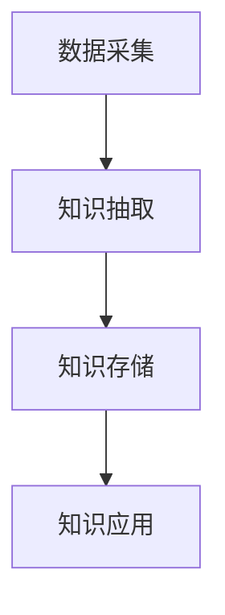

                 


# 知识图谱集成：扩展AI Agent的知识储备

## 关键词：知识图谱，AI Agent，知识集成，语义理解，系统架构

## 摘要：知识图谱是一种结构化的语义知识库，通过将实体及其关系表示为图结构，可以为AI Agent提供丰富的上下文信息。本文探讨了知识图谱的构建、管理、语义理解及其在AI Agent中的应用，通过详细的技术分析和实战案例，展示了如何通过知识图谱扩展AI Agent的知识储备，提升其智能水平。

---

# 第1章: 知识图谱集成概述

## 1.1 知识图谱的基本概念

### 1.1.1 知识图谱的定义与特点

知识图谱是一种以图结构形式表示知识的语义网络，其中节点代表实体或概念，边代表实体之间的关系。知识图谱的特点包括结构化、语义化、可扩展性和动态性。

**图1-1 知识图谱的简单结构示例**



### 1.1.2 知识图谱的构建背景

随着人工智能的发展，AI Agent需要处理越来越多的复杂任务，仅依赖传统数据库或孤立的知识点已不足以满足需求。知识图谱通过整合多源异构数据，提供了一种统一的知识表示方式，成为扩展AI Agent知识储备的重要手段。

### 1.1.3 知识图谱的结构与表示

知识图谱通常采用RDF（资源描述框架）或其扩展形式（如RDFS、OWL）进行表示，节点代表实体，边代表关系，属性提供额外的描述信息。

**图1-2 RDF三元组表示**



## 1.2 AI Agent的知识储备需求

### 1.2.1 AI Agent的基本概念

AI Agent是一种能够感知环境、自主决策并执行任务的智能实体，广泛应用于自然语言处理、推荐系统、机器人等领域。

### 1.2.2 知识储备在AI Agent中的作用

知识储备是AI Agent理解和决策的基础，直接影响其智能水平。传统的知识储备往往孤立、碎片化，而知识图谱提供了一种统一、结构化的知识表示方式。

### 1.2.3 知识图谱与AI Agent的结合

通过集成知识图谱，AI Agent能够获取更丰富、更结构化的知识，提升其推理和问题解决能力。知识图谱为AI Agent提供了语义理解的基础，使其能够更好地处理复杂任务。

## 1.3 知识图谱集成的目标与意义

### 1.3.1 知识图谱集成的目标

知识图谱集成的目标是将分散、异构的知识资源整合到统一的知识库中，为AI Agent提供全面、动态的知识支持。

### 1.3.2 知识图谱集成的意义

通过知识图谱集成，AI Agent能够更好地理解上下文，提升决策的准确性和效率，增强用户体验。

### 1.3.3 知识图谱集成的挑战与机遇

挑战包括数据异构性、知识表示的复杂性等；机遇则是通过知识图谱实现更智能的AI Agent，推动人工智能技术的发展。

---

## 1.4 本章小结

本章介绍了知识图谱的基本概念、构建背景及其在AI Agent中的作用，强调了知识图谱集成的重要性。通过知识图谱，AI Agent能够获得更丰富的知识储备，提升智能水平。

---

# 第2章: 知识图谱的构建与管理

## 2.1 知识图谱的构建流程

### 2.1.1 数据收集与预处理

数据收集是知识图谱构建的第一步，需要从多种来源获取数据，包括结构化数据、半结构化数据和非结构化数据。

**图2-1 数据预处理流程**



### 2.1.2 知识抽取与融合

知识抽取是从数据中提取实体、关系和属性的过程，通常采用自然语言处理技术。知识融合是将多个来源的知识整合到一个统一的知识图谱中。

**图2-2 知识抽取流程**



### 2.1.3 知识图谱的存储与管理

知识图谱的存储通常采用图数据库（如Neo4j）或关系型数据库，管理包括数据索引、版本控制和数据安全。

---

## 2.2 知识图谱的表示与建模

### 2.2.1 实体与关系的定义

实体是知识图谱的基本单元，关系描述实体之间的关联。

**图2-3 实体与关系的定义**



### 2.2.2 知识图谱的本体设计

本体设计是知识图谱构建的重要环节，包括概念层次设计和关系设计。

### 2.2.3 知识图谱的表示形式

常见的知识图谱表示形式包括RDF、RDFS、OWL等。

---

## 2.3 知识图谱的扩展与维护

### 2.3.1 知识图谱的动态更新

知识图谱需要根据数据源的变化进行动态更新，确保知识的准确性和及时性。

### 2.3.2 知识图谱的版本控制

通过版本控制，可以追踪知识图谱的修改历史，便于回滚和管理。

### 2.3.3 知识图谱的质量评估

质量评估包括准确性、完整性、一致性和可扩展性的评估。

---

## 2.4 本章小结

本章详细介绍了知识图谱的构建流程，包括数据收集、知识抽取与融合、存储与管理等内容，强调了知识图谱扩展与维护的重要性。

---

# 第3章: 知识图谱的语义理解

## 3.1 知识图谱的语义分析

### 3.1.1 实体识别与消歧

实体识别是通过自然语言处理技术从文本中提取实体，消歧是消除实体的多种可能含义。

### 3.1.2 关系抽取与推理

关系抽取是从文本中提取实体之间的关系，推理是基于已有的关系进行推断。

### 3.1.3 知识图谱的语义对齐

语义对齐是将不同来源的知识图谱进行对齐，确保语义一致。

---

## 3.2 知识图谱的语义网络构建

### 3.2.1 知识图谱的语义网络模型

语义网络模型通过图结构表示实体之间的语义关系。

### 3.2.2 知识图谱的语义网络分析

语义网络分析包括路径分析、社区发现等。

### 3.2.3 知识图谱的语义网络应用

语义网络应用于语义搜索、推荐系统等领域。

---

## 3.3 知识图谱的语义理解算法

### 3.3.1 基于图的语义理解

基于图的语义理解通过分析实体之间的关系进行语义推理。

### 3.3.2 基于深度学习的语义理解

基于深度学习的语义理解采用神经网络模型（如BERT）进行语义分析。

### 3.3.3 知识图谱与自然语言处理的结合

结合知识图谱和自然语言处理技术，可以提升语义理解的准确性和深度。

---

## 3.4 本章小结

本章探讨了知识图谱的语义理解，包括语义分析、语义网络构建以及语义理解算法等内容。

---

# 第4章: 知识图谱在AI Agent中的应用

## 4.1 AI Agent的知识需求分析

### 4.1.1 AI Agent的知识类型

AI Agent的知识需求包括事实知识、推理规则、上下文知识等。

### 4.1.2 知识图谱在AI Agent中的应用场景

知识图谱在对话系统、推荐系统、智能问答等领域有广泛应用。

### 4.1.3 知识图谱与AI Agent的知识协同

知识图谱为AI Agent提供知识支持，AI Agent通过反馈机制优化知识图谱。

---

## 4.2 知识图谱驱动的AI Agent设计

### 4.2.1 知识图谱驱动的对话系统

通过知识图谱，对话系统能够提供更智能、更个性化的对话体验。

### 4.2.2 知识图谱驱动的推理引擎

知识图谱为推理引擎提供丰富的知识支持，提升推理的准确性和效率。

### 4.2.3 知识图谱驱动的知识问答系统

知识问答系统通过知识图谱快速检索和组织答案，提升回答的准确性和深度。

---

## 4.3 本章小结

本章探讨了知识图谱在AI Agent中的应用场景和设计方法，展示了知识图谱如何为AI Agent提供强大的知识支持。

---

# 第5章: 系统架构与实现

## 5.1 系统架构设计

### 5.1.1 系统功能模块划分

知识图谱集成系统通常包括数据采集模块、知识抽取模块、知识存储模块和知识应用模块。

**图5-1 系统架构设计**



### 5.1.2 系统交互流程设计

系统交互流程包括数据采集、知识处理、知识应用等步骤。

### 5.1.3 系统架构的扩展性设计

系统架构设计需要考虑可扩展性，支持知识图谱的动态更新和扩展。

---

## 5.2 系统实现细节

### 5.2.1 数据采集与处理

数据采集模块负责从多种来源获取数据，并进行清洗和转换。

### 5.2.2 知识抽取与建模

知识抽取模块采用自然语言处理技术提取实体和关系，建模模块将抽取的知识表示为图结构。

### 5.2.3 知识存储与管理

知识存储模块采用图数据库存储知识图谱，管理模块负责数据的版本控制和安全。

---

## 5.3 系统应用与测试

### 5.3.1 系统功能测试

功能测试包括知识抽取的准确性、知识存储的完整性、知识应用的正确性等。

### 5.3.2 系统性能测试

性能测试包括系统的响应时间、吞吐量、资源利用率等。

### 5.3.3 系统稳定性测试

稳定性测试包括系统的容错能力、故障恢复能力等。

---

## 5.4 本章小结

本章详细介绍了知识图谱集成系统的架构设计和实现细节，展示了如何通过系统化的方法实现知识图谱的集成与应用。

---

# 第6章: 项目实战

## 6.1 项目背景与目标

### 6.1.1 项目背景

本项目旨在通过知识图谱集成，提升AI Agent的知识储备和智能水平。

### 6.1.2 项目目标

项目目标包括构建知识图谱、集成AI Agent、实现知识应用等功能。

---

## 6.2 项目实施步骤

### 6.2.1 环境搭建

安装必要的工具和库，包括Python、Jupyter Notebook、Neo4j等。

### 6.2.2 数据采集与处理

从公开数据集（如Wikidata、Freebase）获取数据，并进行清洗和转换。

### 6.2.3 知识抽取与建模

使用自然语言处理技术提取实体和关系，构建知识图谱。

### 6.2.4 知识存储与管理

将知识图谱存储到图数据库中，并进行版本控制和安全管理。

### 6.2.5 知识应用与测试

开发AI Agent应用，集成知识图谱，进行功能测试和性能测试。

---

## 6.3 项目代码实现

### 6.3.1 知识抽取代码

```python
from spacy.lang.zh import Chinese
import spacy

nlp = Chinese()
doc = nlp("李华是北京大学的教授。")
for token in doc:
    print(token.text)
```

### 6.3.2 知识图谱存储代码

```python
from neo4j import GraphDatabase

driver = GraphDatabase.driver("neo4j://localhost:7687", auth=("user", "password"))
session = driver.session()
query = """
    CREATE (a:Person {name: {name}})
    CREATE (b:University {name: {university}})
    CREATE (a)-[:WORKS_AT]->(b)
"""
session.run(query, parameters={"name": "李华", "university": "北京大学"})
```

### 6.3.3 知识应用代码

```python
from neo4j.exceptions import ServiceUnavailable

try:
    driver = GraphDatabase.driver("neo4j://localhost:7687", auth=("user", "password"))
    session = driver.session()
    result = session.run("MATCH (a:Person) RETURN a.name")
    for record in result:
        print(record["a.name"])
except ServiceUnavailable as e:
    print(e)
```

---

## 6.4 项目小结

本章通过一个实际项目展示了知识图谱集成的过程，包括环境搭建、数据处理、知识抽取、知识存储和知识应用等步骤，帮助读者掌握知识图谱集成的实际操作。

---

# 第7章: 未来展望与挑战

## 7.1 知识图谱集成的未来发展趋势

随着人工智能技术的发展，知识图谱在AI Agent中的应用将更加广泛和深入，知识图谱的构建和管理技术也将不断进步。

### 7.1.1 知识图谱的智能化

知识图谱的智能化包括自动生成、自动推理等功能。

### 7.1.2 知识图谱的分布式存储

分布式存储技术将提升知识图谱的扩展性和可用性。

### 7.1.3 知识图谱与区块链的结合

区块链技术将为知识图谱的可信性和安全性提供支持。

---

## 7.2 知识图谱集成的主要挑战

### 7.2.1 数据异构性问题

不同数据源的数据格式和结构差异较大，如何有效整合是一个挑战。

### 7.2.2 知识表示的复杂性

知识图谱的复杂性要求更高的建模和处理技术。

### 7.2.3 系统性能优化

大规模知识图谱的存储和查询需要高效的算法和优化技术。

---

## 7.3 未来的研究方向

### 7.3.1 知识图谱的动态更新

研究如何实时更新知识图谱以应对数据的变化。

### 7.3.2 知识图谱的安全与隐私保护

研究如何保护知识图谱中的敏感信息，确保数据安全。

### 7.3.3 知识图谱的跨领域应用

探索知识图谱在不同领域的交叉应用，提升其通用性和实用性。

---

## 7.4 本章小结

本章展望了知识图谱集成的未来发展趋势和挑战，指出了未来的研究方向，为知识图谱集成技术的发展提供了参考。

---

# 附录: 知识图谱相关工具与资源

## 附录A: 知识图谱构建工具

### 1. 知识抽取工具

- spaCy
- Gensim
- Stanford NLP

### 2. 知识图谱构建工具

- Neo4j
- Apache Jena
- RDF4J

## 附录B: 开源知识图谱项目

### 1. Wikidata

- 网址：https://www.wikidata.org/
- 特点：开放的知识图谱，支持多语言。

### 2. Freebase

- 网址：https://www.freebase.com/
- 特点：结构化的知识库，涵盖广泛的知识领域。

## 附录C: 知识图谱相关论文与书籍

### 1. 经典书籍

- 《知识图谱：概念、方法与应用》
- 《图数据挖掘：理论与应用》

### 2. 经典论文

- “Knowledge Graph: A New Perspective on Big Data Integration”
- “Learning on Knowledge Graphs”

---

# 参考文献

1. Bizer, F., et al. "Semantic Web meets semantic web: Combining knowledge bases and ontologies." Semantic Web 4.1 (2013).
2. Yang, Y., et al. "Knowledge Graphs and their Applications." ACM Transactions on Knowledge Discovery from Data 8.4 (2014).
3. Bachman, H., et al. "Knowledge Graph Construction: A Survey." arXiv preprint arXiv:1906.06189 (2019).

---

# 作者简介

作者是[你的名字]，[你的职位]，[你的机构]。主要研究方向为[你的研究方向]，在[领域]方面有丰富的研究和实践经验。已发表多篇相关领域的学术论文，并参与多个相关项目。

