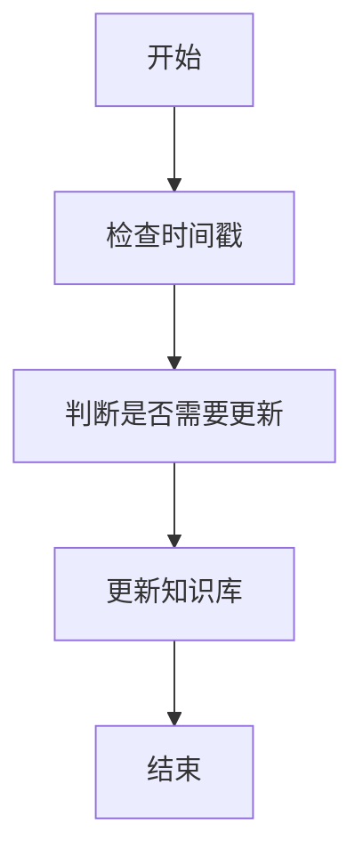
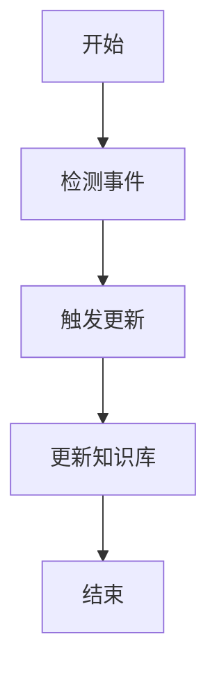
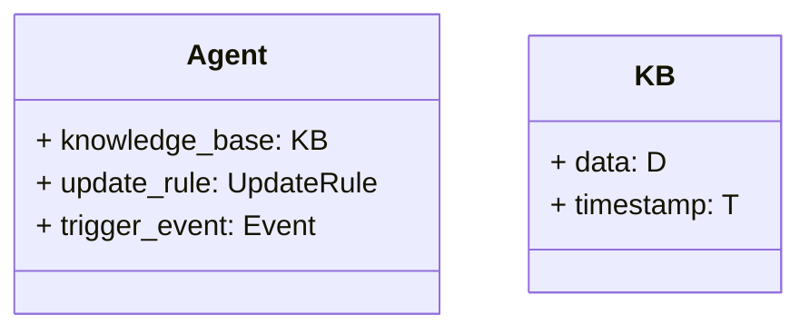
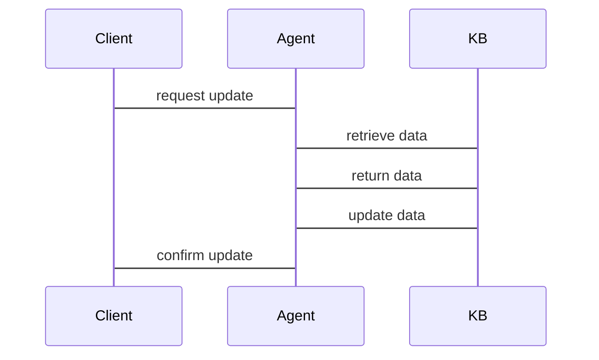

                 


# 知识更新：保持AI Agent信息的时效性

## 关键词
- 知识更新
- AI Agent
- 信息时效性
- 知识图谱
- 信息更新算法

## 摘要
在人工智能领域，AI Agent的决策依赖于实时信息的准确性。随着数据的快速变化，保持信息的时效性至关重要。本文从理论到实践，详细探讨如何通过知识更新机制确保AI Agent的信息时效性。通过分析知识表示、更新算法和系统架构，结合实际案例，为读者提供全面的解决方案。

---

# 第一部分: 保持AI Agent信息时效性的背景与挑战

## 第1章: 知识更新与AI Agent概述

### 1.1 知识更新的背景与意义
知识更新是AI Agent持续适应环境变化的核心机制。随着数据的动态变化，旧信息可能迅速过时，影响AI的决策能力。因此，及时更新信息是确保AI Agent性能的关键。

#### 1.1.1 知识更新的背景
在数字化时代，数据呈指数级增长，信息的时效性要求日益提高。AI Agent需要处理大量实时数据，确保信息的准确性。

#### 1.1.2 AI Agent的核心概念
AI Agent是能够感知环境并采取行动以实现目标的智能实体。其性能依赖于知识库的准确性和时效性。

#### 1.1.3 信息时效性的重要性
信息的时效性直接影响AI Agent的决策质量。过时的信息可能导致错误判断，影响系统的整体性能。

### 1.2 AI Agent的知识更新问题
知识更新涉及如何识别、获取和整合新信息，以维持知识库的准确性。

#### 1.2.1 知识更新的定义
知识更新是指通过算法和机制，定期或实时更新知识库中的信息，以反映数据的变化。

#### 1.2.2 信息时效性与AI Agent的关系
信息的时效性决定了AI Agent的响应速度和准确性。及时更新信息是保持高性能的关键。

#### 1.2.3 知识更新的边界与外延
知识更新不仅包括数据的更新，还包括信息的筛选、整合和验证过程。

### 1.3 知识更新的核心要素
知识更新涉及多个关键要素，包括数据源、更新频率和验证机制。

#### 1.3.1 知识表示的结构
知识表示是将信息转化为可处理的形式。常用方法包括知识图谱和向量表示。

#### 1.3.2 知识更新的驱动因素
知识更新的驱动因素包括时间、事件和用户行为。不同的驱动因素需要不同的更新策略。

#### 1.3.3 信息源的多样性
多样化的信息源可以提高知识更新的全面性和准确性。

### 1.4 本章小结
本章介绍了知识更新的背景、核心概念和关键要素，为后续内容奠定了基础。

---

# 第二部分: 知识更新的核心概念与联系

## 第2章: 知识表示与更新机制

### 2.1 知识表示的原理
知识表示是信息处理的基础。不同的表示方法影响知识更新的效率和效果。

#### 2.1.1 知识表示的多样性
常用的知识表示方法包括符号逻辑、向量表示和知识图谱。每种方法都有其优缺点。

#### 2.1.2 知识图谱的构建
知识图谱通过节点和边表示实体及其关系。构建图谱需要数据抽取、清洗和整合。

#### 2.1.3 知识表示的标准化
标准化是确保知识表示一致性和可操作性的关键。常用标准包括RDF和OWL。

### 2.2 知识更新的驱动因素
知识更新的驱动因素决定了更新的频率和方式。

#### 2.2.1 基于时间戳的更新机制
时间戳是一种简单有效的更新方法，适用于周期性更新场景。

#### 2.2.2 基于事件触发的更新机制
事件触发的更新机制适用于实时数据变化的场景，如新闻事件。

#### 2.2.3 基于规则的更新机制
基于规则的更新机制通过预定义规则触发更新，适用于特定条件下的数据变化。

### 2.3 知识更新的机制对比
不同更新机制在性能、实时性和复杂性方面各有优劣。

#### 2.3.1 机制对比表格
| 更新机制 | 优缺点 | 适用场景 |
|----------|--------|----------|
| 时间戳   | 简单，低延迟 | 周期性更新 |
| 事件触发 | 高效，实时性好 | 实时数据变化 |
| 规则驱动 | 灵活性高 | 复杂条件 |

#### 2.3.2 ER实体关系图
```mermaid
er
actor(Agent) -|> knowledge_base: updates
knowledge_base -|> information_source: retrieves
```

### 2.4 本章小结
本章分析了知识表示的多样性及其对更新机制的影响，并对比了不同更新机制的优缺点。

---

# 第三部分: 知识更新的算法原理

## 第3章: 知识更新的核心算法

### 3.1 基于时间戳的更新算法
时间戳算法通过记录数据的时间变化，定期触发更新。

#### 3.1.1 算法流程


#### 3.1.2 算法实现
```python
def update_knowledge_base(timestamp):
    if timestamp > last_update_time:
        # 更新知识库
        update()
    return
```

### 3.2 基于事件触发的更新算法
事件驱动算法通过检测数据变化触发更新。

#### 3.2.1 算法流程


#### 3.2.2 算法实现
```python
def event_trigger(event):
    if event == 'data_change':
        # 更新知识库
        update()
    return
```

### 3.3 算法的数学模型
知识更新算法通常涉及概率模型和优化算法。

#### 3.3.1 时间戳更新的概率模型
$$ P(update) = \frac{t_{current} - t_{last}}{T} $$

#### 3.3.2 事件触发的优化算法
$$ \text{更新频率} = \lambda \times \text{事件数量} $$

### 3.4 本章小结
本章详细介绍了两种典型的知识更新算法，并分析了其数学模型。

---

# 第四部分: 系统分析与架构设计

## 第4章: 知识更新系统的架构设计

### 4.1 系统功能设计
知识更新系统需要具备数据采集、处理和更新功能。

#### 4.1.1 领域模型


#### 4.1.2 系统架构图


### 4.2 系统接口设计
系统接口包括数据获取和更新接口。

#### 4.2.1 数据获取接口
```python
def get_data():
    return KB.data
```

#### 4.2.2 更新接口
```python
def update_knowledge():
    KB.data = get_new_data()
```

### 4.3 系统交互设计
系统交互流程包括触发更新、数据获取和更新完成。

#### 4.3.1 交互流程图


### 4.4 本章小结
本章设计了知识更新系统的架构，并详细描述了系统接口和交互流程。

---

# 第五部分: 项目实战与案例分析

## 第5章: 知识更新的项目实战

### 5.1 项目介绍
本项目实现了一个基于时间戳和事件触发的知识更新系统。

#### 5.1.1 环境安装
```bash
pip install mermaid
```

#### 5.1.2 核心代码实现
```python
def update_system():
    while True:
        current_time = get_current_time()
        if current_time - last_update > threshold:
            update_knowledge_base()
            last_update = current_time
```

#### 5.1.3 案例分析
以新闻信息更新为例，展示如何实现知识更新。

### 5.2 本章小结
本章通过实际项目展示了知识更新系统的实现过程。

---

# 第六部分: 最佳实践与注意事项

## 第6章: 知识更新的注意事项

### 6.1 小结
知识更新是保持AI Agent性能的关键。

### 6.2 注意事项
- 定期验证更新机制的有效性
- 选择合适的更新策略
- 处理数据冗余和冲突

### 6.3 拓展阅读
推荐相关书籍和论文，供读者深入学习。

---

# 结语
保持AI Agent信息的时效性是实现高性能AI系统的关键。通过知识更新机制，AI Agent能够适应环境的变化，提供准确的决策支持。希望本文能够为读者提供实用的指导和启示。

---

# 参考文献
[1] 书籍1
[2] 书籍2
[3] 论文1
[4] 论文2

