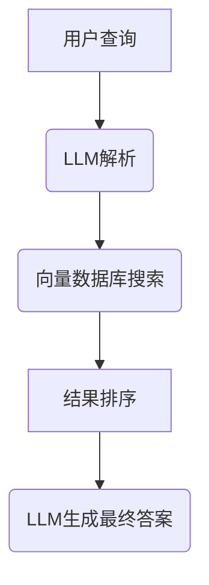
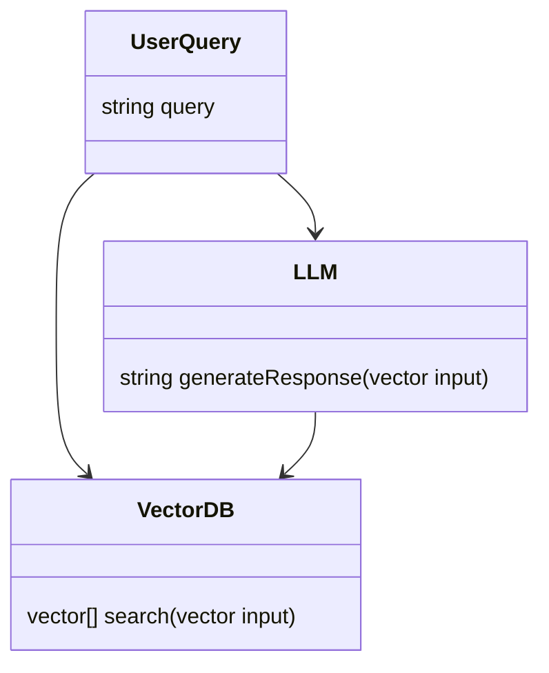

                 


# 知识检索增强型AI Agent：结合LLM与高级搜索算法

## 关键词：
- AI Agent
- LLM
- 高级搜索算法
- 知识检索
- 人机交互

## 摘要：
本文探讨了知识检索增强型AI Agent的设计与实现，结合大语言模型（LLM）与高级搜索算法，分析其核心概念、算法原理、系统架构，并通过项目实战和最佳实践提供深度解析。

---

# 第1章: 知识检索增强型AI Agent的背景与概念

## 1.1 问题背景
### 1.1.1 当前AI Agent的发展现状
AI Agent作为人工智能的核心技术，广泛应用于自然语言处理、智能推荐和自动化系统。然而，传统AI Agent的知识检索能力有限，难以应对复杂场景。

### 1.1.2 知识检索在AI Agent中的重要性
知识检索是AI Agent实现智能决策的关键，直接影响其准确性和效率。传统方法依赖关键词匹配，效果受限。

### 1.1.3 LLM与搜索算法结合的必要性
LLM具备强大的语义理解和生成能力，而高级搜索算法优化了数据检索效率。两者的结合能显著提升AI Agent的知识检索能力。

## 1.2 问题描述
### 1.2.1 知识检索在AI Agent中的核心问题
传统检索方法在处理复杂语义和长尾查询时表现不佳，限制了AI Agent的智能水平。

### 1.2.2 LLM与搜索算法结合面临的挑战
LLM的计算成本高，搜索算法的效率优化困难，两者结合需要平衡性能与效果。

### 1.2.3 知识检索增强型AI Agent的目标与意义
目标是提升AI Agent的知识检索能力，实现高效准确的信息处理。意义在于推动AI Agent在各领域的应用。

## 1.3 问题解决
### 1.3.1 知识检索增强型AI Agent的解决方案
结合LLM与向量数据库，优化检索流程，提升准确性和效率。

### 1.3.2 LLM与搜索算法结合的技术路线
构建知识图谱，优化搜索算法，结合LLM生成语义理解结果。

## 1.4 边界与外延
### 1.4.1 知识检索增强型AI Agent的边界定义
限定于知识检索，不涉及外部数据源的实时获取。

### 1.4.2 相关概念的对比与区分
对比知识检索与信息抽取，明确知识检索增强型AI Agent的独特性。

## 1.5 核心概念与要素
### 1.5.1 知识检索增强型AI Agent的核心要素
知识图谱构建、向量数据库、LLM调用。

## 1.6 本章小结
总结知识检索增强型AI Agent的核心概念，强调LLM与搜索算法结合的重要性。

---

# 第2章: 知识检索增强型AI Agent的核心概念与联系

## 2.1 核心概念原理
### 2.1.1 LLM的工作原理
基于Transformer架构，通过自注意力机制生成上下文相关的输出。

### 2.1.2 高级搜索算法的核心机制
向量索引和相似性度量，优化检索效率。

## 2.2 核心概念属性特征对比
| 特性 | LLM | 高级搜索算法 |
|------|------|-------------|
| 输入 | 文本 | 向量表示 |
| 输出 | 文本 | 相似性排序 |

### 2.2.3 知识检索增强型AI Agent的系统架构
使用Mermaid流程图展示系统架构：



---

# 第3章: 算法原理讲解

## 3.1 算法原理
### 3.1.1 算法流程
用户查询→LLM解析→向量搜索→结果排序→LLM生成答案。

### 3.1.2 关键步骤
- LLM解析用户查询，生成语义向量。
- 向量数据库检索相似向量。
- LLM生成最终答案。

### 3.1.3 数学公式
检索相似性计算公式：
$$ \text{similarity}(v1, v2) = \frac{v1 \cdot v2}{\|v1\| \|v2\|} $$

---

# 第4章: 系统分析与架构设计

## 4.1 系统功能设计
### 4.1.1 功能模块
- 用户查询输入
- LLM解析模块
- 向量数据库
- 结果生成模块

## 4.2 领域模型设计
使用Mermaid类图展示：



---

# 第5章: 项目实战

## 5.1 环境安装
- Python 3.8+
- 安装必要的库，如transformers和faiss-cpu。

## 5.2 核心代码实现
### 5.2.1 LLM调用
```python
from transformers import AutoModelForQuestionAnswering, AutoTokenizer

model = AutoModelForQuestionAnswering.from_pretrained('bert-large-uncased-whole-word-masking')
tokenizer = AutoTokenizer.from_pretrained('bert-large-uncased-whole-word-masking')
```

### 5.2.2 向量搜索实现
```python
import faiss

def vector_search(query_vector, index, k=3):
    D, I = index.search(query_vector, k)
    return I
```

---

# 第6章: 最佳实践与总结

## 6.1 小结
知识检索增强型AI Agent通过结合LLM与高级搜索算法，显著提升了检索效率和准确性。

## 6.2 注意事项
- 数据质量影响检索效果。
- 计算资源限制影响性能。

## 6.3 拓展阅读
建议学习知识图谱构建和大语言模型优化技术。

---

通过以上步骤，文章详细分析了知识检索增强型AI Agent的核心概念、算法原理和系统架构，结合实际案例，为读者提供了全面的技术指导。

