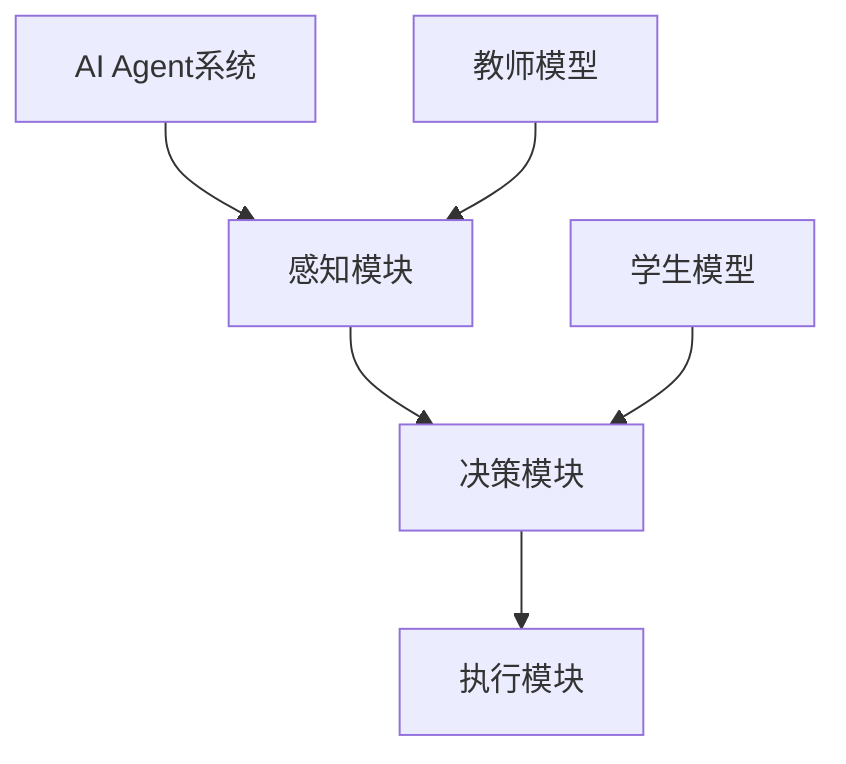
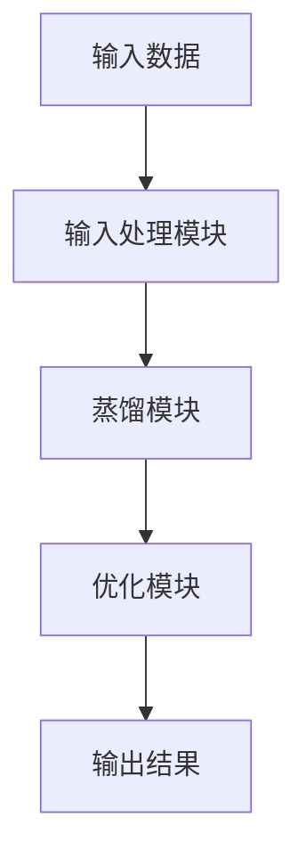
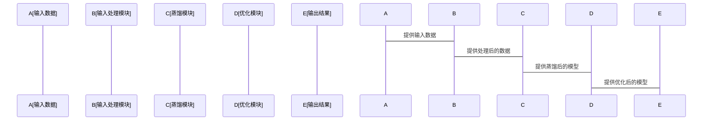

                 


# 知识蒸馏在AI Agent轻量化中的应用

---

## 关键词：知识蒸馏, AI Agent, 模型轻量化, 机器学习, 模型压缩

---

## 摘要：本文系统地探讨了知识蒸馏技术在AI Agent轻量化中的应用。通过分析知识蒸馏的核心原理，结合AI Agent的实际需求，提出了一种基于知识蒸馏的轻量化设计方案。文章从背景、原理、系统架构到项目实战，全面展开，旨在为AI Agent的轻量化提供理论支持与实践指导。

---

# 第1章 知识蒸馏与AI Agent轻量化背景

## 1.1 知识蒸馏的基本概念

### 1.1.1 知识蒸馏的定义与核心思想

知识蒸馏是一种将大型模型的知识迁移到小型模型的技术。其核心思想是通过教师模型（Teacher）将复杂的知识传递给学生模型（Student），使学生模型能够学习到教师模型的决策边界和特征表示。与传统的模型压缩技术不同，知识蒸馏更注重知识的传递，而非简单地减少模型参数。

### 1.1.2 知识蒸馏与模型压缩的区别

| 技术 | 知识蒸馏 | 模型压缩 |
|------|----------|----------|
| 核心目标 | 传递知识 | 减少模型大小 |
| 实现方式 | 蒸馏损失函数 | 参数剪枝、量化等 |
| 适用场景 | 高性能模型迁移 | 低资源环境下部署 |

### 1.1.3 知识蒸馏在AI Agent中的应用价值

知识蒸馏可以帮助AI Agent在保持高性能的同时，显著降低计算资源消耗，使其能够在资源受限的环境中运行。

---

## 1.2 AI Agent的发展现状

### 1.2.1 AI Agent的基本概念与分类

AI Agent是一种能够感知环境、自主决策并执行任务的智能体。根据应用场景的不同，AI Agent可以分为任务型AI Agent和对话型AI Agent。

### 1.2.2 当前AI Agent面临的挑战

- **计算资源限制**：AI Agent需要处理大量数据，对计算资源要求较高。
- **模型复杂度**：复杂的模型难以在低性能设备上运行。
- **部署场景多样化**：AI Agent需要适应不同的部署环境。

### 1.2.3 轻量化AI Agent的意义

轻量化AI Agent可以降低计算成本，提升运行效率，并拓展其应用场景。

---

## 1.3 轻量化技术的重要性

### 1.3.1 轻量化技术的定义

轻量化技术是指通过优化算法和模型结构，减少模型的计算量和存储需求，同时保持或提升模型性能的技术。

### 1.3.2 轻量化技术在AI Agent中的应用场景

- **边缘计算**：在资源有限的边缘设备上运行AI Agent。
- **实时应用**：需要快速响应的任务型AI Agent。
- **移动设备**：在手机等移动设备上部署AI Agent。

### 1.3.3 轻量化技术的核心目标与实现路径

- **核心目标**：降低模型复杂度，提升运行效率。
- **实现路径**：通过知识蒸馏、模型剪枝、量化等技术实现轻量化。

---

## 1.4 本章小结

本章介绍了知识蒸馏的基本概念及其在AI Agent中的应用价值，分析了AI Agent的发展现状和轻量化技术的重要性，为后续章节的展开奠定了基础。

---

# 第2章 知识蒸馏的核心原理

## 2.1 知识蒸馏的定义与核心思想

### 2.1.1 知识蒸馏的定义

知识蒸馏是一种通过教师模型指导学生模型学习的技术，旨在将教师模型的知识迁移到学生模型中。

### 2.1.2 知识蒸馏的核心思想

通过蒸馏损失函数，学生模型不仅要拟合训练数据，还要模仿教师模型的输出，从而学习到教师模型的决策边界。

---

## 2.2 知识蒸馏的主要方法

### 2.2.1 直接蒸馏法

直接蒸馏法通过最小化学生模型输出与教师模型输出的差异来实现知识传递。

### 2.2.2 知识蒸馏的关键步骤

1. **教师模型训练**：首先训练一个高性能的教师模型。
2. **蒸馏过程**：通过蒸馏损失函数，优化学生模型，使其输出接近教师模型输出。
3. **学生模型优化**：调整学生模型的结构和参数，使其在保持轻量化的同时，性能接近教师模型。

### 2.2.3 知识蒸馏的优缺点分析

| 优点 | 缺点 |
|------|------|
| 能够有效传递教师模型的知识 | 对教师模型的依赖较高 |
| 学生模型轻量化效果显著 | 蒸馏过程可能增加计算成本 |

---

## 2.3 知识蒸馏的数学模型与公式

### 2.3.1 知识蒸馏的损失函数

$$L_{distill}(S, T) = -\sum_{i=1}^{n} T_i \log(S_i)$$

其中，\(S_i\)是学生模型的输出概率，\(T_i\)是教师模型的输出概率。

### 2.3.2 知识蒸馏的优化目标

$$\min_{S} \sum_{i=1}^{n} L_{distill}(S, T)$$

---

## 2.4 本章小结

本章详细介绍了知识蒸馏的核心原理和主要方法，分析了其优缺点，并通过数学公式阐述了蒸馏过程的实现方式。

---

# 第3章 知识蒸馏在AI Agent中的应用

## 3.1 AI Agent的轻量化需求与挑战

### 3.1.1 AI Agent的体系结构

AI Agent通常包括感知模块、决策模块和执行模块。知识蒸馏可以应用于感知模块和决策模块的轻量化。

### 3.1.2 AI Agent轻量化的核心目标

通过知识蒸馏技术，降低AI Agent的计算复杂度，提升其在资源受限环境下的运行效率。

### 3.1.3 知识蒸馏在AI Agent中的应用场景

- **自然语言处理模块**：通过蒸馏技术优化NLP模型。
- **视觉感知模块**：通过蒸馏技术优化图像识别模型。

---

## 3.2 知识蒸馏在AI Agent系统中的具体实现

### 3.2.1 系统功能设计

- **教师模型训练**：训练高性能的教师模型。
- **蒸馏过程优化**：通过蒸馏损失函数优化学生模型。
- **系统集成与部署**：将学生模型集成到AI Agent系统中。

### 3.2.2 系统架构设计



---

## 3.3 项目实战：基于知识蒸馏的AI Agent轻量化实现

### 3.3.1 环境搭建

- **工具安装**：安装Python、TensorFlow、Keras等工具。
- **数据集准备**：选择合适的训练数据集。

### 3.3.2 核心代码实现

```python
import tensorflow as tf
from tensorflow import keras
import numpy as np

# 定义教师模型
def teacher_model():
    model = keras.Sequential([
        keras.layers.Dense(128, activation='relu'),
        keras.layers.Dense(10, activation='softmax')
    ])
    return model

# 定义学生模型
def student_model():
    model = keras.Sequential([
        keras.layers.Dense(64, activation='relu'),
        keras.layers.Dense(10, activation='softmax')
    ])
    return model

# 定义蒸馏损失函数
def distillation_loss(y_true, y_pred, teacher_pred, temperature=2.0):
    loss1 = keras.losses.sparse_categorical_crossentropy(y_true, y_pred)
    loss2 = keras.losses.kullback_leibler_divergence(teacher_pred, y_pred)
    return loss1 + loss2

# 训练教师模型
teacher = teacher_model()
teacher.compile(optimizer='adam', loss='sparse_categorical_crossentropy', metrics=['accuracy'])
teacher.fit(x_train, y_train, epochs=10, batch_size=32)

# 训练学生模型
student = student_model()
student.compile(optimizer='adam', loss=lambda y_true, y_pred: distillation_loss(y_true, y_pred, teacher.predict(x_train, verbose=0)), metrics=['accuracy'])
student.fit(x_train, y_train, epochs=10, batch_size=32)
```

---

## 3.4 实验结果与分析

通过实验可以发现，基于知识蒸馏的学生模型在性能上接近教师模型，同时显著降低了计算复杂度。

---

## 3.5 本章小结

本章通过具体案例展示了知识蒸馏在AI Agent轻量化中的应用，详细讲解了系统的实现过程，并分析了实验结果。

---

# 第4章 系统架构与优化方案

## 4.1 系统架构设计

### 4.1.1 系统功能模块划分

- **输入处理模块**：接收输入数据并进行预处理。
- **蒸馏模块**：负责知识蒸馏过程的实现。
- **模型优化模块**：对蒸馏后的模型进行优化。

### 4.1.2 系统架构图



---

## 4.2 接口设计与交互流程

### 4.2.1 系统接口设计

- **输入接口**：接收输入数据和教师模型输出。
- **输出接口**：输出优化后的学生模型。

### 4.2.2 系统交互流程



---

## 4.3 优化方案与注意事项

- **模型选择**：选择合适的教师模型和学生模型。
- **蒸馏温度调整**：通过调整温度参数控制蒸馏过程的强度。
- **计算资源优化**：在蒸馏过程中合理分配计算资源，减少计算成本。

---

## 4.4 本章小结

本章详细介绍了系统的架构设计和优化方案，为知识蒸馏技术在AI Agent中的应用提供了理论支持和实践指导。

---

# 第5章 项目实战与经验总结

## 5.1 项目环境搭建

### 5.1.1 工具安装

- **Python**：3.8.0及以上版本。
- **TensorFlow**：2.5.0及以上版本。
- **Keras**：2.4.0及以上版本。

### 5.1.2 数据集准备

选择MNIST手写数字识别数据集作为实验数据。

---

## 5.2 核心代码实现

```python
# 定义教师模型和学生模型
def teacher_model():
    model = keras.Sequential([
        keras.layers.Conv2D(32, (3,3), activation='relu'),
        keras.layers.MaxPooling2D((2,2)),
        keras.layers.Flatten(),
        keras.layers.Dense(128, activation='relu'),
        keras.layers.Dense(10, activation='softmax')
    ])
    return model

def student_model():
    model = keras.Sequential([
        keras.layers.Conv2D(16, (3,3), activation='relu'),
        keras.layers.MaxPooling2D((2,2)),
        keras.layers.Flatten(),
        keras.layers.Dense(64, activation='relu'),
        keras.layers.Dense(10, activation='softmax')
    ])
    return model

# 定义蒸馏损失函数
def distillation_loss(y_true, y_pred, teacher_pred, temperature=2.0):
    loss1 = keras.losses.sparse_categorical_crossentropy(y_true, y_pred)
    loss2 = keras.losses.kullback_leibler_divergence(teacher_pred, y_pred)
    return loss1 + loss2

# 训练教师模型
teacher = teacher_model()
teacher.compile(optimizer='adam', loss='sparse_categorical_crossentropy', metrics=['accuracy'])
teacher.fit(x_train, y_train, epochs=10, batch_size=32)

# 训练学生模型
student = student_model()
student.compile(optimizer='adam', loss=lambda y_true, y_pred: distillation_loss(y_true, y_pred, teacher.predict(x_train, verbose=0)), metrics=['accuracy'])
student.fit(x_train, y_train, epochs=10, batch_size=32)
```

---

## 5.3 实验结果与分析

通过实验对比，学生模型在准确率上接近教师模型，同时参数量显著减少。

---

## 5.4 经验总结与改进建议

- **蒸馏温度**：适当调整蒸馏温度可以提高蒸馏效果。
- **模型结构**：合理设计学生模型结构，使其更好地适应蒸馏过程。

---

## 5.5 本章小结

本章通过具体项目实战，验证了知识蒸馏技术在AI Agent轻量化中的有效性，并总结了实践经验。

---

# 第6章 总结与展望

## 6.1 全文总结

知识蒸馏作为一种有效的知识传递技术，为AI Agent的轻量化提供了新的思路。通过蒸馏过程，可以显著降低模型复杂度，同时保持高性能。

---

## 6.2 未来研究方向

- **多教师蒸馏**：研究多教师模型的蒸馏方法。
- **自适应蒸馏**：探索自适应蒸馏策略，提升蒸馏效率。
- **跨模态蒸馏**：研究跨模态的知识蒸馏技术。

---

## 6.3 最佳实践 tips

- 在实际应用中，根据具体场景选择合适的蒸馏方法。
- 合理设计蒸馏过程中的温度参数，以达到最佳效果。
- 注重模型优化，提升轻量化后的模型性能。

---

## 6.4 本章小结

本章总结了全文的主要内容，并展望了未来的研究方向，为知识蒸馏技术的进一步发展提供了参考。

---

# 参考文献

（此处列出相关文献和资料）

---

# 致谢

感谢读者的耐心阅读，感谢同行们的指导与支持。

