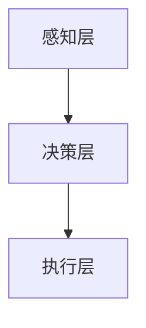

                 


# 知识蒸馏技术在AI Agent轻量化中的创新应用

---

## 关键词
知识蒸馏，AI Agent，轻量化，机器学习，深度学习，模型压缩

---

## 摘要
随着人工智能技术的快速发展，AI Agent（智能体）在各个领域的应用日益广泛。然而，AI Agent的复杂性和计算需求常常限制了其在资源受限环境中的应用。知识蒸馏作为一种有效的模型压缩技术，能够将复杂模型的知识迁移到更简单的模型中，从而实现轻量化。本文将详细探讨知识蒸馏技术在AI Agent轻量化中的创新应用，从理论基础到实际案例，分析其在提升性能、降低计算成本方面的优势，并展望未来的发展方向。

---

## 第1章：知识蒸馏技术概述

### 1.1 知识蒸馏技术的基本概念
知识蒸馏是一种通过将复杂模型的知识迁移到简单模型的技术，旨在在不损失性能的前提下降低模型的复杂度。其核心思想是通过教师模型（Teacher）指导学生模型（Student），使学生模型能够学习到教师模型的决策边界和特征表示。

### 1.2 AI Agent的轻量化需求
AI Agent需要在实时性和资源占用之间找到平衡。知识蒸馏通过减少模型参数和计算复杂度，使AI Agent能够在低功耗设备上高效运行。

### 1.3 知识蒸馏技术的背景与现状
知识蒸馏起源于神经网络压缩领域，近年来在自然语言处理、计算机视觉等领域得到广泛应用。本文将重点探讨其在AI Agent中的创新应用。

---

## 第2章：知识蒸馏技术的核心原理

### 2.1 知识蒸馏的基本原理
知识蒸馏通过调整损失函数，使学生模型在教师模型的指导下进行优化。教师模型输出的概率分布被用作软标签，指导学生模型的学习。

### 2.2 知识蒸馏的数学模型与公式
知识蒸馏的损失函数通常由两部分组成：交叉熵损失和蒸馏损失。公式如下：
$$
L_{\text{total}} = (1-\alpha)L_{\text{CE}}(S, Y) + \alpha L_{\text{CE}}(S, T)
$$
其中，$\alpha$ 是蒸馏系数，$T$ 是教师模型的输出，$S$ 是学生模型的输出。

### 2.3 算法实现的步骤分解
1. 训练教师模型并获取其输出。
2. 初始化学生模型。
3. 在蒸馏过程中，优化学生模型以最小化蒸馏损失。

### 2.4 算法实现的代码示例
```python
import torch
import torch.nn as nn
import torch.optim as optim

# 定义教师模型和学生模型
teacher = ...
student = ...

# 定义蒸馏损失函数
def distillation_loss(teacher_logits, student_logits, temperature=1.0):
    teacher_probs = torch.nn.functional.softmax(teacher_logits / temperature, dim=-1)
    student_probs = torch.nn.functional.softmax(student_logits / temperature, dim=-1)
    loss = -torch.sum(teacher_probs * torch.log(student_probs))
    return loss.mean()

# 初始化优化器
optimizer = optim.Adam(student.parameters())

# 蒸馏训练
for epoch in range(num_epochs):
    for batch in dataloader:
        optimizer.zero_grad()
        with torch.no_grad():
            teacher_outputs = teacher(batch)
        student_outputs = student(batch)
        loss = distillation_loss(teacher_outputs, student_outputs)
        loss.backward()
        optimizer.step()
```

---

## 第3章：知识蒸馏在AI Agent中的应用

### 3.1 AI Agent的任务分解与蒸馏
AI Agent通常需要处理多任务或多模态数据。知识蒸馏可以通过任务分解，将复杂任务拆解为简单任务，逐一优化。

### 3.2 多模态数据的蒸馏处理
在处理图像和文本的多模态数据时，知识蒸馏可以分别蒸馏图像和文本特征，再进行融合。

### 3.3 知识蒸馏的创新应用
创新点包括：动态蒸馏、自适应蒸馏策略、多阶段蒸馏等。

---

## 第4章：系统架构设计

### 4.1 系统功能设计
AI Agent系统通常包括感知层、决策层和执行层。知识蒸馏技术主要应用于感知层和决策层的模型压缩。

### 4.2 系统架构设计
使用mermaid图展示系统架构：


### 4.3 接口设计
定义接口：`agent.distill(teacher_model, student_model)`，用于执行蒸馏过程。

---

## 第5章：项目实战

### 5.1 环境安装
安装必要的库：`torch`, `numpy`, `matplotlib`。

### 5.2 核心实现
实现知识蒸馏的核心代码，包括教师模型、学生模型和蒸馏函数。

### 5.3 案例分析
以自然语言处理任务为例，展示知识蒸馏在AI Agent中的具体应用。

---

## 第6章：总结与展望

### 6.1 本章小结
总结知识蒸馏在AI Agent轻量化中的应用价值和技术优势。

### 6.2 未来展望
探讨知识蒸馏技术的未来发展方向，如动态蒸馏、自适应蒸馏等。

---

## 附录

### 附录A：工具与库安装
安装命令：`pip install torch numpy matplotlib`

### 附录B：数据集与模型代码
提供示例数据集和代码。

---

通过以上结构，本文系统地介绍了知识蒸馏技术在AI Agent轻量化中的创新应用，从理论到实践，为读者提供了全面的技术指导。

