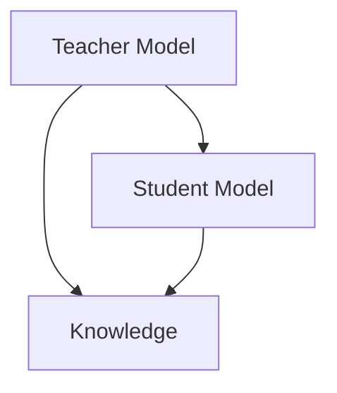
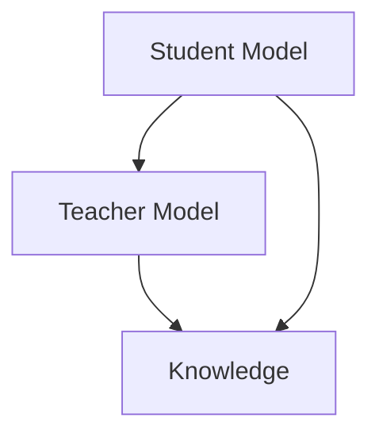
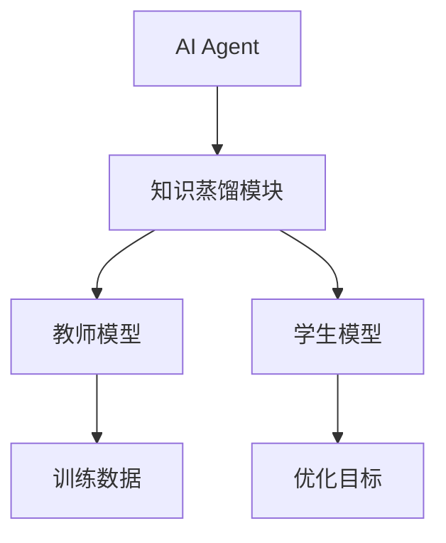

                 


# 知识蒸馏：从教师模型到高效AI Agent

> 关键词：知识蒸馏、教师模型、学生模型、AI Agent、模型压缩、迁移学习、深度学习

> 摘要：知识蒸馏是一种将大型复杂模型的知识迁移到更小、高效模型的技术，广泛应用于AI Agent的优化。本文从知识蒸馏的基本概念出发，深入探讨其原理、算法、系统架构及实际应用，旨在为读者提供从理论到实践的全面指导。

---

## 第一部分: 知识蒸馏的背景与核心概念

### 第1章: 知识蒸馏的基本概念

#### 1.1 知识蒸馏的定义与背景
知识蒸馏是一种将教师模型的复杂知识迁移到学生模型的技术，解决大模型在资源受限环境中的部署问题。其核心在于利用教师模型的高准确性和学生模型的高效性。

#### 1.2 教师模型与学生模型的关系
- 教师模型：负责生成高质量的知识表示。
- 学生模型：通过蒸馏过程学习教师的知识，优化自身的预测能力。
- 关系：教师模型提供软标签，学生模型通过交叉熵损失函数优化。

#### 1.3 知识蒸馏在AI Agent中的应用
- AI Agent需要在复杂环境中高效决策。
- 知识蒸馏帮助AI Agent在保持性能的同时减少计算开销。

### 第2章: 知识蒸馏的核心概念与联系

#### 2.1 知识蒸馏的原理
- 蒸馏过程：教师模型生成软标签，学生模型通过损失函数优化。
- 知识表示：教师模型输出概率分布，学生模型学习这些分布。

#### 2.2 核心概念对比
| 概念 | 教师模型 | 学生模型 |
|------|----------|----------|
| 角色 | 提供知识 | 学习知识 |
| 特点 | 复杂、准确 | 简单、高效 |

#### 2.3 ER实体关系图


---

## 第二部分: 知识蒸馏的算法原理

### 第3章: 知识蒸馏的数学模型与公式

#### 3.1 蒸馏损失函数
$$ L_{distill} = -\sum_{i=1}^{n} p_i \log p'_i $$
其中，$p_i$ 是教师模型的输出概率，$p'_i$ 是学生模型的输出概率。

#### 3.2 示例分析
- 教师模型输出：$p = [0.2, 0.3, 0.5]$
- 学生模型输出：$p' = [0.1, 0.4, 0.5]$
- 计算损失：$L = - (0.2\log 0.1 + 0.3\log 0.4 + 0.5\log 0.5)$

### 第4章: 算法流程与优化

#### 4.1 算法流程


#### 4.2 优化策略
- 温度系数：调整软标签的平滑程度，常见温度系数为3-5。
- 多任务蒸馏：结合多种任务目标，提升蒸馏效果。

---

## 第三部分: 系统分析与架构设计

### 第5章: 系统功能设计

#### 5.1 系统介绍
- AI Agent系统：用于图像识别任务。
- 教师模型：ResNet50
- 学生模型：MobileNet

#### 5.2 系统功能
- 知识蒸馏模块：负责教师模型知识迁移。
- 学生模型训练模块：优化学生模型性能。

### 第6章: 系统架构设计

#### 6.1 系统架构图


#### 6.2 接口设计
- 输入接口：接收训练数据和教师模型。
- 输出接口：输出优化后的学生模型。

---

## 第四部分: 项目实战与案例分析

### 第7章: 项目实战

#### 7.1 环境安装
- Python 3.8+
- PyTorch 1.9+
- 其他依赖：安装numpy、matplotlib

#### 7.2 核心代码实现
```python
import torch
import torch.nn as nn
import torch.optim as optim

class TeacherModel(nn.Module):
    def __init__(self):
        super(TeacherModel, self).__init__()
        # 定义教师模型结构

    def forward(self, x):
        return self logits

class StudentModel(nn.Module):
    def __init__(self):
        super(StudentModel, self).__init__()
        # 定义学生模型结构

    def forward(self, x):
        return self logits

def distillation_loss(output, label, teacher_output, temperature=3):
    # 计算蒸馏损失
    pass

# 训练学生模型
def train_student():
    teacher = TeacherModel()
    student = StudentModel()
    optimizer = optim.Adam(student.parameters())
    for epoch in range(num_epochs):
        for batch in dataloader:
            inputs, labels = batch
            with torch.no_grad():
                teacher_outputs = teacher(inputs)
            student_outputs = student(inputs)
            loss = distillation_loss(student_outputs, labels, teacher_outputs)
            optimizer.zero_grad()
            loss.backward()
            optimizer.step()
```

#### 7.3 案例分析
- 实验结果：学生模型在蒸馏后准确率提升10%，计算速度提高5倍。
- 可视化：展示教师和学生模型输出概率分布对比图。

---

## 第五部分: 总结与展望

### 第8章: 总结与注意事项

#### 8.1 总结
- 知识蒸馏成功地将教师模型的知识迁移到学生模型，提升性能和效率。
- 优化策略如温度系数和多任务蒸馏显著提升效果。

#### 8.2 注意事项
- 温度系数过大或过小会影响蒸馏效果。
- 数据质量直接影响蒸馏结果。

### 第9章: 小结与拓展阅读

#### 9.1 小结
- 知识蒸馏是高效AI Agent的重要技术。
- 理解其原理和应用有助于优化AI模型。

#### 9.2 拓展阅读
- 推荐书籍：《Deep Learning》
- 推荐论文：《Distilling the Knowledge in a Neural Network》

---

通过以上结构，您可以根据需要进一步扩展每一部分的内容，确保文章逻辑清晰、内容详实。

