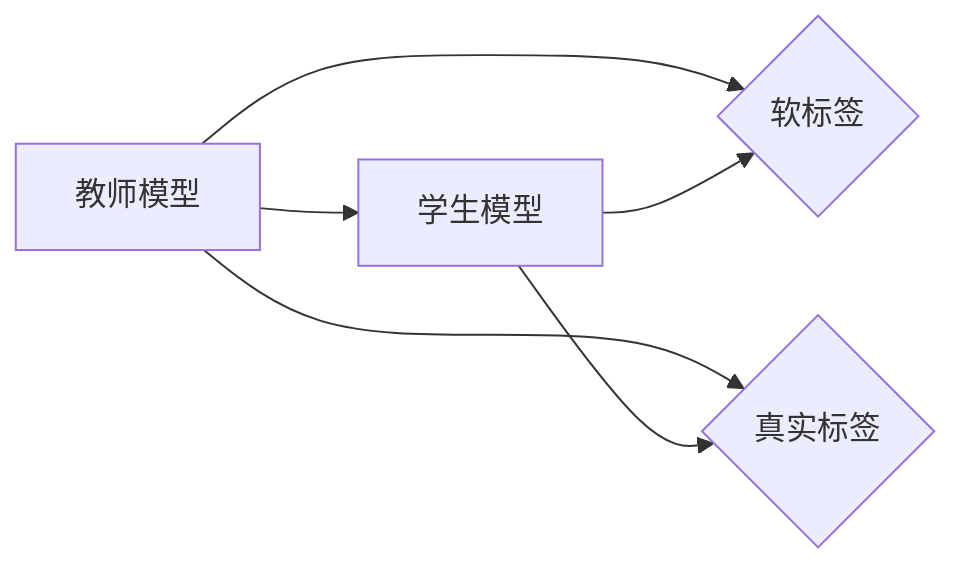
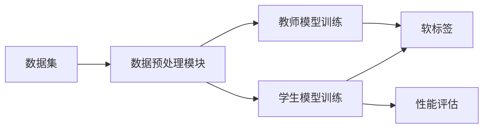
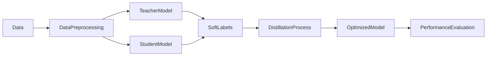
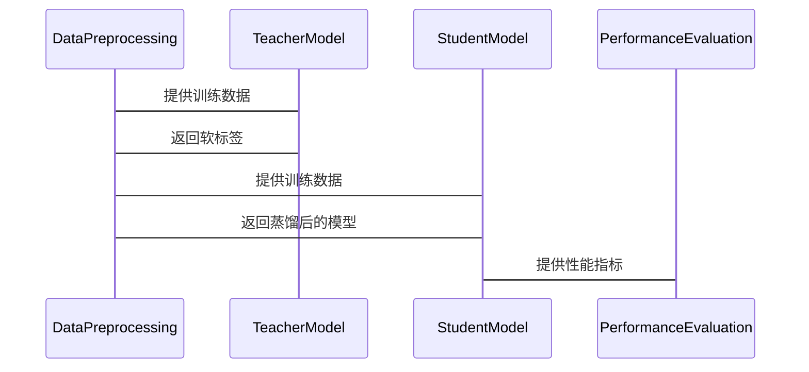

                 


# 知识蒸馏：压缩模型大小的同时保持性能

## 关键词：知识蒸馏、模型压缩、机器学习、深度学习、性能优化

## 摘要：  
知识蒸馏是一种将大型模型的知识迁移到小模型的技术，旨在在保持性能的同时显著减少模型的大小和计算成本。本文深入探讨知识蒸馏的核心概念、算法原理、系统架构设计以及实际项目中的应用，帮助读者全面理解这一技术及其在实际场景中的应用价值。

---

## 第一部分：知识蒸馏的背景与核心概念

### 第1章：知识蒸馏的起源与背景

#### 1.1 知识蒸馏的定义与核心概念  
知识蒸馏（Knowledge Distillation）是一种将复杂模型（教师模型）的知识迁移到简单模型（学生模型）的技术。其核心思想是通过教师模型的输出分布指导学生模型的训练，使学生模型在保持性能的同时，体积更小、计算更高效。  

- **教师模型**：通常是一个复杂且训练良好的大型模型，负责提供知识。  
- **学生模型**：目标模型，通常是一个小型模型，负责学习教师模型的知识。  

#### 1.2 模型压缩与知识蒸馏的关系  
模型压缩是通过减少模型参数或降低计算复杂度来优化模型的技术，而知识蒸馏是模型压缩的一种重要方法。蒸馏的目标是通过教师模型的软标签（soft label）来指导学生模型的训练，从而实现模型的轻量化。  

- **区别**：模型压缩通常涉及剪枝、量化等技术，而蒸馏是一种知识迁移的方法。  
- **联系**：蒸馏可以与剪枝、量化等技术结合使用，进一步提升压缩效果。  

#### 1.3 知识蒸馏的适用场景与挑战  
- **适用场景**：适用于需要在资源受限的环境中部署模型的场景，例如移动设备、边缘计算等。  
- **挑战**：知识蒸馏的效果依赖于教师模型的质量，且蒸馏过程可能会引入额外的计算开销。  

---

## 第二部分：知识蒸馏的核心原理与技术

### 第2章：知识蒸馏的基本原理

#### 2.1 知识蒸馏的理论基础  
知识蒸馏的理论基础是通过优化目标函数来实现知识的迁移。目标函数通常包含两部分：  
1. 学生模型与真实标签的损失（hard loss）。  
2. 学生模型与教师模型输出的KL散度损失（soft loss）。  

- **直觉**：学生模型不仅要匹配真实标签的分布，还要匹配教师模型输出的分布。  

#### 2.2 教师模型与学生模型的关系  
教师模型和学生模型之间的关系可以通过以下步骤来理解：  
1. 教师模型在大规模数据上进行训练，得到一个高质量的模型。  
2. 学生模型在教师模型的指导下，通过蒸馏损失函数进行优化。  

- **图示**：使用Mermaid绘制教师模型与学生模型的关系图，展示数据流和损失函数的传递过程。  



#### 2.3 知识蒸馏的关键步骤  
1. **预训练教师模型**：在大规模数据集上训练一个性能优异的教师模型。  
2. **蒸馏过程**：学生模型在教师模型的软标签指导下进行训练，目标是最小化软标签的KL散度。  
3. **蒸馏优化**：通过调整温度、损失函数权重等参数，优化蒸馏过程，提升学生模型的性能。  

---

### 第3章：知识蒸馏的数学模型与算法实现

#### 3.1 知识蒸馏的数学模型  
知识蒸馏的核心是通过优化目标函数来实现知识的迁移。目标函数可以表示为：  

$$ L = \lambda L_{\text{hard}} + (1-\lambda) L_{\text{soft}} $$  

其中，$L_{\text{hard}}$ 是学生模型与真实标签的交叉熵损失，$L_{\text{soft}}$ 是学生模型与教师模型软标签的KL散度损失，$\lambda$ 是平衡参数。  

- **软标签计算**：教师模型的输出经过Softmax得到概率分布，作为软标签。  

$$ P(y|x) = \text{Softmax}(\frac{Z(x)}{T}) $$  

其中，$T$ 是温度参数，用于调节软标签的分布。  

#### 3.2 知识蒸馏的算法实现  
以下是一个简单的知识蒸馏算法实现代码示例：  

```python
import torch
import torch.nn as nn
import torch.optim as optim

# 定义教师模型和学生模型
class TeacherModel(nn.Module):
    def __init__(self):
        super(TeacherModel, self).__init__()
        self.fc = nn.Linear(784, 10)

class StudentModel(nn.Module):
    def __init__(self):
        super(StudentModel, self).__init__()
        self.fc = nn.Linear(784, 10)

# 初始化模型
teacher = TeacherModel()
student = StudentModel()
teacher.load_state_dict(torch.load('teacher.pth'))  # 加载预训练的教师模型

# 定义损失函数和优化器
criterion_hard = nn.CrossEntropyLoss()
criterion_soft = nn.KLDivLoss(reduction='batchmean')
optimizer = optim.SGD(student.parameters(), lr=0.01)

# 蒸馏温度
temperature = 3.0
lambda_soft = 0.5

# 训练循环
for batch_input, batch_label in dataloader:
    # 前向传播
    with torch.no_grad():
        teacher_logits = teacher(batch_input)
    student_logits = student(batch_input)
    
    # 计算硬标签损失
    loss_hard = criterion_hard(student_logits, batch_label)
    
    # 计算软标签损失
    teacher_probs = torch.nn.functional.softmax(teacher_logits / temperature, dim=1)
    loss_soft = criterion_soft(torch.log_softmax(student_logits / temperature, dim=1), teacher_probs)
    
    # 总损失
    loss = (1 - lambda_soft) * loss_hard + lambda_soft * loss_soft
    
    # 反向传播和优化
    optimizer.zero_grad()
    loss.backward()
    optimizer.step()
```

- **代码解释**：  
  1. **教师模型和学生模型**：教师模型是一个简单的全连接网络，学生模型结构类似。  
  2. **损失函数**：包括硬标签损失和软标签损失，通过调整$\lambda$参数平衡两者的影响。  
  3. **蒸馏温度**：温度$T$用于调节软标签的分布，$T>1$会增加分布的多样性，$T<1$会增加分布的集中性。  

---

## 第三部分：知识蒸馏的系统分析与架构设计

### 第4章：知识蒸馏的系统架构

#### 4.1 系统功能设计  
- **功能模块划分**：  
  - 数据预处理模块：负责加载和处理数据集。  
  - 模型训练模块：包括教师模型和学生模型的训练流程。  
  - 蒸馏模块：实现知识蒸馏的核心逻辑。  
  - 性能评估模块：评估蒸馏后学生模型的性能。  

- **功能流程图**：使用Mermaid绘制系统功能流程图，展示数据流和模块交互。  



#### 4.2 系统架构设计  
- **架构层次**：  
  - 数据层：存储训练数据和教师模型权重。  
  - 训练层：包括教师模型和学生模型的训练流程。  
  - 蒸馏层：实现知识蒸馏的核心逻辑。  
  - 应用层：评估蒸馏后模型的性能并部署应用。  

- **系统架构图**：使用Mermaid绘制系统架构图，展示各模块之间的关系。  



#### 4.3 系统交互设计  
- **交互流程**：  
  1. 数据预处理模块将原始数据转换为适合训练的格式。  
  2. 教师模型在预处理后的数据上进行训练，得到软标签。  
  3. 学生模型在教师模型的指导下进行蒸馏训练。  
  4. 性能评估模块对蒸馏后的模型进行测试，评估其性能。  

- **交互序列图**：使用Mermaid绘制系统交互序列图，展示各模块的交互过程。  



---

## 第四部分：知识蒸馏的项目实战与优化

### 第5章：知识蒸馏的项目实战

#### 5.1 环境搭建与数据准备  
- **环境安装**：安装PyTorch、Transformers等必要的库。  
- **数据集准备**：使用MNIST数据集进行实验。  

```python
import torch
from torch.utils.data import DataLoader
import torchvision.datasets as datasets
import torchvision.transforms as transforms

# 数据预处理
transform = transforms.Compose([
    transforms.ToTensor(),
    transforms.Normalize((0.1307, ), (0.3081, )),
])

# 数据加载
train_dataset = datasets.MNIST(root='./data', train=True, download=True, transform=transform)
train_loader = DataLoader(train_dataset, batch_size=128, shuffle=True)
```

#### 5.2 模型定义与训练  
- **教师模型定义**：一个简单的全连接网络。  

```python
class TeacherModel(nn.Module):
    def __init__(self):
        super(TeacherModel, self).__init__()
        self.fc = nn.Linear(784, 10)
        self.dropout = nn.Dropout(0.5)
    
    def forward(self, x):
        x = x.view(-1, 784)
        x = self.fc(x)
        return x
```

- **学生模型定义**：一个更简单的模型，如宽度为5的全连接网络。  

```python
class StudentModel(nn.Module):
    def __init__(self):
        super(StudentModel, self).__init__()
        self.fc = nn.Linear(784, 5, bias=False)
        self.dropout = nn.Dropout(0.5)
    
    def forward(self, x):
        x = x.view(-1, 784)
        x = self.fc(x)
        return x
```

#### 5.3 蒸馏过程与优化  
- **训练循环**：  
  1. 预训练教师模型。  
  2. 使用蒸馏方法训练学生模型。  

```python
def train_student():
    optimizer = optim.SGD(student.parameters(), lr=0.01)
    criterion_hard = nn.CrossEntropyLoss()
    criterion_soft = nn.KLDivLoss(reduction='batchmean')
    temperature = 3.0
    lambda_soft = 0.5

    for epoch in range(10):
        for batch_input, batch_label in train_loader:
            optimizer.zero_grad()
            with torch.no_grad():
                teacher_logits = teacher(batch_input)
            student_logits = student(batch_input)
            
            # 硬标签损失
            loss_hard = criterion_hard(student_logits, batch_label)
            
            # 软标签损失
            teacher_probs = torch.nn.functional.softmax(teacher_logits / temperature, dim=1)
            loss_soft = criterion_soft(torch.log_softmax(student_logits / temperature, dim=1), teacher_probs)
            
            # 总损失
            loss = (1 - lambda_soft) * loss_hard + lambda_soft * loss_soft
            loss.backward()
            optimizer.step()
```

#### 5.4 性能评估与分析  
- **性能指标**：评估学生模型的准确率、计算速度等。  
- **实验结果**：展示学生模型在蒸馏后的性能变化。  

---

## 第五部分：总结与展望

### 第6章：知识蒸馏的总结与展望

#### 6.1 知识蒸馏的核心要点总结  
- 知识蒸馏是一种有效的模型压缩技术，能够在保持性能的同时显著减少模型大小。  
- 蒸馏的关键在于教师模型的软标签和学生模型的优化。  

#### 6.2 知识蒸馏的优缺点分析  
- **优点**：  
  - 模型体积小，适合资源受限的场景。  
  - 训练时间短，计算成本低。  
- **缺点**：  
  - 依赖教师模型的质量，效果可能受限。  
  - 蒸馏过程可能引入额外的计算开销。  

#### 6.3 知识蒸馏的未来发展方向  
- **结合其他压缩技术**：如剪枝、量化等，进一步提升压缩效果。  
- **优化蒸馏算法**：探索更高效的蒸馏方法，如自适应温度调整、多教师蒸馏等。  
- **扩展应用场景**：将知识蒸馏应用于更多领域，如自然语言处理、计算机视觉等。  

---

## 参考文献与进一步阅读  
1. Hinton G, Vinyals O,等人. "Distilling the Knowledge in Neural Networks." arXiv preprint arXiv:1412.0585 (2014).  
2. 书籍推荐：《深度学习》—— Ian Goodfellow等著。  

---

通过以上内容，我们详细介绍了知识蒸馏的核心概念、算法原理、系统架构设计以及实际项目中的应用。希望读者能够通过本文全面理解知识蒸馏技术，并在实际项目中灵活应用这一技术，以实现模型的轻量化和性能优化。

